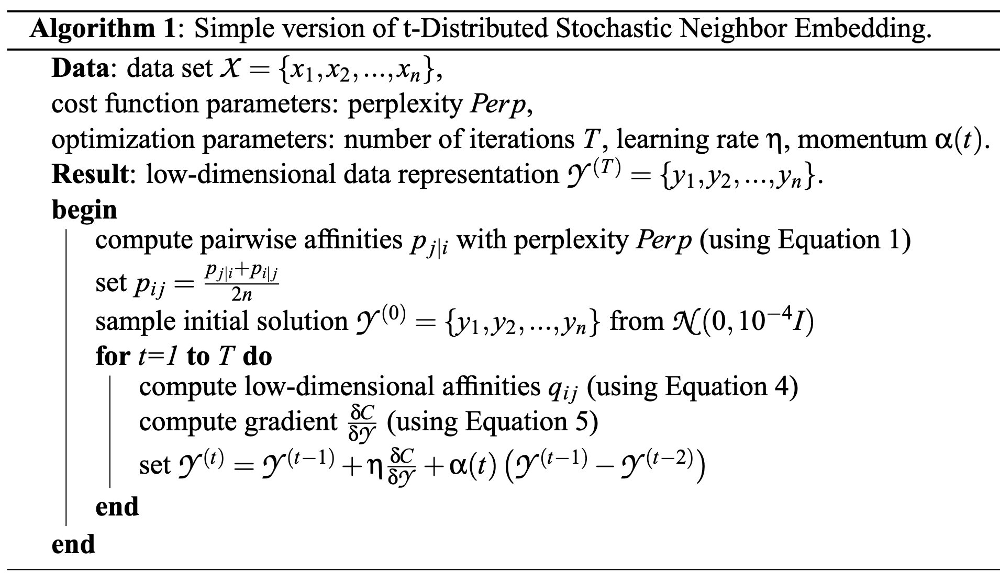

This post introduces how to understand t-SNE.

# Introduction

t-SNE an dimension reduction algorithm, which projects high-dimensional data into low-dimensional space. Thus the algorithm can be used to visualize the data distribution.

To understand how t-SNE works, we first review the SNE algorithms, then we introduce the t-SNE algorithm.

# SNE

## Method

Stochastic Neighbor Embedding, or SNE, is the previous version of t-SNE.

The basic idea behind SNE is that: *data points that are close in high-dimensional space should be close in lower-dimensional space too*.

Formally speaking, given a data set $X\in\mathbb{R}^{D\times N}$ consisting of $N$ data points, with each data point lies in $D$ dimensional space. Our goal is to reduce the data points into $d<< D$ dimensional space $Y\in\mathbb{R}^{d\times N}$, that is, we seek to find a map $f:\mathbb{R}^{D\times N}\to \mathbb{R}^{d\times N}$ such that $f(X)=Y$. Usually, $d=2$ or $d=3$ for visualization use.

SNE measures "close" in a probabilistic way. The similarity is represented by converting Euclidean distance between data points to condition probabilities:

$$ p_{j\mid i} = \frac{\exp\left(-\Vert\bm{x}_i-\bm{x}_j\Vert^2/(2\sigma_i^2)\right)}{\sum_{k\neq i}\exp\left(-\Vert\bm{x}_i-\bm{x}_k\Vert^2/(2\sigma_i^2)\right)} $$

the above equation can be interpreted as *the probability of point $\bm{x}_j$ being a neighbor of point $\bm{i}$ is proportional to the distance between them*. $\sigma_i$ is the variance of the Gaussian distribution that is centered on data point $\bm{x}_i$. We introduce the method for determining $\sigma_i$ later.

Similarly, we can construct a probability distribution $q$ based on $Y$.

$$ q_{j\mid i} = \frac{\exp\left(-\Vert\bm{x}_i-\bm{x}_j\Vert^2\right)}{\sum_{k\neq i}\exp\left(-\Vert\bm{x}_i-\bm{x}_k\Vert^2\right)} $$

where we set the variance as $1/\sqrt{2}$ following the original paper.

$p_{i\mid i}$ and $q_{i\mid i}$ are set $0$ since we are only interested in modeling pairwise similarities.

Now we want $q_{j\mid i}$ are as close as $p_{j\mid i}$, that is, we want two distributions are as close as to each other. This can be measured by **Kullback- Leibler divergence**, which is written as:

$$ C(P, Q) = \sum_{i=1}^N\mathrm{KL}(P_i\Vert Q_i)=\sum_{i=1}^N\sum_{j=1}^N p_{j\mid i}\log \frac{p_{i\mid j}}{q_{i\mid j}} $$

where $P_i=[p_{1\mid i},\dots,p_{N\mid i}]\in\mathbb{R}^N$ and $Q_i=[q_{1\mid i},\dots,q_{N\mid i}]\in\mathbb{R}^N$.

## Choosing $\sigma$

Now we introduce how to choose $\sigma$. Note that $\sigma$ determines the distribution of data points, larger $\sigma$ indicates sparser distribution of data points. The original paper uses *perplexity* to measure such sparsity. It is defined as

$$ \mathrm{Perp}(P_i) = 2^{H(P_i)} $$

where $H(P_i)$ is the *Shannon entropy* of $P_i$ measured in bits:

$$ H(P_i) = -\sum_{i=1}^N p_{j\mid i}\log p_{j\mid i} $$

The perplexity can be interpreted as a smooth measure of the effective number of neighbors. The performance of SNE is fairly robust to changes in the perplexity, and typical values are between 5 and 50.

Notice that $p_{j\mid i}$, by setting different value on $\mathrm{Perp}(P_i)$, we can obtain different $\sigma_i$ via binary search.

## Optimization

Our goal now becomes minimizing $C(p, q)$ over variables $\bm{y}_1,\dots,\bm{y}_N\in\mathbb{R}^d$, given $p$ and hyperparameter $\sigma_i, i=1,\dots,N$. This can be done via gradient descent methods. The gradient is now given by

$$ \frac{d C}{d\bm{y}_i}=2\sum_{j=1}^N\left(p_{j\mid i} - q_{j\mid i}  + p_{i\mid j}- q_{i\mid j} \right)(\bm{y}_i-\bm{y}_j)\in\mathbb{R}^d, \ i=1,\dots,N  $$

We can write it in matrix form and add a momentum term:

$$ Y^{t+1} = Y^t  + \beta\frac{dC}{dY} + \alpha_t\left(Y^{t-1}-Y^{t-2}\right)  $$

where $\beta$ is the step size and $\alpha_t$ is momentum parameter,

$$ Y^t = [\bm{y}_1^t,\dots, \bm{y}_N^t]\in\mathbb{R}^{d\times N} ,\ \frac{dC}{dY} = \left[\frac{d C}{d\bm{y}_1},\dots,\frac{d C}{d\bm{y}_N}\right]\in\mathbb{R}^{d\times N} $$

# t-SNE

## Symmetric SNE

The first difference between t-SNE and SNE is the probability, t-SNE uses symmetric version of SNE to simplify computations.

Different from SNE, symmetric SNE uses a joint probability instead of a condition probability:

$$ C(P, Q) = \sum_{i=1}^N\mathrm{KL}(P\Vert Q)=\sum_{i=1}^N\sum_{j=1}^N p_{ij}\log \frac{p_{ij}}{q_{ij}} $$

where $p_{ij}$ and $q_{ij}$ are defined as

$$ p_{ij} = \frac{\exp\left(-\Vert\bm{x}_i-\bm{x}_j\Vert^2/(2\sigma^2)\right)}{\sum_{k\neq r}\exp\left(-\Vert\bm{x}_r-\bm{x}_k\Vert^2/(2\sigma^2)\right)},q_{ij} = \frac{\exp\left(-\Vert\bm{x}_i-\bm{x}_j\Vert^2\right)}{\sum_{k\neq r}\exp\left(-\Vert\bm{x}_r-\bm{x}_k\Vert^2\right)}  $$

the problem if joint probability $p_{ij}$ is that if there is an outlier $\bm{x}_i$, then $p_{ij}$ will be extremely small for all $j$. This problem can be solved by defining $p_{ij}$ from the conditional probability $p_{i\mid j}$ and $p_{j\mid i}$

$$ p_{ij} = \frac{p_{j\mid i}+p_{i\mid j}}{2N} $$

This ensures that

$$ \sum_{j=1}^N p_{ij} > \frac{1}{2N} $$

for all $\bm{x}_i$, in result, each data point makes a significant contribution to the cost function.

In this case, the gradient of the cost function is now given by

$$ \frac{d C}{d\bm{y}_i}=4\sum_{j=1}^N\left(p_{ij} - q_{ij}\right)(\bm{y}_i-\bm{y}_j)\in\mathbb{R}^d, \ i=1,\dots,N $$

## t-SNE

Experiments show that symmetric SNE seems to produce maps that are just as good as asymmetric SNE, and sometimes even a little better.

However, there is a problem with SNE, that is, the *crowding problem*, which manifests as a tendency for points in the low-dimensional space to be clustered too closely together, particularly in high-density regions of the data.

The causes of the crowding problems are:

1. Data points in high dimensional space tend to far from each other, which makes the distance information less useful.
2. SNE aims to preserve the local structure of the data points, but it can struggle with non-linear relationships. The projected data points will be closed to each other due to this reason.
3. The optimization algorithm used by SNE can get stuck in local minimum.

To alleviate the crowding problem, t-SNE is introduced in the following way:
*In the high-dimensional space, we convert distances into probabilities using a Gaussian distribution. In the low-dimensional map, we can use a probability distribution that has much heavier tails than a Gaussian to convert distances into probabilities.*
This allows a moderate distance in the high-dimensional space to be faithfully modeled by a much larger distance in the map and, as a result, it eliminates the unwanted attractive forces between map points that represent moderately dissimilar data points.

t-SNE uses student t-distribution in low-dimensional map:

$$ q_{ij} = \frac{\left(1+\Vert\bm{y}_i-\bm{y}_j\Vert^2\right)^{-1}}{\sum_{k\neq r}\left(1+\Vert\bm{y}_i-\bm{y}_j\Vert^2\right)^{-1}} $$

A Student t-distribution with a single degree of freedom is used, because it has the particularly nice property that $\left(1+\Vert\bm{y}_i-\bm{y}_j\Vert^2\right)^{-1}$ approaches an inverse square law for large pairwise distances $\Vert\bm{y}_i-\bm{y}_j\Vert$ in the low-dimensional map.

Compared to Gaussian distribution, t-distribution is heavily tailed。

A computationally convenient property of t-SNE is that it is much faster to evaluate the density of a point under a Student t-distribution than under a Gaussian because it does not involve an exponential, even though the Student t-distribution is equivalent to an infinite mixture of Gaussians with different variances.

The gradient of t-SNE is given by

$$ \frac{d C}{d\bm{y}_i}=4\sum_{j=1}^N\left(p_{ij} - q_{ij}\right)(\bm{y}_i-\bm{y}_j)\left(1+\Vert\bm{y}_i-\bm{y}_j\Vert^2\right)^{-1}\in\mathbb{R}^d, \ i=1,\dots,N $$

The advantages of t-SNE gradients over SNE are given by:

1. The t-SNE gradient strongly repels dissimilar data points that are modeled by a small pairwise distance in the low-dimensional representation.
2. Second, although t-SNE introduces strong repulsions between dissimilar data points that are modeled by small pairwise distances, these repulsions do not go to infinity.

The algorithm is given as follows:

## Optimization

There are some optimizations that can be used to improve performance of t-SNE:

1. Early compression, which is used to force the map points to stay close together at the start of the optimization
2. Early exaggeration, which is used to multiply all of the pi j’s by, for example, 4, in the initial stages of the optimization

# Implementation

# Reference

- [Visualizing Data using t-SNE](http://jmlr.org/papers/v9/vandermaaten08a.html)
