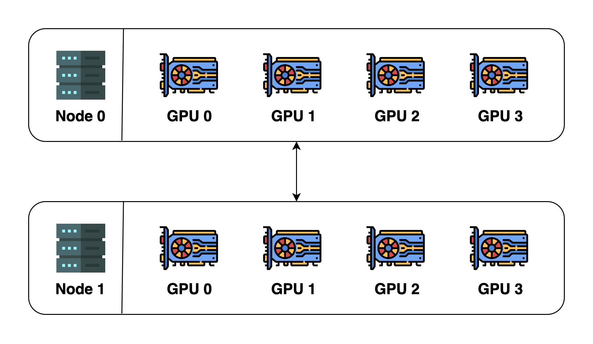
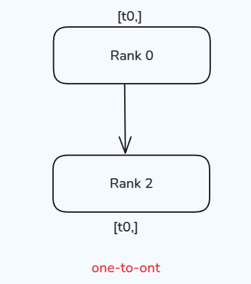
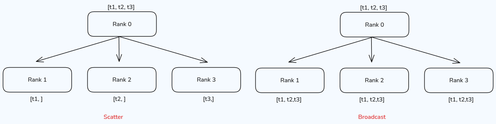
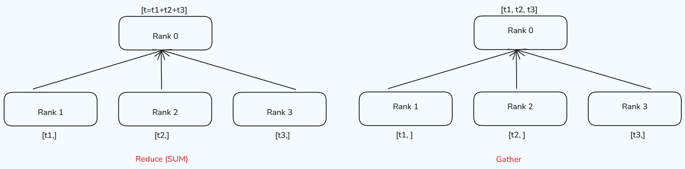
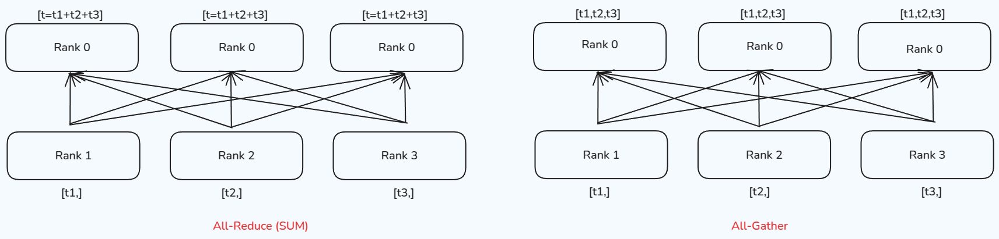

> 说明：本文参考了 [nanotron/ultrascale-playbook](https://huggingface.co/spaces/nanotron/ultrascale-playbook) 和 [Colossal-AI Concepts](https://colossalai.org/docs/concepts/distributed_training)

# 什么是分布式系统

分布式系统允许一个软件的多个组件运行在不同的机器上。与传统集中式系统不一样，分布式系统可以有效提高系统的稳健性。
一个比较比较经典的分布式就是Git，Git允许我们把代码保存在多个remote上。这样当一个remote宕机时，其他remote也能提供服务。

评估一个分布式系统的重要标准就是规模效益(scalablity)，也就是说，我们希望使用8台设备应该要比4台设备快2倍。但是，由于通信带宽等原因，实际上加速比并不是和设备数量成线性关系。因此，我们需要设计分布式算法，来有效提高分布式系统的效率。

# 为什么需要分布式训练

我们需要分布式训练的原因主要是以下几点：

1. 模型越来越大。当下（2025）领先模型如Qwen，LLaMA系列的最大模型都超过了100B [2][3]。LLaMA系列最大的模型甚至超过了1000B。Scaling law告诉我们模型表现与参数量，算力，数据量成正相关关系。
2. 数据集越来越大。现在领先的模型需要的数据量基本都需要100M以上，而大语言模型训练需要的token数量也都超过了10T的量级 [2][3].
3. 算力越来越强。现有最强的GPU H100其显存为80GB，拥有3.35TB/s 的带宽 (PcIe)，这让训练大规模模型成为可能。

超大的模型使得我们很难在一张GPU上进行训练，甚至我们都很难使用单张GPU进行部署。而10T级的数据也也需要几个月的时间才能训练完毕。因此，如何高效利用多张GPU在大规模数据上训练超大模型就是我们需要解决的问题。

# 基本概念

我们先来熟悉一下分布式训练中的一些基本概念：

- Host: host (master address)是分布式训练中通信网络的主设备(main device). 一般我们需要对其进行初始化
- Node: 一个物理或虚拟的计算单元，可以是一台机器，一个容器或者一个虚拟机
- Port: port (master port)主要是用于通信的master port
- Rank: rank是通信网络中每个设备唯一的ID
- world size: world size是通信网络中设备的数量
- process group: 一个process group是通信网络中所有设备集合的一个子集。通过process group, 我们可以限制device只在group内部进行通信

我们以下图为例：

上图中一共包含2个node (2台机器)，每台机器包含4个GPU (device)，当我们初始化分布式环境时，我们一共启动了8个进程（每台机器4个进程），每个进程绑定一个GPU。

在初始化分布式环境之间，我们需要指定host和port。假设我们指定host为`node 0`和port为 `29500`，接下来，所有的进程都会基于这个host和port来与其他进程连接。默认的process group（包含所有device）的world size 为8. 其细节展示如下

| process ID | rank | Node index| GPU index |
| --- | --- | --- |--- |
| 0 | 0 | 0 | 0|
| 1 | 1 | 0 | 1|
| 2 | 2 | 0 | 2|
| 3 | 3 | 0 | 3|
| 4 | 4 | 1 | 0|
| 5 | 5 | 1 | 1|
| 6 | 6 | 1 | 2|
| 7 | 7 | 1 | 3|

我们可以创建一个新的process group，使其仅包含ID为偶数的process：

| process ID | rank | Node index| GPU index |
| --- | --- | --- |--- |
| 0 | 0 | 0 | 0|
| 2 | 1 | 0 | 2|
| 4 | 2 | 1 | 0|
| 6 | 3 | 1 | 2|

**Remark**: 注意，rank与process group相关，一个process在不同的process group里可能会有不同的rank.

# 通信方式

接下来，我们需要介绍一下设备间的通信方式，这是我们后面分布式训练算法的基础。根据设备数量的不同，我们可以将设备间通信分为：

1. one-to-one: 两个device之间互相进行通信
2. one-to-many: 一个device与多个device进行通信
3. many-to-one: 多个device与一个device之间进行通信
4. many-to-many: 多个device之间互相进行通信

## One-to-one

One-to-one的情况很简单，一个process与另一个process进行通信，通信通过 `send` 和 `recv` 完成。还有对应的 immediate版本，即 `isend` 和 `irecv`，示意图如下所示



测试代码如下：

```python
# send_recv.py
import os

import torch
import torch.distributed as dist


def init_process():
    dist.init_process_group(backend='nccl')
    torch.cuda.set_device(dist.get_rank())
    
def example_send():
    if dist.get_rank() == 0:
        tensor = torch.tensor([1, 2, 3, 4, 5], dtype=torch.float32).cuda()
        dist.send(tensor, dst=1)
    elif dist.get_rank() == 1:
        tensor = torch.zeros(5, dtype=torch.float32).cuda()
        print(f"Before send on rank {dist.get_rank()}: {tensor}")
        dist.recv(tensor, src=0)
        print(f"After send on rank {dist.get_rank()}: {tensor}")


init_process()
example_send()

# run with
# torchrun --nproc_per_node=2 send_recv.py
```

结果输出

```
Before send on rank 1: tensor([0., 0., 0., 0., 0.], device='cuda:1')
After send on rank 1: tensor([1., 2., 3., 4., 5.], device='cuda:1')
```

> 注：为了方便，后续代码仅定义函数和运行方式，`init_process()`和import部分省略

`send/recv`的特点是在完成通信之前，两个process是锁住的。与之相反，`isend/irecv` 则不会加锁，代码会继续执行然后返回`Work`对象，为了让通信顺利进行，我们可以在返回之前加入`wait()`

```python
# isend_irecv.py
def example_isend():
    req = None
    if dist.get_rank() == 0:
        tensor = torch.tensor([1, 2, 3, 4, 5], dtype=torch.float32).cuda()
        req = dist.isend(tensor, dst=1)
        print("Rank 0 is sending")
        
    elif dist.get_rank() == 1:
        tensor = torch.zeros(5, dtype=torch.float32).cuda()
        print(f"Before irecv on rank {dist.get_rank()}: {tensor}")
        req = dist.irecv(tensor, src=0)
        print("Rank 1 is receiving")
        req.wait()
        print(f"After isend on rank {dist.get_rank()}: {tensor}")

init_process()
example_isend()

# run with
# torchrun --nproc_per_node=2 isend_irecv.py
```

结果输出

```
Before irecv on rank 1: tensor([0., 0., 0., 0., 0.], device='cuda:1')
Rank 0 is sending
Rank 1 is receiving
After isend on rank 1: tensor([1., 2., 3., 4., 5.], device='cuda:1')
```

由于`isend/irecv`这种不锁的特性，我们不应该

1. 在`dist.isend()`之前修改发送的内容`tensor`
2. 在`dist.irecv()`之后读取接受的内容`tensor`

`req.wait()` 可以保证这次通信顺利完成，因此我们可以在`req.wait()`之后再进行修改和读取。

## One-to-many

One-to-many 情形下，可以分为两种：scatter 和 broadcast

scatter的作用是将一个process的数据均分并散布到其他process。broadcast的作用是将一个process的数据广播到其他process。两者不同的地方在于其他process获取到的是全量数据(copy)还是部分数据(slice)，其示意图如下所示



scatter 测试代码：

```python
# scatter.py
def example_scatter():
    if dist.get_rank() == 0:
        scatter_list = [
            torch.tensor([i+1] * 5, dtype=torch.float32).cuda()
            for i in range(dist.get_world_size())
        ]
        print(f"Rank 0 scatter list: {scatter_list}")
    else:
        scatter_list = None
    
    tensor = torch.zeros(5, dtype=torch.float32).cuda()
    print(f"Before scatter on rank {dist.get_rank()}: {tensor}")
    dist.scatter(tensor, scatter_list, src=0)
    print(f"After scatter on rank {dist.get_rank()}: {tensor}")

init_process()
example_broadcast()

# run with
# torchrun --nproc_per_node=4 broadcast.py
```

结果输出以下内容（输出内容有优化，后续不再说明）：

```
Rank 0 scatter list: [
    tensor([1., 1., 1., 1., 1.], device='cuda:0'), 
    tensor([2., 2., 2., 2., 2.], device='cuda:0'), 
    tensor([3., 3., 3., 3., 3.], device='cuda:0'), 
    tensor([4., 4., 4., 4., 4.], device='cuda:0')
]
Before scatter on rank 2: tensor([0., 0., 0., 0., 0.], device='cuda:2')
Before scatter on rank 1: tensor([0., 0., 0., 0., 0.], device='cuda:1')
Before scatter on rank 3: tensor([0., 0., 0., 0., 0.], device='cuda:3')
Before scatter on rank 0: tensor([0., 0., 0., 0., 0.], device='cuda:0')

After scatter on rank 0: tensor([1., 1., 1., 1., 1.], device='cuda:0')
After scatter on rank 2: tensor([3., 3., 3., 3., 3.], device='cuda:2')
After scatter on rank 3: tensor([4., 4., 4., 4., 4.], device='cuda:3')
After scatter on rank 1: tensor([2., 2., 2., 2., 2.], device='cuda:1')
```

broadcast 测试代码:

```python
# broadcast.py
def example_broadcast():
    if dist.get_rank() == 0:
        tensor = torch.tensor([1, 2, 3, 4, 5], dtype=torch.float32).cuda()
    else:
        tensor = torch.zeros(5, dtype=torch.float32).cuda()
    print(f"Before broadcast on rank {dist.get_rank()}: {tensor}")
    dist.broadcast(tensor, src=0)
    print(f"After broadcast on rank {dist.get_rank()}: {tensor}")


init_process()
example_broadcast()

# run with
# torchrun --nproc_per_node=3 broadcast.py
```

结果输出：

```
Before broadcast on rank 1: tensor([0., 0., 0., 0., 0.], device='cuda:1')
Before broadcast on rank 2: tensor([0., 0., 0., 0., 0.], device='cuda:2')
Before broadcast on rank 0: tensor([1., 2., 3., 4., 5.], device='cuda:0')

After broadcast on rank 0: tensor([1., 2., 3., 4., 5.], device='cuda:0')
After broadcast on rank 1: tensor([1., 2., 3., 4., 5.], device='cuda:1')
After broadcast on rank 2: tensor([1., 2., 3., 4., 5.], device='cuda:2')
```

## Many-to-one

Many-to-one 情形下，也可以分为两种：gather 和 reduce, Gather对应one-to-many的scatter操作，负责将多个process的内容汇聚到一起，形成一个完整的向量。而reduce的操作则是通过一个函数 $f(\cdot)$ 来把数据进行汇总，常见的函数有求和以及求平均，示意图如下所示



gather 测试代码：

```python
# gather.py
def example_gather():
    tensor = torch.tensor([dist.get_rank() + 1] * 5, dtype=torch.float32).cuda()
    if dist.get_rank() == 0:
        gather_list = [
            torch.zeros(5, dtype=torch.float32).cuda()
            for _ in range(dist.get_world_size())
        ]
        print(f"Rank 0 gather list: {gather_list}")
    else:
        gather_list = None
    
    print(f"Before gather on rank {dist.get_rank()}: {tensor}")
    dist.gather(tensor, gather_list, dst=0)
    if dist.get_rank() == 0:
        print(f"After gather on rank {dist.get_rank()}: {gather_list}")

init_process()
example_gather()

# run with
# torchrun --nproc_per_node=4 gather.py
```

结果输出：

```
Before gather on rank 3: tensor([4., 4., 4., 4., 4.], device='cuda:3')
Before gather on rank 2: tensor([3., 3., 3., 3., 3.], device='cuda:2')
Before gather on rank 0: tensor([1., 1., 1., 1., 1.], device='cuda:0')
Before gather on rank 1: tensor([2., 2., 2., 2., 2.], device='cuda:1')

After gather on rank 0: [
    tensor([1., 1., 1., 1., 1.], device='cuda:0'), 
    tensor([2., 2., 2., 2., 2.], device='cuda:0'), 
    tensor([3., 3., 3., 3., 3.], device='cuda:0'), 
    tensor([4., 4., 4., 4., 4.], device='cuda:0')
]
```

reduce 测试代码:

```python
# example_reduce.py
def example_reduce():
    tensor = torch.tensor([dist.get_rank() + 1] * 5, dtype=torch.float32).cuda()
    print(f"Before reduce on rank {dist.get_rank()}: {tensor}")

    dist.reduce(tensor, dst=0, op=dist.ReduceOp.SUM)
    if dist.get_rank() == 0:
        print(f"After reduce on rank {dist.get_rank()}: {tensor}")


init_process()
example_reduce()

# run with
# torchrun --nproc_per_node=3 example_reduce.py
```

这里我们使用求和`dist.ReduceOp.SUM`作为我们的汇总操作，Pytorch还支持其他的[reduce operations](https://docs.pytorch.org/docs/stable/distributed.html#torch.distributed.ReduceOp). 结果输出以下内容：

```
Before reduce on rank 2: tensor([3., 3., 3., 3., 3.], device='cuda:2')
Before reduce on rank 3: tensor([4., 4., 4., 4., 4.], device='cuda:3')
Before reduce on rank 0: tensor([1., 1., 1., 1., 1.], device='cuda:0')
Before reduce on rank 1: tensor([2., 2., 2., 2., 2.], device='cuda:1')

After reduce on rank 0: tensor([10., 10., 10., 10., 10.], device='cuda:0')
```

## Many-to-many

Many-to-many 情形下的两种通信方式为：All-Reduce 和 All-Gather，分别是reduce和gather的升级版，all-reduce对所有process都执行一次reduce操作，而all-gather则对所有process执行一次gather操作，其示意图如下所示



all-gather 测试代码：

```python
# example_all_gather.py
def example_all_gather():
    tensor = torch.tensor([dist.get_rank() + 1] * 5, dtype=torch.float32).cuda()
    gather_list = [
        torch.zeros(5, dtype=torch.float32).cuda()
        for _ in range(dist.get_world_size())
    ]
    print(f"Before all gather on rank {dist.get_rank()}: {tensor}")
    dist.all_gather(gather_list, tensor)
    print(f"After all gather on rank {dist.get_rank()}: {gather_list}")


init_process()
example_all_gather()

# run with
# torchrun --nproc_per_node=3 example_all_gather.py
```

测试输出结果：

```
Before all gather on rank 2: tensor([3., 3., 3., 3., 3.], device='cuda:2')
Before all gather on rank 3: tensor([4., 4., 4., 4., 4.], device='cuda:3')
Before all gather on rank 0: tensor([1., 1., 1., 1., 1.], device='cuda:0')
Before all gather on rank 1: tensor([2., 2., 2., 2., 2.], device='cuda:1')

After all gather on rank 0: [
    tensor([1., 1., 1., 1., 1.], device='cuda:0'), 
    tensor([2., 2., 2., 2., 2.], device='cuda:0'), 
    tensor([3., 3., 3., 3., 3.], device='cuda:0'), 
    tensor([4., 4., 4., 4., 4.], device='cuda:0')]
After all gather on rank 2: [
    tensor([1., 1., 1., 1., 1.], device='cuda:2'), 
    tensor([2., 2., 2., 2., 2.], device='cuda:2'), 
    tensor([3., 3., 3., 3., 3.], device='cuda:2'), 
    tensor([4., 4., 4., 4., 4.], device='cuda:2')
]
After all gather on rank 3: [
    tensor([1., 1., 1., 1., 1.], device='cuda:3'), 
    tensor([2., 2., 2., 2., 2.], device='cuda:3'), 
    tensor([3., 3., 3., 3., 3.], device='cuda:3'), 
    tensor([4., 4., 4., 4., 4.], device='cuda:3')
]
After all gather on rank 1: [
    tensor([1., 1., 1., 1., 1.], device='cuda:1'), 
    tensor([2., 2., 2., 2., 2.], device='cuda:1'), 
    tensor([3., 3., 3., 3., 3.], device='cuda:1'), 
    tensor([4., 4., 4., 4., 4.], device='cuda:1')
]

```

all-reduce 测试代码：

```python
# example_all_reduce.py
def example_all_reduce():
    tensor = torch.tensor([dist.get_rank() + 1] * 5, dtype=torch.float32).cuda()
    print(f"Before all reduce on rank {dist.get_rank()}: {tensor}")
    dist.all_reduce(tensor, op=dist.ReduceOp.SUM)
    print(f"After all reduce on rank {dist.get_rank()}: {tensor}")

init_process()
example_all_reduce()

# run with
# torchrun --nproc_per_node=3 example_all_reduce.py
```

测试输出结果

```
Before all reduce on rank 1: tensor([2., 2., 2., 2., 2.], device='cuda:1')
Before all reduce on rank 0: tensor([1., 1., 1., 1., 1.], device='cuda:0')
Before all reduce on rank 2: tensor([3., 3., 3., 3., 3.], device='cuda:2')
Before all reduce on rank 3: tensor([4., 4., 4., 4., 4.], device='cuda:3')
After all reduce on rank 0: tensor([10., 10., 10., 10., 10.], device='cuda:0')
After all reduce on rank 2: tensor([10., 10., 10., 10., 10.], device='cuda:2')
After all reduce on rank 3: tensor([10., 10., 10., 10., 10.], device='cuda:3')
After all reduce on rank 1: tensor([10., 10., 10., 10., 10.], device='cuda:1')
```

## Barrier

除了之前这些传输数据的方式之外，我们还有Barrier，用于在所有process之间进行同步。Barrier会确保所有的process在同一时间点完成某些操作。其流程为，先让每个process完成各自的任务，然后当process到达barrier时，process会通知系统自己已到达。最后当所有process都到达barrier之后，阻塞会解除，所有process继续执行下一步操作。

barrier 测试代码

```python
# example_barrier.py
def example_barrier():
    import time
    rank = dist.get_rank()
    t_start = time.time()
    print(f"Rank {rank} sleeps {rank} seconds")
    time.sleep(rank)
    dist.barrier()
    print(f"Rank {rank} is done at {time.time() - t_start:.4f} seconds")

init_process()
example_barrier()

# run with
# torchrun --nproc_per_node=3 example_barrier.py
```

结果输出

```
Rank 2 sleeps 2 seconds
Rank 0 sleeps 0 seconds
Rank 1 sleeps 1 seconds
Rank 3 sleeps 3 seconds

Rank 3 is done at 3.3046 seconds
Rank 1 is done at 3.3229 seconds
Rank 2 is done at 3.8437 seconds
Rank 0 is done at 3.6613 seconds
```

可以看到，四个process的到达时间都在3s左右，这是因为rank 3需要3s才能完成当前任务

## Advanced

除了前面的通信方式之外，还有 Reduce-Scatter和Ring All-Reduce，这两个通信方式等我们学习ZeRO的时候再一并讲解。

# Reference

1. [Colossal-AI](https://colossalai.org/docs/concepts/distributed_training)
2. [LLaMA 4 blog](https://ai.meta.com/blog/llama-4-multimodal-intelligence/)
3. [Qwen3 blog](https://qwenlm.github.io/blog/qwen3/)
4. [Pytorch tutorial](https://docs.pytorch.org/tutorials/intermediate/dist_tuto.html)
5. [nanotron/ultrascale-playbook](https://huggingface.co/spaces/nanotron/ultrascale-playbook)
