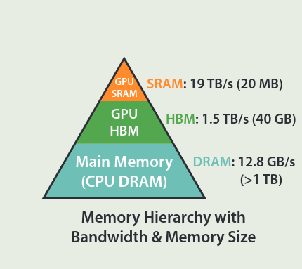
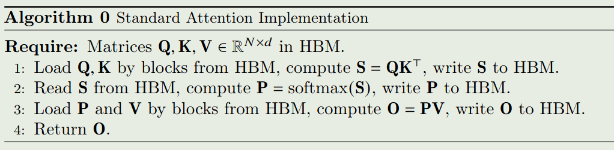
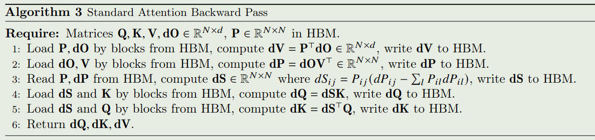
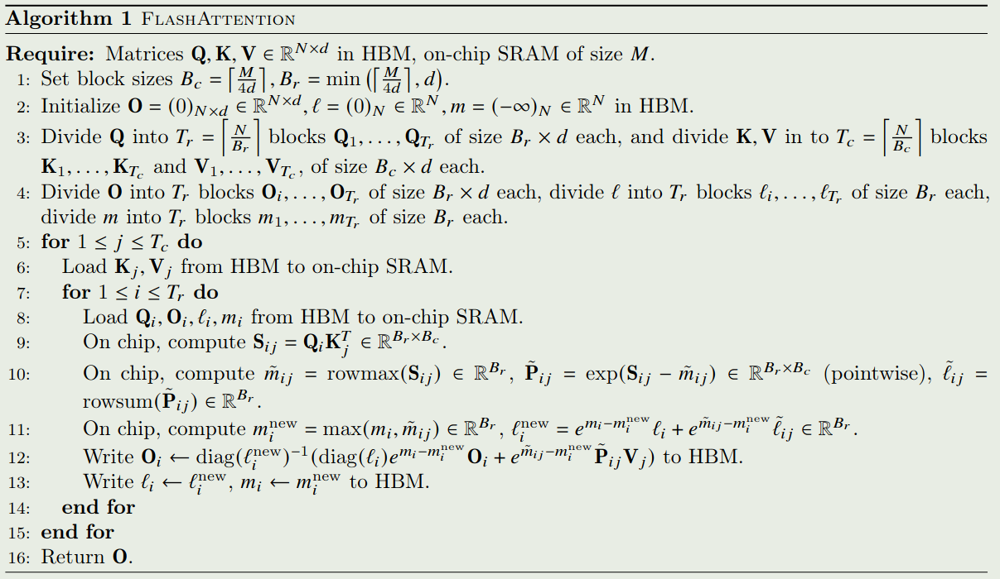
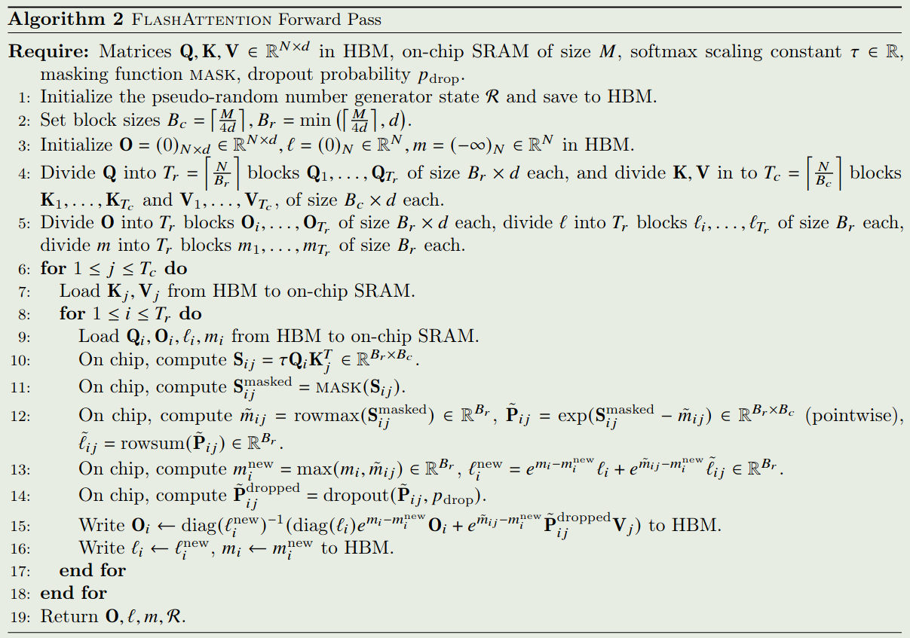
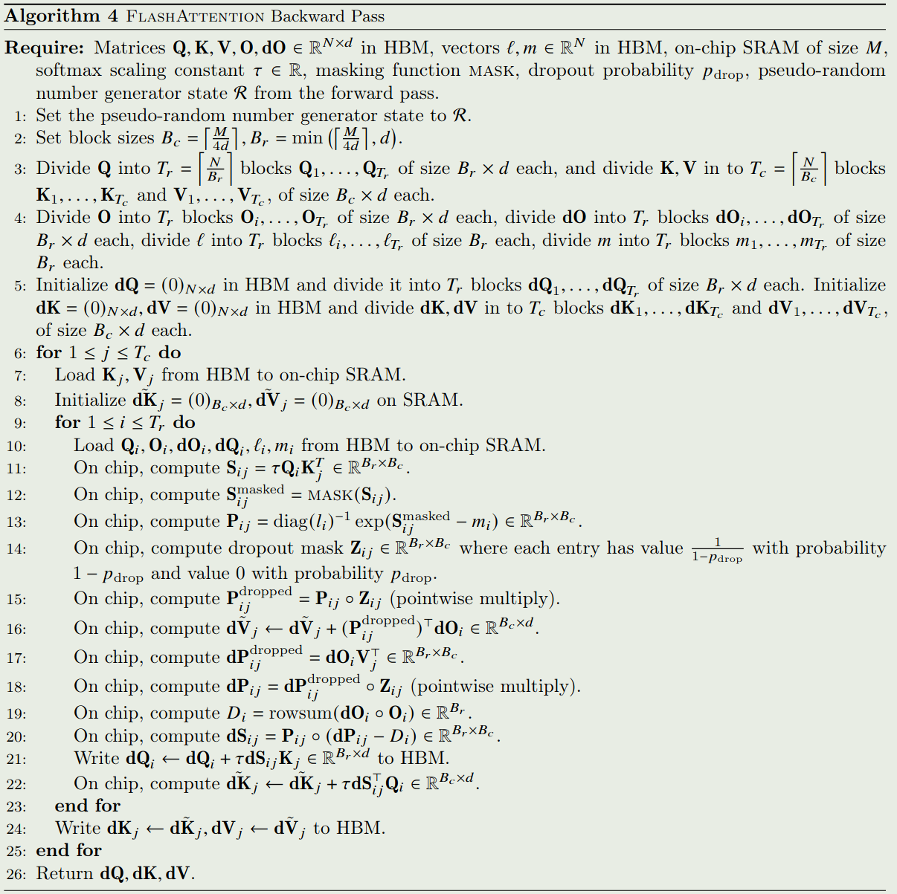
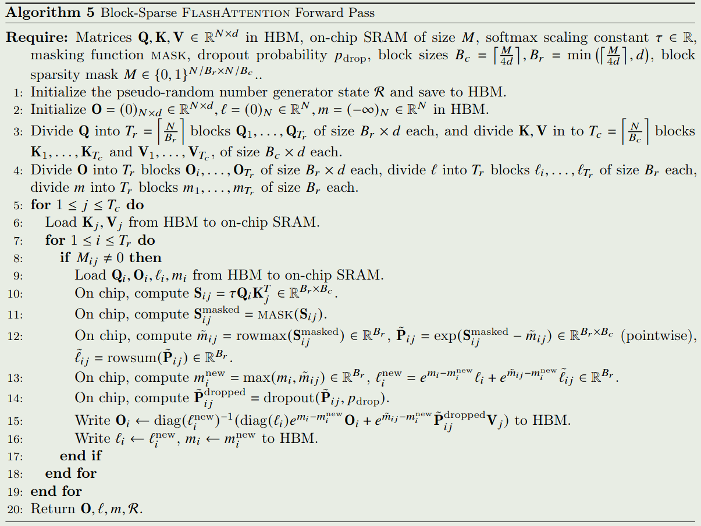
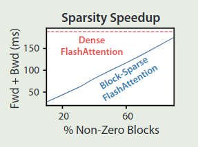
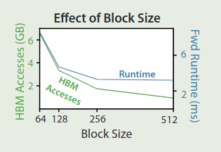

作者提出了 flashattention, 一个通过降低 multi head attention 内存访问开销来提高 attention 计算效率的方法

## Introduction

Transformer 的 attention 是一个平方度复杂度的算法，这个平方复杂度既体现在时间复杂度上（矩阵乘法），也体现在空间复杂度上（需要存储中间结果）。因此，要降低 attention 的复杂度，我们有两种思路：

1. 从时间复杂度上入手，比如使用稀疏 attention 机制或者线性注意力机制
2. 从空间复杂度上入手，比如使用 [GQA](https://maosong.website/p/notes-on-gqa/), [MQA](https://maosong.website/p/notes-on-mqa/) 等减少内存的访问开销

本文提出的 flashattention 就属于降低空间复杂度的一种做法。作者认为，我们应该设计一种 **IO-aware** 的 attention 算法，来减少 attention 计算式的内存访问开销，进而提高 attention 的计算效率。

作者首先提到，一个未解决的问题就是：

> 降低 attention 的内存访问开销是否可以提高 attention 的计算效率？

作者发现，已有的一些工作虽然在理论上降低了 attention 的计算效率，但是在实际中，他们的效果并没有提升太多。作者分析原因认为，已有工作主要关注于降低 FLOPs, 但是忽略了内存访问开销。

因此，作者在本文中就提出了 flashattention, 一个 IO-aware 的 attention 算法，作者通过尽可能降低内存访问开销来提高模型的计算效率。具体做法就是，避免从内存中读写 attention matrix, 作者认为这个目标有两个挑战：

1. 计算 softmax 的时候不访问所有的输入
2. 在反向传播时不存储中间的 attention matrix

作者提出了两个方法来分别解决这两个问题：

1. 作者使用了 **tiling** 技巧，将 input 分成多个 block, 然后分别进行处理，进而降低 softmax 的内存访问开销
2. 作者使用了 **recompute** 技巧，在反向传播时，重新计算 softmax normalization factor

通过这些改进，我们可以让 attention 运行更快，并且降低内存访问开销。

作者还从理论上分析了 flashattention 的复杂度，提供了理论基础。

作者通过实验验证了 flashattention 的有效性，主要是三点：

1. 训练效率更高：相比于 Huggingface 和 Megatron, flashattention 的训练效率提升了 2-3 倍
2. 模型的表现更好：相比于 GPT-2, 模型的 perplexity 提升了 0.7 个点左右
3. 速度更快：flashattention 比标准的 attention 实现快 3 倍以上

## Background

### Hardware Performance

作者首先介绍了以下 GPU 的内存架构，如下图所示

可以看到，GPU 内存可以分为三个层级：

1. SRAM: GPU 的寄存器，容量小，但是访问速度极快
2. High bandwith memory (HBM): GPU 的高速内存，访问速度较快，容量中等
3. DRAM: CPU 内存，容量最大，但是访问速度较慢

接下来作者介绍了 Execution model 的概念，GPU 有多个线程来执行同一个操作（SPMD），这个操作也被称为 kernel, kernel 会从 HBM 中加载输入到 SRAM 中进行计算，然后写回 HBM.

对一个算法，我们可以将其归类为 compute-bound 和 memory-bound 两类， 我们可以用 arithmetic intensity 来进行区分，arithmetic intensity 定义为 arithmetic operations 与 memory access 的比率。

1. compute bound: 算法的瓶颈在于算力，由于算力不足导致运行时间慢，比如矩阵乘法
2. memory-bound: 算法的瓶颈在于内存访问效率，比如 element-wise 操作或者是 reduction

为了提高 memory-bound 类型算法的效率，我们进行 kernel fusion, 即把多个访问同一片内存的操作放在一起处理，避免多次读写内存

### Standard Attention Implementation

作者还回顾了一下标准化的 attention 实现。

#### Forward Pass

给定 $Q,K,V\in\mathbb{R}^{N\times d}$, 其中 $N$ 是序列长度, $d$ 是 head dimension, attention 的定义如下

$$
S = QK^T\in\mathbb{R}^{N\times N},\quad P = \mathrm{softmax}(S)\in\mathbb{R}^{N\times N},\quad O = PV\in\mathbb{R}^{N\times d}
$$

这里 $\mathrm{softmax}$ 是逐行计算的。

算法的执行过程如下

我们有第一个结论

> Proposition 1
> 标准化 attention 前向传播时访问 HBM 的内存访问开销为 $\mathcal{O}(Nd+N^2)$.

证明：对于 attention, 我们需要从 HBM 中加载 $Q,K,V\in\mathbb{R}^{N\times d}$,  然后输出 $O\in\mathbb{R}^{N\times d}$ 并保存到内存中。

首先我们需要计算 $S = QK^T$, 这一步需要加载 $Q,K$ 并将 $S$ 保存到 HBM 中，内存访问量为 $\mathcal{O}(Nd+N^2)$.

接下来，我们需要计算 $P = \mathrm{softmax}(S)$, 这一步需要加载 $S$ 然后将 $P$ 保存到 HBM 中，内存访问量为 $\mathcal{O}(N^2)$.

最后，我们需要计算 $O = PV$, 这一步需要加载 $P$ 和 $V$ 然后将 $O$ 保存到 HBM 中，内存访问量为 $\mathcal{O}(Nd+N^2)$.

总的来说，标准化 attention 的内存访问开销为 $\mathcal{O}(Nd+N^2)$.

#### Backward Pass

标准 attention 反向传播过程如下图所示

> Proposition 2
> 标准化 attention 反向传播时访问 HBM 的内存访问开销为 $\mathcal{O}(Nd+N^2)$.

证明：对于标准化 attention 的反向传播，我们需要从 HBM 中加载 $Q,K,V,dO\in\mathbb{R}^{N\times d}$ ,  然后输出 $dQ,dK,dV$ 并保存到 HBM 中。

首先我们计算 $dV=P^TdO$, 这一步需要加载 $P,dO$ 并将 $dV$ 保存到 HBM 中，内存访问开销为 $\mathcal{O}(Nd+N^2)$.

接下来我们计算 $dP=dOV^T$, 这一步需要加载 $dO, V$ 并将 $dP$ 保存到 HBM 中，内存访问开销为 $\mathcal{O}(Nd)$.

然后我们计算 $dS$, 这一步需要加载 $P$ 并将 $dS$ 保存到 HBM 中，内存访问开销为 $\mathcal{O}(N^2)$.

对于 $dQ$ 和 $dK$ 的计算，内存访问开销都是 $\mathcal{O}(Nd+N^2)$.

因此，标准化 attention 的内存访问开销为 $\mathcal{O}(Nd+N^2)$.

## Method

作者在本节首先介绍了 flashattention 算法，然后作者证明了 flashattention 的正确性以及分析了复杂度。最后作者对 flashattention 进行扩展得到了 Block-sparse Flashattention.

### Flashattention

attention 模块的输入是 $Q,K,V\in\mathbb{R}^{N\times d}$, 输出是 $O\in\mathbb{R}^{N\times d}$, 作者的目标是减少计算过程中的 HBM 访问次数

作者分别使用了 tiling 和 recomputation 来解决 attention 前向传播和反向传播中的内存访问开销。flashattention 的核心思想是，我们将 $Q,K,V$ 分割成 block, 然后在 block 层面进行加载和计算。

#### Tiling

首先作者介绍了一下如何使用 tiling 来计算 softmax.

给定一个向量 $x\in\mathbb{R}^{B}$, 其 softmax 计算方式如下

$$
m(x) = \max_i x_i,\ f(x) = [e^{x_1-m(x)},\dots,e^{x_B-m(x)}], \ \ell(x)=\sum_if(x)_i, \ \mathrm{softmax}(x) = \frac{f(x)}{\ell(x)}
$$

如果我们现在有两个向量 $x^{(1)}, x^{(2)}\in\mathbb{R}^{B}$,  记 $x=[x^{(1)}, x^{(2)}]^T\in\mathbb{R}^{2B}$, 我们可以将 $\mathrm{softmax}(x)$ 的计算分解为

$$
\begin{aligned}
m(x) &= \max(m(x^{(1)}), m(x^{(2)}))， f(x) = [e^{m(x^{(1)})-m(x)}f(x^{(1)}),e^{m(x^{(2)})-m(x)}f(x^{(2)})]\\
\ell(x) &= e^{m(x^{(1)})-m(x)}\ell(x^{(1)}) + e^{m(x^{(2)})-m(x)}\ell(x^{(2)}), \mathrm{softmax}(x) = \frac{f(x)}{\ell(x)}
\end{aligned}
$$

因此，如果我们额外记录 $m(x)$ 以及 $\ell(x)$ 这两个量，那么我们可以每次仅计算 softmax 的一个 block

#### Recomputation

在反向传播过程中，一般我们需要存储 $S,P\in\mathbb{R}^{N\times N}$, 需要的空间复杂度为 $\mathcal{O}(N^2)$.  但是，通过存储 $O\in\mathbb{R}^{N\times d}$ 以及 $(m,\ell)$, 我们可以避免重新计算 $S,P$,这可以看做是 gradient checkpointing. 但是与 checkpointing 相比，因为 flashattention 减少了内存访问开销，因此其反向过程并没有变得更慢。

#### Algorithm

最终，flashattention 的算法如下图所示

### Analysis

#### Correctness

算法的正确性由定理 1 给出

> Theorem 1
> flashattention (即算法 1) 输出 $O=\mathrm{softmax}(QK^T)V$, 其时间复杂度为 $\mathcal{O}(N^2d)$, 空间复杂度为 $\mathcal{O}(N)$.

证明：时间复杂度主要由矩阵乘法决定。在计算 $S_{ij}=Q_iK_j^T$ 时，所花费的 FLOPS 为 $\mathcal{O}(B_rB_cd)$. 在计算 $\tilde{P}_{ij}V_j$ 时，所花费的 FLOPS 为 $\mathcal{O}(B_rB_cd)$. 循环一共执行了

$$
T_cT_r = \left\lceil\frac{N}{B_c}\right\rceil\left\lceil\frac{N}{B_r}\right\rceil
$$

从而总的 FLOPS 为

$$
\mathcal{O}\left(\frac{N^2}{B_rB_c}B_rB_cd\right) = \mathcal{O}(N^2d)
$$

在 flashattention 的计算过程中，我们只需要保存 $(\ell, m)$ 即可，因此需要的额外内存空间为 $\mathcal{O}(N)$.

接下来，我们可以证明 flashattention 的正确性，我们使用归纳法来证明。令 $j$ 满足 $0\leq j\leq T_c$, $K_{:j}\in\mathbb{R}^{jB_c\times d}$, $V_{:j}\in\mathbb{R}^{jB_c\times d}$ 分别为 $K$ 和 $V$ 的前 $jB_c$ 行。 $S_{:, :j}=QK_{:j}^T\in\mathbb{R}^{N\times jB_c}$, $P_{:,:j}=\mathrm{softmax}(S_{:,:j})\in\mathbb{R}^{N\times jB_c}$, $m^{(j)}, \ell^{(j)}, O^{(j)}$ 分别为 $m,\ell, O$ 的第 $j$ 个元素。我们证明经过第 $j$ 次迭代后，HBM 中保存的是

$$
m^{(j)}=\mathrm{rowmax}(S_{:,:j})\in\mathbb{R}^N, \ell^{(j)}=\mathrm{rowsum}(\exp(S_{:,:j}-m^{(j)}))\in\mathbb{R}^N, O^{(j)} = P_{:,:j}V_{:j}\in\mathbb{R}^{N\times d}
$$

当 $j=0$ 时，上面的结果显然成立。现在我们假设对某个 $j=0,\dots, T_c-1$ 上面的结果成立，我们需要证明对 $j+1$ 也成立。

首先

$$
m^{(j+1)}=\max(m^{(j)}， \tilde{m}) = \max(\mathrm{rowmax}(S_{:,:j}), \mathrm{rowmax}(S_{:,j:j+1}))=\mathrm{rowmax}(S_{:,:j+1})
$$

接下来

$$
\begin{aligned}
\ell^{(j+1)} &= \exp(m^{(j)}-m^{(j+1)})\ell^{(j)} + \exp(\tilde{m}-m^{(j+1)})\tilde{\ell}\\
&=\exp(m^{(j)}-m^{(j+1)})\mathrm{rowsum}(\exp(S_{:,:j}-m^{(j)})) + \exp(\tilde{m}-m^{(j+1)})\mathrm{rowsum}(\exp(S_{:,j:j+1}-\tilde{m}))\\
&= \mathrm{rowsum}(\exp(S_{:,:j}-m^{(j+1)})) + \mathrm{rowsum}(\exp(S_{:,j:j+1}-m^{(j+1)}))\\
&= \mathrm{rowsum}(\exp(S_{:,:j+1}-m^{(j+1)}))
\end{aligned}
$$

最后，我们计算 $O^{(j+1)}$ 得到：

$$
\begin{aligned}
O^{(j+1)} &= \mathrm{diag}(\ell^{(j+1)})^{-1}(\mathrm{diag}(\ell^{(j)})\exp(m^{(j)}-m^{(j+1)})O^{(j)}+\exp(\tilde{m}-m^{(j+1)})\exp(S_{:,j:j+1}-\tilde{m})V_{:,j:j+1})\\
&= \mathrm{diag}(\ell^{(j+1)})^{-1}(\mathrm{diag}(\ell^{(j)})\exp(m^{(j)}-m^{(j+1)})P_{:,:j}V_{:,:j}+\exp(-m^{(j+1)})\exp(S_{:,j:j+1})V_{:,j:j+1})\\
&= \mathrm{diag}(\ell^{(j+1)})^{-1}(\mathrm{diag}(\ell^{(j)})\exp(m^{(j)}-m^{(j+1)})\mathrm{diag}(\ell^{(j)})^{-1}\exp(S_{:,:j}-m^{(j)})V_{:,:j}+\exp(-m^{(j+1)})\exp(S_{:,j:j+1})V_{:,j:j+1})\\
&= \mathrm{diag}(\ell^{(j+1)})^{-1}(\exp(-m^{(j+1)})\exp(S_{:,:j}))V_{:,:j}+\exp(-m^{(j+1)})\exp(S_{:,j:j+1})V_{:,j:j+1})\\
&= \mathrm{diag}(\ell^{(j+1)})^{-1}(
\begin{bmatrix}
\exp(S_{:,:j}-m^{(j+1)}) & \exp(S_{:,:j}-m^{(j+1)})
\end{bmatrix}\begin{bmatrix}
V_{:,:j} \\
V_{:,j:j+1}
\end{bmatrix}\\
&= \mathrm{softmax}(S_{:,:j+1})V_{:,:j+1}
\end{aligned}
$$

因此上面的结果对 $j+1$ 也成立，从而 flashattention 的结果对 $j=0,\dots,T_c$ 都成立。

#### Forward Pass of flashattention

第一个问题是如何提高 softmax 计算的效率，作者的做法先先计算 normalization constant 然后再分别计算不同的 column.

给定 $Q,K,V\in\mathbb{R}^{N\times d}$, 其中 $N$ 是序列长度, $d$ 是 head dimension, attention 的定义如下

$$
S = QK^T\in\mathbb{R}^{N\times N},\quad P = \mathrm{softmax}(S)\in\mathbb{R}^{N\times N},\quad O = PV\in\mathbb{R}^{N\times d}
$$

我们有 $S_{ij}=q_i^Tk_j$, 这里 $q_i$ 和 $k_j$ 分别是 $Q$ 和 $K$ 的第 $i$ 列以及第 $j$ 列， normalization constant 定义为：

$$
L_i = \sum_{j=1}^N \exp\left(q_i^Tk_j\right)
$$

对任意 $i$, 计算 $L_i$ 只需要 $\mathcal{O}(N)$ 的空间复杂度。

令 $v_j$ 是 $V$ 的第 $i$ 列，则输出 $O$ 的第 $i$ 列 $o_i$ 为

$$
o_i = P_{i:}V = \sum_{j=1}^N P_{ij}v_j = \sum_{j=1}^N\frac{\exp(q_i^Tk_j)}{L_i}v_j
$$

这个过程中，对任意 $i$, 计算 $o_i$ 也只需要 $\mathcal{O}(N)$ 的空间复杂度。

因此，在 $L_i$ 已经计算好的情况下，我们可以在 $\mathcal{O}(N)$ 的空间复杂度下计算 $o_i$.

最终，flashattention 的 forward pass 过程如下图所示

接下来，作者分析了 flashattention 的内存访问开销。结论如下

> Theorem 2
> 令 $N$ 为 sequence length, $d$ 为 head dimension, $M$ 是 SRAM 的 size, 且满足 $d\leq M\leq Nd$. 则 flashattention 前向传播的内存访问开销为 $\Theta(N^2d^2M^{-1})$.

证明：由 Algorithm 1（或者 Algorithm 2）可以知道，$K$ 和 $V$ 的每一个元素都只需要从 HBM 中加载一次，而每一次外层循环都会从 HBM 中加载一次 $O$ 和 $Q$, 因此总的 HBM 访问次数为 $\mathcal{O}(Nd+NdT_c)=\mathcal{O}(NdT_c)$.

接下来，我们给出每一次内层循环的内存访问开销，这是由 SRAM 的大小决定的。由于我们需要 SRAM 可以存储 $K_j\in\mathbb{R}^{B_c\times d}$ 以及 $V_j\in\mathbb{R}^{B_c\times d}$ ，我们的 block size 需要满足

$$
B_cd = \mathcal{O}(M) \Rightarrow B_c = \mathcal{O}\left(\frac{M}{d}\right)
$$

同理，对于 $O$ 和 $Q$, 我们有

$$
B_rd = \mathcal{O}(M) \Rightarrow B_r = \mathcal{O}\left(\frac{M}{d}\right)
$$

最后，我们还需要 SRAM 可以存储 $S_{ij}\in\mathbb{R}^{B_r\times B_c}$, 因此

$$
B_rB_c=\mathcal{O}(M)
$$

这样，

$$
B_c = \mathcal{O}\left(\frac{M}{d}\right), B_r=\mathcal{O}\left(\min\left(\frac{M}{d},\frac{M}{B_c}\right)\right)=\mathcal{O}\left(\min\left(\frac{M}{d},d\right)\right)
$$

从而

$$
T_c = \frac{N}{B_c} = \mathcal{O}\left(\frac{Nd}{M}\right)
$$

最终，总的内存访问开销为

$$
\mathcal{O}(NdT_c) = \mathcal{O}\left(\frac{N^2d^2}{M}\right)
$$

一般来说, $d$ 的大小为 $64-128$, $M$ 的大小为 $100 KB$ 左右, $d^2<< M, 因此 flashattention 的内存访问开销远小于标准化 attention 的内存访问开销。

作者还证明 flashattention 的内存访问开销是一个下界，即

> Proposition 3
> 令 $N$ 为 sequence length, $d$ 为 head dimension, $M$ 是 SRAM 的 size, 且满足 $d\leq M\leq Nd$. 则不存在一个对任意 $M\in[d,Nd]$ 都可以在 内存访问开销为 $\Theta(N^2d^2M^{-1})$ 的条件下完成 attention 计算的算法。

证明可以用反证法，基本思想是加载 $Q,K,V$ 的 HBM 访问次数至少为 $\mathcal{O}(Nd)$.

#### Backward Pass of flashattention

第二个问题是能否在线性空间复杂度下计算 attention 的反向传播过程。

首先我们记损失函数为 $\phi$, 然后令 $\phi$ 对 $O,Q,K,V$ 的梯度分别为 $dO,dQ,dK, dV\in\mathbb{R}^{N\times d}$, 我们的目标是计算 $dQ, dK, dV$.

$dV$ 的计算是最容易的，我们有 $dV=P^TdO$,  因此

$$
dv_j = \sum_{i=1}^N P_{ij}do_i = \sum_{i=1}^N\frac{\exp(q_i^Tk_j)}{L_i}do_i
$$

由于我们已经计算了 $L_i$, 因此，$dv_j$ 只需要 $\mathcal{O}(d)$ 的空间复杂度。

接下来，注意到 $dP=dOV^T$,  因此我们有

$$
dP_{ij} = do_i^Tv_j
$$

计算的空间复杂度也是要 $\mathcal{O}(N)$ 的

注意到 $P_{i:}=\mathrm{softmax}(s_{i:})$, 且 $y=\mathrm{softmax}(x)$ 的 Jacobian 是 $\mathrm{diag}(y)-yy^T$ (推导过程见 [softmax](softmax.md)), 我们有

$$
dS_{i:} = (\mathrm{diag}(P_{i:})-P_{i:}P_{i:}^T)dP_{i:} = P_{i:} \odot dP_{i:} - (P_{i:}^TdP_{i:})P_{i:}
$$

我们定义

$$
D_i = P_{i:}^TdP_{i:}= \sum_{j=1}^N\frac{\exp(q_i^Tk_j)}{L_i}do_i^Tv_j = do_i^T\sum_{j=1}^N\frac{\exp(q_i^Tk_j)}{L_i}v_j = do_i^To_i
$$

$D_i$ 的空间复杂度也只需要 $\mathcal{O}(N)$.

则

$$
dS_{i:} =P_{i:} \odot dP_{i:} - D_iP_{i:}
$$

我们有

$$
dS_{ij} = P_{ij}dP_{ij} - D_iP_{ij} = P_{ij}(dP_{ij}-D_i)
$$

注意到 $S_{ij}=q_i^Tk_j$, 我们有

$$
dq_i = \sum_{j=1}^N dS_{ij}k_j = \sum_{j=1}^NP_{ij}(dP_{ij}-D_i)k_j = \sum_{j=1}^N\frac{\exp(q_i^Tk_j)}{L_i}(do_i^Tv_j-D_i)k_j
$$

因此计算 $dq_i$ 的空间复杂度为 $\mathcal{O}(d)$.

同样的，

$$
dk_j = \sum_{j=1}^N dS_{ij}q_i = \sum_{j=1}^NP_{ij}(dP_{ij}-D_i)q_i = \sum_{j=1}^N\frac{\exp(q_i^Tk_j)}{L_i}(do_i^Tv_j-D_i)q_i
$$

其空间复杂度为 $\mathcal{O}(N)$.

总之，attention 的反向传播过程所需要的空间复杂度为 $\mathcal{O}(N)$.

作者发现有两点可以改进：

1. attention mask 不需要存储，我们只需要保存 forward pass 时的输入，然后在 backward pass 时重新生成即可，这样只需要 $\mathcal{O}(N)$ 的空间复杂度。
2. 计算 softmax 的梯度是，如果使用公式 $D_i=P_{i:}^TdP_{i:}$ 来计算的话，由于 $P_{i:}\in\mathbb{R}^N$, 可能会导致超过 SRAM 的内存使用限制，因此，我们可以使用 $D_i=do_i^To_i$ 来避免这个问题，其中 $o_i\in\mathbb{R}^d$.

最终，flashattention 的 backward pass 过程如下图所示

经过前面的分析，flashattention 的反向传播的时间复杂度为 $\mathcal{O}(N^2)$,  空间复杂度为 $\mathcal{O}(N)$.

 > Theorem 5
> 令 $N$ 为 sequence length, $d$ 为 head dimension, $M$ 是 SRAM 的 size, 且满足 $d\leq M\leq Nd$. 则 flashattention 反向传播的内存访问开销为 $\Theta(N^2d^2M^{-1})$.

定理的证明与 Theorem 2 基本一致，我们此处不再赘述。

### Block-sparse Flashattention

当 attention 具有 block sparsity 的性质时，作者提出了 blck-sparse flashattention 来进一步提高 attention 的计算效率。

给定 $Q,K,V\in\mathbb{R}^{N\times d}$,  以及一个 mask $M\in\{0,1\}^{N\times N}$, 我们需要计算

$$
S = QK^T\in\mathbb{R}^{N\times N},\quad P = \mathrm{softmax}(S\odot \mathbb{1}_{M})\in\mathbb{R}^{N\times N},\quad O = PV\in\mathbb{R}^{N\times d}
$$

其中当 $M_{kl}=1$ 时， $(S\odot \mathbb{1}_ {M})_ {kl}=S_ {kl}$, 否则 $(S\odot \mathbb{1}_ {M})_{kl}=0$.

Block-sparse attention 的算法如下所示

> Proposition 4
> 令 $N$ 为 sequence length, $d$ 为 head dimension, $M$ 是 SRAM 的 size, 且满足 $d\leq M\leq Nd$. 则 block-sparse attention 的内存访问开销为 $\Theta(Nd+N^2d^2M^{-1}s)$, 其中 $s$ 是 block-sparse mask 中的非零 block 的比例

证明与 Theorem 2 的证明是类似的，总的内存访问开销为 $\mathcal{O}(Nd+NdT_c)$, 但是在计算的过程中，由于 mask 矩阵的 block-sparsity, 我们实际上只需要计算一小部分 $M_{ij}\neq0$ 的情况，因此最终的内存访问开销为

$$
\mathcal{O}\left(Nd+\frac{N^2d^2}{M}s\right)
$$

可以看到，attention mask 的 sparsity 越高，block-sparse flashattention 的效率也就越高。当 $N$ 非常大时，$s 通常为 $1/\sqrt{N}$ 或者 $N^{-1}\log N$,  从而最终的内存访问开销为 $\mathcal{O}(N\sqrt{N})$  或者  $\mathcal{O}(N\log N)$.

作者对比了以下 block-sparse flashattention 和 flashattention 的效率对比，结果如下图所示

## Experiment

作者通过实验验证了 flashattention 的有效性，如下表所示

|Attention    | Standard| FlashAttention|
|---------    |---------|---------------|
|GFLOPs       | 66.6    |75.2           |
|HBM R/W (GB) |40.3     |4.4            |
|Runtime (ms) |41.7     |7.3            |

可以看到，尽管 flashattention 相比于标准化 attention 需要更多的算力，但是由于其内存访问开销更少，所以最终的运行时间大有了大幅度降低

作者还探究了 block size 对 flashattention 性能对的影响，实验结果如下图所示

可以看到，随着 block size 增加，循环次数降低，内存访问开销也逐渐降低。但是当 block size 充分大 ( $> 256$) 之后，运行时间就会被别的因素所限制，并且过大的 block size 可能会导致 SRAM 的内存溢出

作者首先在 BERT 和 GPT-2 上验证了 flashattention 的表现，BERT 的实验结果如下表所示

| BERT Implementation   | Training time (minutes) |
| --------------------- | ----------------------- |
| Nvidia MLPerf 1.1     | $20.0\pm1.5$            |
| FlashAttention (ours) | $17.4\pm1.4$            |

GPT-2 的实验结果如下表所示

| Model implementations         | OpenWebText (ppl) | Training time (speedup) |
| ----------------------------- | ----------------- | ----------------------- |
| GPT-2 small - Huggingface     | 18.2              | 9.5 days (1.0 )         |
| GPT-2 small - Megatron-LM     | 18.2              | 4.7 days (2.0 )         |
| GPT-2 small - FlashAttention  | 18.2              | 2.7 days (3.5 )         |
| GPT-2 medium - Huggingface    | 14.2              | 21.0 days (1.0 )        |
| GPT-2 medium - Megatron-LM    | 14.3              | 11.5 days (1.8 )        |
| GPT-2 medium - FlashAttention | 14.3              | 6.9 days (3.0 )         |

实验结果显示，flashattention 比 Huggingface 快 3 倍左右，比 Megatron 快 1.7 倍左右

1. 训练速度：实验显示，flashattention 在 BERT 上，比 MLPerf 1.1 快 $15\%$, 在 GPT-2 上比 HuggingFace 快 3 倍，比 Megatron 快 1.8 倍
2. 准确率：flashattention 是第一个在 Path-X 上比随机表现更好的 transformer 模型；block-sparse flashattention 是第一个在 Path-256 上比随机表现更好的的 sequence model

## Conclusion

作者提出了 flashattention, 一个通过优化标准 attention 内存访问效率来提高 attention 计算效率的方法，作者详细介绍了算法设计的原理与证明，并通过实验证明了结果的有效性。

## References

- [arxiv](http://arxiv.org/abs/2205.14135)
