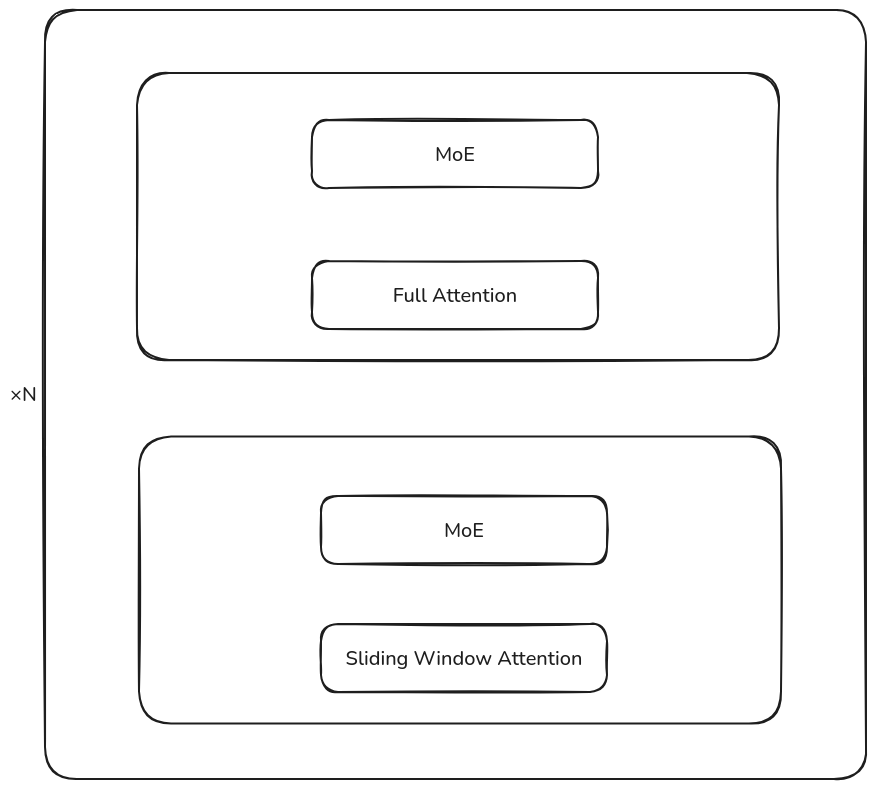
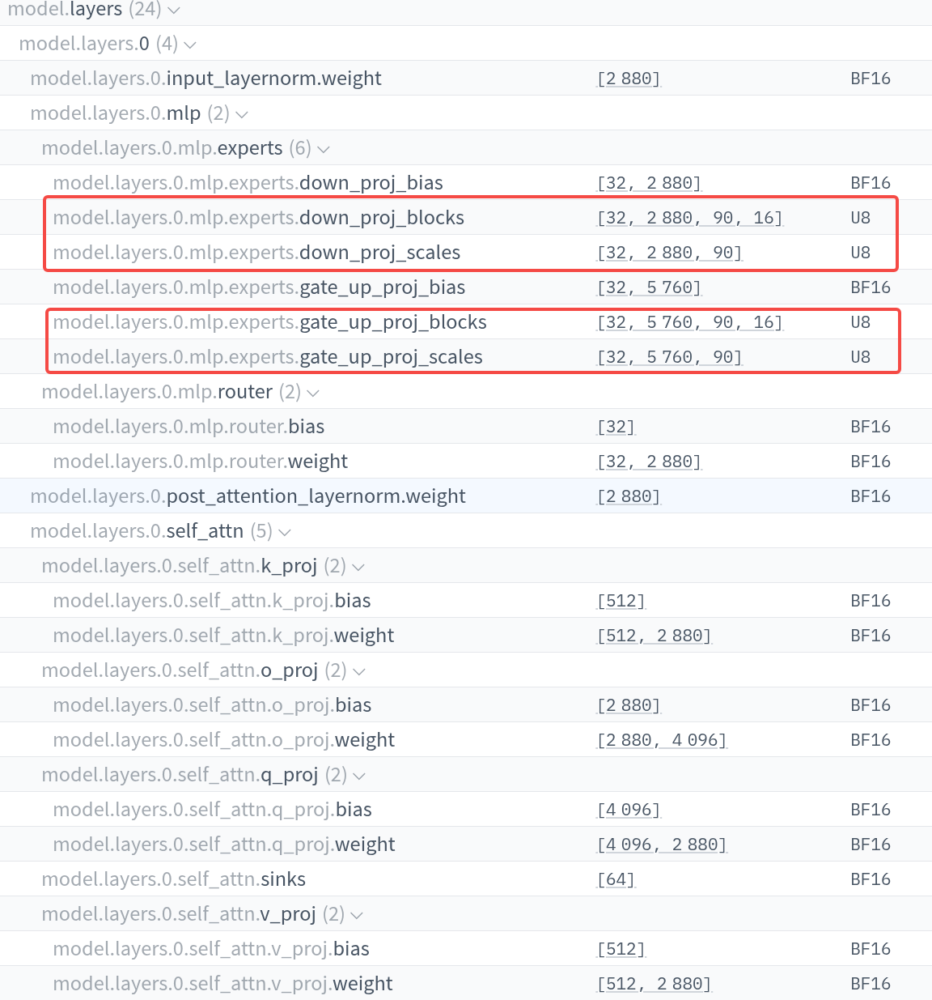
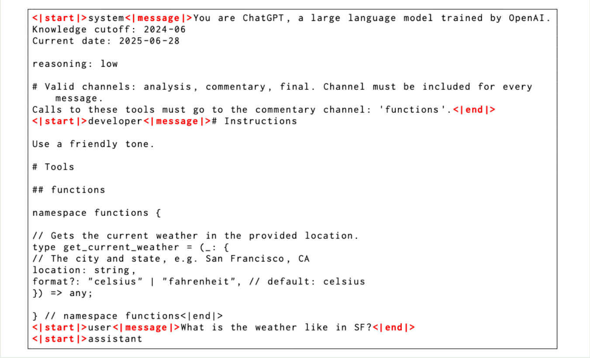
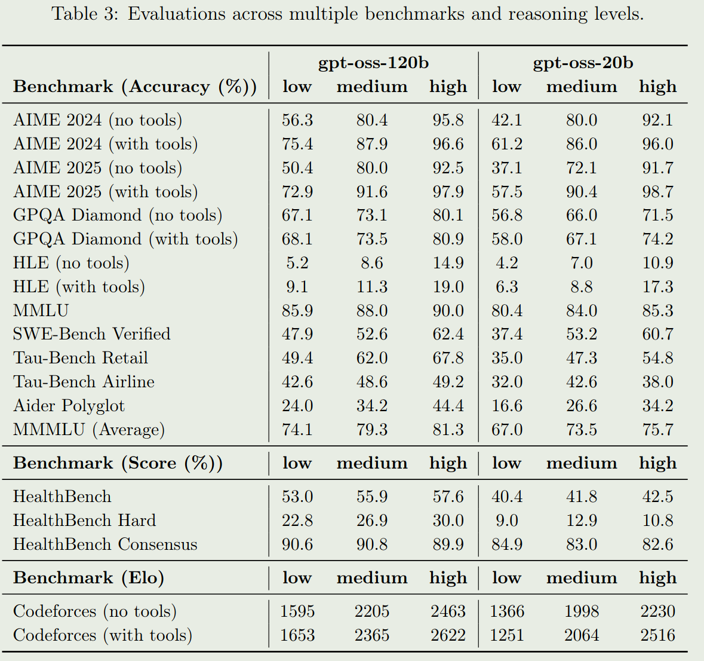

openAI 发布了 gpt-oss 大语言模型，包含 120B-A5.1B 以及 20.9B-A3.6B 两个 size, 作者强调了模型的 instruction following, tool use, 以及 adaptive thinking 能力

## Method

### Architecture

gpt-oss 系列是一个基于 MoE transformer 架构的 LLM. 架构中交替使用 sliding window attention 和 full attention, sliding window size 为 128 token, 架构图如下所示



模型的配置如下表所示

| Model                      | 120B               | 20B                |
| -------------------------- | ------------------ | ------------------ |
| Date                       | 2025/8/5           | 2025/8/5           |
| # Total Parameters         | 116B               | 20B                |
| # Activated Parameters     | 5.13B              | 3.61B              |
| # MoE Layers               | 36                 | 24                 |
| Hidden Dim                 | 2880               | 2880               |
| MoE Intermediate Dim       | 2880               | 2880               |
| Attention                  | GQA+sliding window | GQA+sliding window |
| Attention Head Dim         | 64                 | 64                 |
| Attention bias             | True               | True               |
| # Attention Heads          | 64                 | 64                 |
| # Key-Value Heads          | 8                  | 8                  |
| # Experts (total)          | 128                | 32                 |
| # Experts Active Per Token | 4                  | 4                  |
| # Shared Experts           | 0                  | 0                  |
| QK-Norm                    | No                 | No                 |

在架构上，gpt-oss 做的主要改变有：

1. Q, K, V projection layer, expert layer, routing layer 都使用了 bias
2. 修改了 expert layer 中 SwiGLU 的定义
3. attention 中额外使用了一个 attention sink

#### SwiGLU

大多数模型使用的基于 SwiGLU 的 MLP 定义如下

$$
y = W_2(W_3x \odot \mathrm{SwiGLU}(W_1x))
$$

其中 $\mathrm{SwiGLU}(x)=x\odot\mathrm{sigmoid}(x)$,  在 gpt-oss 模型中，作者首先定义了两个常数 $\alpha=1.702$, $\mathrm{limit}=7.0$,  然后 SwiGLU MLP 的定义如下

$$
\begin{aligned}
o_1&=W_1x+b1,\\
o_3&=W_3x+b_3\\
o_1&=\mathrm{clamp}(o_1,\max=\mathrm{limit})\\
o_3&=\mathrm{clamp}(o_3,\min=-\mathrm{limit},\max=\mathrm{limit})\\
o_3&= o_3\odot \mathrm{sigmoid}(\alpha\cdot o_3)\\
o_3&= (o_1+1)\odot o_3\\
y &= W_2o_3
\end{aligned}
$$

#### Attention Sink

作者使用了 [attention sink](https://maosong.website/p/notes-on-streamingllm/) 来避免 window attention 在超过 kv cache size 之后，表现大幅度下降的问题。

### Quantization

为了降低模型的内存占用量，作者使用了 PTQ 来训练 MoE 的权重，使用的精度为 MXFP4, 这样每个参数由 4.25 bits 来表示。最终，模型的参数存储格式如下：



通过这个流程，gpt-oss-120B 可以部署在 80GB 内存的 GPU 上，gpt-oss-20B 可以部署在 16GB 内存的 GPU 上。模型各部分参数量如下表所示


| Component         | 120b    | 20b     |
| ----------------- | ------- | ------- |
| MLP               | 114.71B | 19.12B  |
| Attention         | 0.96B   | 0.64B   |
| Embed + Unembed   | 1.16B   | 1.16B   |
| Active Parameters | 5.13B   | 3.61B   |
| Total Parameters  | 116.83B | 20.91B  |
| Checkpoint Size   | 60.8GiB | 12.8GiB |

这里在计算激活参数的时候，没有没有考虑 embedding 的参数量。

### Pre-training

预训练细节不多，主要是使用了 [flash attention](flash%20attention.md) 进行加速计算，使用了 Triton 进行了 kernel 的优化，gpt-oss-120b 训练了 120M H100-hours, gpt-oss-20B 的训练时间是 gpt-oss-120Bd 的十分之一左右

### Post-training

post-training 的数据包括 coding, math 以及 science 等，主要使用 RL 进行训练

作者介绍了以下 post-training 使用的格式，即 `harmony chat format`. 角色的优先级如下所示

```
System > Developer > User > Assistant > Tool
```

作者还加入了 channels 来限制可以使用的信息，比如使用 `analysis` 来表示 CoT tokens, 使用 `commentary` 来表示 function calling 等，一个具体的例子如下：



## Evaluation

gpt-oss 系列的表现如下表所示



## Conclusion

作者提出了 gpt-oss 系列大语言模型，gpt-oss 在架构上与已有的主流模型架构如 [Qwen3](Qwen3.md), [DeepSeek-V3](DeepSeek-V3.md) 等都有一定区别

## References

- [technical report](https://openai.com/index/introducing-gpt-oss/)
