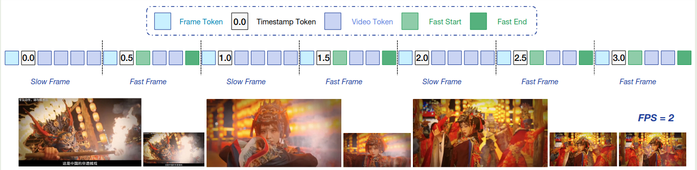
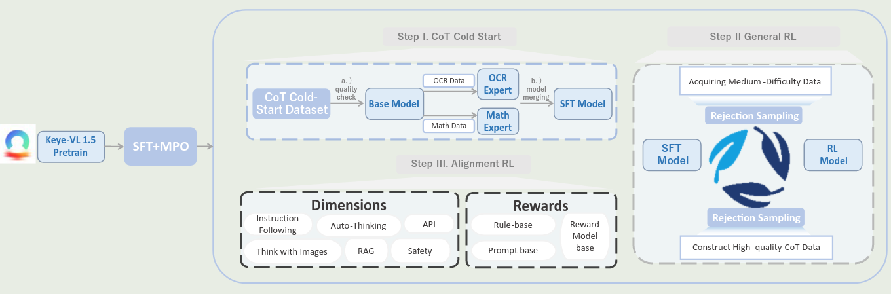
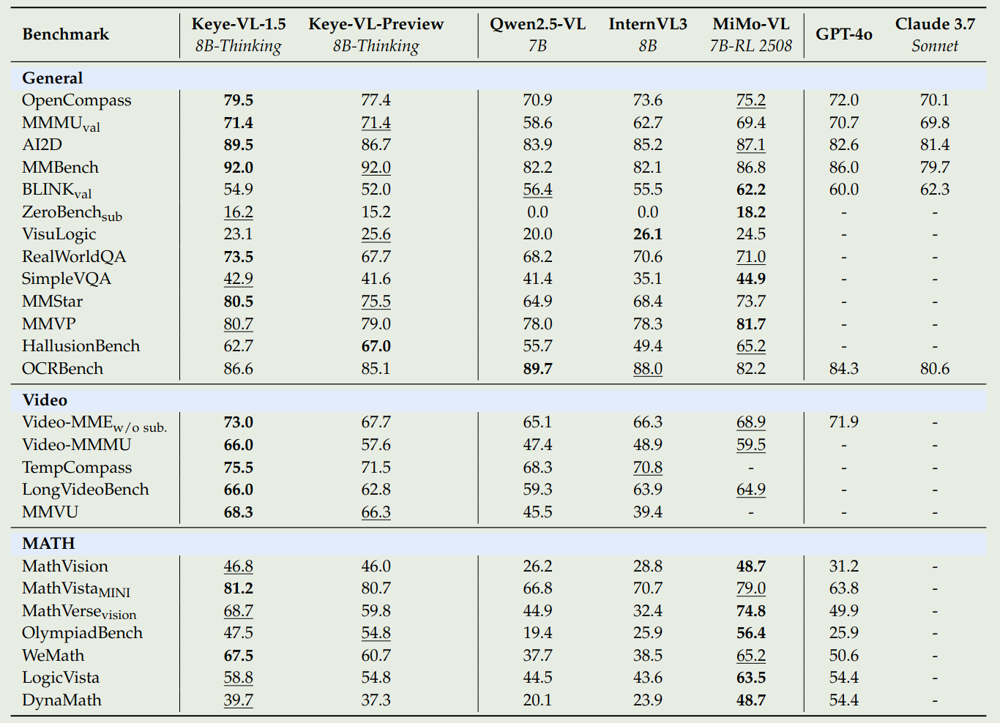
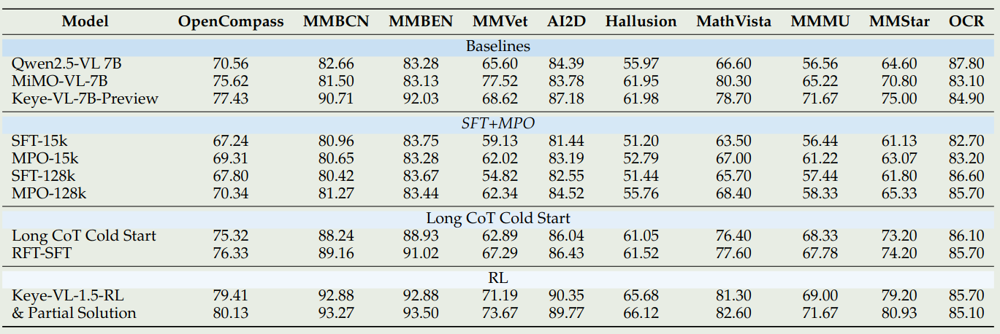
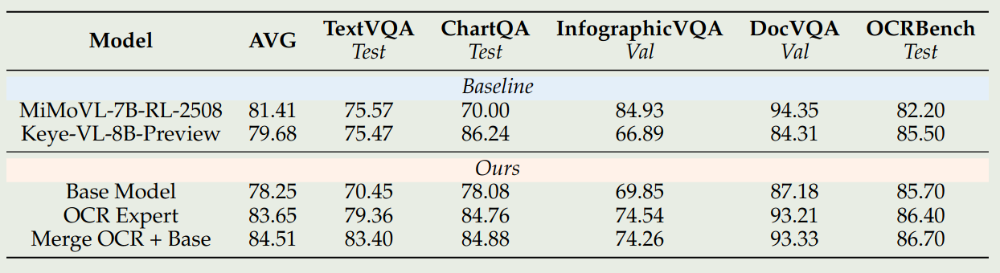
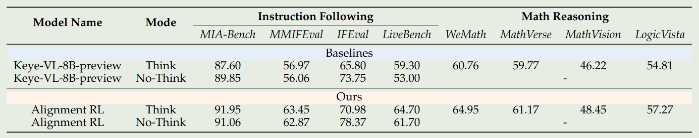
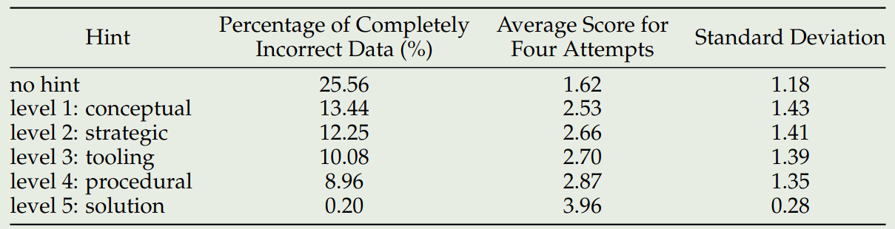
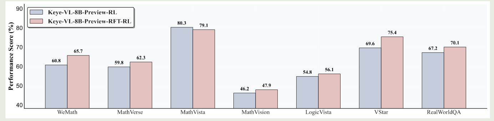

快手提出了 Keye-VL 1.5, 一个强调 reasoning, video understanding 的 8B 多模态大模型。作者提出了 slow-fast video encoding strategy 来提高模型的视频理解能力，作者通过在预训练和后训练提高了模型的长上下文能力和 reasoning 能力

## Introduction

作者回顾了多模态大模型的进展，然后提到视频理解能力仍然是一个挑战。为了解决这个问题，作者提出了 Keye-VL-1.5, 一个 8B 的视频理解多模态大模型。

Keye-VL-1.5 主要做了三点改进：

1. 在架构上，使用了 Slow-Fast Video Encoding
2. 在预训练阶段，使用多个 stage 来提升模型的长上下文能力
3. 在 post-training 阶段，提高模型的 reasoning 能力和 alignment 表现

## Method

### Architecture

Keye-VL 1.5 的架构与 [Keye-VL](https://maosong.website/p/notes-on-keye-vl/) 一致。

Keye-VL 1.5 主要做出的改进点为针对视频的 encoding 方式

作者回顾了已有 MLLM 处理视频的方式，比如 [Qwen2.5-VL](https://maosong.website/p/notes-on-qwen2.5-vl/) 使用 3D convolution 来 merge 相邻的两帧，[Seed1.5-VL](https://maosong.website/p/notes-on-seed1.5-vl/) 采用了 Dynamic Frame-Resolution Sampling 技巧，来根据 budget 和处理的任务来动态调整采样率 (frame) 和每一帧的图片精度 (resolution)。

但是这些方法很难进行泛化。因此，作者在本文中就提出了 **SlowFast video encoding stratrgy**:

1. Slow Pathway: 空间信息丰富（high resolution），时间信息简略 (low number of frames)
2. Fast Pathway: 时间信息丰富（high number of frames），空间信息简略 (low resolution)

为了区分 slow/fast frames, 作者提出了一个基于 patch similarity 的 metric:

1. 第一帧始终定义为 slow frame
2. 接下来的每一帧，如果其和上一帧的相似度超过 $95\%$, 则定义为 fast frame; 反之则定义为 slow frame.

得到 slow/fast frames 之后，作者将 fast-frame 的 token budget 限制为 slow frame token budget 的 $30\%$ 来平衡时间信息以及空间信息。接下来，作者使用二分搜索来决定 slow frame 的 token budget. 为了区分 slow frame 和 fast frame 的 token, 作者使用了特殊的 token 来进行分离。

最终的处理结果如下图所示

### Pre-training

预训练的数据和 Keye-VL 基本一致，我们主要介绍改进的点

对于 Image caption 数据，作者认为这批数据可能会损害模型的指令跟随和 reasoning 能力，因此作者对数据进行了增广，主要是调整了数据的格式：

1. QA, 数据格式为 `<image, caption, [eos], question, answer>`
2. reverse QA, 数据格式为 `<image, question, answer, [eos], caption>`
3. instruction following: 随机给一批数据作为输入，然后让模型基于特定 image 输出 caption

作者还构建了一个 trap question 来提高模型的 robustness 以及 faithfulness.

OCR 数据在 Keye-VL 的基础上加入了两点：

1. Structured Document and Code Understanding: 基于 markdown 和 HTML 等数据来获取 code OCR 数据
2. Instruction Following OCR: 基于特定指令进行 OCR

对于 grounding 数据，作者进一步加入了 temporal grounding 数据，作者首先使用 TEMPURA

来将短视频分割成若干个 video clips. 然后作者使用 SOTA MLLM 来过滤数据，最后作者基于 Gemini2.5 来生成对应的 QA.

预训练和 Keye-VL 一样，包含 3 个 stage

前两个 stage，作者将模型的上下文限制为 8K, 使用了 DP 和 Zero-2 来减少内存开销。在 stage 3, 作者将模型的上下文从 8K 扩展到 128K, 对应的 base frequency 从 1M 提升到 8M. 训练数据包括长视频，长文本和大规模图片。作者将优化策略调整为 Zero-1, CP 和 PP 来支持 long-context 的训练。训练时数据分布为 video:images:text=24:50:26.

### Post-training

SFT 阶段使用了 **7.5M** 多模态 QA 样本进行训练。

MPO 阶段的数据相比 Keye-VL 有所减少，包含：

1. 250K 开源样本
2. 150K 纯文本数据
3. 26K 人类标注数据

对于 reward model 的训练，作者使用了 SFT 和 RL 两个阶段。SFT 阶段的数据包括 R1-Reward 和 MMPR, 训练之后作者还是用比较短的 good response 来避免产生较长的回答

在 SFT 和 MPO 阶段之后，作者使用 LongCoT code-start 初步激活模型的 reasoning 能力。

作者构建了一个 5 部的自动化数据生成 pipeline, 如下图所示

步骤如下：

1. Multi-Source Data Collection and Enhancement：收集数据
2. Multi-Path Reasoning Generation with Confidence Quantification: 基于 confidence 来挑选数据
3. Comprehensive Two-Level Quality Assessment: 基于答案和过程的正确性来提高数据质量
4. Human-in-the-Loop Quality Enhancement: 对于中等质量的数据请人类进一步进行标注
5. Dynamic Quality Scoring and Data Utilization Strategy: 对数据进行打分，高质量数据进行上采样

接下来就是 General RL 过程。

对于通用的 RLVR 训练，作者使用了 [GSPO](https://maosong.website/p/notes-on-gspo/) 算法来进行训练。

在训练过程中，作者采取了 progressive hint sampling 方式，也就是提供不同程度的 hint 来提高模型的训练效率。作者将 hint 分为五个等级：

1. Level 1 (Concept / Observation)
2. Level 2 (Strategy / Method)
3. Level 3 (Tools / Formula)
4. Level 4 (Steps / Calculation)
5. Level 5 (Complete Solution)

来提供不同程度的辅助，作者使用 Keye-VL 1.5 来确定最小的 hint level, 然后基于这个 level 提供信息进行 RL 的训练

为了进一步提高模型的表现，作者采用了一个和 [Seed1.5-VL](https://maosong.website/p/notes-on-seed1.5-vl/) 一样的迭代式训练策略，即反复进行 SFT 和 RL 来降低训练成本，提高训练效率。

最后，再通用 RL 阶段之后，作者加入了 alignment RL 的训练来进行对齐，reward 包括三个方面：

1. rule-based reward
2. generative reward
3. model-based reward

任务主要包括三个方面：

1. instruction following
2. format adherence
3. preference alignment

数据介绍如下：

1. instruction following:25 类硬约束，20 类软约束，数据包括 17K 多模态数据和 23K 纯文本数据，奖励包括 rule-based reward 和 generative reward
2. reasoning: 12K 数学和逻辑推理数据
3. RAG: 提高模型的搜索能力，作者使用 GSPO 算法进行训练

## Experiments

模型表现如下

接下来作者进行了消融实验。

首先是不同训练阶段对模型表现的影响，如下图所示

实验结果显示，提高 SFT 训练数据可以有效提高模型在数学推理，逻辑推理和 OCR 任务上的表现。MPO 可以进一步提高模型的表现，Long CoT cold start 可以有效提高模型的 reasoning 表现。

作者还探究了 model merging 对模型表现的影响，作者首先基于 base model 和 OCR 数据训练得到 OCR expert, 然后进行 merge, 实验结果如下

实验结果显示，model merging 可以有效提高模型在 special domain 上的表现，并且还可以维持模型的通用能力

作者还发现：

1. expert model 训练时间过长会影响最终 merge model 的表现
2. expert mode 训练的学习率应该要设置比较小

接下来，作者探究了 alignment RL 对模型表现的影响，

实验结果说明，alignment RL 可以在保持模型 reasoning 能力的同时提高模型的指令跟随能力

作者还探究了 hint 对模型表现的影响，使用不同 level hint 进行训练对模型表现影响的结果如下图所示

实验结果显示，使用 high level 的 hint 可以有效提高模型输出的正确率。

最后作者探究了 rejection sampling 对模型表现的影响，实验结果如下图所示

结果发现，通过 rejection sampling，模型的表现有了进一步的提升。因此作者采用了 ST-RL-(RFT-SFT)-(RFT-RL) 的训练方式来进行训练

## Conclusion

作者在本文中提出了 Keye-VL1.5, 一个强调 video understanding 和 reasoning 的 MLLM. Keye-VL 1.5 使用了 SlowFast video encoding strategy 来提高模型的效率和视频理解能力。作者详细介绍了模型的数据，训练和评估。

## References

- [arxiv](http://arxiv.org/abs/2509.01563)
