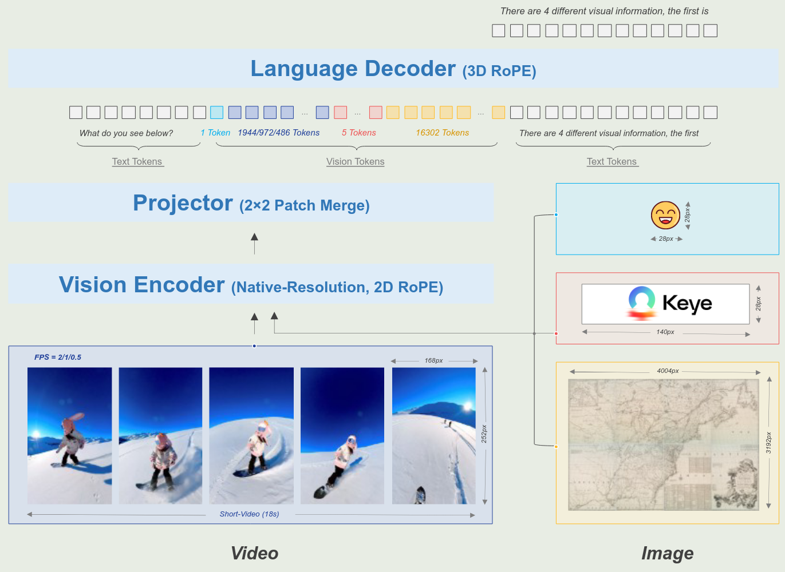
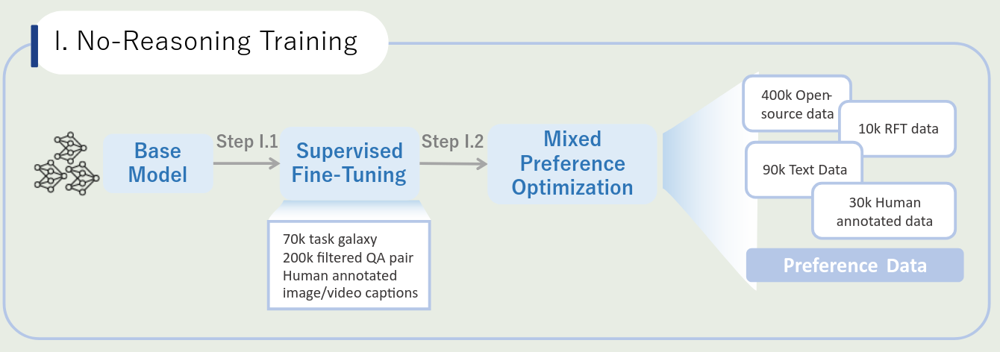
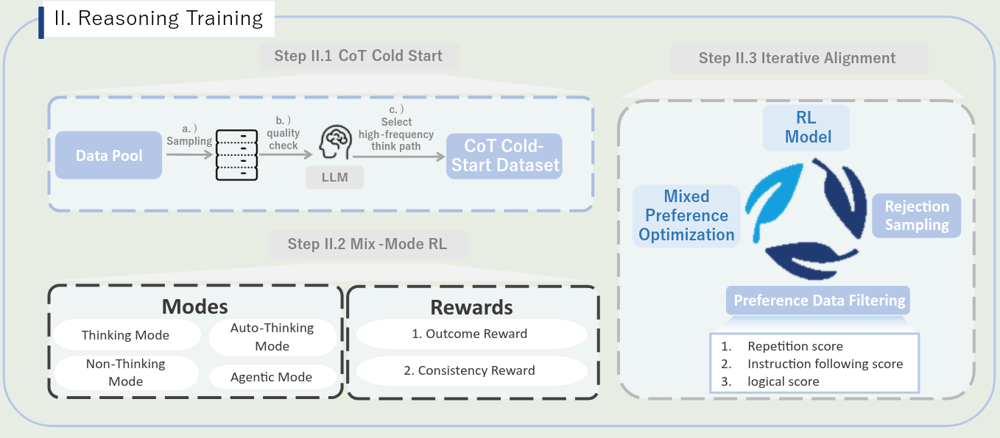
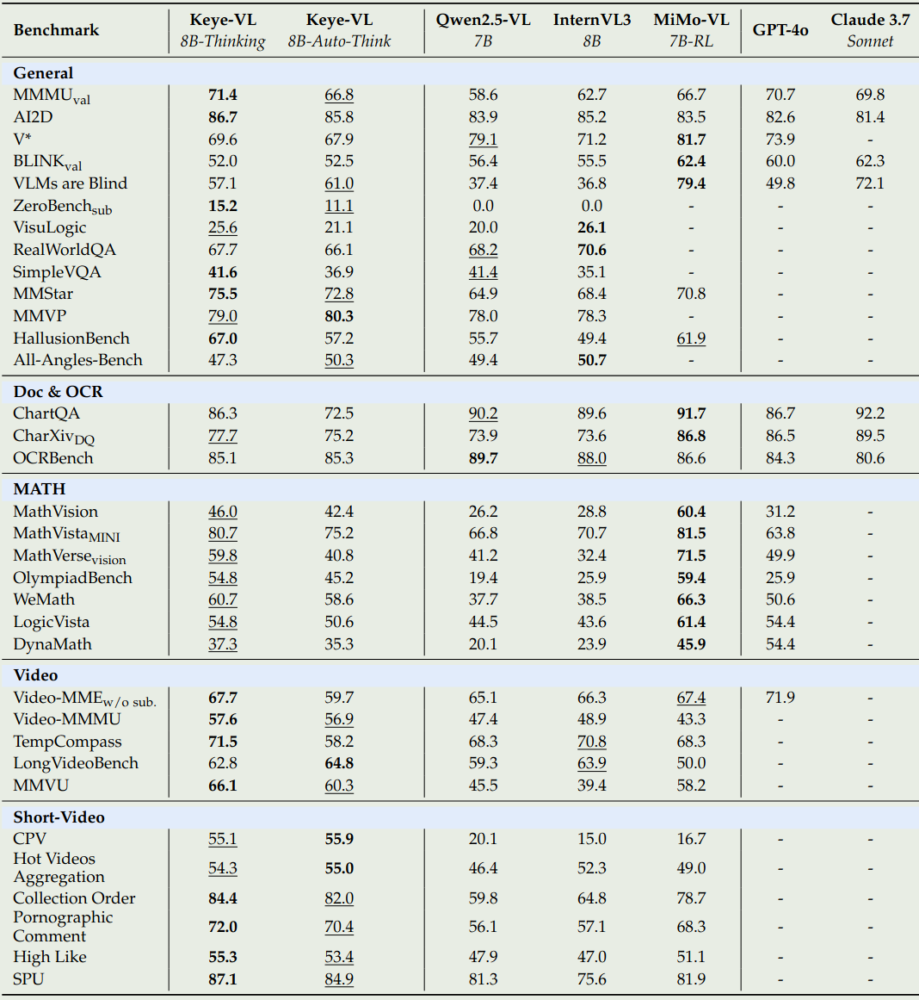
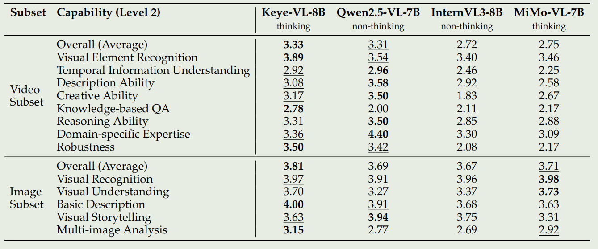

Keye-VL 是快手在 25 年 7 月份提出的一个 8B 的多模态大模型，其亮点为短视频理解能力。预训练包括 4 个 stage，使用了 600B token，后训练包括 2 个 stage，用于提升模型的 reasoning 和 non-reasoning 能力。

## Introduction

作者首先回顾了已有的 MLLM 工作，然后强调理解短视频仍然是一个很难的任务，特别是要求模型基于 video 和 audio 来理解视频。因此，在本文中，作者提出了 Kwai Keye-VL，一个 8B 的多模态大模型，主要用于短视频理解任务。

## Method

### Architecture

Keye-VL 是一个标准的 ViT-MLP-LLM 的架构，其中，ViT 是 SigLIP-400M-384-14, MLP 是一个基于 SwiGLU 的 2 层 MLP，使用了和 [Qwen2.5-VL](https://maosong.website/p/notes-on-qwen2.5-vl/) 一样的 patch merge 方法，LLM 使用的是 Qwen3-8B，模型架构示意图如下

作者针对 ViT 和 visual encoding 分别做了如下改进

#### NaViT

作者实现了 native resolution ViT，来处理不同分辨率的图片。

具体做法为，作者基于 SigLIP-400M-384-14 来初始化 ViT。

然后，作者首先采用了 interpolation 来将 ViT 的 position encoding 扩展到不同的图片精度下面去。

接下来，作者提出了 2D RoPE 来进一步提升 position encoding 的表现。

最后，作者加入了 NaViT 的 packing 技巧来继续预训练 ViT.

在 ViT 预训练的过程中，作者使用了 **500B** 的 token

#### Visual Encoding

为了提升模型理解图片和视频的能力，作者针对图片和视频进行了进一步的处理。

对于不同精度的图片，作者将最大 token 个数设置为 16384。

对于视频，作者将每帧的 token 数限制在 $[128,768]$, 每个视频的最大 token 个数设置为 24576

对于提取的 frames，作者重新计算了 FPS, 然后在 3D RoPE 中让时间维度与真实时间严格对齐。

### Pre-training

#### Data

预训练数据一共包括 600B token，覆盖了 6 个类别：

- Image caption: 包括中英文数据，来源为 LAION, DataComp 以及 Coyo. 作者基于 CLIP 来计算相速度，然后过滤掉相似度比较低的数据，作者还对数据进行了 re-caption，实验发现 re-caption 可以提高模型的细粒度图片理解能力
- OCR & VQA: 数据包括开源数据和合成数据。合成数据包括 Synthesis 和 Rendering 两个方法，第一是基于 text-dense image 构建 OCR 数据以及基于 image-caption pair 数据使用 MLLM 构建 VQA 数据。第二是使用字体渲染工具合成高质量的 OCR 数据
- Grounding & Counting: Grounding 数据主要包括 RefCoCo, VisualGenome, TolokaVQA, Counting 数据包括 PixMo. 作者仍然使用 CLIP 对数据进行过滤
- Interleaved text-image data: 作者发现图文交错数据可以提供通用知识，并且还可以提高模型的视觉语言对齐能力，第三就是提升模型的泛化能力。作者主要从 academic PDF 以及结构化知识中提取对应的数据。作者基于 Garbled character recognition, low-resolution/broken image filtering 以及 text-image similarity validation 来保证数据的质量
- Video understanding: 作者使用 Qwen2.5-omni 从 interleaved video-asr 来将视频数据转化图文交错数据， 然后基于 ASR 的结果进行 recaption，最后对每一帧进行 OCR. 作者还构建了 Frame-level re-ordering 以及 multiple video matching 两个任务来提高模型的上下文理解能力
- Pure Text: 未提及

对于源数据，作者进行了数据清洗：

1. 使用 CLIP 对数据进行打分，然后过滤掉低质量的数据
2. 使用开源的 MLLM 作为 discriminator 来选择高质量的数据
3. 去重

#### Training Recipe

预训练包括 4 个 stage：

- Stage 0: 使用 SigLIP 损失函数来继续训练 ViT
- Stage 1: cross-modal Alignment，仅训练 MLP
- Stage 2: multi-task pre-training, 解冻所有参数，使用 Multi-task 数据来训练模型
- Stage 3: annealing, 在高质量数据集上进行 fine-tune，进一步提升模型的能力

作者发现，预训练后的模型在下游任务上的表现对训练数据配比非常敏感。为了解决这个问题，在最后一个训练阶段，作者使用了一个 merging 的技巧，来保持模型的能力。

### Post-training

post-training 阶段一共包含了 2 个 step, 5 个 stage, 第一个 step 包含 2 个 stage，用于提升模型的 non-reasoning 能力。第二个 step 包含 3 个 stage, 用于提升模型的 reasoning 能力

#### No-reasoning Training

第一个 step 是 non-reasoning training, 包含了 SFT 和 [MPO](MPO.md) 两个 stage, 训练 pipeline 如下图所示

**SFT**
SFT 阶段一共使用了 **5M** 的多模态 QA 样本，为了提升数据的多样性，作者使用 TaskGalaxy 来将数据分类为 70,000 种任务类型，然后作者对每条数据，使用 MLLM 评估问题的难度，来过滤掉过于简单的问题。最后，作者请人类来进行标注，保证数据的可靠性。

**MPO**
训练方面，作者使用了 MPO 进行训练。
数据方面，作者使用了：

1. 400,000 开源的数据，作者主要进行了去重以及过滤低质量的数据
2. 50,000 偏好数据，基于 MM-RLHF 和 MMPR 等数据构建，然后构建高质量的 negative examples
3. 10,000 条 self-improvement 样本：基于 benchmark 和人类反馈，使用 SFT model 的回答作为 chosen samples, 然后基于 reward model 或者 rule-based rewards 评估模型输出，选择分数最低的座位 rejected samples
4. 90,000 纯文本样本： in-house data
5. 30,000 人类标注样本：使用开源和闭源模型进行回答，然后请人类进行排序

#### Reasoning Training

第二个 step 是 reasoning training, 包含了 CoT Cold-Start, Mix-Mode RL 和 Iterative Alignment 三个 stage, 训练 pipeline 如下图所示

**CoT cold-start**
作者收集了如下数据：

- 330, 000 条 non-reasoning 样本：和第一个 step 的数据分布类似，但是不重合
- 230,000 reasoning 样本：作者构建了一个 data construction pipeline,用于保证 long-CoT 的正确性
- 20,000 automatic reasoning 样本：作者基于 MMPR, MM-Eureka 以及 OpenR1-math 来收集数据，基于这些模型来训练模型自动化决定是否要进行 reasoning
- 100,000 agentic reasoning 样本：训练模型的 "think with image" 能力。基于 3M QA pairs，作者使用 Qwen2.5-72B 来识别需要进行 manipulating 的问题，然后生成对应的代码。接下来作者构建了一部分 OCR 数据，让模型学会 constrast enhancement 或者 rotation 操作。最后对于数学问题，作者让 Gemini-2.5-Pro 生成对应的思考过程，再让 GPT-4o 将对应的计算转换为可执行的代码。
- 32, 000 Video data: 包含了 24,000 条 thinking samples 和 80,000 条 non-thinking samples

训练时，所有样本混在一起进行训练。作者认为，将日常使用的 SFT 数据和 reasoning 数据放在一起训练，可以保持模型在通用场景下的能力。

**Mix-Mode RL**
训练数据主要包括 4 个任务：

1. Multimodal perception: 复杂文本识别和 counting 任务
2. Multimodal reasoning: MMPR 和 MM-Eureka
3. Text-based mathematical reasoning: 数学推理问题
4. Agentic reasoning: 从 DeepEyes 中获取的 47,000 条样本

作者使用了 GRPO 来训练，reward 基于 MLLM 进行，包括最终结果和思考过程。

作者还使用 RL 来提高模型的短视频理解能力。作者发现 RL 训练之后，模型的短视频理解能力有了大幅度的提升。

**Iterative Alignment**
这一步主要解决模型的重复性输出，或者 reasoning logic 不对的问题。作者使用了 rejection-sampling 数据，包括 instruction following, OCR, mathematics, charts, counting 等。

作者基于 Rule-based score 和 model-based score 来进行打分，最后使用 MPO 算法进行训练。通过这个过程，模型的输出格式和动态思考能力都有了提升。

## Evaluation

作者首先评估了 ViT 的表现，主要有两点：

1. 在 SigLIP 的基础上加入 1D interpolation 之后，模型的表现所有下降，作者认为这是由于 1D 的 position encoding 无法识别 2D 的 patch 排列导致的
2. 加入 2D RoPE 之后，ViT 与 SigLIP 的表现持平

接下来是 Keye-VL 在公开 benchmark 上的表现，如下图所示

作者还构建了一个内部的 benchmark, 用于进一步评估模型的能力。

已有 benchmark 的问题：

1. contamination
2. 多语种覆盖不足：大部分 benchmark 都是英文的
3. 任务和 domain 覆盖不足：大部分 benchmark 只考虑基本的 perception 和 reasoning 能力
4. 任务难度和评估格式单调

构建 benchmark 的原则：

1. 在中文场景下的真实用户需求，open ended QA,  包括短视频理解能力
2. 细粒度的评估
3. 多样性高
4. 没有 contamination
5. 多角度评估策略: 正确性，相关性，理解性，流畅性和创造性

结果如下：

分析：

1. Keye-VL 在 OCR 等任务上的表现有所不足，其细粒度的识别能力也有所不足，会认错人。有时候还会忽略掉一些信息
2. 描述 temporal action 时会出现不稳定性，模型对镜头的感知能力不足。需要准确定位时间等
3. 在需要逻辑链条和数学计算时，模型能力不足，对于特定 domain 上的任务会出现事实性错误。写作时，模型倾向于输出通用的回答，而不是定制化的回答。

## Discussion

作者讨论了两点关键发现：

1. reasoning 和 non-reasoning 的数据可以互相促进彼此的表现，这与 ERNIE 4.5 的发现一致。
2. 作者认为通过 mix-mode 的训练，模型在简单和复杂任务上的表现都可以提升，因此作者使用了混合数据来进行训练，结果发现效果很好。

## Conclusion

本文中，作者提出了 Keye-VL 8B，一个短视频理解能力出色的多模态大模型，作者详细介绍了 pre-training 和 post-training. 其中，mix-mode training 可以有效提高模型的表现。

作者认为 Keye-VL 有如下改进的地方：

1. 并没有优化 video encoder 或者是改进 video encoding 的策略
2. Keye-VL 的视觉感知能力有进一步的提升空间，其 "reasoning with image" 能力依然落后于领先的 reasoning model
3. 使用一个额外的 MLLM 作为 reward model 会极大消耗算力，如何构建一个更可靠更高效的 reward model 需要进一步探索。

## Reference

- [Arxiv](http://arxiv.org/abs/2507.01949)
- [Github](https://github.com/Kwai-Keye/Keye/tree/main)
