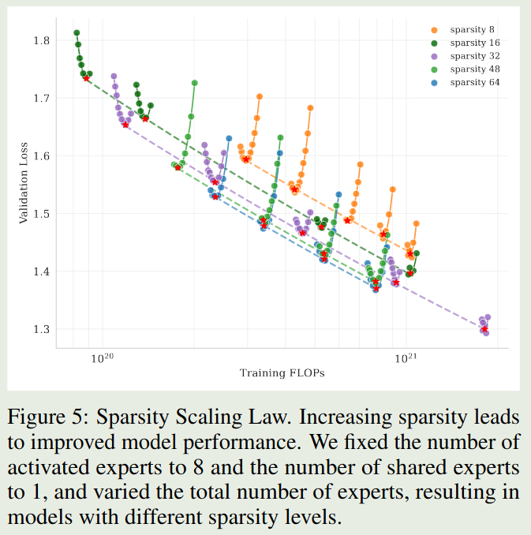
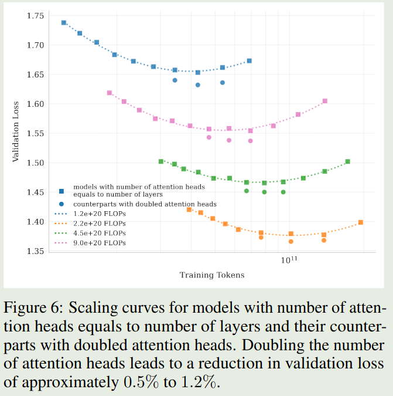
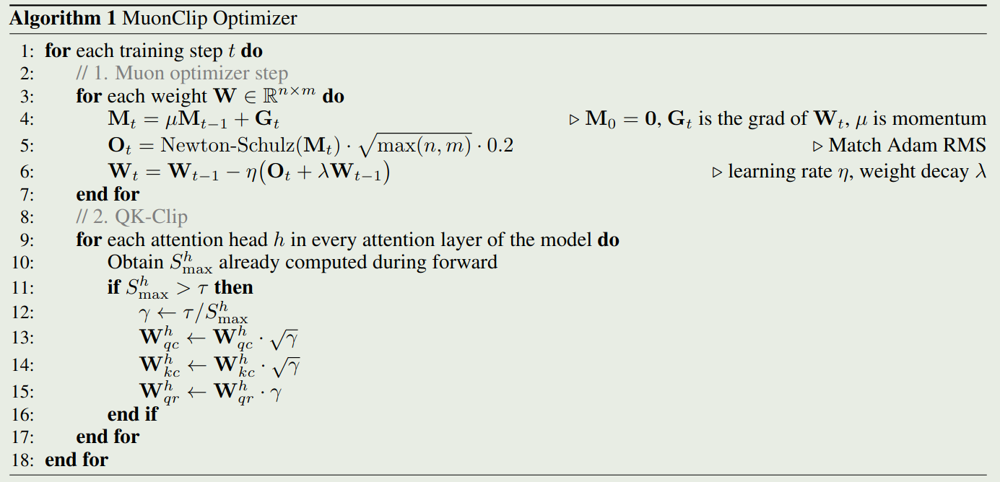
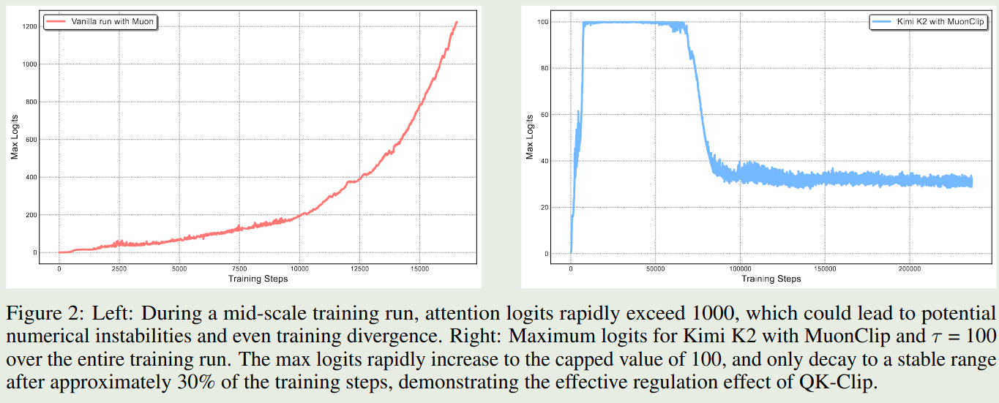
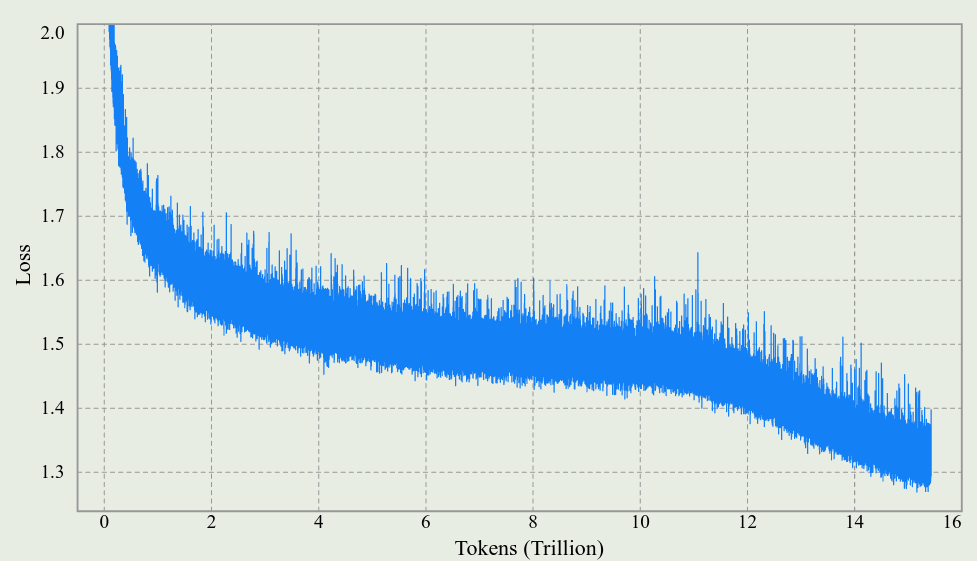
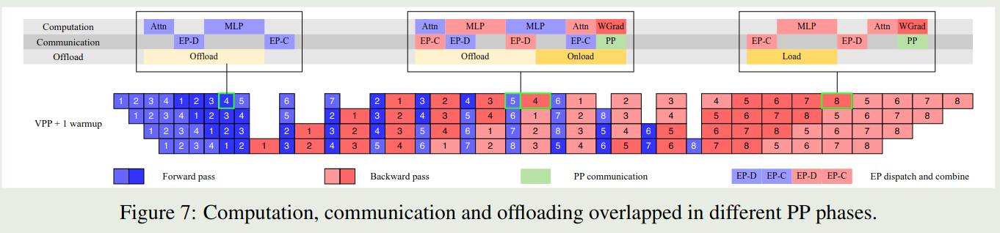
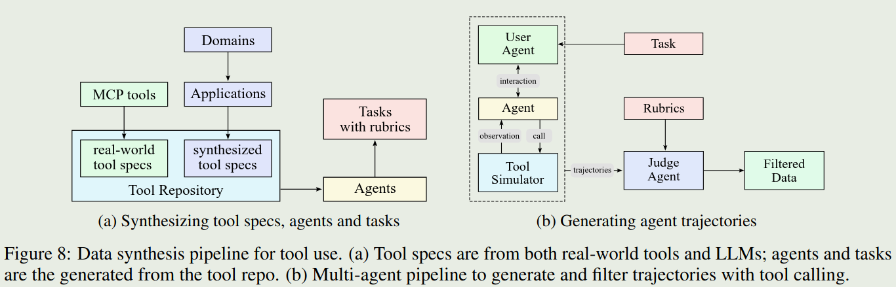
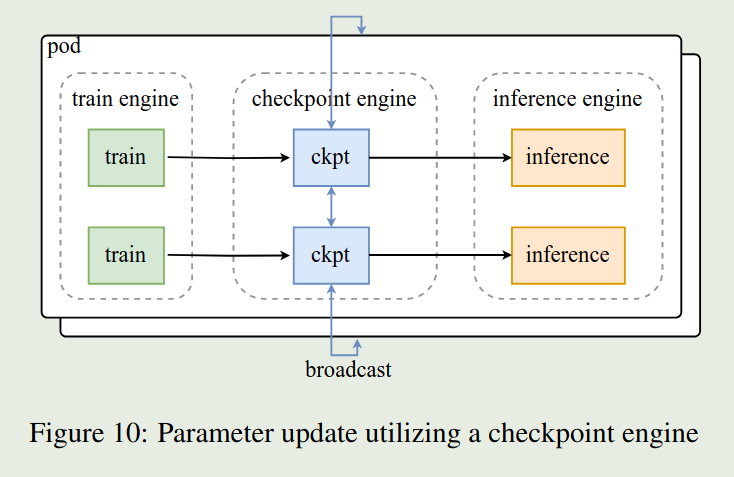
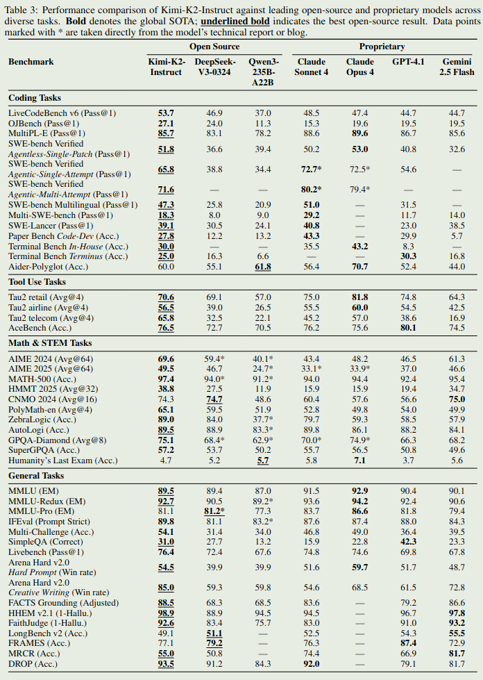

Kimi-k2 是一个总参数为 1T, 激活参数为 32B 的 MoE 大语言模型，模型使用 15.5T token 进行训练，optimizer 使用了 MuonClip. 作者主要关注模型的 agent 能力

## Introduction

作者首先强调现在 LLM 发展主要是 Agentic Intelligence, 也就是让模型自主感知，规划，思考和与环境交互。

基于这个目标，作者就提出了 Kimi K2, 一个 1.04T 总参数，32B 激活参数的 MoE 模型，用于解决实现 agent Intelligence 中遇到的问题。作者主要进行了三点改进：

1. MuonClip, 一个基于 [Muon](https://maosong.website/p/notes-on-moonlight/) 的优化算法，来提高 Kimi K2 对 token 的利用效率以及提高训练的稳定性
2. 大规模的 agentic 数据合成 pipeline: 作者构建了一个用于合成工具调用，agent 数据的 pipeline
3. 通用的 RL 框架，作者将 RLVR 和 self-critic rubric reward mechanism 结合起来，用于提升模型的表现

## Pre-training

### Architecture

Kimi-K2 的架构与 DeepSeek-V3 相似，配置如下表所示

| 指标                       | DeepSeek-V3   | Kimi K2        | $\Delta$          |
| ------------------------ | ------------- | -------------- | ----------------- |
| # Layers                 | 61            | 61             | =                 |
| Total Parameters         | $671\text{B}$ | $1.04\text{T}$ | $\uparrow 54\%$   |
| Activated Parameters     | $37\text{B}$  | $32.6\text{B}$ | $\downarrow 13\%$ |
| Experts (total)          | 256           | 384            | $\uparrow 50\%$   |
| Experts Active per Token | 8             | 8              | =                 |
| Shared Experts           | 1             | 1              | =                 |
| Attention Heads          | 128           | 64             | $\downarrow 50\%$ |
| Number of Dense Layers   | 3             | 1              | $\downarrow 67\%$ |
| Expert Grouping          | Yes           | No             | -                 |

与 DeepSeek-V3 相比，模型主要进行了以下改动：

1. 作者认为提高专家的稀疏性，可以有效提高模型表现。因此作者将专家个数提升了 50%.
2. 为了降低模型在 inference 阶段的算力开销，作者将 attention heads 的个数降低了 50%.

**Sparsity Scaling Law**
作者首先构建了基于 Muon 的 sparsity law, 这里 sparsity 定义为激活专家个数与总专家个数之比，即：

$$
\mathrm{sparsity} = \frac{\# \mathrm{activated\ experts}}{\# \mathrm{total\ experts}}
$$

作者在小规模上的实验结果如下图所示

> **Observation**
> 实验结果表明，在相同算力（激活专家个数）下，模型的表现随 sparsity 提高而增加。

但是，进一步提高 sparsity, 会让 infra 变的难以优化，因此在 Kimi-K2 里，将 sparsity 定义为 $48$.

**Number of attention heads**
作者还分析了探究了 attention heads 的最优配置。DeepSeek-V3 将 attention heads 的个数设置为 layers 层数的 2 倍，来提高带宽利用率以及提高计算效率。但是，当上下文长度增加之后，attention head 变成了 computational bound. 作者对比了不同配置模型的表现，实验结果如下：

> **Observation**
> 实验结果表明，使用双倍 attention head 带来的收益是比较小的，只有 $0.5\%$ 到 $1.2\%$ 左右

因此，作者在 Kimi-K2 中，奖 attention head 的个数设置为 $64$.

### Data

Kimi-K2 主要强调了 token efficiency, 即每个 token 对模型表现提升的贡献。token efficiency 越高，说明每个 token 对最终模型的贡献也就越高

相比于 [Kimi-k1.5](https://maosong.website/p/notes-on-kimi-k1.5/), Kimi-K2 使用了一个 rephrasing pipeline, 来提高高质量 token 的利用率，作者在 knowledge 和 mathematics domain 上进行了实验。

最终，Kimi-K2 的预训练数据包括了 **15.5T** token, 主要覆盖 Web text, code, mathmatics 以及 Knowledge 四个 domain. 大部分的数据处理与 Kimi-k1.5 相同。

**Knowledge Data Rephrasing**
作者构建了一个 synthetic rephrasing 框架来提高 knowledge token 的利用率，框架主要包含以下几个模块：

1. Style and perspective-diverse prompting: 作者构建了一系列 prompt, 来让 LLM 从多个角度和风格来重新表述原始文本
2. Chunk-wise auto-regressive generation: 为了保持模型在长文档中的 coherence 以及避免信息损失，作者使用了一个 chunk-based rewriting 策略，也就是对每个 chunk 分别进行改写，然后将它门汇总在一起
3. Fidelity verification: 作者对原始文本和改写文本进行了 fidelity 检查来保证语义的一致性。

作者对比了以下三个设置对模型在 SimpleQA benchmark 上表现的影响，这三个设置分别是：

1. 原始数据集训练 10 epoch
2. 改写数据一次，然后训练 10 epoch
3. 改写数据一次，训练 1 epoch

实验结果如下表所示

| # Rephrasings     | # Epochs SimpleQA | Accuracy |
| ----------------- | ----------------- | -------- |
| 0 (raw wiki-text) | 10                | 23.76    |
| 1                 | 10                | 27.39    |
| 10                | 1                 | 28.94    |

可以看到，改写的策略可以有效提高模型在 SimpleQA benchmark 上的表现

**Math Data Rephrasing**
对于数学相关数据，作者基于 SwallowMath, 将数据改写成了学习笔记 (learning-note) 的风格。然后，作者还将其他语言的高质量文本翻译为英文。

> **Recall**
> 个人认为，数据改写在一定程度上也算是合成数据，对于合成数据这一块，微软提出的 phi 系列是一个比较好的参考

### MuonClip Optimizer

Kimi-K2 使用了 Muon optimizer, 之前的实验结果说明了在相同的 compute budget 下，Muon optimizer 的表现超过了 AdamW. 也就是说，Muon optimizer 更加高效。

但是，Muon optimizer 的问题是训练不稳定。为了解决这个问题，作者提出了 QK-clip, 一个 weight clipping 机制，来显示约束 attention logits. QK-clip 的机制是**当输出的 logits 超过某一个阈值之后，就对齐进行截断**。

每个 head 的 attention 的计算公式如下

$$
O = \mathrm{softmax}\left(\frac{QK^T}{\sqrt{d}}\right)V
$$

其中, $d$ 是 hidden size, $Q, K,V$ 分别是 query, key, value, 定义如下：

$$
Q = XW_Q, K=XW_K, V=XW_V
$$

这里 $W_Q,W_K,W_V$ 是模型可学习的参数。

作者定义每个 head 的 max logit 如下：

$$
S_{\max}^h = \frac{1}{\sqrt{d}} \max_{X\in\mathcal{B}}\max_{i,j} [QK^T]_{ij}
$$

最简单的做法就是直接进行截断，也就是

$$
W_Q\gets \gamma^\alpha W_q, W_K\gets \gamma^{1-\alpha}W_K
$$

其中 $\gamma=\min(1, \tau S_{\max})$, 这里 $S_{\max}=\max_h S_{\max}^h$ 是所有 head 对应 $S_{\max}^h$ 的最大值。

但是，实际中，作者发现只有少部分 head 会出现 logits 爆炸现象。为了提高计算效率，作者针对每个 head 单独进行 scaling, 也就是 $\gamma_{h}=\min(1, \tau S_{\max}^h)$.  对于 MLA 架构，作者仅在 unshared 模块使用 clipping:

- $q^c$ 以及 $k^c$, scaling factor 为 $\sqrt{\gamma_h}$
- $q^R$, scaling factor 为 $\gamma_h$

最后，作者将 Muon, weight decay, RMS matching 和 QK-clip 汇总在一起，得到 Kimi-k2 使用的 MuonClip optimizer, 算法如下所示：

接下来，作者对比了以下 Muon 和 MuonClip 两个优化器的表现，作者分别使用这两个优化器训练 53B-A9B 的 MoE 模型，实验结果如下

实验结果表明，Muon 优化器在 1000 步左右就出现了 logits 爆炸的现象，但是 MuonClip 通过优化可以避免这个问题。作者还发现，MuonClip 可以减少 loss spike 的产生，整体的 loss 变化情况如下图所示

作者还在附录中说明 QK-clip 并不影响最终的收敛性，并且，为了尽可能减少对模型训练的干扰，作者发现，仅在训练初期 QK-clip 被激活:

1. 在初始的 70, 000 步里，有 12.7% 的 attention heads 至少触发了一次 QK-clip, 并且将它们的 $S_\max$ 降到了 100 以下
2. 接下来的 70, 000 步里，QK-clip 就不再被激活

### Infra

Kimi-k2 使用了 16-way 的 PP, 16-way 的 EP 以及 ZeRO-1 Data Parallelism. 具体流程如下

作者发现通过增加 warm-up mircro-batches, 我们可以有效重叠 EP 的 all-to-all communication 以及 computation. 但是，对于 [[DualPipe]], 其要求双倍的存储来保存参数和梯度，并且提高 PP 粒度会引入更多的 bubble, 因此 Kimi-K2 没有使用 DualPipe.

为了减少 [[1F1B]] 的 PP 通信开销，作者在反向传播的过程中同时进行 PP 通信，来进一步重合通信与计算。

作者还发现，使用更小的 EP group 可以提高整体的训练速度，因此作者将 EP 设置为 16.

作者发现，剩余的 GPU 内存不足以存放 MoE 的 activation, 因此作者采取了三个办法解决这个问题：

1. Selective recomputation: 作者对 LayerNorm, SwiGLU,  MLA 的 up-projection 和 MoE 的 down-projections 等进行重新计算。
2. FP8 storage for insentive activations: 作者使用了 FP8 精度来存储 MoE up-projections 以及 SwiGLU. 作者发现使用 FP8 进行计算可能会导致性能下降，因此作者并没有使用 FP8 进行计算。
3. Activation CPU offload: 作者将其余的 activation 放在 CPU RAM 上，在 1F1B 的过程中，作者再进行加载

### Training Recipe

模型上下文长度为 4096, 使用 MuonClip 进行优化，使用 WSD lr Scheduler.weight decay 为 0.1, global batch size 为 67M tokens.

预训练结束之后，作者加入了一个 long-context activation stage. 这个阶段，作者使用了 400B 的 4K 上下文的 token 和 60B 的 32K 上下文的 60B token. 最后作者使用 [YARN](https://maosong.website/p/notes-on-yarn/) 将模型上下文长度扩展到 128K.

## Post-training

### SFT

数据的构建主要是基于：

1. prompt 的多样性
2. Response 的质量

作者构建了一系列的数据生成 pipeline, 然后使用 Kimi-k1.5 来生成多样化的回答，最后再进行质量评估和过滤。这里，作者主要介绍了一下 tool-use 数据的构建

受 ACEBench 启发，作者构建了一个模仿真实世界 tool-use 的数据合成 pipeline. pipeline 如下图所示

pipeline 主要包含三个阶段：

- tool spec generation: 作者基于 MCP tools 和 self-evolved 的数据合成策略来构建 tool repository. MCP tools 包括 3000+ 的 tools,合成了 20，000 个 tools
- Agent and task generation: 作者还用不同的 system prompt 以及不同的 tools combination 来构建对应的 agent. 然后对不同的 agent, 作者构建了对应的成功标准均，工具调用模式以及评估方式
- Trajectory generation: 作者首先构建不同风格的 LLM, 然后作者使用一个 simulator 来执行 tool call 并给予反馈。

最后，作者对数据进行了过滤。

作者还加入了 coding 以及软件工程等任务相关数据来进一步提高模型的 agent 能力

### RL

RL 与 Kimi-K1.5 差不多。作者进一步提高了 RL 阶段的算力并做出了亮点改进：

1. 作者构建了类似 Gym 的框架，用于扩展 RL 的能力
2. 作者加入了更多 RLVR 的任务

**Data**
数据主要包括以下几类：

1. Math, STEM and logical tasks: 数据构建的原则为多样化和中等难度
2. Instruction following: 作者基于 hybrid rule verification 和 multi-source instruction generation 来合成复杂的指令跟随数据
3. Faithfulness: 作者训练了一个 judge model 来提供 reward
4. Coding & Software Engineering: 作者从开源数据收集并合成了代码相关数据
5. Safety.  提高模型的安全性，防止 jailbreak

**Reward**
作者使用了 self-critique rubric reward 的奖励机制。

首先，对于 Kimi-k2 的回答，作者会使用另一个 kimi-k2 作为 critic，基于三个方面进行排序：

- core rubric: AI 的核心价值观
- prescriptive rubric: 避免 reward hacking
- human-annotated rubric: 特定的上下文

在训练的过程中，critic 也会基于 verifiable signals 进行 refine

**RL training**
RL 的训练目标与 Kimi-k1.5 相同

$$
\mathcal{L}(\pi_\theta) = \mathbb{E}_{x\sim \mathcal{D}}\left[\frac1K\sum_{i=1}^K \left(r(x,y_i)-\bar{r}(x) -\tau\log\frac{\pi_{\mathrm{\theta}}(y_i\mid x)}{\pi_{\mathrm{old}}(y_i\mid x)}\right)^2\right]
$$

其中 $\bar{r}(x)=1/K\sum_{i=1}^Kr(x,y_i)$ 是 sample response 的平均奖励。

作者做了以下几点改进来提高模型在不同 domain 上的表现：

1. Budget control: 作者针对不同任务分别设置了最大 token 限制，模型超过这个限制会受到惩罚。猜测应该是 length penalty 或者类似 Qwen3 一样，直接中断思考过程输出最终答案
2. PTX loss: 作者使用了 PTX loss 来提高模型对于高质量数据的利用率以及降低模型的过拟合
3. Temperature Decay: 作者发现，训练后期保持较高的采样温度会影响模型的表现，因此作者设置了一个 schedule, 来逐步降低采样温度。

### RL Infra

RL infra 与 Kimi-k1.5 类似。主要包含三个模块。其中 train engine 和 inference engine 两者互相切换，一个 engine 进行 training 的时候，另一个 engine 就进行 inference, 为了提高 engine 切换的效率，作者使用了 checkpoint engine 来传输更新后的参数。

## Evaluation

模型评估结果如下图所示

评估结果显示，模型在 coding 和通用任务上的表现仅次于 Claude 4, 大部分 benchmark 上都是第二名甚至是 sota.

## Conclusion

作者在本文中提出了 Kimi-K2, 一个总参数为 1B 的 MoE 大语言模型。作者在架构，数据和优化器上进行了创新。并且通过 post-training 显著提高了模型的 agent 以及 tool-use 能力

作者发现模型主要存在的问题有：

1. reasoning 任务过难或者 tool 的定义不清晰的时候，模型会使用很多 token
2. 有时候工具调用可能会降低模型的表现
3. 模型在 agentic coding 任务上的能力需要进一步提升

## References

- [Github](https://github.com/MoonshotAI/Kimi-K2)
