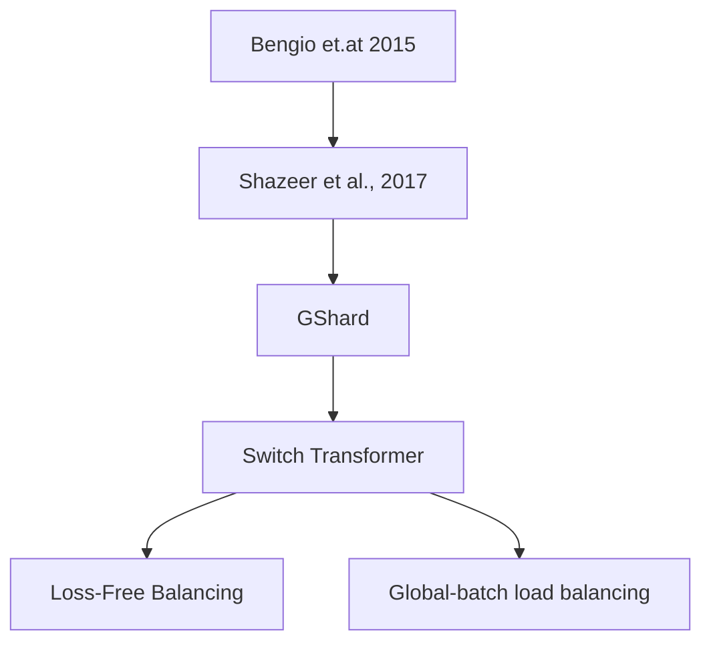

我们在本文中探讨关于 load balancing loss 的定义，性质和推广

## Introduction

我们在 [MoE tutorial](https://maosong.website/p/moe-tutorial/) 中已经介绍了 MoE 模块，MoE 尽管可以在相同的算力下扩大模型的 size, 但是其问题在于训练时容易出现负载不均衡，也就是说只有少数几个专家被激活，其他专家处于闲置状态，从而导致模型性能下降

为了解决这个问题，一个通用的做法是使用 load balancing loss. load balancing loss 可以有效实现负载均衡，让各个专家被激活的概率差不多。

Load balancing loss 一共经历了如下几个阶段，发展路线如下图所示

## Method

### Notation

我们假设输入的 batch size 为 $B$, 总专家个数为 $N$, 激活专家个数为 $K$, $G_i(x_j)$ 代表 gating layer 预测的第 $i$ 个专家对于 token $x_j$ 的重要性程度。

### Coefficient of Variation

第一个阶段的 load balancing loss 针对广义的 MoE 模型。

**Bengio et.at 2015**
作者提出了一个让 batch 里每个专家平均激活概率分布更均匀的损失函数，其定义如下所示

$$
L_b = \sum_{i=1}^N\left\Vert \frac1B\sum_{j=1}^BG_i(x_j) - \frac1N\right\Vert_2
$$

其主要目标是让每个专家的平均激活概率接近 $1/N$, 即均匀分布.

**Noam et.al 2017**
作者对 (Bengio et.at 2015) 进行了改进，提出了变异系数 $\mathrm{CV}(\cdot)$ 来保证负载均衡，其定义如下：

$$
L_{importance} = \mathrm{CV}(\mathrm{Importance}(X))^2
$$

其中

$$
\mathrm{Importance}_i(X) = \sum_{j=1}^B G_i(x_j),\ \mathrm{CV}(X)= \frac{\mathrm{var}[X]}{\mathbb{E}[X]},\ i=1,\dots,N
$$

注意到 $\mathrm{var}[X]\geq0$, 当且仅当 $X$ 为均匀分布时 $\mathrm{var}[X]=0$,  因此 important loss 可以让每个专家在一个 batch 中的激活的平均概率尽可能一致。

但是平均概率一致不代表各个专家处理的 token 个数一致，比如一个专家可能处理比较少的 token,  但是每个 token 的权重都很大。因此，作者额外加入了 load balancing loss

$$
\mathcal{L}_{\mathrm{load}} = \mathrm{CV}(\mathrm{Load}(X))^2
$$

其中

$$
\begin{aligned}
\mathrm{Load}_i(X) &= \mathrm{soft\_estimation}\left(\sum_{j=1}^B\mathbb{1}(\text{token }j \text{ selects expert }i)\right)\\
&=\mathrm{soft\_estimation}\left(\sum_{j=1}^B\mathbb{1}\{i\in\mathrm{TopK}(\{G_i(x_j)\}_{i=1}^{E}, K)\}\right),\ i=1,\dots,N
\end{aligned}
$$

这里 $\mathrm{soft\_estimation}$ 是作者针对离散变量进行的一个光滑化处理，以方便反向传播。

### GShard

[GShard](https://maosong.website/p/gshard/) 进一步对 (Noam et.al 2017) 提出的 loss 进行了简化，首先注意到 $\sum_{i=1}^N\mathrm{Load}_i(X)=BK$, 因此我们有

$$
\begin{aligned}
\mathcal{L}_{\mathrm{load}} &= \mathrm{CV}(\mathrm{Load}(X))^2 \\
&= \left(\frac{\mathrm{var}[\mathrm{Load}(X)]}{\mathbb{E}[\mathrm{Load}(X)]}\right)^2\\
&= \left(C_1[\mathrm{Load}(X)]\right)^2\\
&= C_1\mathbb{E}[\mathrm{Load}(X)^2]-C_2
\end{aligned}
$$

这里 $C_1,C_2$ 均为常数。GShard 并没有使用 soft estimation, 因此这里的 $\mathrm{Load}_i(X)$ 定义为

$$
\mathrm{Load}_i(X)=\sum_{j=1}^B\mathbb{1}(\text{token }j \text{ selects expert }i),\ i=1,\dots,N
$$

其代表了一个 batch 里专家 $i$ 被激活的次数，理想情况下，所有专家被激活的次数应该是一致的，从而我们就实现了负载均衡。

但是现在的问题是，$\mathrm{Load}_i(X)$ 是一个离散变量，为了解决这个问题，作者使用了重要性来进行近似，即

$$
\begin{aligned}
\mathcal{L}_{\mathrm{load}} &= \mathbb{E}[\mathrm{Load}(X)^2]\\
&\approx \mathbb{E}[\mathrm{Load}(X)\cdot\mathrm{Importance}(X)]
\end{aligned}
$$

### Switch Transformer

[Switch Transformer](https://maosong.website/p/switch-transformer/) 进一步对 [GShard](https://maosong.website/p/gshard/) 提出 load balancing loss 进行了规范化，也是现在大部分 load balancing loss 使用的形式，其定义如下：

$$
\mathcal{L}_{\mathrm{load}} = \sum_{i=1}^N f_i P_i
$$

其中，

$$
f_i = \frac{1}{B}\mathrm{Load}_i(X)=\frac{1}{B}\sum_{j=1}^B\mathbb{1}(\text{token }j \text{ selects expert }i),\ i=1,\dots,N
$$

代表了分配给专家 $i$ 的 token 比例，

$$
P_i = \frac{1}{B}\mathrm{Importance}_i(X) = \frac{1}{B}\sum_{j=1}^B G_i(x_j)
$$

代表了这个 batch 里专家 $i$ 的平均激活概率。

从而，这个形式和 GShard 的形式实际上是等价的：

$$
\mathcal{L}_{\mathrm{load}} = \sum_{i=1}^N f_i P_i = \mathbb{E}[\mathbf{f}\cdot \mathbf{P}] = N \mathbb{E}[\mathrm{Load}(X)\cdot\mathrm{Importance}(X)]
$$

## Analysis

目前关于 load balancing loss 可以实现负载均衡的数学分析是比较少的。[Switch Transformer](https://maosong.website/p/switch-transformer/) 中进行了如下分析：

> [!quote]
> The auxiliary loss of Equation 4 encourages uniform routing since it is minimized under a uniform distribution.

但实际上，这个分析是错误的，Switch transformer 中定义的 load balancing loss 并不是在均匀分布时取最小值，而是取最大值。考虑如下情形，

$$
\mathbf{f}=[1,\dots,0],\ \mathbf{P}=[0,\dots,1]
$$

此时，我们有

$$
\mathbf{f}\cdot \mathbf{P} = 0\leq [1/N,\dots,1/N]\cdot [1/N,\dots,1/N] = 1/N.
$$

我找了很多资料，最后发现苏剑林老师在 [MoE环游记：2、不患寡而患不均](https://spaces.ac.cn/archives/10735) 这篇 blog 中进行了分析。我这里基于苏剑林老师的 blog 进行了一下总结，推荐大家看苏剑林老师的原文。

分析的核心思想就是，尽管 load balancing loss 目标函数没有意义，但是我们通过 straight-through estimator (STE)，就可以得到一个有意义的目标函数，其梯度与 load balancing loss 目标函数的梯度是一致的，这样 load balancing loss 目标函数就完成了其负载均衡的目标。

注意到 load balancing loss 的最终目标是让每个专家处理的 token 个数尽可能一致，也就是

$$
\mathcal{L}_{\mathrm{load}} = \sum_{j=1}^B \left(f_i-\frac1B\right)^2
$$

但是 $f_i=\mathrm{Load}_i(X)$ 是一个离散变量不可导，因此，基于 STE, 我们可以将其改写为

$$
\mathcal{L}_{\mathrm{load}} = \sum_{j=1}^B \left(P_i+\mathrm{sg}[f_i-P_i]-\frac1B\right)^2
$$

其中 $\mathrm{sg}[\cdot]$ 满足：

$$
\mathrm{sg}[\cdot]=\begin{cases}
x, &\text{forward pass}\\
0, &\text{backward pass}
\end{cases}
$$

此时我们目标函数的梯度就变成了

$$
\begin{aligned}
\nabla_\theta\mathcal{L}_{\mathrm{load}} &= \sum_{j=1}^B 2\nabla_\theta\left(P_i+\mathrm{sg}[f_i-P_i]-\frac1B\right)\left(P_i+\mathrm{sg}[f_i-P_i]-\frac1B\right)\\
&= 2\sum_{j=1}^B\nabla_\theta P_i\left(f_i-\frac1B\right)\\
&= 2\sum_{j=1}^B\nabla_\theta P_i\left(f_i-\frac1B\right)\\
&= 2\nabla_\theta \left(\sum_{j=1}^Bf_iP_i\right)
\end{aligned}
$$

这样就对应上了我们之前的目标函数。总之，目标函数尽管本身没有意义，但是其对应的梯度却可以让模型实现负载均衡的目标。

## Extension

### Loss Free Load Balancing Strategy

Loss-Free load balancing 是 DeepSeek 提出来的一个无需 load balancing loss 实现负载均衡的方法，其核心思想是 load balancing loss 会影响语言建模性能，因此在 $\mathrm{TopK}$ 操作时，作者加入一些扰动，从而让负载高的专家被选择的概率降低，让负载低的专家被选择的概率提高。

具体细节见 [Loss-Free Balancing](https://maosong.website/p/notes-on-loss-free-balancing/).

### Global-batch Load Balancing Loss Strategy

Global-batch Load Balancing 是 Qwen 提出来的一个提高负载均衡的方法。其核心思想是，现有的 token choice 只是在 batch 层面达到负载均衡，这种局部均衡的性质可能会对模型的全局均衡性产生影响。因此，作者就预先在 global batch 层面对专家进行分配，从而提高专家在不同 domain 上的特化程度。

具体细节见 [Global-batch load balancing](https://maosong.website/p/notes-on-global-batch-load-balancing/)

## Experiments

[olmoe](https://maosong.website/p/notes-on-olmoe/) 对比了加入 load balancing loss 之后模型的表现变化情况，结果如下图所示

可以看到，加入 load balancing loss 之后，模型的表现均超过了不加时的表现。

作者进一步分析了不同专家在加/不加 load balancing loss 时的激活情况，结果如下图所示

结果显示，load balancing loss 确实可以让不同专家的激活概率大致相当。

## Conclusion

在本文中，我们介绍了 load balancing loss 的演化，定义，分析以及相关的实验结果。

## Reference

- [GShard](http://arxiv.org/abs/2006.16668)
- [Bengio et.at 2015](https://openreview.net/pdf/BNYMo3QRxh7PwR1riEDL.pdf)
- [Noam et.al 2017](https://www.cs.toronto.edu/~hinton/absps/Outrageously.pdf)
- [Loss free balancing](https://arxiv.org/pdf/2408.15664)
- [Global-batch load balancing loss](http://arxiv.org/abs/2501.11873)
- [MoE环游记：2、不患寡而患不均](https://spaces.ac.cn/archives/10735)
