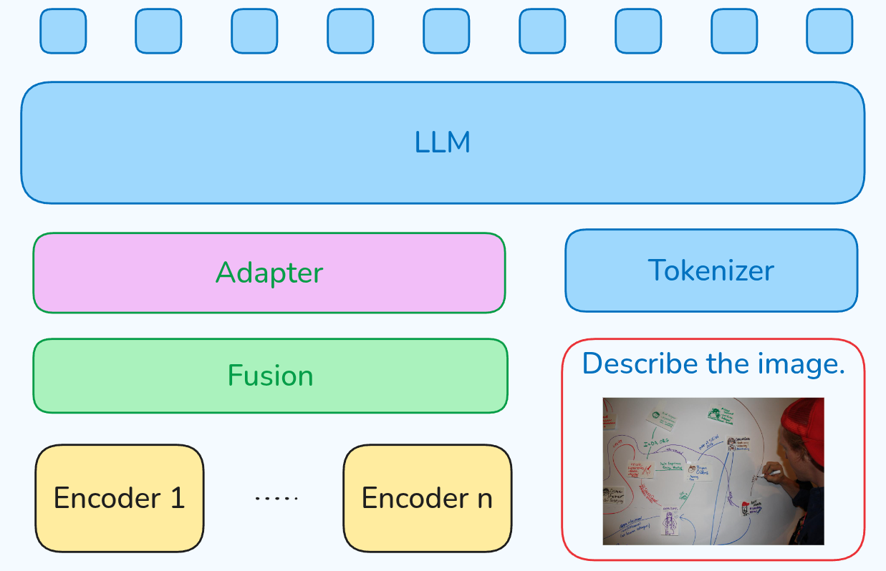

# 介绍

小米在5月30号发布了MiMo-VL 7B多模态推理大模型，模型包括SFT和RL两个版本，作者在技术报告里讲解了MiMo-VL的架构，预训练和后训练过程，最后对MiMo-VL的性能进行了评测

# 架构

MiMo-VL 7B的架构是一个标准的 "ViT-MLP-LLM"的架构，其中：

- ViT使用了Qwen2.5-VL的Qwen2.5-ViT
- MLP是一个两层的SwiGLU MLP Layer
- LLM是之前发布的MiMo-7B

# 预训练

## 数据

预训练阶段一共使用了2.4T的token

- Image caption data: 使用了rewrite caption等方法提升和过滤数据，作者还基于MetaCLIP来降低数据的不平衡性
- Interleaved data: 主要从webpage, books, papers中提取，最后基于relevance, complementarity, balance of information density来保证数据的质量
- OCR and grounding data: OCR数据包括文档，表格，数学公式等。grounding data包括单物体和多物体
- video data: rewrite caption, caption有对应的时间戳，加入了video analysis数据
- GUI data: 覆盖mobile, web, desktop三种场景, 加入了GUI grounding和GUI action数据
- Synthetic reasoning data:使用一个reasoning model来生成带有思考过程的reasoning数据

## 训练

训练有四个阶段，基本上和之前的模型一致，先训练MLP，然后解冻ViT，再训练全部参数，最后扩展模型的上下文。训练过程如下表所示

# 后训练

作者提出了Mixed On-policy Reinforcement Learning (MORL)框架来把RLVR和RLHF结合起来

## 数据

RLVR的数据包括:

1. visual reasoning, 80K数据，使用rule-based math-verify library来评估
2. text reasoning, 使用了MiMo的数学推理数据，评估方式与visual reasoning一致
3. Image grounding, 包括general and GUI grounding任务，使用GIoU来计算奖励
4. Visual Counting, 使用准确率来打分
5. Temporal Video Grounding, temporal video grounding任务，使用IoU来计算奖励

RLHF的数据包括中英文的query，作者使用MiMo-VL-7B和其他模型来采样，然后使用一个advanced VLM来排序.
RLHF的reward model使用Breadley-Terry model作为训练目标，text-only reward由MiMo-7B初始化得到，多模态reward model由MiMo-VL-7B初始化得到

## 训练

训练过程就是将RLVR和RLHF放在一起进行训练，作者使用了MiMo的seamless rollout engine.

训练目标与GRPO一致，但是本文中作者使用了on-policy的训练方式。

# 评估

作者评估了MiMo-VL-7B的通用能力，reasoning能力，GUI交互理解能力，最后还给出了MiMo-VL-7B在ChatbotArena上的排名

## Ablation study

作者首先探究了在预训练阶段加入Long CoT数据对模型表现的影响，结果发现模型正在MMMU, OlympiadBench等benchmark上都有了提升

作者还比较了原始的GRPO和本文中使用的on-policy版本的GRPO，结果发现on-policy版本的GRPO效果更好

最后，作者探讨了一下将不同任务放在一起训练导致的互相干扰问题，这个在MiMo里也提到过，核心问题就是有的任务是short CoT的，有的任务是Long CoT的，如何让模型根据任务来选择不同的reasoning length是一个需要探讨的问题，这个问题在[VC-PPO](https://maosong.website/p/vc-ppo%E5%AD%A6%E4%B9%A0%E7%AC%94%E8%AE%B0/)里进行了初步的探讨。

# 结论

与MiMo一样，MiMo-VL-7B通过在预训练阶段加入reasoning data，来提高模型的reasoning能力，并指出模型可以通过这个方式来媲美其他模型的表现

# 参考文献

- [Github](https://github.com/XiaomiMiMo/MiMo-VL)
