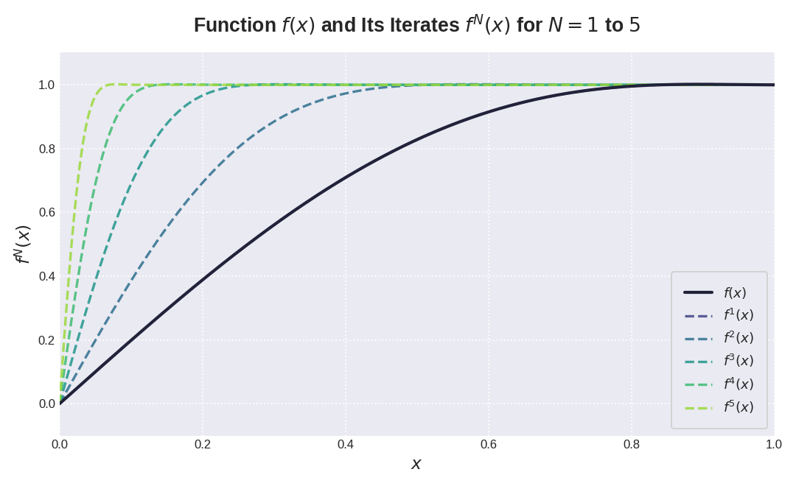
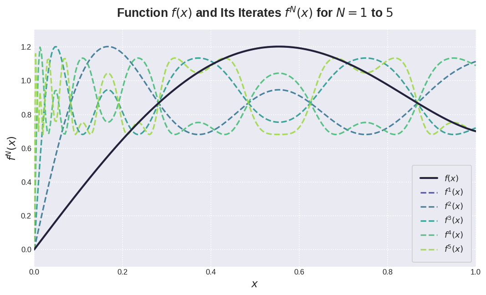
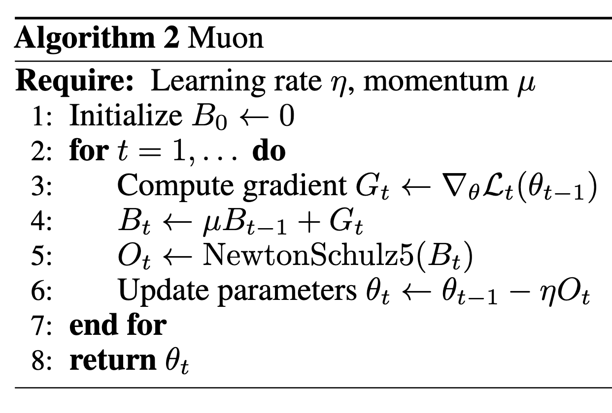
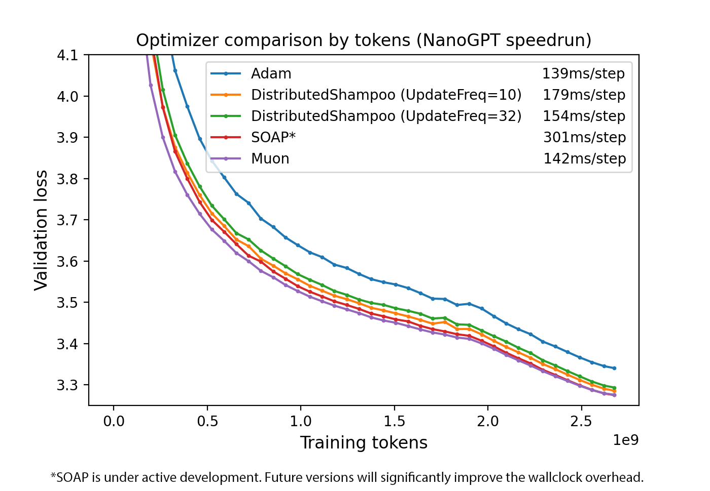

Muon (MomentUm Orthogonalized by Newton-Schulz) 是一个针对二维神经网络的优化器，它基于 SGD-momentum 改进，增加了一个 Newton-Schulz 的后处理步骤

## Method

Newton-Schulz (NS) 的目的是用一个正交矩阵近似一个给定矩阵，即

$$
\mathrm{Ortho}(G) = \arg\min_{O} \{\|O-G\|_F: \text{either } O^TO=I\text{ or } OO^T=I\}
$$

也就是说，NS iteration 将 SDG-moment 的更新矩阵替换为了“最近的” semi-orthogonal matrix. 这等价于将更新矩阵替换为 $UV^T$, 其中 $USV^T$ 是更新矩阵的 SVD 分解。

> [!tip]
> 作者观察到，对于 SGD-momentum 和 Adam 来说，其在基于 transformer 的神经网络里有非常高的 condition number, 也就是 optimizer 仅在少数几个方向上进行优化。作者认为，通过正交化，可以有效提高模型在其他方向上的更新速度，进而提高模型表现

### Newton-Schulz

作者提到，正交化矩阵的方法有很多，比如 SVD 分解，但是其问题是非常慢，还有 Coupled Newton iteration, 但是其精度要求非常高，必须要在 `float32` 以上。

作者因此使用了 Newton-Schulz iteration.

令 $G=USV^T$ 是 SGD-momentum 更新矩阵的 SVD 分解，则基于系数 $(a,b,c)$ 的 NS iteration 定义如下：

$$
\begin{aligned}
G' &= aG + b(GG^T)G + c(GG^T)^2G\\
&= (aI+b(GG^T)+c(GG^T)^2)G\\
&= (aI+bUS^2U^T+cUS^4U^T)USV^T\\
&= U(aS+bS^3+cS^5)V^T
\end{aligned}
$$

也就是说，如果我们定义五次多项式函数 $\phi(x)=ax+bx^3+cx^5$, 然后执行 $N$ 次 NS iteration, 则我们得到 $U\phi^N(S)V^T$, 其中 $\phi^N$ 代表 $\phi$ 复合 $N$ 次。

为了保证 NS iteration 收敛到 $\mathrm{Ortho}(G) = UV^T$, 我们必须保证两点：

1. $S$ 的值，也就是 $G$ 的奇异值必须在区间 $[0,1]$ 上
2. $\phi$ 必须满足 $\phi^N\to 1$, $N\to\infty$,  $\forall x\in[0,1]$.

为了满足第一个条件，我们可以对 $G$ 进行 rescale, 即 $G\gets G/\|G\|_F$, rescale 不影响最终的结果，即 $\mathrm{Ortho}(G) = \mathrm{Ortho}(cG)$.

对于 $\phi(x)$, 我们有很多选择，比如我们定义 $(a,b,c):=(2,-1.5,0.5)$ 就得到如下结果



### Coefficient Optimization

尽管 $(a,b,c):=(2,-1.5,0.5)$ 已经满足了第二个条件，但是我们还是想进一步优化，优化的方向主要有两个：

1. 让 $a$ 尽可能大，这是因为 $\phi'(0)=a$ 控制了较小奇异值的收敛速率。
2. 对于所有的 $x\in[0,1]$, 我们希望 $\phi^N(x)\in[1-\epsilon, 1+\epsilon]$, $N\to\infty$. 这样 NS iteration 的结果与 $\mathrm{Ortho}(G)$ 不会相差太远。

作者发现， $\epsilon$ 可以设置为 $0.3$ 而不影响 Muon optimizer 的收敛性。因此，作者的目标现在是

$$
\begin{aligned}
\max\quad &a\\
\mathrm{s.t.}\quad &\lim_{N\to\infty}\phi^N(x)\in[0.7, 1.3]
\end{aligned}
$$

作者通过 ad-hoc gradient 方法求解得到一组数值解为 $(a,b,c)=(3.4445, 4.7750, 2.0315)$, 作者将这组数值应用于 Muon optimizer 中。迭代结果如下图，可以看到，当 $x\approx0$ 时，函数变得更加陡峭。



实验中，作者发现，仅需迭代五次，最终的结果就 work 的很好。作者还尝试了不同的多项式，结果发现并没有太大的提升。

### Algorithm

最终，Muon Optimizer 的算法如下



其中, `NewtonSchulz5` 算法伪代码定义如下

```python
def newtonschulz5(G, steps=5, eps=1e-7):
    assert G.ndim=2
    a, b, c = (3.4445, -4.7750, 2.0315)
    X = G.bfloat16()
    X /= (X.norm() + eps)
    if G.size(0) > G.size(1):
        X = X.T
    for _ in range(steps):
        A = X @ X.T
        B = b * A + c * A @ A
        X = a * X + B @ X
    if G.size(0) > G.size(1):
        X = X.T
    return X
```

## Analysis

本节作者分析了以下 Muon 的内存占用和算力开销。

在 NS iteration 之前，Muon optimizer 和 SGD-moment 是一样的。

对于 $n\times m$ 的矩阵（假设 $m\leq n$）， 首先 NS iteration 会进行转置，NS iteration 的每一步需要 $2(2nm^2+m^3)$ FLOPs, 其中括号前面的系数 $2$ 代表精度。因此，Muon 相比于 SGD momentum 需要的额外 FLOPs 为 $2T(2nm^2+m^3)$, 其中 $T$ 是迭代次数。

使用 baseline 进行一次训练（前向 + 后向），所需要的 FLOPS 为 $6nmB$, 其中 $B$ 是 batch size. 因此，Muon 的 FLOP 开销至多为 $Tm/B$, 其中 $m$ 是模型的 hidden size, $B$ 是 batch size, $T$ 是 NS iteration 的步数。

作者分别基于 nanoGPT 和 LLaMA-405B 进行验证，结果发现，Muon optimizer 带来的额外开销不足 $1\%$.

作者发信啊，使用 Nesterov-style momentum 可以比普通的 SGD-momentum 效果更好，因此作者在 muon 中使用了前者。

作者还发现，对于 QKV layer，分别进行优化效果会更好。

## Experiments



## Limitation and Future Work

Muon 仅被设计用于优化 2D 参数（因为涉及矩阵计算），其余的参数仍然需要 AdamW 等优化器参与。

作者认为未来的工作有：

1. 能否 scale up Muon Optimizer
2. 分布式优化
3. 在 fine-tuning 和 RL 阶段使用 Muon Optimizer

## Conclusion

作者提出了 Muon optimizer，该优化器在 nanoGPT speedrun 上取得了 SOTA 的结果，作者详细介绍了优化器的工作原理。

## References

- [Muon: An optimizer for hidden layers in neural networks](https://kellerjordan.github.io/posts/muon/)
