## Introduction

已有的模型如 [DeepSeek-MoE](https://maosong.website/p/notes-on-deepseekmoe/), [Mixtral MoE](https://maosong.website/p/mixstral-8x7b/), [Qwen1.5](https://maosong.website/search/?keyword=qwen1.5) 等 MoE 模型基本只开源权重。也有一些开源的模型，比如 OpenMoE 等，但是开源信息不全。基于这个目的，作者提出了 olmoe 模型系列，包括 olmoe-7B-A1B 和 olmoe-7B-A1B-instruct 两个版本。

## Method

### Pretraining

模型的架构如下图所示，MoE 架构与 dense 架构不同的地方在于 decoder layer 中的 FFN 被替换为了 MoE layer.

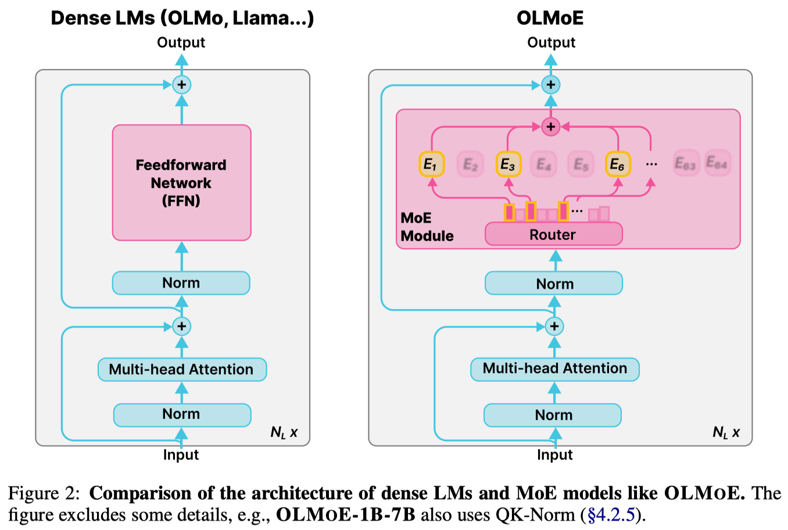

模型的配置如下表所示

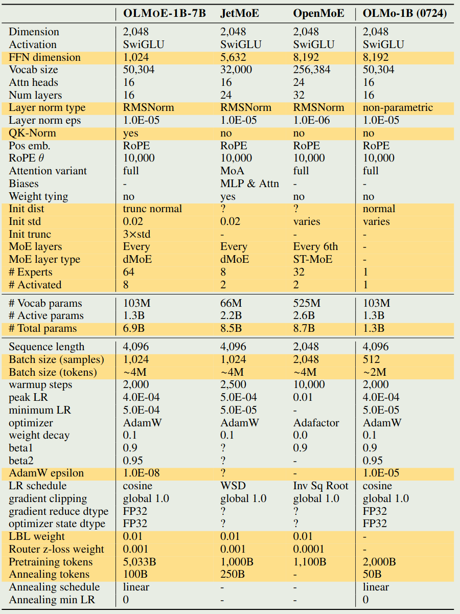

训练的目标函数为

$$
\mathcal{L} = \mathcal{L}_{CE} +\alpha\mathcal{L}_{LB} +\beta\mathcal{L}_{RZ}
$$

其中 $\alpha,\beta$ 为系数， $\mathcal{L}_{CE}$, $\mathcal{L}_{LB}$ 以及 $\mathcal{L}_{RZ}$ 分别代表 cross-entropy loss, load balancing loss 以及 routing Z loss.

预训练数据包括 DCLM 和 Dolma1.7 两个数据集的混合，作者将预训练数据集称为**olmoe-mix**. 数据集的配比如下

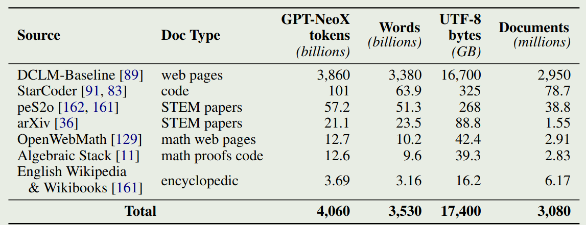

### Post-training

在 post-training 时，作者将训练分为 instruction tuning 和 preference tuning 两个阶段，在 instruction dataset 中，作者加入了更多的代码和数学数据来提高对应的能力。数据集如下表所示

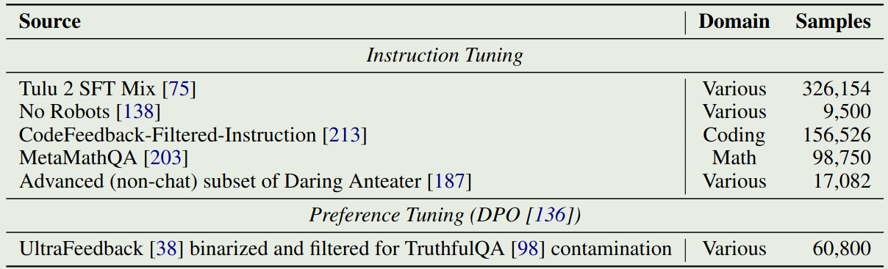

## Ablation Study

### MoE Settings

#### MoE vs. Dense

作者对比了 MoE 模型和 dense 模型的训练效率，为了方便对比，作者使用 olmo-7B 和 olmo-1B 作为 baseline, 最终 olmoe 的总参数为 6.9B, 激活参数为 1.3B. 实验结果如下图所示

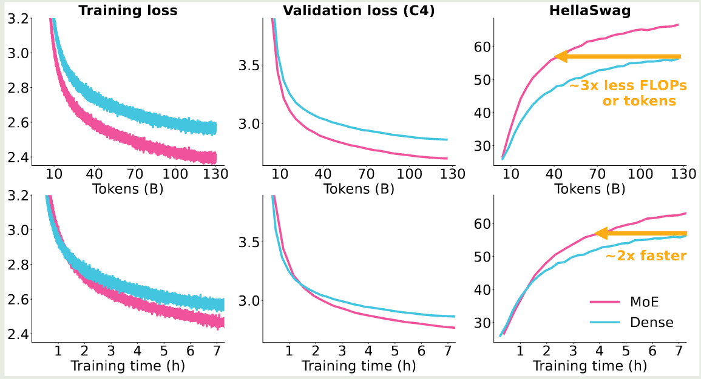

实验结果发现，MoE 模型所需要的 token 或者 FLOPs 是 dense 模型的 $1/3$, 但是由于 MoE 模型需要额外的内存开销，因此从训练时间上来看，MoE 模型训练时间仅比 dense 模型快 $2$ 倍左右。

#### Expert Granularity

[DeepSeekMoE](https://maosong.website/p/notes-on-deepseekmoe/) 提出使用细粒度的专家来提供更多的组合可能性。作者探究了不同的粒度对模型表现的影响，结果如下图所示

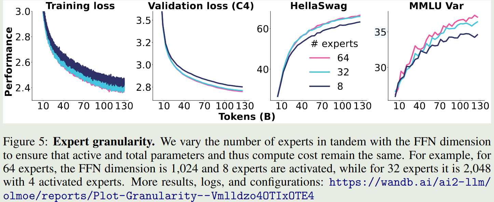

结果显示，当专家粒度从 8E-1A 扩展到 32E-4A 时，模型在 HellaSwag 上的表现提升了 $10\%$, 但是进一步扩展到 64E-8A 时，模型的表现提升不到 $2\%$, 这说明了无限制提升粒度对模型的提升越来越有限。在本文中，作者使用了 64 个专家。

#### Shared Experts

[DeepSeekMoE](https://maosong.website/p/notes-on-deepseekmoe/) 提出使用共享专家来学习 common knowledge, 作者对这种方法进行了实验，结果如下图所示。

可以看到，加入一个 shared expert 之后，模型的表现没有变化，作者认为减少 routed expert 之后，模型的组合可能性降低为原来的 $10\%$ 左右。因此作者认为没有必要使用共享专家，因此作者在 olmoe 中没有采用共享专家这个方法。

#### Expert Choice vs. Token Choice

作者探究了 routing 的策略，一个是 expert choice (EC), 另一种是 token choice (TC), 分别代表了每个 expert 选取固定的 token 数和每个 token 选取固定的 expert 数这两种情况。实验结果如下图所示

可以看到，token choice 的表现明显更好。EC 虽然可以实现负载均衡。但是因为自回归模型在生成时是无法提前确定生成的 token 数的，因此 EC 很可能导致算力资源浪费或者是 token dropping. 在本文中，作者采用了 TC 这种策略。

#### Sparse Upcycling

作者还对比了从零开始训练 MoE 与基于 dense model upcycling 的方式训练 MoE，sparse upcycling 的相关工作有 MiniCPM, [Qwen2](https://maosong.website/p/notes-on-qwen2/) 以及 [Mixtral MoE](https://maosong.website/p/mixstral-8x7b/).结果如下图所示

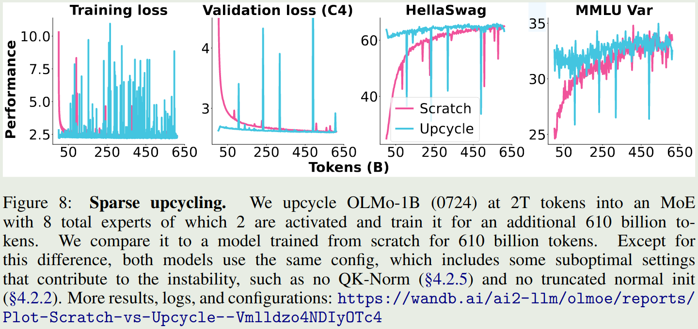

结果发现，upcycling 确实可以提高训练效率，但是这种方法的缺陷在于：

1. upcycling 受 dense model 的超参数限制
2. upcycling 的训练不是很稳定

因此在本文中作者没有采取 upcycling 的做法。

#### Load Balancing Loss

作者还探究 Load Balancing loss 对模型表现的影响，结果如下图所示

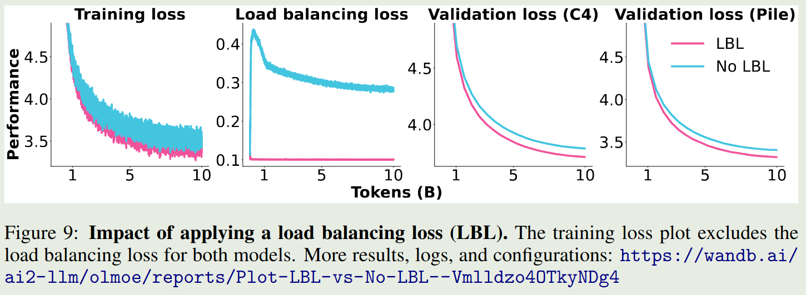

可以看到，加入 load balancing loss 之后，模型的表现均超过了不加时的表现。

作者进一步分析了不同专家在加/不加 load balancing loss 时的激活情况，结果如下图所示

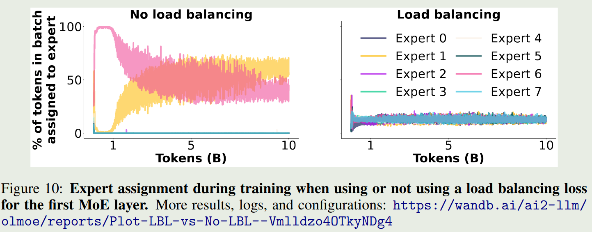

结果显示，load balancing loss 确实可以让不同专家的激活概率大致相当。

#### Router Z-loss

[ST-MoE](https://maosong.website/p/st-moe/) 提出了 Router z-loss 来提高 MOE 训练的稳定性和表现。其表达式如下所示

$$
\mathcal{L}_{RZ}(x) = \frac{1}{B}\sum_{i=1}^B\left(\log\sum_{j=1}^{N_E}\exp(x_i^{(i)})\right)^2
$$

实验结果如下图所示

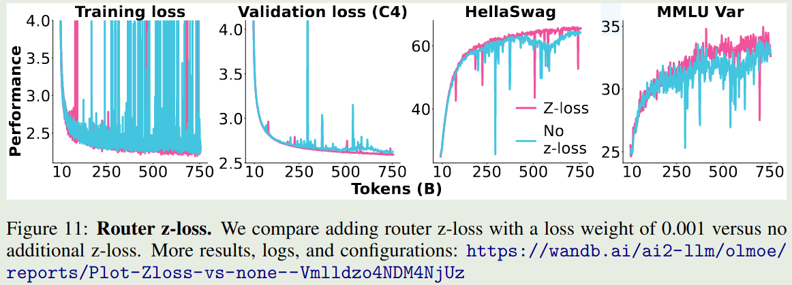

可以看到，加入 router Z-loss 之后，模型训练的稳定性有所提升。因此在本文中作者使用了这个 loss.

### General Pre-training Settings

#### Initialization

作者探究了不同初始化策略对模型训练的影响，结果发现使用 truncate normal initialization 的训练稳定性更高

#### QK-Norm

作者探究了 [QK-norm](https://maosong.website/p/notes-on-qk-norm/) 对模型训练的影响，结果发现 QK-norm 可以提高模型训练的稳定性，结果如下图所示

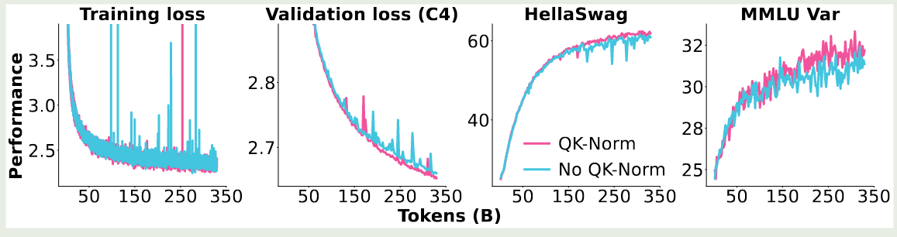

#### AdamW Epsilon

作者发现，在 [AdamW](https://maosong.website/p/notes-on-adamw/) 优化器中，使用更小的 `eps` 可以提高模型的表现，因此作者将 `eps` 设置为 $1e-8$.

#### Adaptation Settings

在 post-training 阶段，作者在三个方面进行了实验：

1. 是否加入 load balancing loss: 结论是不加，因为负载均衡在 pre-training 阶段已经实现了
2. 是否使用 annealing: 结论是使用，因为效果更好
3. 使用 DPO 还是 KTO, 结论是两种方法结果差不多

实验结果如下表所示

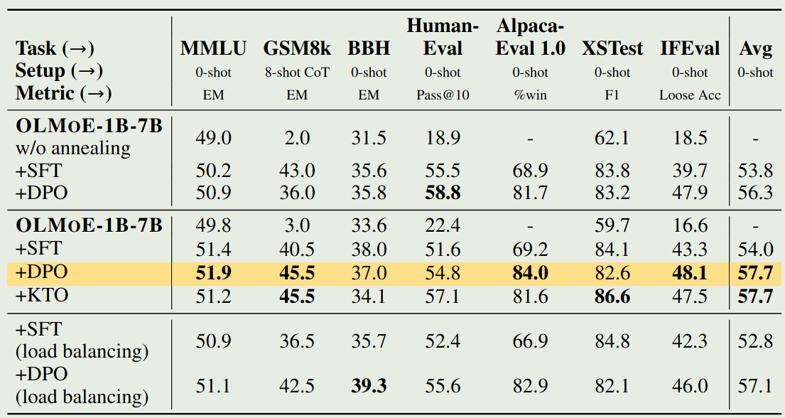

#### Load Balancing Precision

[Switch Transformer](https://maosong.website/p/switch-transformer/) 中提出使用 `float32` 精度来进行 routing 的计算，作者通过实验发现，这一方法并不能提高模型训练的稳定性，因此作者没有采用这一策略。

## MoE Analysis

### Router Saturation

作者探究了训练过程中激活的专家和训练结束后激活的专家的匹配程度，结果如下图所示

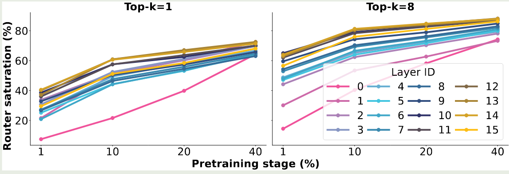

结果发现，训练 $1\%$ 的数据之后，就有 $40\%$ 的 routing 和训练完毕的 routing 一致，当训练 $40\%$ 的数据之后，这个比例提升到了 $80\%$.

作者还发现，later layers 比 early layers 饱和更快，early layer, 特别是 layer 0, 饱和的非常慢。作者认为，这是 [DeepSeekMoE](https://maosong.website/p/notes-on-deepseekmoe/) 放弃在第一层使用 MoE layer 的原因，因为 load balancing loss 收敛更慢。

### Expert Co-activation

作者分析了 expert 之间的互相依赖程度，作者通过可视化发现，不同的 expert 之间 co-activation 的比例比较小，说明 expert redundancy 比较低

### Domain Specialization

作者还探究了不同 expert 对于不同 domain 的 specialization 程度，作者发现对于 specialized domain 的数据，expert 会出现一定程度的 specialization, 但是对于通用 domain 的数据，expert 的 specialization 程度比较低。这个结论与 [Mixtral MoE](https://maosong.website/p/mixstral-8x7b/) 的结论不同，作者认为这个原因是 [Mixtral MoE](https://maosong.website/p/mixstral-8x7b/) 使用了 upcycling 的方式，这会限制模型的表现。因此，作者进一步强调 MoE 从零开始训练是一个更好的训练方式。

### Vocabulary Specialization

作者还探究了 vocabulary 中不同 token index 与激活专家之间的关系，结果发现 later layers 的 specialization 程度更高，这与 saturation 的趋势一致

## Conclusion

作者在本文中提出了 olmoe, 一个全开源的 moe 大模型系列，作者详细介绍了针对 MoE 架构和通用架构的设计，为后来的模型架构设计提供了基础。

## References

- [arxiv](http://arxiv.org/abs/2409.02060)
