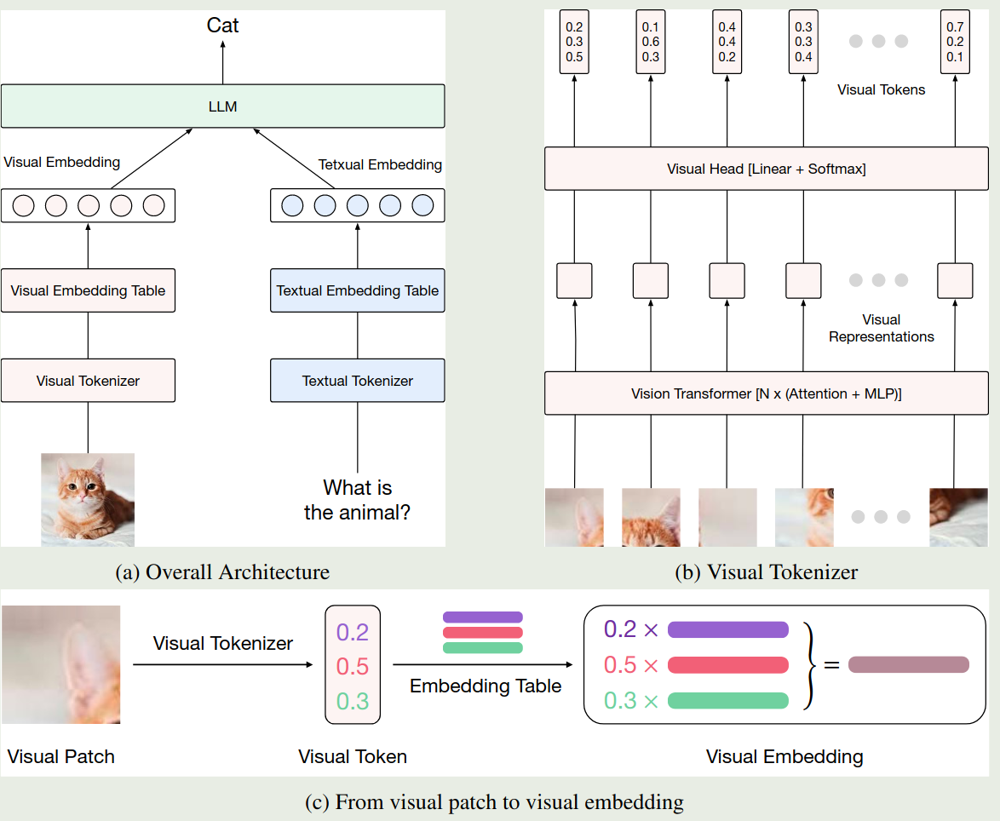
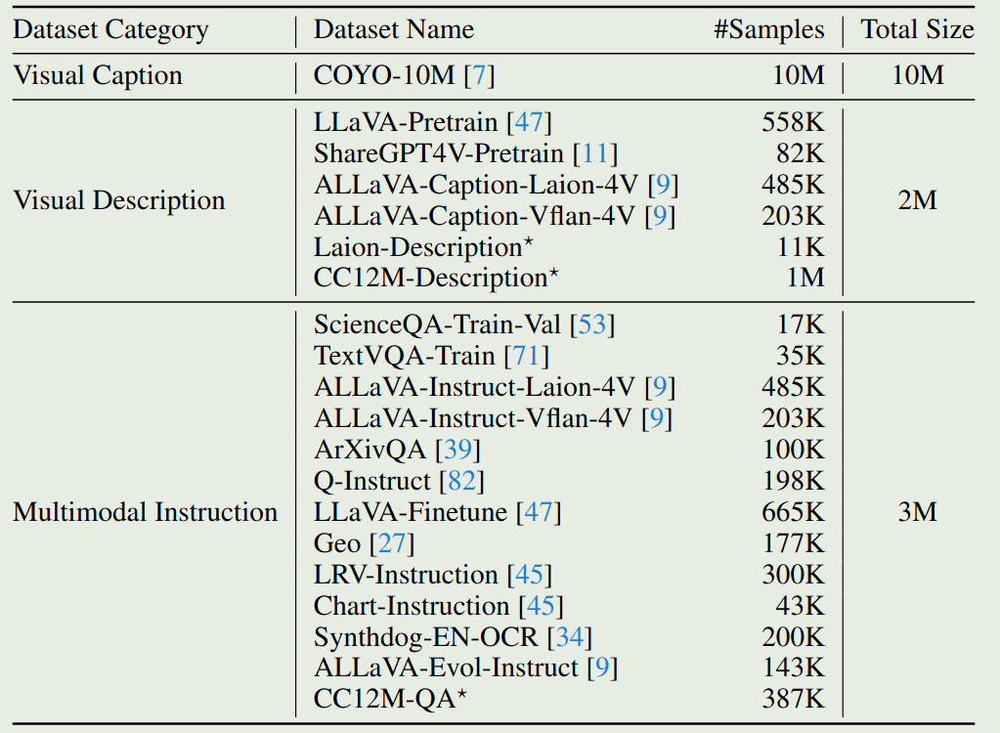

作者提出了 Ovis，一个离散化表示 visual encder 输出特征的方法，来更好对齐 LLM 的视觉输入和文本输入

## Introduction

作者分析了已有多模态大模型的架构，已有多模态大模型的输入对于文本来说是离散的 (text token), 对于图片来说是连续的 (visual embedding)。作者认为这种连续 - 离散的输入可能会影响模型最终的表现。

为了解决这个问题，作者构建了一个 visual embedding table, 将 visual embedding 也转换成离散的 token 表示形式，进而统一 LLM 输出的粒度。

## Method

模型的架构如下图所示

我们首先会构建一个 visual vocabulary $\{e_k\}_{k=1}^K$, 其大小为 $K$, 然后对于 ViT 输出的 $n$ 个 visual feature $\{r_i\}_{i=1}^n$, 我们会加入一个 linear head 以及一个 softmax 来构建一个 vocabulary 上的分布，即

$$
v_i = \mathrm{softmax}(Wr_i), W\in\mathbb{R}^{K\times d}
$$

这里 $v_i\in\Delta^K$ 是 visual vocabulary 上的概率分布。最终，视觉模块的输入是 vocabulary 中 visual token 的一个加权求和

$$
V_i = \sum_{k=1}^K v_{i,k}e_k\in\mathbb{R}^{d'}
$$

训练分为三个阶段：

- Stage 1: 训练 $W$, visual encoder 最后一个 block 以及 visual vocabulary
- Stage 2: 训练 $W$, visual vocabulary 以及 visual encoder
- Stage 3: multimodal SFT, 提高模型的指令跟随能力，模型所有参数都参与训练

训练数据分布如下表所示

## Conclusion

作者提出了 Ovis，一个离散化表示 visual encder 输出特征的方法，来更好对齐 LLM 的视觉输入和文本输入

## References

- [Arxiv](http://arxiv.org/abs/2405.20797)
