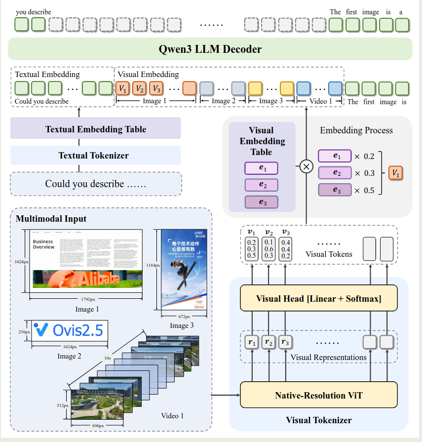
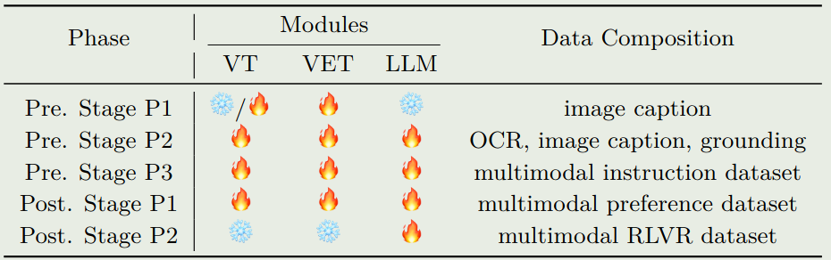

作者提出了 Ovis2.5, 一个基于 Ovis 改进的多模态大模型系列，包括 2B 和 9B 两个 size，Ovis2.5 主要强调了支持不同分辨率图片输入以及深度思考这两个 feature

## Introduction

作者首先回顾了 [Ovis](https://maosong.website/p/ovis-discrete-visual-embedding/), Ovis 主要是解决 text embedding 以及 visual embedding 对齐程度比较低的问题。

接下来，作者介绍了以下 Ovis 的两个问题：

1. 只能支持固定大小的图片输入
2. 缺乏深度思考能力

为了解决这两个问题，作者提出了 Ovis 2.5, Ovis 主要做出了两点改进：

1. 使用了 NaViT 来处理不同分辨率图片的输入
2. 作者通过训练提高了模型的深度思考能力

最终 Ovis2.5 主要有以下 feature

1. 支持动态分辨率图片输入
2. 深度思考能力
3. SOTA 的表现
4. 高效的训练方式

## Method

### Architecture

Ovis2.5 的架构如下所示

Ovis 包括三个模块：

1. visual tokenizer： ViT 架构，
2. visual embedding table: 类似 LLM 中的 text embedding table, 见 [Ovis](https://maosong.website/p/ovis-discrete-visual-embedding/)
3. LLM: 基于 [Qwen3](https://maosong.website/p/notes-on-qwen3/)

作者在架构上进行了如下改进：

1. 动态分辨率图片输入处理：作者使用了 NaViT 来支持动态分辨率图片输入
2. LLM: 作者使用了 Qwen3 来进一步提高模型的表现

### Training

模型训练包括 pre-training 和 post-training 两个大的 stage,  其中 pre-training 又包含 3 个小的 stage, post-training 包含 2 个 stage. 训练过程如下所示

pre-training 阶段的数据包括 COYO, Laion, Wukong, DataComp, SAM 等。作者介绍了几个部分的数据：

1. OCR 数据，作者基于 MLLM 来标注数据和合成 QA
2. Grounding 数据，作者使用了 RefCoCo 等数据集以及先进的 MLLM 来标注数据
3. Reasoning 数据，作者收集了数据然后使用 MLLM 来合成 Reasoning path

训练时，

1. VET pretraining: 训练 VET, 作者基于 SigLIP 来初始模型的参数，然后仅训练最后一层 ViT layer, visual head 以及 VET, 图片精度为 448-896. 作者采用了动态 position embedding
2. Multimodal pretraining: 这阶段全量微调所有参数，主要目的是使用对话格式的数据。图片精度为 448-1792
3. multimodal instruction tuning: 这阶段训练所有参数，主要提高模型跟随多模态指令的能力

post-training 包括 DPO 和 GRPO 两个阶段。

1. DPO: 训练所有参数，使用 pre-training checkpoint 来多次采样
2. GRPO: 使用 RLVR 数据集进行训练

## Infra

infra 方面，作者主要强调了 data packing 以及多种并行策略融合。

## Conclusion

作者在本文中提出了 Ovis2.5, 一个基于 Ovis 架构的多模态大模型，作者主要强调了模型的动态图片输入处理能力以及深度思考能力。

作者提出了几个未来的方向：

1. 将输入图片精度提升到 4K
2. 处理长视频输入并进行 temporal reasoning
3. 在 Reasoning 过程中加入 tool-use.

## References

- [arxiv](http://arxiv.org/abs/2508.11737)
