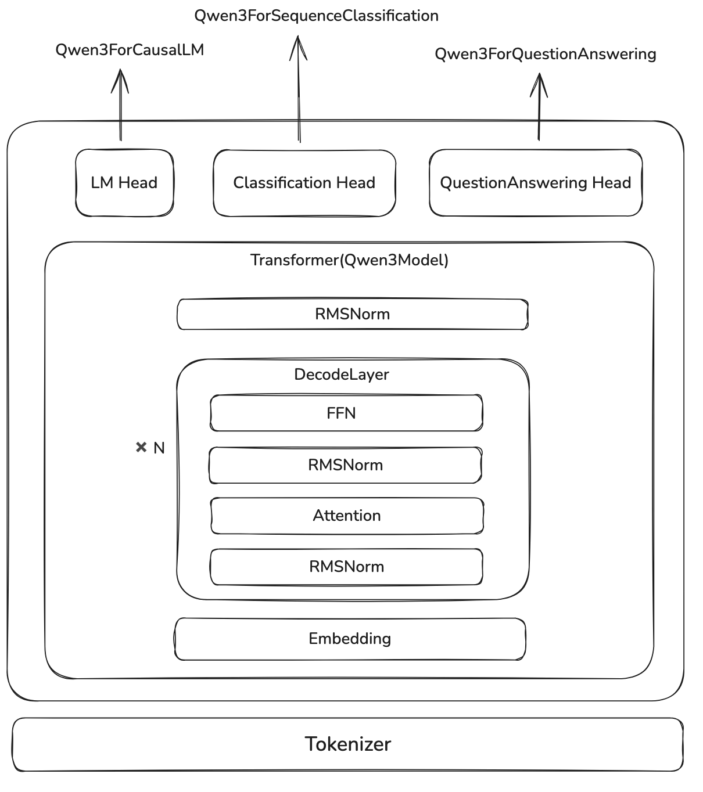

本文中，我们介绍一下如何计算 LLM 的参数量。我们将基于 [Qwen3](https://maosong.website/p/notes-on-qwen3/) 模型架构出发，对模型架构进行拆解，然后给出 LLM 参数量计算公式。

## Dense Model

我们首先来看一下 Qwen3 的架构，如下图所示



这里，`Qwen3ForCausalLM` 就是我们的的 LLM, 其关键代码如下

```python
class Qwen3ForCausalLM:
    def __init__(self, config):
        self.model = Qwen3Model(config)
        self.lm_head = nn.Linear(config.hidden_size, config.vocab_size, bias=False)
```

我们假设 `vocab_size`, 也就是词表大小为 $|V|$ (我们用 $V$ 表示词表), `hidden_size` 为 $d$, 则总参数量为

$$
\mathrm{parameter}(\texttt{Qwen3ForCausalLM}) =d|V| + \mathrm{parameter}(\texttt{Qwen3Model})
$$

`Qwen3Model` 包含三个（含参数的）模块，分别是 `nn.Embedding`, `Qwen3DecodeLayer` 以及 `Qwen3RMSNorm`, 分别代表了输入 token 的 embedding layer, Transformer block 和对输出的 normalization. 其关键代码如下：

```python
class Qwen3Model:
    def __init__(self, config: Qwen3Config):
        self.embed_tokens = nn.Embedding(config.vocab_size, config.hidden_size, self.padding_idx)
        self.layers = nn.ModuleList(
            [Qwen3DecoderLayer(config, layer_idx) for layer_idx in range(config.num_hidden_layers)]
        )
        self.norm = Qwen3RMSNorm(config.hidden_size, eps=config.rms_norm_eps)
```

其中，`nn.Embedding` 参数量与 `lm_head` 一样，都是 $d|V|$.

对于 normalization, 现在大部分 LLM 用的都是 `RMSNorm`, 其定义如下：

$$
\mathrm{RMSNorm}(x) = \frac{x}{\sqrt{\|x\|_2^2+\epsilon}}\odot \gamma
$$

其参数量为：$d$.

如果说我们使用的是 `LayerNorm`, 则其定义如下：

$$
\mathrm{LayerNorm}(x) = \frac{x-\mathbb{E}[x]}{\sqrt{\mathrm{var}[x]+\epsilon}}\odot \beta + \gamma
$$

其参数量为： $2d$.

因此，`Qwen3Model` 的参数量为

$$
\mathrm{parameter}(\texttt{Qwen3Model})=d|V| + N*\mathrm{parameter}(\texttt{Qwen3DecoderLayer}) + d
$$

这里第一项为 `nn.Embedding`, 第三项为 `Qwen3RMSNorm`， 第二项里，$N$ 代表 decode layer 的个数，也就是 `config.num_hidden_layers`.

`Qwen3DecoderLayer` 包含了四个模块，其关键代码如下

```python
class Qwen3DecoderLayer:
    def __init__(self, config: Qwen3Config):
        self.self_attn = Qwen3Attention(config=config, layer_idx=layer_idx)
        self.mlp = Qwen3MLP(config)
        self.input_layernorm = Qwen3RMSNorm(config.hidden_size, eps=config.rms_norm_eps)
        self.post_attention_layernorm = Qwen3RMSNorm(config.hidden_size, eps=config.rms_norm_eps)
```

因此，`Qwen3DecoderLayer` 的参数量为

$$
\mathrm{parameter}(\texttt{Qwen3DecoderLayer}) = 2d + \mathrm{parameter}(\texttt{Qwen3MLP}) + \mathrm{parameter}(\texttt{Qwen3Attention})
$$

其中，第一项是两个 `Qwen3RMSNorm` 的参数。

对于 `Qwen3MLP`, 其定义如下：

$$
y = W_2(W_3x\odot \mathrm{SwiGLU}(W_1x))
$$

这里 $W_3,W_1\in\mathbb{R}^{d_{ff}\times d}$,  $W_2\in\mathbb{R}^{d\times d_{ff}}$, $d_{ff}$ 是 MLP 的 hidden size, 代码中用 `intermediate_size` 来表示，因此

$$
\mathrm{parameter}(\texttt{Qwen3MLP}) = dd_{ff} + dd_{ff} + d_{ff}d=3dd_{ff}
$$

这里三项分别代表 $W_1,W_3,W_2$ 的参数量。

如果说，我们使用原始 transformer 的 MLP, 也就是

$$
y = W_2\max(0,W_1x+b_1)+b_2
$$

其中 $W_1\in\mathbb{R}^{d_{ff}\times d}$, $W_2\in\mathbb{R}^{d\times d_{ff}}$, $b_1\in\mathbb{R}^{d_{ff}}$, $b_2\in\mathbb{R}^d$, 则总参数为

$$
\mathrm{parameter}(\texttt{TransformerMLP}) = d_{ff}d + dd_{ff} + d_{ff} +d = 2d_{ff}d + d_{ff} + d
$$

这里的四项分别代表了 $W_1,W_2,b_1,b_2$.

### Qwen3Attention

接下来，就是 Attention 部分的参数，`Qwen3Attention` 的关键代码如下：

```python
class Qwen3Attention:
    def __init__(self, config: Qwen3Config, layer_idx: int):
        self.q_proj = nn.Linear(
            config.hidden_size, config.num_attention_heads * self.head_dim, bias=config.attention_bias
        )
        self.k_proj = nn.Linear(config.hidden_size, config.num_key_value_heads * self.head_dim, bias=config.attention_bias)
        self.v_proj = nn.Linear(config.hidden_size, config.num_key_value_heads * self.head_dim, bias=config.attention_bias)
        self.o_proj = nn.Linear(config.num_attention_heads * self.head_dim, config.hidden_size, bias=config.attention_bias)
        self.q_norm = Qwen3RMSNorm(self.head_dim, eps=config.rms_norm_eps)
        self.k_norm = Qwen3RMSNorm(self.head_dim, eps=config.rms_norm_eps) 
```

这里，我们先定义几个量：

- 我们将 head 的个数记为 $h$, 即 `num_attention_heads`
- 我们将每个 head 的 hidden size 记为 $h_d$, 即 `head_dim`
- 我们将 key 和 value head 的个数记为 $h_{kv}$ , 即 `num_key_value_heads`

`Qwen3Attention` 的参数由以下几个部分组成：

- Query projection: $W_{Q}\in\mathbb{R}^{hh_d\times d}$, $b_Q\in\mathbb{R}^{hh_d}$
- Key projection: $W_K\in\mathbb{R}^{h_{kv}h_d\times d}$, $b_K\in\mathbb{R}^{h_{kv}h_d}$
- Value projection: $W_V\in\mathbb{R}^{h_{kv}h_d\times d}$, $b_V\in\mathbb{R}^{h_{kv}h_d}$
- output projection: $W_O\in\mathbb{R}^{d\times hh_d}$
- RMSNorm：前文已经提到过，两个 normalization (query norm 以及 key norm) 的总参数量为 $2h_d$.

因此， `Qwen3Attention` 部分的总参数量为

$$
\mathrm{parameter}(\texttt{Qwen3Attention}) = hh_{d}d + 2h_{kv}h_dd +dhh_d + 2h_d = 2hh_dd + 2h_{kv}h_dd + 2h_d
$$

分别代表 $W_Q, W_O, W_K,W_V$ 和 两个 normalization layer 的参数量。

注意，这里我们没有加入 bias, 这是因为 QKV bias 在 Qwen3 中被取消，取而代之的是两个 normalization.

如果我们查看 `Qwen2Attention` 的代码，我们可以得到 `Qwen2Attention` 的总参数量为

$$
\mathrm{parameter}(\texttt{Qwen2Attention}) = 2hh_{d}d + 2h_{kv}h_dd +h_{kv}h_d+hh_d+h_{kv}h_d
$$

分别代表 $W_Q, W_K, W_V,W_O$ 和 $b_Q,b_K, b_V$ 的参数量。

我们将计算结果汇总在一起就得到：

$$
\begin{aligned}
\mathrm{parameter}(\texttt{Qwen3ForCausalLM}) &=d|V| + \mathrm{parameter}(\texttt{Qwen3Model})\\
&=2d|V| + N*\mathrm{parameter}(\texttt{Qwen3DecoderLayer}) + d\\
&= N*(2d + \mathrm{parameter}(\texttt{Qwen3MLP}) + \mathrm{parameter}(\texttt{Qwen3Attention})) + d(2|V|+1)\\
&= N*(2d+3dd_{ff}+2hh_{d}d + 2h_{kv}h_dd + 2h_d) + d(2|V|+1)\\
\end{aligned}
$$

这是针对 `Qwen3ForCausalLM` 的参数量计算。这里的变量定义如下：

| Math Variable  | Code Variable         | Description          |
| -------------- | --------------------- | -------------------- |
| $N$            | `num_hidden_layers`   | Transformer block 个数 |
| $\vert V\vert$ | `vocab_size`          | 词表大小                 |
| $d$            | `hidden_size`         | token embedding 的维度  |
| $d_{ff}$       | `intermediate_size`   | MLP 的中间层的维度          |
| $h_d$          | `head_dim`            | 每个 head 的维度          |
| $h$            | `num_attention_heads` | query head 的个数       |
| $h_{kv}$       | `num_key_value_heads` | key 和 value head 的个数 |

### Verification

接下来，我们就可以基于 Qwen3 的模型来验证了，比如，`Qwen3-32B` 的配置如下:

| Field          | Value  |
| -------------- | ------ |
| $N$            | 64     |
| $\vert V\vert$ | 151936 |
| $d$            | 5120   |
| $d_{ff}$       | 25600  |
| $h_d$          | 128    |
| $h$            | 64     |
| $h_{kv}$       | 8      |

根据上式，最终的参数量为

$$
\mathrm{parameter}(\texttt{Qwen3-32B}) = 32.762123264*10^9\approx 32.8B
$$

我们使用 `Qwen3-32B` 的 `index.json` 可以得到其真实的参数量为

$$
\texttt{total\_size}/\texttt{precision} = 65524246528/2 = 32762123264
$$

与我们计算的结果一致（这里除以 2 的原因是其表示模型权重文件的总大小，以 bytes 为单位，一般模型都是 `bfloat16`, 大小为 2 个 bytes, 因此总参数量为总大小除以权重的精度）

## MoE Model

MoE model 与 Dense model 不同的地方在于每一层的 FFN, 因此，其总参数计算方式为：

$$
\mathrm{parameter}(\texttt{Qwen3MoeForCausalLM})=N*(2d+\mathrm{parameter}(\texttt{Qwen3MoE})+hh_{d}d + 2h_{kv}h_dd +dhh_d + 2d) + d(2|V|+1)
$$

对于 MoE layer, 其关键代码为：

```python
class Qwen3MoeSparseMoeBlock:
    def __init__(self, config):
        self.num_experts = config.num_experts
        self.top_k = config.num_experts_per_tok
        self.gate = nn.Linear(config.hidden_size, config.num_experts, bias=False)
        self.experts = nn.ModuleList([Qwen3MoeMLP(config, intermediate_size=config.moe_intermediate_size) for _ in range(self.num_experts)])
```

我们记 $n$ 为总专家个数，即 `num_experts`， 记 $k$ 为激活专家个数，即 `num_experts_per_tok` 或者 `top_k`,

首先 `gate` 的参数量为 $dn$, 接下来每个 expert 都是一个 `Qwen3MLP`, 因此 `experts` 总参数量为 $n * 3dd_{ff}$. 这样 MoE layer 的总参数量为

$$
\mathrm{parameter}(\texttt{Qwen3MoE}) = nd + 3ndd_{ff}
$$

在推理时，只有一部分专家，也就是 $k$ 个专家会参与计算，此时激活参数量为

$$
\mathrm{parameter\_activated}(\texttt{Qwen3MoE}) = nd + 3kdd_{ff}
$$

我们带入到 `Qwen3MoeForCausalLM` 中就得到：

模型总参数量为：

$$
\mathrm{parameter}(\texttt{Qwen3MoeForCausalLM})=N*(2d+nd + 3ndd_{ff}+hh_{d}d + 2h_{kv}h_dd +dhh_d + 2h_d) + d(2|V|+1)
$$

模型激活参数量为：

$$
\mathrm{parameter\_activated}(\texttt{Qwen3MoeForCausalLM})=N*(2d+nd + 3kdd_{ff} + 2h_{kv}h_dd +dhh_d + 2h_d) + d(2|V|+1)
$$

这里的变量定义如下：

| Math Variable  | Code Variable                   | Description          |
| -------------- | ------------------------------- | -------------------- |
| $N$            | `num_hidden_layers`             | Transformer block 个数 |
| $\vert V\vert$ | `vocab_size`                    | 词表大小                 |
| $d$            | `hidden_size`                   | token embedding 的维度  |
| $d_{ff}$       | `intermediate_size`             | MLP 的中间层的维度          |
| $h_d$          | `head_dim`                      | 每个 head 的维度          |
| $h$            | `num_attention_heads`           | query head 的个数       |
| $h_{kv}$       | `num_key_value_heads`           | key 和 value head 的个数 |
| $n$            | `num_experts`                   | 总专家个数                |
| $k$            | `top_k` (`num_experts_per_tok`) | 激活专家个数               |

### MoE Verification

我们用 `Qwen3-235B-A22B` 来验证，其配置如下：

| Field          | Value  |
| -------------- | ------ |
| $N$            | 94     |
| $\vert V\vert$ | 151936 |
| $d$            | 4096   |
| $d_{ff}$       | 1536   |
| $h_d$          | 128    |
| $h$            | 64     |
| $h_{kv}$       | 4      |
| $n$            | 128    |
| $k$            | 8      |

计算得到总参数量为

$$
\mathrm{parameter}(\texttt{Qwen3-235B-A22B}) = 235.09363456*10^9\approx 235B
$$

计算得到激活参数量为

$$
\mathrm{parameter\_activated}(\texttt{Qwen3-235B-A22B}) = 22.14456064 * 10^9
$$

实际总参数量为

$$
470187269120/2 = 235093634560.0\approx 235B
$$

可以看到，计算结果与实际相符。

## Extension

通过以上计算过程，我们可以很轻松将上述公式扩展到混合架构或者是 MLA 上，对于混合架构，我们分别计算不同 attention 的 layer 个数，然后分别计算。对于 MLA, 我们可以替换 Attention 的计算逻辑。

对于小语言模型系列，比如 0.6B 和 1.7B, 模型的大部分参数集中在 embedding 上，因此 Qwen3 采取了 tie embedding 的方式来减少参数量，具体做法就是 `nn.Embedding` 和 `lm_head` 共享参数。

## Visualization

接下来，我们来可视化一下不同大小模型不同模块的参数量占比。计算的代码如下：

```python
def compute_param_distribution( N: int, V: int, d: int, d_ff: int, h_d: int, h: int, h_kv: int, tie_word_embeddings: bool) -> dict:
    """
    Compute parameter distribution across different components of the model.

    Args:
        N: Number of layers
        V: Vocabulary size
        d: Hidden dimension
        d_ff: Feed-forward dimension
        h_d: Head dimension
        h: Number of attention heads
        h_kv: Number of key/value heads
        tie_word_embeddings: Whether input and output embeddings are tied

    Returns:
        dict: Parameter counts for each component
    """
    # Embedding parameters
    embedding = V * d
    if not tie_word_embeddings:
        embedding *= 2

    # Attention parameters per layer
    attention_per_layer = h * h_d * d + 2 * h_kv * h_d * d + d * h * h_d + 2 * h_d
    attention_total = attention_per_layer * N

    # FFN parameters per layer
    ffn_per_layer = 3 * d * d_ff
    ffn_total = ffn_per_layer * N

    # RMSNorm (2d), QK-Norm (2d), output normalization (d)
    others = N * (4 * d) + d

    return {
        "Embedding": embedding,
        "Attention": attention_total,
        "FFN": ffn_total,
        "Others": others,
    }
```

对于 dense 模型，每部分的参数量可视化如下：


可以看到，随着模型 size 增加，模型大部分参数量都集中在 FFN 上。

接下来，我们可视化一下 MoE 模型的参数分布，核心计算代码如下：

```python
def compute_moe_param_distribution(N, V, d, d_ff, h_d, h, h_kv, n, k, activate=False) -> dict:
    """
    Compute parameter distribution across different components of the MoE model.

    Args:
        N: Number of layers
        V: Vocabulary size
        d: Hidden dimension
        d_ff: Feed-forward dimension
        h_d: Head dimension
        h: Number of attention heads
        h_kv: Number of key/value heads
        n: Number of experts
        k: Number of experts per token
        activate: Whether to compute activated parameters

    Returns:
        dict: Parameter counts for each component
    """
    # Embedding parameters
    embedding = 2 * V * d

    # Attention parameters per layer
    attention_per_layer = h * h_d * d + 2 * h_kv * h_d * d + d * h * h_d + 2 * h_d
    attention_total = attention_per_layer * N

    # FFN parameters per layer
    if activate:
        moe_per_layer = n * d + 3 * k * d * d_ff
    else:
        moe_per_layer = n * d + 3 * n * d * d_ff
    ffn_total = moe_per_layer * N

    # RMSNorm (2d), QK-Norm (2d), output normalization (d)
    others = N * (2 * d + 2 * h_d) + d

    return {
        "Embedding": embedding,
        "Attention": attention_total,
        "MoE": ffn_total,
        "Others": others,
    }
```

结果如下


可以看到，MoE 模型的大部分参数还是集中在 MoE 模块上，但是由于其稀疏机制，在激活的参数里，MoE 占比从 95% 以上降低到了 60% 左右。

## Conclusion

在本文中，我们基于 Qwen3 大语言模型系列，介绍了如何计算 dense 模型和 MoE 模型的参数量。模型的参数量计算为后面的显存占用以及优化提供了基础。

## References

- [Qwen3 Collection](https://huggingface.co/collections/Qwen/qwen3-67dd247413f0e2e4f653967f)
