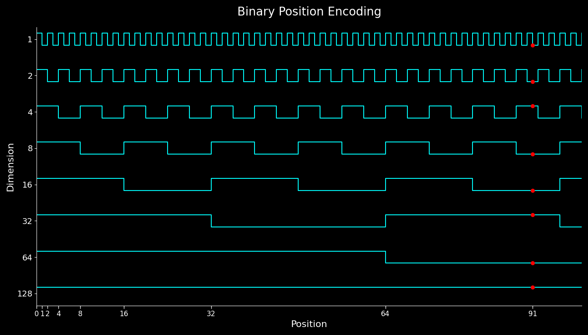
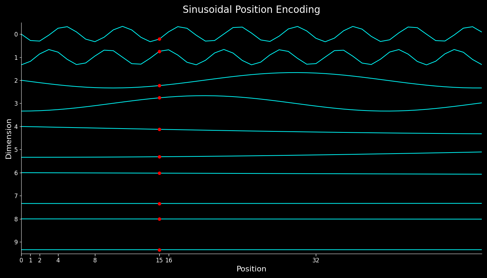
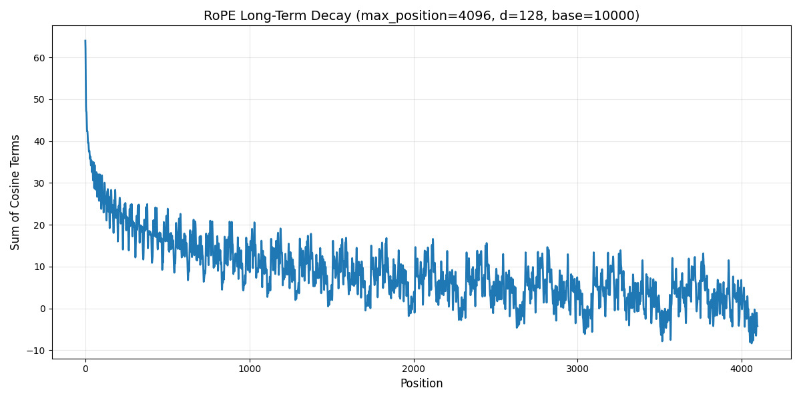

> 本文前半部分参考 [参考文献1](https://huggingface.co/blog/designing-positional-encoding)，推荐大家看博客原文。

# Introduction

在 [上一篇blog](https://maosong.website/p/%E5%85%B3%E4%BA%8Eattention-bias%E7%9A%84%E4%B8%80%E4%BA%9B%E6%80%9D%E8%80%83/) 中, 我们介绍了 Attention 的两个性质，也就是在不加 position encoding 的情况下，Attention 对于 query 是 permutation equivariant 的，对于 key 和 value 是 permutation invariant 的。

但是“我爱你”和“你爱我”这两句话所表示的含义应该是不一样的，我们将这两句话作为 key 和 value 的时候，我们发现模型的输出是一致的，这显然是不能接受的。因此，我们就需要加入 position encoding，让模型学习到语序信息，从而明白不同的语序有不同的含义。

下面是测试代码 （来自 [参考文献1](https://huggingface.co/blog/designing-positional-encoding)）

```python
import torch
import torch.nn as nn
from transformers import AutoTokenizer, AutoModel

model_id = "meta-llama/Llama-3.2-1B"
tok = AutoTokenizer.from_pretrained(model_id)
model = AutoModel.from_pretrained(model_id)

text = "The dog chased another dog"
tokens = tok(text, return_tensors="pt")["input_ids"]
embeddings = model.embed_tokens(tokens)
hdim = embeddings.shape[-1]

W_q = nn.Linear(hdim, hdim, bias=False)
W_k = nn.Linear(hdim, hdim, bias=False)
W_v = nn.Linear(hdim, hdim, bias=False)
mha = nn.MultiheadAttention(embed_dim=hdim, num_heads=4, batch_first=True)

with torch.no_grad():
    for param in mha.parameters():
        nn.init.normal_(param, std=0.1) # Initialize weights to be non-negligible

output, _ = mha(W_q(embeddings), W_k(embeddings), W_v(embeddings))

dog1_out = output[0, 2]
dog2_out = output[0, 5]
print(f"Dog output identical?: {torch.allclose(dog1_out, dog2_out, atol=1e-6)}") #True
```

Position encoding 可以分为绝对位置编码 (absolute position encoding, APE)，相对位置编码 (relative position encoding, RPE) 以及可学习的位置编码。可学习位置编码主要是 BERT 类的模型在使用，其训练成本比较高，本文不做讨论。绝对位置编码是原始 transformer 里提出的编码模式，现在的大多数基于 transformer 模型使用的都是相对位置编码。

本文中，我们先介绍位置编码应该具有的性质，然后我们分别介绍绝对位置编码和相对位置编码，我们将着重关注苏剑林老师提出来的 RoPE。

# 位置编码

在介绍位置编码之前，我们首先应该关注位置编码的性质，位置编码的目标是为输入的 token embedding 增加位置信息，那么理想的位置编码应该是怎么样的呢？

我们这里直接引用 [参考文献1](https://huggingface.co/blog/designing-positional-encoding) 中给定的性质：

1. **性质 1**: token sequence 中每个位置的位置编码都是唯一的。这个很好理解，如果不唯一的话，那么根据前面推导的性质，这两个位置的 attention 输出就完全一致了
2. **性质 2**: 线性相关性。也就是说，如果我们知道了位置 $p$ 处的位置编码，那么理想情况下，我们应该能比较简单地得到 $p+k$ 处的位置编码，理想情况下，我们应该有 $PE(p+k)=W_kPE(p)$.
3. **性质 3**: 泛化到长上下文中去。我们希望位置编码不仅在 8K 的上下文起作用，还希望位置编码能够泛化到 32K 的上下文
4. **性质 4**: 生成模式是固定的。固定的模式有助于模型更好地学习位置相关的信息
5. **性质 5**: 可以扩展到多维。我们希望位置编码可以从文本扩展到图片再到视频，也就是从 $1D$ 到 $nD$.

# 绝对位置编码

绝对位置编码依照其名称，其思想就是为每个位置的 token 分配一个固定的位置信息，也就是对于输入的 hidden states $\bm{x}=[\bm{x}_1,\dots,\ \bm{x}_m]\in\mathbb{R}^{m\times d}$, 我们有

$$
\bm{x}_i' = \bm{x}_i + p_i, i=1,\dots, m
$$

这里，$p_i\in\mathbb{R}^d$. 我们的 attention 就变成了

$$
\mathrm{Attn}(X) = \mathrm{softmax}\left(\frac{(Q+P)(K+P)^T}{\sqrt{d}}\right)V\in\mathbb{R}^{m\times d}
$$

这里

$$
P = [p_1,\dots,p_m]\in\mathbb{R}^{m\times d}， Q= W_QX\in\mathbb{R}^{m\times d}, K=W_KX, V=W_VX\in\mathbb{R}^{n\times d}
$$

## 整数位置编码

一个最简单的想法就是我们使用正整数来标记 token 所在的位置，也就是

$$
PE(i) = [i, \dots, i]=i\mathbf{1}_{d\times 1}\in\mathbb{R}^d,\ i=1,\dots,m
$$

可以看到，这个简单的设计满足性质 1，性质 2，性质 3，性质 4.

但是，注意到 attention 的输入 $X$ 通常是经过 Layer Normalization 处理过后的，因此其按列符合正态分布，并且均值和方差一般较小。当我们加上整数位置编码之后，其 token 本身的信息就会被污染，也就是信噪比非常低。一个解决方法就是我们对 $PE(i)$ 进行 normalization，即

$$
PE(i)' = \frac{1}{m}PE(i) = \frac{i}{m}\mathbf{1}_{d\times 1}
$$

现在所有的位置编码的值都比较小，但是我们发现新的位置编码不满足性质 2 了，这是因为现在位置编码还和 sequence 长度有关，我们从位置 $p$ 到位置 $p+k$ 不仅取决于 $k$ 还取决于 sequence 长度 $m$

## 二进制位置编码

既然整数位置编码的主要问题是对输入影响太大，我们能否找一个不影响输入的整数位置编码方式呢？ [参考文献1](https://huggingface.co/blog/designing-positional-encoding) 提出了二进制位置编码，因为每个 token 是 $d$ 维的，因此我们可以使用 $d$ 位二进制来表示 $i$. 比如说，当 $d=3$, $m=4$ 时，我们的位置编码分别为

$$
PE(0) =p_{(000)_2} = [0, 0, 0],\  PE(1) =p_{(001)_2}= [0, 0, 1],\  PE(2) =p_{(010)_2} = [0, 1, 0],\  PE(3) =p_{(011)_2} = [0, 1, 1]
$$

现在，我们二进制位置编码满足性质 1，性质 2. 对于性质 3，由于 $d$ 位二进制的表示范围为 $[0, 2^d-1]$，因此其泛化性受到 $d$ 的影响。

[参考文献1](https://huggingface.co/blog/designing-positional-encoding) 画出了不同位置的值的变化情况。我们这里也模仿绘制出类似的曲线图



我们发现，二进制位置编码高位，也就是 $PE(i)_{d}$ 的变化很慢，而低位，也就是 $PE(i)_{0}$ 变化很快，

二进制位置编码解决了整数位置编码的信噪比过低和线性相关性。但是其问题是其对不同位置的 token embedding 产生的影响是不一样的。比如位置 1 和位置 2 的相同的 token embedding 之间的区别是：

$$
(\bm{x}_2 + PE(2)) - (\bm{x}_1 + PE(1)) = (\bm{x}_2-\bm{x}_1)+ [0, 1, -1]
$$

一般来说, $\bm{x}_2-\bm{x}_1$ 比较小，因此使用二进制位置编码的问题是输入位置的微小变化（增加一个 token 或减少一个 token）都会对最终结果产生巨大影响。因此，我们需要想办法解决这个问题。

## Sinusoidal

前面提到二进制位置编码的问题是相邻 token 之间变化太大，不够光滑。因此我们想要增加一个光滑性质，也就是说我们希望：

1. 位置编码值在 $[-1, 1]$ 之间，防止对 token embedding 产生影响
2. 相邻 token 的位置编码尽可能相近，即 $|PE(k+p)-PE(p)| \leq \delta |k|$, 其中 $\delta>0$ 是一个比较小的数。
3. 与二进制一样，高位的变化比较慢，低位的变化比较快

一个想法就是利用三角函数 $\sin$ 或者 $\cos$，三角函数满足前两个性质， 对于第三个性质，我们可以通过控制频率来满足。这样我们得到的位置编码就具有如下形式：

$$
PE(p, i) = \sin\left(\frac{p}{\theta^{i/d}}\right)
$$

其中 $\theta$ 是我们的超参数。

我们现在来推导一下上面位置编码的线性相关性：

$$
PE(p+k) = \sin\left(\frac{p+k}{\theta^{i/d}}\right)=PE(p)\cos\left(\frac{k}{\theta^{i/d}}\right) + \cos\left(\frac{p}{\theta^{i/d}}\right)\sin\left(\frac{k}{\theta^{i/d}}\right)
$$

我们发现，$\sin$ 位置编码不满足线性相关性。但是出现的 $\cos$ 给了我们启发，也就是我们可以同时使用 $\sin$ 和 $\cos$ 来完成位置编码，这也是原始 transformer 里提出来的 Sinusoidal 位置编码，其形式为：

$$
\begin{aligned}
    PE(p, 2i) &= \sin\left(\frac{p}{\theta^{2i/d}}\right)\\
    PE(p, 2i+1) &= \cos\left(\frac{p}{\theta^{2i/d}}\right)
\end{aligned}
$$

现在，记 $\omega_i=1/\theta^{2i/d}$, 我们再推导一下线性相关性，就得到：

$$
\begin{aligned}
    \begin{bmatrix}
        PE(p+k, 2i)\\
        PE(p+k, 2i+1)\\
    \end{bmatrix}&=\begin{bmatrix}
        \sin \omega_i(p+k)\\
        \cos \omega_i(p+k)
    \end{bmatrix}\\
    &=\begin{bmatrix}
        \sin \omega_i(\omega_ip)\cos(\omega_ik)+\cos w_i(\omega_ip)\sin(\omega_ik)\\
        \cos \omega_i(\omega_ip)\cos(\omega_ik)-\sin w_i(\omega_ip)\sin(\omega_ik)
    \end{bmatrix}\\
    &= \begin{bmatrix}
        \cos(\omega_ik)& \sin(\omega_ik)\\
        -\sin(\omega_ik)& \cos(\omega_ik)
    \end{bmatrix}\begin{bmatrix}
        PE(p, 2i)\\
        PE(p, 2i+1)\\
    \end{bmatrix}
\end{aligned}
$$

也就是说，Sinusoidal 位置编码满足线性相关性。对于 Sinusoidal 位置编码我们也可以进行可视化：



# 相对位置编码

前面介绍了绝对位置编码，每个位置的位置编码是固定的。但是绝对位置编码的问题是，模型比较难以学习相对位置关系。

举个例子，我们提到上下文时，通常会使用“上一节”，“上一章”这些表示相对位置关系的词。

因此，我们希望让模型学习相对位置关系而不是绝对位置关系，因为相对关系更符合我们的认知。

## RoPE

RoPE 由苏剑林老师提出，最早应用于 LLaMA 架构（没有确认），后续被大多数模型所采用。

之前的 PE 大多数关注于加性位置编码，也就是**假设位置编码的形式为 $\bm{x}+\bm{p}$**, 基于这种假设，已有的工作基本都集中于优化下面的 Q 和 K 的内积

$$
\langle f_q(\bm{x}_q, m), f_k(\bm{x}_k, n) \rangle
$$

这里 $f_q(\bm{x}_q, m)=W_q(\bm{x}_q+\bm{p}_m)$, $f_k(\bm{x}_k, n)=W_k(\bm{x}_k+ \bm{p}_n)$.

而 RoPE 里面，作者使用了一个不同的假设： **假设内积应该仅包含两者的相对信息**，也就是

$$
\langle f_q(\bm{x}_q, m), f_q(\bm{x}_k, n)\rangle := g(\bm{x}_q,\bm{x}_k, m-n)
$$

这里的 $f$ 和 $g$ 都是未知函数。我们的目标就是从这个公式中推导出一个合适的位置编码出来。

不失一般性，我们可以假设

$$
f_q(\bm{x}_m,0) = \bm{x}_q,\quad  f_q(\bm{x}_n, 0) = \bm{x}_k
$$

这个假设代表初始条件下，我们不对输入做任何改变，也就是不增加位置信息。

## 2D 推导

与 RoPE 一样，我们直接使用复平面来进行推导。

我们假设 $d=2$, 注意到二维平面上的每个点都可以表示为如下形式

$$
\bm{z} = (x,y) = re^{i\theta}
$$

其中 ($\mathrm{atan2}$ 定义参考 [维基百科](https://en.wikipedia.org/wiki/Polar_coordinate_system))

$$
r = \|\bm{z}\|_2 = \sqrt{x^2+y^2}\in\mathbb{R},\quad  \theta = \mathrm{atan2}(y, x)\in\mathbb{R},
$$

现在，对于三个向量 $f_q(\bm{x}_q, m)$, $f_q(\bm{x}_k, n)$, $g(\bm{x}_q,\bm{x}_k, m-n)$ 我们可以写出其极坐标形式：

$$
\begin{aligned}
    f_q(\bm{x}_q,m) &:= r_q(\bm{x}_q,m)e^{i\theta_q(\bm{x}_q,m)}\\
    f_k(\bm{x}_k, n) &:= r_k(\bm{x}_k, n)e^{i\theta_k(\bm{x}_k, n)}\\
    g(\bm{x}_q,\bm{x}_k, m-n) &:= r_g(\bm{x}_q,\bm{x}_k, m-n)e^{i\theta_g(\bm{x}_q,\bm{x}_k, m-n)}
\end{aligned}
$$

我们计算内积并比较同类项得到：

$$
\begin{aligned}
    r_g(\bm{x}_q,\bm{x}_k, m-n) &:= r_q(\bm{x}_q,m)r_k(\bm{x}_k, n)\\
    \theta_g(\bm{x}_q,\bm{x}_k, m-n) &:= \theta_q(\bm{x}_q,m)-\theta_k(\bm{x}_k, n)
\end{aligned}\tag{3}
$$

我们接下来分别推导 $r_g(\bm{x}_q,\bm{x}_k, m-n)$ 和 $\theta_g(\bm{x}_q,\bm{x}_k, m-n)$ 的形式

### $r_g(\bm{x}_q,\bm{x}_k, m-n)$

我们令 $m=n=0$ 可以得到初始条件

$$
r_g(\bm{x}_q,\bm{x}_k, 0) = r_q(\bm{x}_q,0)r_k(\bm{x}_k, 0)=\|\bm{q}\|_2\|\bm{k}\|_2
$$

我们再令 $n=0$,得到

$$
r_g(\bm{x}_q,\bm{x}_k, m) = r_q(\bm{x}_q,m)r_k(\bm{x}_k, 0)=r_q(\bm{x}_q,m)\|\bm{k}\|_2=\frac{r_g(\bm{x}_q,\bm{x}_k, m-n)}{r_k(\bm{x}_k, n)}\|\bm{k}\|_2
$$

这里最后一个等式带入了原始等式 (3)，注意到左侧与 $n$ 无关，因此右侧我们选取 $n=1$, 得到

$$
r_g(\bm{x}_q,\bm{x}_k, m) = \frac{r_g(\bm{x}_q,\bm{x}_k, m-1)}{r_k(\bm{x}_k, 1)}\|\bm{k}\|_2 =\cdots= r_g(\bm{x}_q,\bm{x}_k, 0)\left(\frac{\|\bm{k}\|_2 }{r_k(\bm{x}_k, 1)}\right)^{m+1}
$$

令 $m=0$ 我们有

$$
r_k(\bm{x}_k, 1) = \|\bm{k}\|_2.
$$

因此我们最终的表达式为：

$$
r_g(\bm{x}_q,\bm{x}_k, m) = r_g(\bm{x}_q,\bm{x}_k, 0) = \|\bm{q}\|_2\|\bm{k}\|_2.
$$

并且，通过分别设置 $m=0$ 以及 $n=0$ 我们还可以得到

$$
 r_q(\bm{x}_q,m) = \|\bm{q}\|_2,\quad r_k(\bm{x}_k, n) = \|\bm{k}\|_2
$$

### $\theta_g(\bm{x}_q,\bm{x}_k, m-n)$

令 $m=n=0$, 我们得到初始条件

$$
\theta_g(\bm{x}_q,\bm{x}_k, 0) = \theta_q(\bm{x}_q,0)-\theta_k(\bm{x}_k, 0)=\theta_q-\theta_k
$$

令 $n=1$, 我们有

$$
\begin{aligned}
    \theta_g(\bm{x}_q,\bm{x}_k, m-1) &= \theta_q(\bm{x}_q,m)-\theta_k(\bm{x}_k, 1)\\
    &=\theta_g(\bm{x}_q,\bm{x}_k, m-n)  + \theta_k(\bm{x}_k, n)-\theta_k(\bm{x}_k, 1)
\end{aligned}
$$

这里我们带入了公式 (3)，注意到公式左边与 $n$ 无关，因此在公式右侧我们令 $n=0$, 得到

$$
 \theta_g(\bm{x}_q,\bm{x}_k, m-1) = \theta_g(\bm{x}_q,\bm{x}_k, m)+ \theta_k(\bm{x}_k, 0)-\theta_k(\bm{x}_k, 1)
$$

分别令 $m=1,2,\dots$ 并相加这些等式，我们得到

$$
\theta_g(\bm{x}_q,\bm{x}_k, 0) = \theta_g(\bm{x}_q,\bm{x}_k, m) + m(\theta_k(\bm{x}_k, 0)-\theta_k(\bm{x}_k, 1))
$$

即

$$
\theta_g(\bm{x}_q,\bm{x}_k, m) = m(\theta_k(\bm{x}_k, 1)-\theta_k(\bm{x}_k, 0))+(\theta_q-\theta_k)\tag{4}
$$

注意到

$$
\theta_g(\bm{x}_q,\bm{x}_k, m) = \theta_q(\bm{x}_q,m)-\theta_k(\bm{x}_k, 0)=\theta_q(\bm{x}_q,m)-\theta_k
$$

带入上式我们就得到

$$
\theta_q(\bm{x}_q,m) = m(\theta_k(\bm{x}_k, 1)-\theta_k(\bm{x}_k, 0))+\theta_q
$$

在 (4) 式中再令 $m=m-n$，并带入 $\theta_q(\bm{x}_q,m)$ 就有

$$
\theta_k(\bm{x}_k,n) = n(\theta_k(\bm{x}_k, 1)-\theta_k(\bm{x}_k, 0))+\theta_k
$$

## 汇总

最后，我们将以上结果放在一起，就得到

$$
f_q(\bm{x}_q,m) = \bm{q}e^{im\theta}, f_v(\bm{x}_k,m) = \bm{k}e^{in\theta}
$$

这里 $\theta=\theta_k(\bm{x}_k, 1)-\theta_k(\bm{x}_k, 0)$ 是一个超参数，用于控制频率。

我们记

$$
R_{\theta,m} = \begin{bmatrix}
    \cos m\theta & -\sin m\theta\\
    \sin m\theta & \cos m\theta
\end{bmatrix}
$$

则我们有：

$$
f_q(\bm{x}_q,m) = R_{\theta,m}\bm{q}, f_v(\bm{x}_k,m) = R_{\theta,n}\bm{k}.
$$

并且

$$
\langle f_q(\bm{x}_q,m), f_v(\bm{x}_k,m)\rangle = \bm{q}^TR_{\theta,m-n}\bm{k} \tag{5}
$$

## 多维扩展

上面是 2D 的情况，对于多维情况，苏剑林老师通过将两个元素组对，然后分别进行处理，得到了多维的情形：

$$
R_{\theta,m}^d = \begin{bmatrix}
    R_{\theta_1,m} &  & && & \\
    & & R_{\theta_2,m} &  &   & \\
    &&&& \ddots & \\
    &&&& & R_{\theta_{d/2},m}
\end{bmatrix}\in\mathbb{R}^{d\times d}
$$

我们可以验证公式 (5) 仍然是成立的。

## RoPE 的远程衰减性质

我们接下来看一下结果与相对距离 $m-n$ 之间的关系， 注意到

$$
\langle f_q(\bm{x}_q,m), f_v(\bm{x}_k,m)\rangle = \bm{q}^TR_{\theta,m-n}\bm{k} = \sum_{i=1}^{d/2} \bm{q}_i^TR_{\theta, m-n}\bm{k}_i
$$

这里 $\bm{q}_i=[q_{2i},q_{2i+1}]^T$, $\bm{k}_i=[k_{2i},k_{2i+1}]^T$ 分别是对应的 pair，我们考虑其中一个分量，不妨假设 $\|\bm{q}\|_2=\|\bm{k}\|_2=1$, 我们有

$$
\begin{aligned}
\bm{q}_i^TR_{\theta, m-n}\bm{k}_i
&\leq \bm{q}_i^TR_{\theta, m-n}\bm{q}_i\\
&= \bm{q}_i^T\left(\frac{R_{\theta, m-n}+R_{\theta, m-n}^T}{2}\right)\bm{q}_i\\
&\leq \lambda_{\max}\left(\frac{R_{\theta, m-n}+R_{\theta, m-n}^T}{2}\right) \\
&= \cos (m-n)\theta_i
\end{aligned}
$$

其中，第一个不等式是因为 两个向量相等时其内积最大，第二个不等式是由于二次型最大值为矩阵的特征值。

这样我们就有

$$
\langle f_q(\bm{x}_q,m), f_v(\bm{x}_k,m)\rangle \leq \sum_{i=1}^{d/2}\cos (m-n)\theta_i.
$$

我们可以简单画出对应的曲线：



这里针对不同的配置，结果也会略微不同，具体分析可以参加知乎回答 [RoPE的远距离衰减](https://zhuanlan.zhihu.com/p/705492804)

# RoPE 代码实现与理解

## Naive 实现

我们接下来看一下如何实现 RoPE

$$
\Theta_m\bm{x}=\begin{bmatrix}
    \cos m\theta_0 & -\sin m\theta_0 & &&\cdots &\cdots &\cdots \\
    \sin m\theta_0 & \cos m\theta_0 & &&\cdots &\cdots &\cdots\\
    & & \cos m\theta_1 & -\sin m\theta_1 & \cdots  &\cdots &\cdots\\
    & & \sin m\theta_1 & \cos m\theta_1 & \cdots &\cdots &\cdots \\
    &&&& \ddots &\vdots &\vdots\\
    &&&& & \cos m\theta_{d/2} & -\sin m\theta_{d/2}\\
    &&&& & \sin m\theta_{d/2} & \cos m\theta_{d/2}
\end{bmatrix}\begin{bmatrix}
    x_1\\
    x_2\\
    \vdots \\
    x_d
\end{bmatrix}
$$

在实现的时候，我们一般根据 $\sin$ 和 $\cos$ 进行分组，也就是

$$
\Theta_m\bm{x}=\begin{bmatrix}
\cos m\theta_0\\
\cos m\theta_0\\
\vdots\\
\cos m\theta_{d/2}\\
\cos m\theta_{d/2}\\
\end{bmatrix}\odot \begin{bmatrix}
x1\\
x2\\
\vdots\\
x_{d-1}\\
x_d\\
\end{bmatrix} + \begin{bmatrix}
\sin m\theta_0\\
\sin m\theta_0\\
\vdots\\
\sin m\theta_{d/2}\\
\sin m\theta_{d/2}\\
\end{bmatrix}\odot
\begin{bmatrix}
-\ x_2\\
x_1\\
\vdots\\
-x_d\\
x_{d-1}\\
\end{bmatrix}
$$

我们通常按照奇偶 index 来分别计算，然后通过重排序来得到最终的结果，实现代码如下：

```python
def apply_rotary_pos_emb(x: torch.Tensor, sin: torch.Tensor, cos: torch.Tensor) -> torch.Tensor:
    x_even = x[..., ::2]  # (seq_len, d_k_half)
    x_odd = x[..., 1::2]  # (seq_len, d_k_half)
    odds = cos * x_even - sin * x_odd  # (...,seq_len, d_k_half)
    evens = sin * x_even + cos * x_odd  # (...,seq_len, d_k_half)
    stacked = torch.stack((odds, evens), -2)  # (...,seq_len, 2, d_k_half)
    stacked_trans = rearrange(
        stacked, "... seq_len double d_k_half -> ... seq_len d_k_half double"
    )  # (...,seq_len, d_k_half, 2)
    out = rearrange(
        stacked_trans, "... seq_len d_k_half double -> ... seq_len (d_k_half double)"
    )  # (..., seq_len, d_k)
    return out
```

## LLaMA 实现

```python
def precompute_freqs_cis(dim: int, end: int, theta: float = 10000.0):
    freqs = 1.0 / (theta ** (torch.arange(0, dim, 2)[: (dim // 2)].float() / dim))
    t = torch.arange(end, device=freqs.device)  # type: ignore
    freqs = torch.outer(t, freqs).float()  # type: ignore
    freqs_cis = torch.polar(torch.ones_like(freqs), freqs)  # complex64
    return freqs_cis

def reshape_for_broadcast(freqs_cis: torch.Tensor, x: torch.Tensor):
    ndim = x.ndim
    assert 0 <= 1 < ndim
    assert freqs_cis.shape == (x.shape[1], x.shape[-1])
    shape = [d if i == 1 or i == ndim - 1 else 1 for i, d in enumerate(x.shape)]
    return freqs_cis.view(*shape)


def apply_rotary_emb(
    xq: torch.Tensor,
    xk: torch.Tensor,
    freqs_cis: torch.Tensor,
) -> Tuple[torch.Tensor, torch.Tensor]:
    xq_ = torch.view_as_complex(xq.float().reshape(*xq.shape[:-1], -1, 2))
    xk_ = torch.view_as_complex(xk.float().reshape(*xk.shape[:-1], -1, 2))
    freqs_cis = reshape_for_broadcast(freqs_cis, xq_)
    xq_out = torch.view_as_real(xq_ * freqs_cis).flatten(3)
    xk_out = torch.view_as_real(xk_ * freqs_cis).flatten(3)
    return xq_out.type_as(xq), xk_out.type_as(xk)
```

在 LLaMA 中，我们首先还是计算 $\theta_i$, 然后在计算的过程中，我们将 $(x_i,x_{i+1})$ 视作一个复数，然后 乘以 $\exp(im\theta)$, 最后再取实部得到最终的结果

## 通用实现

实际上，naive 版本的实现与现在大语言模型所采用的实现并不一致，我们先看一下现有的大语言模型的 RoPE 实现，这里我们将 [LLaMA的transformer代码](https://github.com/huggingface/transformers/blob/main/src/transformers/models/llama/modeling_llama.py) 放在下面，

```python
def rotate_half(x):
    """Rotates half the hidden dims of the input."""
    x1 = x[..., : x.shape[-1] // 2]
    x2 = x[..., x.shape[-1] // 2 :]
    return torch.cat((-x2, x1), dim=-1)

def apply_rotary_pos_emb(q, k, cos, sin, position_ids=None, unsqueeze_dim=1):
    cos = cos.unsqueeze(unsqueeze_dim)
    sin = sin.unsqueeze(unsqueeze_dim)
    q_embed = (q * cos) + (rotate_half(q) * sin)
    k_embed = (k * cos) + (rotate_half(k) * sin)
    return q_embed, k_embed

class LlamaRotaryEmbedding(torch.nn.Module):
    def __init__(self, dim, max_position_embeddings=2048, base=10000, device=None):
        super().__init__()

        self.dim = dim
        self.max_position_embeddings = max_position_embeddings
        self.base = base
        inv_freq = 1.0 / (self.base ** (torch.arange(0, self.dim, 2).float().to(device) / self.dim))
        self.register_buffer("inv_freq", inv_freq)

        self.max_seq_len_cached = seq_len
        t = torch.arange(self.max_seq_len_cached, device=device, dtype=self.inv_freq.dtype)

        freqs = torch.einsum("i,j->ij", t, self.inv_freq)
        # Different from paper, but it uses a different permutation in order to obtain the same calculation
        emb = torch.cat((freqs, freqs), dim=-1)
        self.register_buffer("cos_cached", emb.cos()[None, None, :, :].to(dtype), persistent=False)
        self.register_buffer("sin_cached", emb.sin()[None, None, :, :].to(dtype), persistent=False)

    def forward(self, x, seq_len=None):
        # x: [bs, num_attention_heads, seq_len, head_size]
        if seq_len > self.max_seq_len_cached:
            self._set_cos_sin_cache(seq_len=seq_len, device=x.device, dtype=x.dtype)

        return (
            self.cos_cached[:, :, :seq_len, ...].to(dtype=x.dtype),
            self.sin_cached[:, :, :seq_len, ...].to(dtype=x.dtype),
        )
```

我们将上述代码翻译成公式，现在我们的 $\Theta$ 变成了 (对应 `emb = torch.cat((freqs, freqs), dim=-1)`)

$$
\Theta = [\theta_0,\dots,\theta_{d/2},\theta_0,\dots,\theta_{d/2}]^T
$$

实际上 $\sin$ 部分对应的向量现在变成了

$$
[-x_{d/2+1},
-x_{d/2+2},
\dots,
-x_{d},
x_1,
\dots,
x_{d/2}]^T
$$

我们带回到原始公式，可以得到对应的 RoPE 操作变成了

$$
R_{\theta,m}^d=\begin{bmatrix}
    \cos m\theta_0 &  & &  -\sin m\theta_0 & \cdots &\cdots &\cdots \\
    & & \cos m\theta_1 & &-\sin m\theta_1 & \cdots  &\cdots \\
    & & & \cos m\theta_2 & &-\sin m\theta_2 & \cdots  \\
    \vdots&\vdots&\vdots&\vdots& \vdots &\vdots &\vdots\\
    & & &  &\cos m\theta_{d/2 - 1} & & -\sin m\theta_{d/2 - 1}  \\
    \sin m\theta_0 && & \cos m\theta_0  &&\cdots &\cdots \\
    & & \sin m\theta_1 & &\cos m\theta_1 & \cdots &\cdots  \\
    & & & \sin m\theta_2 & &\cos m\theta_2 & \cdots  \\
    \vdots&\vdots&\vdots&\vdots& \vdots &\vdots &\vdots\\
    &&&& \sin m\theta_{d/2 - 1}&  & \cos m\theta_{d/2 - 1}
\end{bmatrix}
$$

这列每一行的 $\cos$ 和 $\sin$ 都相差了 $d/2$ 列.

因此，这里的区别在于，原始 RoPE 计算的 pair 为 $(x_{i}, x_{i+1})$, 而 LLaMA 里的 RoPE 计算的 pair 为 $(x_{i}, x_{i+d/2})$. transformers library 使用这种方式，可以减少计算量，提高整体的计算效率。

为了适应使用 LLaMA 中实现的 RoPE 的，Huggingface 对权重进行了转换，使得基于原始 RoPE 实现的模型也可以获得加速.

假设 $d=8$，原始 RoPE 的 pair 为 `[(q_0, q_1), (q_2, q_3), (q_4, q_5), (q_6, q_7)]`, 新的 pair 为 `[(q_0, q_4), (q_1, q_5), (q_2, q_6), (q_3, q_7)]`. 我们希望对 index 进行 remap，我们发现一个满足条件的 permutation 为 `[0, 2, 4, 6, 1, 3, 5, 7]`, 也就是 `q_0->q_0`, `q_2->q_1`, ..., `q_7->q_7`.

但是，如果我们在推理时这样做，就会降低整体速度，因此 Huggingface 的做法是改变 $W_Q$ 和 $W_K$ 的权重，具体来说，就是 $\Pi q=(\Pi W_Q)x$， 左边是在线转换，右侧离线转换。转换好 $W_Q$ 之后，正常计算就可以了。[具体代码](https://github.com/huggingface/transformers/blob/e42587f596181396e1c4b63660abf0c736b10dae/src/transformers/models/llama/convert_llama_weights_to_hf.py) 为

```python
# permute for sliced rotary
def permute(w, n_heads=n_heads, dim1=dim, dim2=dim):
    return w.view(n_heads, dim1 // n_heads // 2, 2, dim2).transpose(1, 2).reshape(dim1, dim2)

state_dict = {
    f"model.layers.{layer_i}.self_attn.q_proj.weight": permute(
        loaded[f"layers.{layer_i}.attention.wq.weight"]
    ),
    f"model.layers.{layer_i}.self_attn.k_proj.weight": permute(
        loaded[f"layers.{layer_i}.attention.wk.weight"]
    ),
    ...
}
```

# 结论

本文中，我们回顾了位置编码，包括绝对位置编码和相对位置编码，我们着重介绍了 RoPE 的原理，推导以及代码实现。

# 参考文献

1. [You could have designed state of the art positional encoding](https://huggingface.co/blog/designing-positional-encoding)
2. [Is LLaMA rotary embedding implementation correct?](https://discuss.huggingface.co/t/is-llama-rotary-embedding-implementation-correct/44509/2)
3. [[LLaMA] Rotary positional embedding differs with official implementation](https://github.com/huggingface/transformers/issues/25199)
4. [RoPE blog](https://kexue.fm/archives/8130/comment-page-6#comments)
5. [RoFormer](http://arxiv.org/abs/2104.09864)
6. [位置编码之路](https://zhuanlan.zhihu.com/p/1894384438206505105)
7. [RoPE的远距离衰减](https://zhuanlan.zhihu.com/p/705492804)
