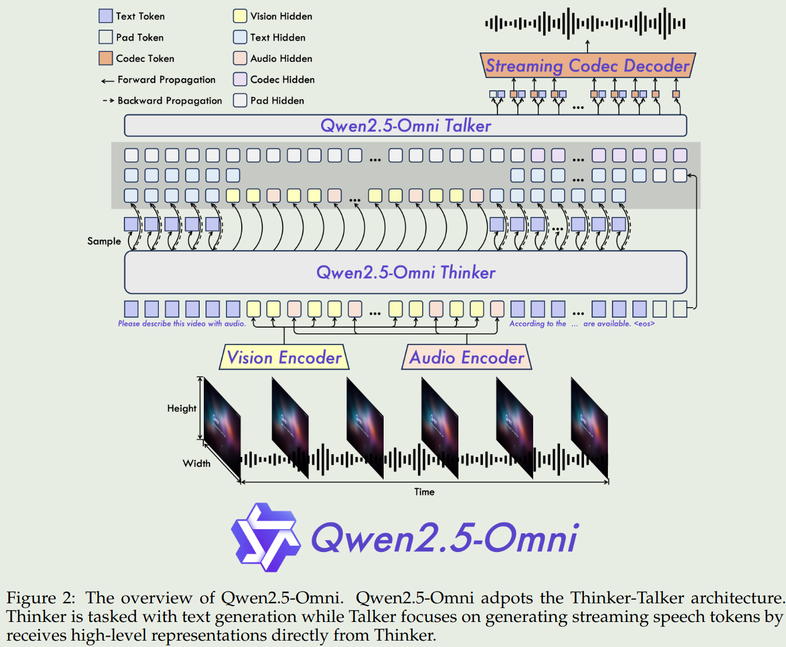
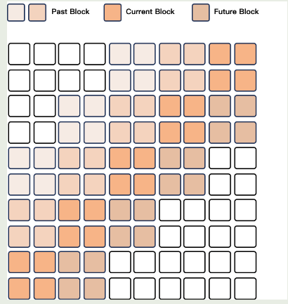
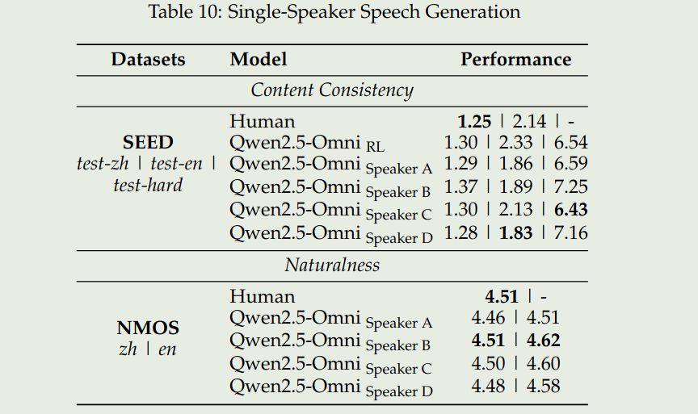

# 介绍

2025年3月26号，Qwen团队发布了Qwen2.5 omni，Qwen2.5 omni是一个多模态模型，支持文本、音频、视频、图像等多个模态的输入，支持文本，音频的输出。
作者提出了TMRoPE来对齐不同的模态，然后还是用了Thinker-Talker的架构来同时生成文本和音频。
Thinker是一个大语言模型，Talker是一个dual-track自回归模型，Talker基于Thinker的hideen states来生成audio token，最后通过一个sliding-window DiT来解码audio token

现有omni-model存在的问题：

1. 缺乏一个系统的，联合训练多个不同模态的方法
2. 需要处理不同模态输出时互相干扰的问题
3. 不能实时理解或者流式输出多模态信息

Qwen2.5 omni的解决方法：

1. 使用TMRoPE来对齐不同的模态。作者将audio以及video frame按照时间顺序组织成一个交替的架构，然后使用TMRoPE来对齐
2. 使用Thinker-Talker的架构来同时生成文本和音频。Thinker负责文本输出，Talker负责音频的流式输出。
3. 在multimodal encoder中使用Block-wise streaming处理技巧来实现实时理解；在输出时，实现了一个dual-track自回归架构来生成audio token，以及一个DiT模型来解码audio token

Qwen2.5 omni的贡献：

1. 提出了Qwen2.5-omni,可以实时理解多模态信息，并流式输出文本和音频
2. 提出了TMRoPE，一个可以对齐不同模态的RoPE算法
3. 提出了Thinker-Talker的架构，来完成实时理解和音频输出
4. 在多个benchmark上取得了SOTA

# 架构

## 总览

Qwen2.5-omni的架构如下图所示

其中Talker类似于人的嘴，负责基于脑中的信息来生成对话；Thinker类似于人的大脑，负责理解输入的信息，并生成对话的上下文。

## 输入

- text: Qwen的tokenizer
- audio： Qwen2-Audio的tokenizer
- vision： Qwen2.5-VL的vision tokenizer

视频以及TMRoPE。 对于视频来说，Qwen2.5-omni采取了和Qwen2.5-VL一样的MRoPE算法。只是这里的temporal ID对应40ms

音频：对于音频来说，Qwen2.5-omni也是以40ms进行采样然后encoding。

视频+音频：对于视频+音频来说，Qwen2.5-omni将视频和音频的token进行交替的排列，来保证时间上信息一致

## 输出

- Text：text由Thinker直接输出，这和LLM的输出方式是一样的。
- Speech：Qwen2.5-omni首先构建了`qwen-tts-tokenizer`，一个speech codec，用于表示speech的关键信息。
然后基于这些关键信息，Talker通过自回归的方式生成audio tokens以及text tokens。

## 流式输出

对于流式输出来说，现在的模型存在latency，具体影响因素如下：

1. 处理多模态输入的延迟
2. TTFT （time to first token）
3. 将第一段speech token解码为audio的时间
4. 模型架构导致的latency，如模型参数等

为了解决这个问题，Qwen2.5-omni采取了以下措施：

1. Support prefilling. 作者修改了audio以及vision encoder来在temporal dimension上支持block-wise attention.
具体来讲，audio encoder只关注2秒内的信息，而vision encoder和Qwen2.5-VL一样，使用了一个MLP patch merger来压缩视觉token
2. Streaming Codec generation. 为了提高流式输出的效率，作者还是用了基于Flow-Matching的DiT，输出的code收线使用Flow-Matching转化为一个mel-spectrogram.
然后再通过一个BigVGAN来重建得到对应的waveform. 作者在这里修改了DiT的attention，将其receptive field 限制为4个block，包括lookback of 2 blocks以及lookahead of 1 block.

# Pre Training

模型参数初始化：

- LLM： 从Qwen2.5进行初始化
- vision encoder：从Qwen2.5-VL的vision encoder进行初始化
- audio encoder：从Whisper-large-v3进行初始化

Pretraining和Qwen2.5-VL的训练过程类似，分成了3个stage：

1. 冻结LLM的参数，仅训练vision encoder和audio encoder， 该阶段使用了audio-text以及image-text pairs来进行训练。 数据：image-text, video-text, video-audio, audio-text以及text corpus，
跟Qwen2-Audio类似，作者将hierarchical tags用自然语言prompt进行替换
2. 训练所有参数，使用更多的多模态数据进行训练。数据包括800B token的image和Video相关数据，300B token的audio数据，100B token的video-audio相关数据。
3. 将模型的上下文扩展到32K。前两个阶段的上下文长度为8192，本阶段使用了long video data等数据来将模型的上下文扩展到32K。

# Post Training

## Thinker

数据格式为ChatML，数据类型包括pure text-based dialogue data, visual-modality conversation data, audio-modality conversation data and mix-modality conversation data.

## Talker

包括三个阶段

1. ICL training: 训练Talker学习context continuation
2. [DPO](https://maosong.website/p/notes-on-dpo/) training: 提升speech generation的stability
3. multi-speaker instruction fine-tuning: 提升模型的naturalness和controllability

# Evaluation

Qwen2.5-omni在两类benchmark上进行来的评测，分别时多模态理解（X->text）以及音频生成(X-> Speech)

我们这里主要关注一下speech understanding以及speech generation的benchmark.

# 总结

Qwen2.5-omni相当于是结合了Qwen2.5-VL以及Mini-omni，跟mini-omni2的输入输出是类似的。不同的点在于，Qwen2.5-omni使用了Thinker-Talker的架构，然后还使用了TMRoPE来对齐不同的模态。总的来说，感觉模型还是更偏重于audio的理解与生成。

# Reference

- [Qwen2.5-omni](http://arxiv.org/abs/2503.20215)
- [Mini-omni](https://arxiv.org/abs/2408.16725)
- [Mini-omni2](https://arxiv.org/pdf/2410.11190)
