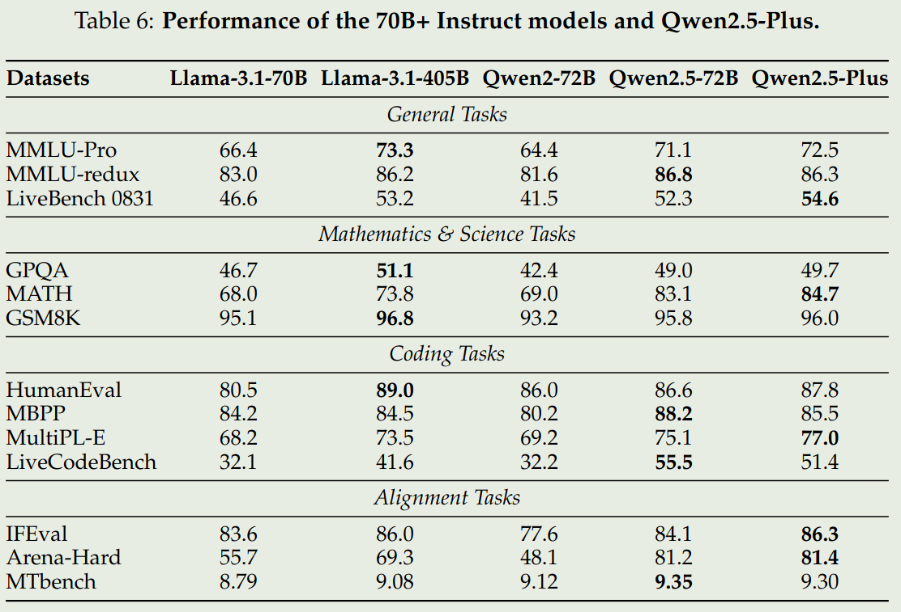
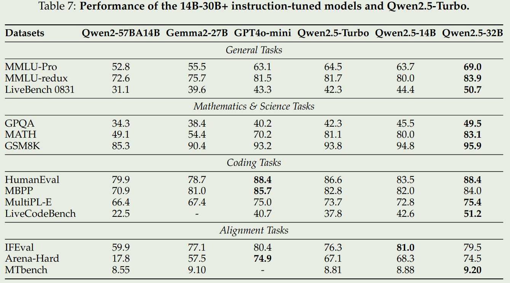
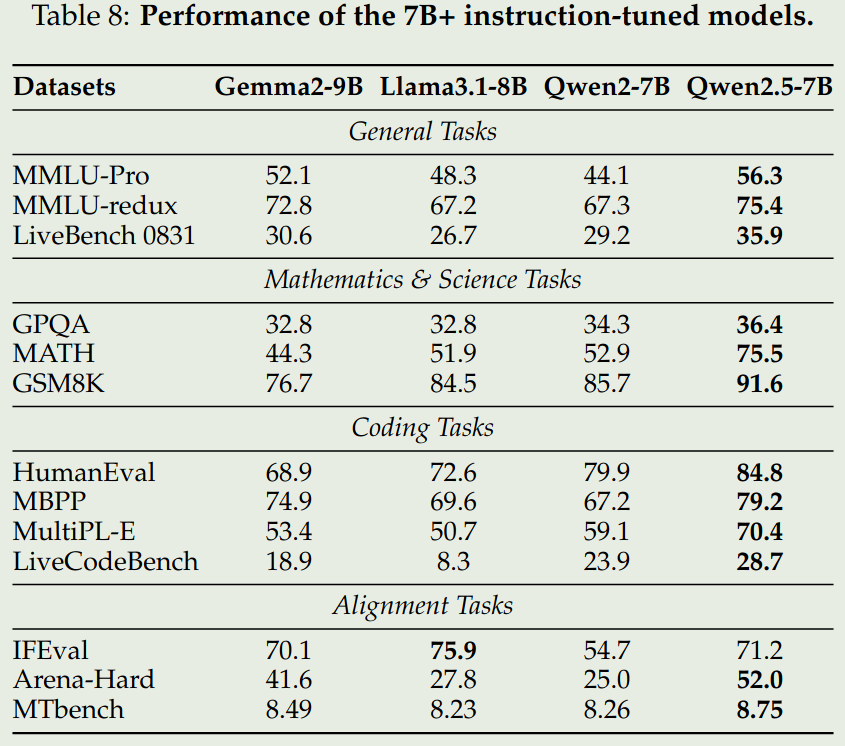
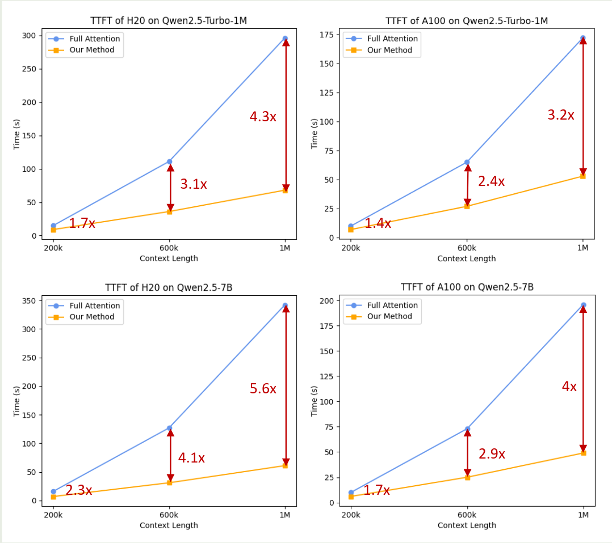

2024 年 12 月 Qwen 发布了 Qwen 2.5 系列大语言模型，包括 7 个 dense 模型以及两个 MoE 模型，Qwen2.5 在 pre-training 阶段使用了 18T token 进行。在 post-training 阶段使用了 1M 的样本，还使用了 DPO 以及 GRPO 来进行 RL 的训练

Qwen2.5 主要在以下方面进行了改进

1. 模型方面，提供了更多的 size，[Qwen2](https://maosong.website/p/qwen2-%E6%8A%80%E6%9C%AF%E6%8A%A5%E5%91%8A%E6%80%BB%E7%BB%93/) 中只有 0.5B, 1.5B, 7B, 72B 四个 size, 在 Qwen2.5 中，加入了 3B, 14B 和 32B 三个 size 的模型
2. 数据方面，pre-training 阶段使用了 18T 的 token， post-training 阶段使用了 1M 的样本
3. 功能方面，Qwen2.5 支持更长的上下文长度（8K），支持结构化输入和输出，拥有更强的工具调用能力。

## Method

### Architecture

模型架构这方面，Qwen2.5 和 Qwen2 的模型架构是一致的，tokenizer 页没有太大变化。为了支持工具调用，作者额外增加了 18 个 control token

### Pre-training

**data**
Qwen2.5 从以下方面提高了预训练数据的质量

1. Better data filtering: 使用 Qwen2-Instruct 来过滤掉质量的数据，然后从多维度对训练数据进行打分，从而提高数据的质量
2. Better math and code data: 加入了 Qwen2.5 Math 以及 Qwen2.5 Coder 的训练数据来提高模型的数学和代码能力
3. Better synthetic data: 作者使用 Qwen2-72B-Instruct 以及 Qwen2-Math-72B-Instruct 来合成 math, code, knowledge domain 的数据，然后通过过滤以及 Qwen2-Math-RM-72B 来提高数据的质量
4. Better data mixture: 作者使用 Qwen2-Instruct 来分类，然后平衡不同 domain 的数据分布。作者发现 e-commerce, social media 以及 entertainment 的数据重复性高，且大多都是机器生成的。而 technology, science 以及 academic research 等 domain 的数据质量更高。作者对不同 domain 的数据进行了上采样或者下采样。

基于这个过程，作者一共收集了**18T** tokens

**Hyper-parameters**
作者构建了针对超参数的 scaling law，即决定最优的训练超参数如 batch size, learning rate 等

作者通过实验得到了 model size $N$ 以及 pre-training data size $D$ 与 learning rate $\mu_{opt}$ 和 batch size $B_{opt}$ 之间的关系。

**Long context pre-training**
为了提升模型的上下文长度，作者将 pre-training 拆分为两个 stage，第一个 stage 的上下文长度为 4096， 第二个 stage，作者将上下文长度从 4096 扩展到 32768.

在提升模型上下文过程中，作者使用 ABF 技巧将 [Position Encoding](https://maosong.website/p/position-encoding%E6%80%BB%E7%BB%93/) 的 base frequency 从 10,000 提升到了 1,000,000.

对于 Qwen2-5-Turbo，作者实现了渐进式上下文长度扩展策略，模型上下文长度扩展经历四个阶段：32768, 65536, 131072 到最终的 262,144. 此时，RoPE 的 base frequency 为 10,000,000. 在训练的每个阶段，作者都使用了 40% 的长文本以及 60% 的短文本，以保证在扩展模型上下文长度的同时，还能保持模型在不同上下文长度下的表现。

为了提高模型在 inference 时的长上下文表现，作者使用了 [Dual Chunk Attention](https://maosong.website/p/qwen1.5%E6%8A%80%E6%9C%AF%E6%8A%A5%E5%91%8A%E6%80%BB%E7%BB%93/) 和 [YARN](https://maosong.website/p/notes-on-yarn/) 两个技巧。通过这两个技巧，作者将 Qwen2.5-Turbo 的上锈阿文扩展到了 1M，将其他模型的上下文长度扩展到了 131072.

### Post-training

Qwen2.5 的 post-training 分为两个大的 stage: SFT 和 RL，其中 RL 又分为两个小的 stage，分别是 offline RL 和 online RL

在 SFT 阶段，作者主要做了以下改进：

1. Long-sequence generation: 作者将 Qwen2.5 的输出长度提升到了 8192, 为了扩展模型输出的长度，作者构建了 Long-response 数据集，然后基于 back-translation 来生成对应的 query，最后使用 Qwen2 来过滤低质量的数据
2. Math: 作者在 SFT 阶段加入了 Qwen2.5-Math 的 CoT 数据，包括公开数据集，K12 问题集一集合成数据等。作者通过 rejection sampling 以及 annotated answers 来生成 CoT 过程
3. Code: 作者加入了 Qwen2.5-Coder 的 SFT 数据，作者基于多个 agent 来生成多样化高质量的 Instruction, 然后还从 code-related QA website 以及 Github 上获取数据来扩展数据集。对于最终的数据，作者使用了 sandbox 来保证代码的质量
4. Instruction following: 作者构建了一个基于 code 的验证框架，让 LLM 同时生成 Instruction 和对应的验证代码，验证的单元测试。最后，通过 rejection sampling 来得到最终的数据集
5. Structured Data Understanding: 作者还构建了针对 tabular QA, fact verification, error correction 以及 structured understanding 等数据集。作者在回答中加入 CoT，作者提高了模型对 structured data 的理解能力
6. Logical Reasoning: 作者构建了 70,000 个不同 domain 的 query，有多种格式，覆盖了 analogical reasoning, causal reasoning 等 domain
7. Cross-Lingual Transfer: 作者使用了一个翻译模型，来将 Instruction 转换到 low-resource language 上，进而提高模型在对应语种上的表现
8. Robust System Instruction: 作者构建了不同的 system prompt 用于提升 system prompt 的多样性。作者发现，使用不同的 system prompt 可以减少模型的 variance, 提高模型的 robustness.
9. Response Filtering: 作者使用了多种自动化标注方法来保证最终 response 的质量

最终，作者一共收集到 **1M** 的 SFT 样本，模型训练了两个 epoch

在 RL 阶段，作者首先基于 SFT model 来进行采样，然后将高质量的回答作为正样本，低质量的回答作为负样本，通过这个过程，一共采集到了**150K**的样本。最后，作者使用 DPO 来进行训练。

然后，作者进行了 online stage 的 RL 训练，这一阶段主要是对齐模型与人类的价值观。这一阶段的数据包括公开数据集，私有数据集。作者使用不同的 checkpoint 来进行采样，然后作者使用 GRPO 来进行训练.

### Long Cotnext Fine-tuning

作者还针对 Qwen2.5-Turbo 做了额外的 post-training, 来进一步提高其在长上下文下的表现。

在 SFT 阶段，作者使用了一个两阶段方法，第一阶段仅在短文本上进行训练（上下文长度为 32768），这一阶段的训练数据与其他 Qwen2.5 的模型训练数据相同。第二个阶段，作者混合了短文本和长文本（262144）来进行训练，来提高模型在长上下文情景下的指令跟随能力

在 RL 阶段，作者使用了和其他 Qwen2.5 模型相同的训练策略。作者认为：

1. 长上下文下训练 RL 代价很大
2. reward model 更偏向于长文本
3. RL 尽管只在短文本上进行训练，其还是可以提高模型在长上下文下的表现。

## Evaluation

我们仅关注 instruction 版本的 72B,32B 和 7B 模型

可以看到，Qwen2.5 72B 模型表现和 LLaMA3.1 405B 表现差不多，其他两个 size 的模型基本上达到了 SOTA

最后，作者评估了一下 DCA+YaRN v.s. Full attention 的表现，结果如下图所示

可以看到，使用 DCA+YaRN 之后，模型的推理效率比 full attention 要快 3-4 倍。

## Conclusion

在本文中，作者提出了 Qwen2.5 系列大语言模型，包括 7 个 dense 模型以及两个 MoE 模型，作者详细介绍了模型的 pre-training 和 post-training. 评测结果发现 Qwen2.5 模型基本上达到了 SOTA.

作者认为，未来工作有：

1. 使用更多更多样化的 pre-training 和 post-training 数据
2. 多模态大模型的构建，特别是 omni-modal
3. 提高模型的 Reasoning 能力

## References

- [Arxiv](http://arxiv.org/abs/2412.15115)
