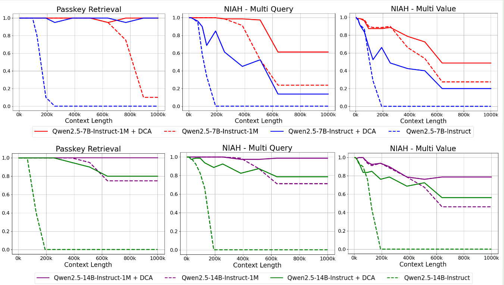
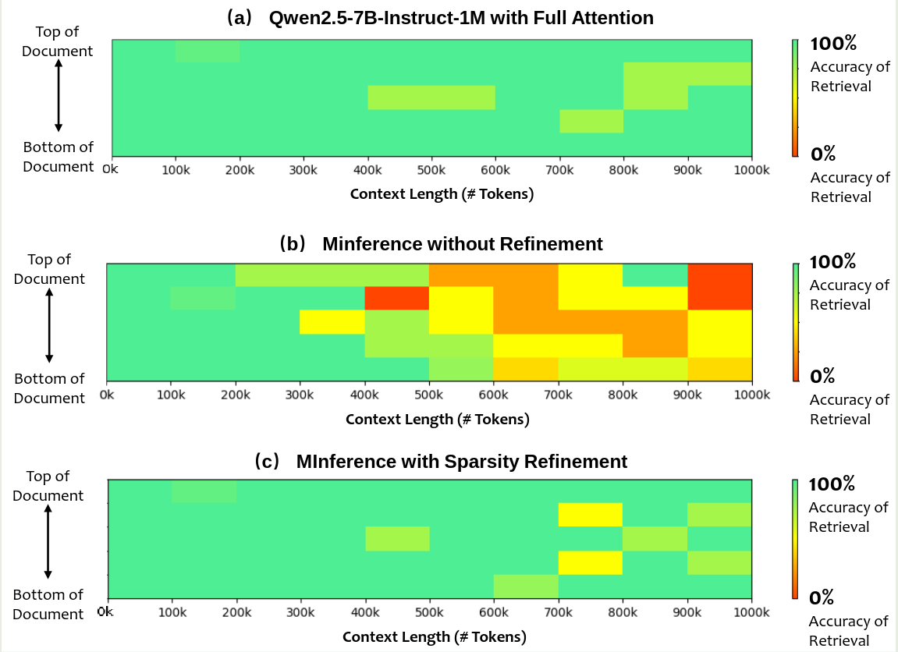
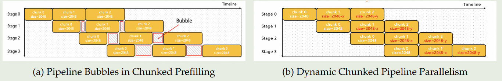
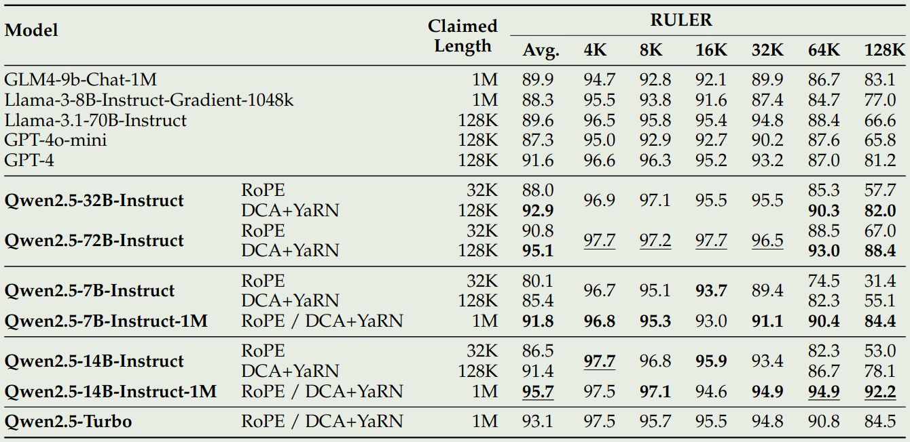

Qwen 在 2025 年 1 月提出了 Qwen2.5-1M，一个拥有 1M 上下文长度的大语言模型系列。包含 7B，14B 两个开源模型以及 API 模型 Qwen2.5-Turbo.  主要改进方法包括长上下文数据合成，渐进式预训练以及多阶段 post-training 等。作者还对 inference 进行了优化，提高了 inference 的效率。

## Method

架构上，Qwen2.5-1M 与 [Qwen2.5](https://maosong.website/p/notes-on-qwen2.5/) 的架构一致，Qwen2.5-1M 包括 7B，14B 两个 size，还包括一个基于 MoE 的 API 模型 Qwen2.5-Turbo，不同的点在于，Qwen2.5-1M 的上下文长度为 1M，最大生成长度为 8K

### Pretraining

**Data**
作者首先从 CC, arxiv, book, code repositories 等 domain 收集了原始数据。但是，作者发现，原始数据的局部相关性强，但是全局相关性弱。因此，作者基于原始数据进行了增广，来提高数据的长上下文依赖关系。具体有三个任务：

1. **Fill in the middle**: FIM 是 openAI 提出来的一个做法，核心思想就是将填空类问题转化为 next-token-prediction 的问题。通过这种方式，作者希望提升模型理解长上下文依赖的能力
2. **Keyword-based and Position-based retrieval**: 基于 keywords 或者 position 来找到对应的 paragraph，这个任务的目的是提高模型识别并连接相关信息的能力
3. **Paragraph Reordering**: 对输入的 paragraphs 进行随机打乱，然后要求模型重新组织段落的关系

**Training**
作者将训练拆分为了 5 个 stage：

1. stage 1 和 stage 2 与 Qwen2.5 的训练过程一致，stage 1 的上下文长度为 4096，stage 2 的上下文长度为 32768, 训练时，作者使用了 ABF 技巧来将 RoPE 的 base frequency 从 10,000 调整到了 1,000,000.
2. stage 3, stage 4 和 stage 5 分别将模型的上下文长度扩展到了 65,536 tokens, 131,072 tokens 以及 262,144 tokens, 对应的 RoPE base frequency 分别为 1M, 5M 和 10M. 训练时，作者使用了 75% 的长文本和 25% 的短文本，这样可以保证模型在短文本任务上的表现

最后，作者在评估了一下每个 stage 的表现，结果如下表所示

| Training Length |      |      |      | RULER |      |      |      |
| --------------- | ---- | ---- | ---- | ----- | ---- | ---- | ---- |
|                 | Avg. | 4K   | 8K   | 16K   | 32K  | 64K  | 128K |
| 32,768 Tokens   | 82.3 | 96.8 | 94.7 | 95.9  | 92.2 | 76.4 | 37.6 |
| 65,536 Tokens   | 86.8 | 96.5 | 95.5 | 93.6  | 92.5 | 86.7 | 56.0 |
| 131,072 Tokens  | 92.5 | 96.5 | 95.9 | 93.0  | 92.6 | 93.0 | 83.8 |
| 262,144 Tokens  | 92.7 | 95.6 | 93.8 | 93.1  | 94.1 | 91.9 | 87.6 |

可以看到，随着训练的上下文长度的提升，模型在更长上下文下的能力也有提升，说明模型具有一定的泛化性。

### Post-training

Post-training 阶段与 Qwen2.5 一样，也分为了 SFT 和 RL 两个阶段。

在 SFT 阶段，作者从预训练预料中选择了一部分长文档的片段，然后让 Qwen2.5 来生成对应的 query，query 类型包括 summarization, information retrieval, multi-hop QA 等任务。接下来，作者使用 Qwen-Agent 框架基于全文来回答这些问题。最后，作者基于生成的 query，全文，以及模型产生的回答作为训练数据。

SFT 训练时，作者拆分为了两个 stage。 stage 1 作者在 32768 的上下文上进行训练，来提高模型短文本回答能力。第二个阶段，作者混合了 262,144 和 32768 上下文长度的训练数据。

RL 训练时，与 Qwen2.5 不一样的是，作者进使用了 offline RL，也就是 DPO。作者仅在 8192 的上下文长度上面进行训练。作者认为，长上下文的 RL 训练是非常耗时的，并且作者发现，短文本上进行 RL 的训练之后，模型在长文本上的表现也能得到提升。结果如下表所示

| Model               | Before RL | After RL    |
|---------------------|-----------|-------------|
| Qwen2.5-7B-Instruct-1M | 7.32      | 8.08 (+0.75) |
| Qwen2.5-14B-Instruct-1M | 8.56     | 8.76 (+0.20) |
| Qwen2.5-Turbo        | 7.60      | 8.34 (+0.74) |

## Inference

前面是训练部分的优化，主要是提升模型的上下文能力。接下来，作者详细介绍了如何在 Inference 阶段提升整体的推理效率和减少内存占用。

### Length Extrapolation

与 Qwen2.5 一样，Qwen2.5-1M 也是用了 [Dual Chunk Attention](https://maosong.website/p/dual-chunk-attention/) 和 [YARN](https://maosong.website/p/notes-on-yarn/) 来在推理阶段扩展模型的上下文长度，作者做了如下实验，来对比 Qwen2.5, Qwen2.5-1M 加上 DCA 之后的影响

结果显示，Qwen2.5-1M 的表现比 Qwen2.5 更好，并且加上 DCA 之后，两者的表现都有进一步的提升。

### Sparse Attention

为了进一步提高计算效率，作者基于 MInference 来加速 perfilling phase. 并结合了 前面的技巧来防止模型性能下降。

**MInference**
MInference 的主要思想就是在长上下文中，有一些 critical token 对最终结果的影响是更大的。因此我们可以识别出这些 critical token 并只计算这些 token 对应的 attention score. 这些 critical token 对应的 pattern 被称为 Vertical-Slash pattern.

为了识别出这个 pattern，作者首先进行离线搜索，来决定最优的 configuration。这个 configuration 决定了 attention 应该如何计算。在 Inference 阶段，MInference 首先计算最后一个 query 和前面所有 key 的 attention，然后基于 configuration 来动态选择 pattern。通过 MInference，我们可以降低 10 倍以上的内存和算力消耗。

**Integrating with Chunked prefill**
但是 MInference 的问题在于，整个 sequence 是并行处理的，这会导致内存占用持续上升。为了解决这个问题，作者提出了 chunked prefilling 的技巧，来降低 VRAM 的消耗。具体做法就是，将整个 sequence 分为若干个 chunk，然后每个 chunk 里，选取最后 64 个 token 作为 query，在每个 chunk 中分别识别出 critical token，这样就降低了 MInference 的内存占用

接下来，作者在集成 DCA 的时候，发现性能有所下降。作者认为，这是由于 DCA 的 position id 信息不连续所导致的，为了解决这个问题，作者在选择 critical token 的时候，使用了连续版的 position id 信息。在最终推理的时候，还是使用 DCA 本身的位置信息。

**Sparsity refinement**
前面提到，MInference 需要先进行离线搜索决定最优的 configuration，但是对于 1M token 的上下文，这个过程还是非常耗时的。因此，作者构建了一个加速离线搜索的方法，具体做法就是定义两个 attention score，一个是 full attention, 另一个是 sparse attention， 然后计算两者的差值，如果说相差比较小，则说明 critical token 抓住了全局信息，这个配置是有效的。其公式定义如下：

$$
\mathrm{Attention\_Recall} = \exp\left(\log\sum_{0\leq j\leq i}\exp \left(\frac{q^Tk_j}{\sqrt {d}}\right) - \log\sum_{j\in\mathcal{critical}}\exp \left(\frac{q^Tk_j}{\sqrt {d}}\right)\right)
$$

Attention Recall 越高，说明选取的 critical token 越好，其 configuration 也就越好。

作者进一步分析了 sparse attention 对 accuracy 的影响，结果如下

可以看到，仅使用 MInference 会导致模型性能 下降，但是加入 refinement 之后，模型的表现基本上和 full attention 差不太多。

### Inference Engine

**Kernel Optimization**
作者还对 inference engine 进行了优化，作者使用 BladeLLM 作为 Qwen2.5-1M 的推理引擎。

作者主要做了两点优化，第一是对 sparse attention kernel 进行了优化，提高了 sparse attention 的计算效率，结果发现，在 1M 的上下文下，BladeLLM 比 Flash Attention 要快 27.8 倍。

第二是针对 MoE kernel 的优化。作者发现，decoding 的表现是与 memory access speed 相关的。具体来讲，当 batch size 超过 32 之后，获取模型参数成了效率的瓶颈。因此，作者使用了一系列技巧来提高 memory access 的效率

**Pipeline parallelism**
作者还对 Chunked pipeline parallelism 进行了优化，Chunked pipeline parallelism 的问题在于，在长上下文的场景下，不同长度的 chunk 会对 attention 的计算时间产生很大影响。不同的计算时间会产生 pipeline bubbles.

BladeLLm 使用了 Dynamic Chunked pipeline parallelism 来解决这个问题，该方法通过计算复杂度来调整每个 chunk 的大小，进而使得最终的处理时间尽可能一致

**Scheduling**
作者还在 Scheduling 上进行了优化，已有的推理引擎主要分为四个模块：API server, scheduler, model runner 以及 decoder

已有方法的问题在于，non-GPU 的操作会占用大量时间，导致 GPU 利用率非常低。因此，作者在 BladeLLM 中进行了改进，使用了 Totally Asynchronous Generator (TAG) 的架构，主要有：

1. Scheduler：动态分配 KV cache，类似于 speculative sampling, 而不必等前面的结果完成
2. Runner: 基于 Scheduler 分配的任务直接进行处理，处理完之后直接处理下一个任务
3. Decoder：基于 token id，进行解码，然后发送给前端的 API server

## Evaluation

作者主要在三个 benchmark 上进行了评测：

1. RULER: RULER 是 Needle-in-ahaystack 任务的一个扩展笨笨，其要求模型从不相关的上下文中找到多个 "needles" 或者回答多个问题，数据最长为 128K tokens.
2. LV-Eval: LV-Eval 要求模型从上文本中同时理解多个 evidence fragments，数据最长为 256K tokens
3. Longbench-Chat: 评估模型在长上下文下与人类偏好对齐的程度，数据最长为 100K tokens

Qwen2.5-1M 与 Qwen2.5 的对比表现如下

可以看到，相比于 Qwen2.5，Qwen2.5 模型的表现有了大幅度的提升。

## Conclusion

在本文中，作者提出了 Qwen2.5-1M 系列大语言模型，包括 7B，14B 两个 size，以及一个 MoE 架构的 API 模型 Qwen2.5-Turbo。作者在训练和推理两方面进行了改进，最终将模型的上下文长度扩展到了 1M。从现在的角度来看，不管是 Reasoning model 还是 agent 的训练都依赖 long Context 作为基础能力。

## References

- [Qwen2.5-1M Technical Report](http://arxiv.org/abs/2501.15383)
