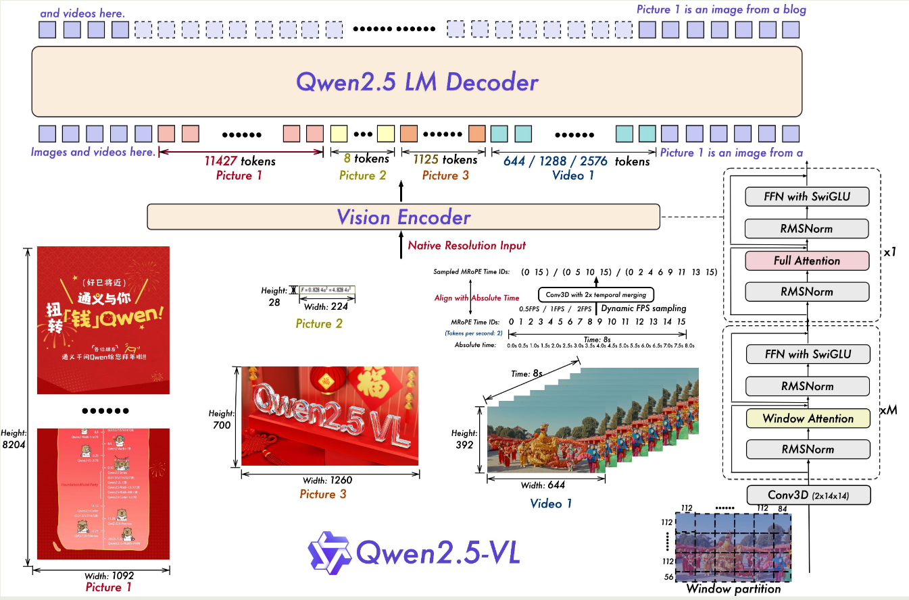
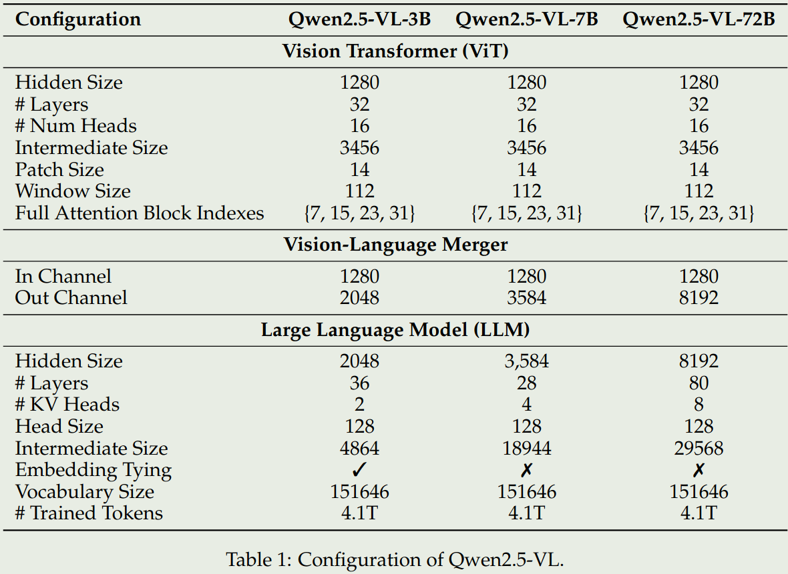
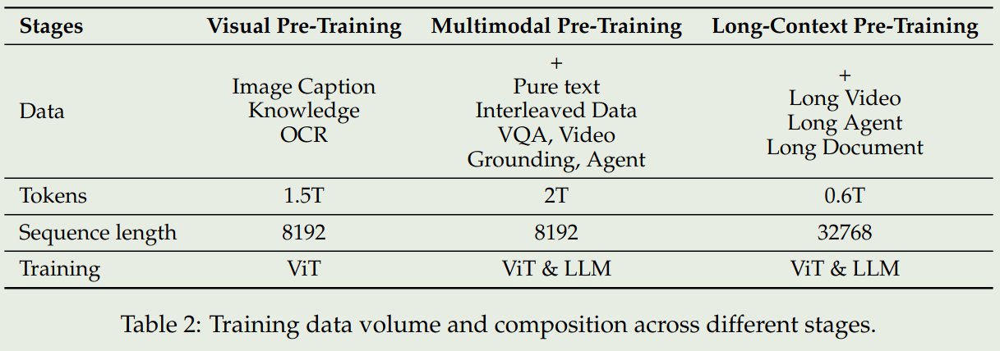
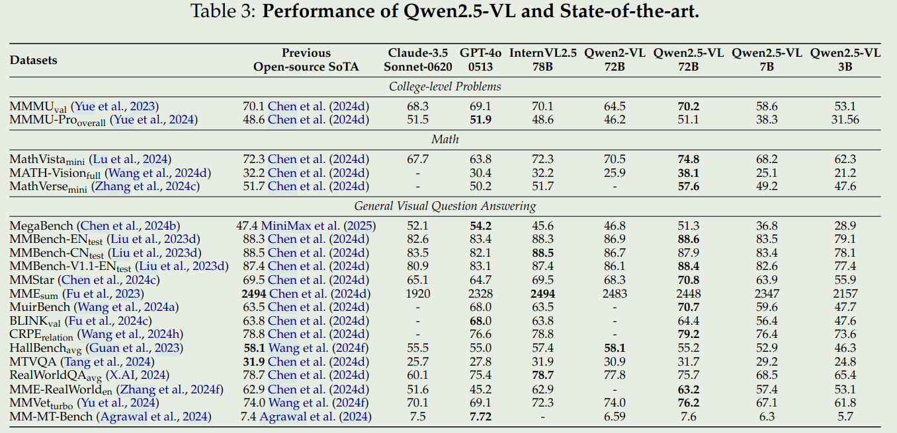
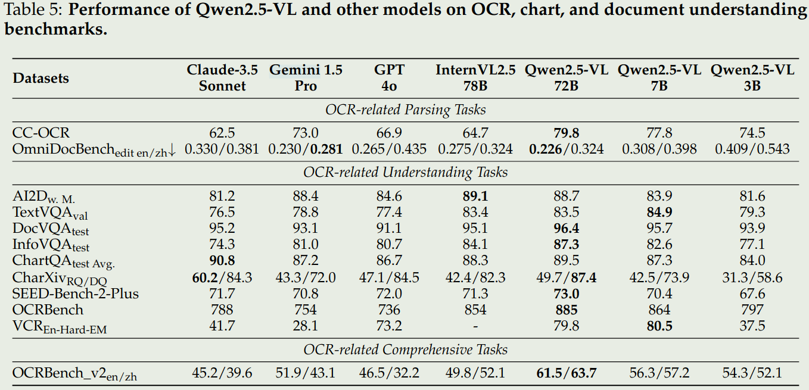
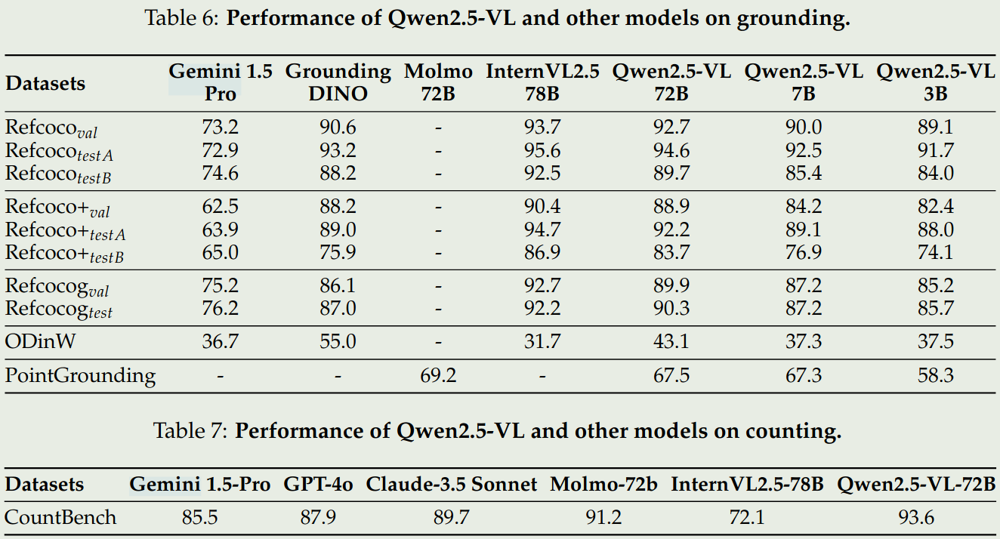
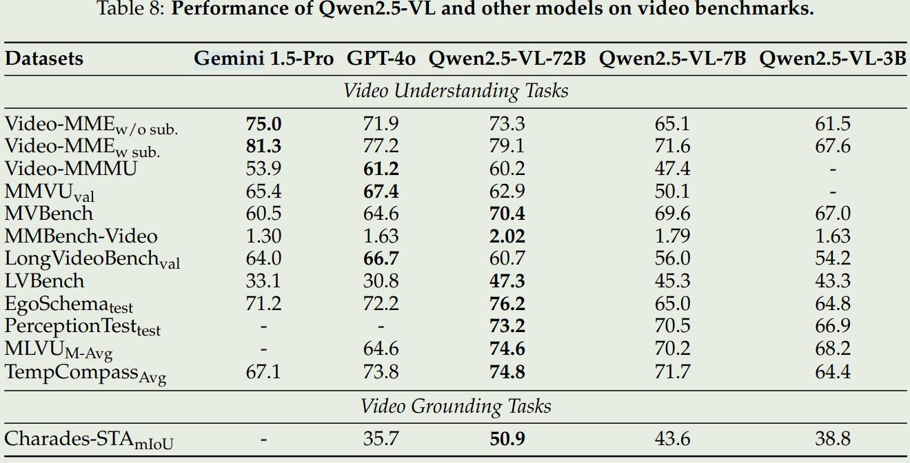
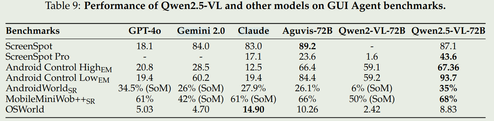

# Introduction

2025年2月20号Qwen团队发布了Qwen2.5 VL技术报告，Qwen2.5 VL包括3B，7B， 72B三个size。Qwen2.5-VL主要在架构，数据上进行了改进。通过评测，Qwen2.5-VL在多个benchmark上取得了SOTA。

Qwen2.5 VL认为已有模型的缺点为：

- 计算复杂度高
- 上下文理解能力有限
- 细粒度visual perception能力不足
- 在不同上下文长度下表现不一致

Qwen2.5 VL的贡献为：

1. 使用了一个从零开始训练的ViT作为vision encoder，并且在ViT中使用了window attention，来提高计算效率
2. 使用了dynamic FPS sampling，用于处理不同采样率的视频输入
3. 将MRoPE扩展到了temporal domain上，进一步提高了模型在与时间相关任务上的表现
4. 使用了更高质量的数据集，其中预训练阶段使用了4.1T的token

Qwen2.5 VL的主要亮点为：

- 优秀的document parsing能力
- 精确的object grounding能力
- 针对长视频的理解和细粒度grounding能力
- 针对UI的agent functionality

# 模型架构

## 总览

Qwen2.5 VL和Qwen2 VL的架构基本一致，包括Vision Encoder，Language Encoder，以及projector layer三个部分，其架构图如下：



- LLM： 使用Qwen2.5 LLM作为LLM，并且将1D-RoPE升级为了MRoPE
- Vision Encoder： 使用一个从零开始训练的ViT架构，patch_size为14，position embedding为2D-RoPE， attention为window attention和self-attention的混合，其中，只有四层使用的是self-attention.对于输入的图片，ViT会将图片resize到28的整数倍。
- Projector Layer： 使用的是一个两层的MLP

模型的参数配置如下图



## Vision Encoder

Vision encoder的主要改进点为：

1. 使用了window attention来提升计算效率，window attention的size为 $112\times 112$， 对应为 $8\times 8$ 个patch. 这样做的好处是可以不用对图片做scaling
2. 使用了2D RoPE来捕捉空间信息，使用3D RoPE来捕捉视频输入的时间信息
3. 与LLM的结构进行对齐，包括使用RMSNorm替换LayerNorm，使用SwiGLU替换ReLU

## 输入处理

对于图片输入，Qwen2.5 VL使用原始图片的空间信息来构建坐标，而不是将坐标normalize到[0, 1000]之间，这样让模型可以处理不同精度的图片输入。

对于视频输入，因为使用了3D RoPE，因此Qwen2.5 VL可以处理不同帧率的视频输入，这样就避免了不同帧率视频对模型视频理解带来的影响。这一点和Apollo里的想法是一样的。具体来说，Qwen2.5 VL首先将连续的两帧group到了一起，然后使用了temporal ID来将position和视频所对应的时间进行对齐。这里可以看Qwen2.5 VL的代码：

```
Temporal (Time): 3 patches, representing different segments of the video in time.
Height: 2 patches, dividing each frame vertically.
Width: 2 patches, dividing each frame horizontally.
We also have some important parameters:
fps (Frames Per Second): The video's frame rate, set to 1. This means one frame is processed each second.
tokens_per_second: This is a crucial parameter. It dictates how many "time-steps" or "temporal tokens" are conceptually packed into a one-second interval of the video. In this case, we have 25 tokens per second. So each second of the video will be represented with 25 separate time points. It essentially defines the temporal granularity.
temporal_patch_size: The number of frames that compose one temporal patch. Here, it's 2 frames.
interval: The step size for the temporal position IDs, calculated as tokens_per_second * temporal_patch_size / fps. In this case, 25 * 2 / 1 = 50. This means that each temporal patch will be have a difference of 50 in the temporal position IDs.
input_ids: [V V V V V V V V V V V V T T T T T], here V is for vision.
vision temporal position_ids: [0, 0, 0, 0, 50, 50, 50, 50, 100, 100, 100, 100]
vision height position_ids: [0, 0, 1, 1, 0, 0, 1, 1, 0, 0, 1, 1]
vision width position_ids: [0, 1, 0, 1, 0, 1, 0, 1, 0, 1, 0, 1]
text temporal position_ids: [101, 102, 103, 104, 105]
text height position_ids: [101, 102, 103, 104, 105]
text width position_ids: [101, 102, 103, 104, 105]
Here we calculate the text start position_ids as the max vision position_ids plus 1.
```

这里`fps`为1，表示每一帧对应一秒，`tokens_per_second`为25，表示每秒包含25个token，`temporal_patch_size`为2，表示每个temporal patch包含2个frame。因此一个patch里面，就包含了2frame, 对应50tokens. 然后前面提到连续两帧会被group到一起，因此每个temporal patch对应4个spatial patches. 其position_ids为：

```python
[(t, 0, 0), (t, 0, 1), (t, 1, 0), (t, 1, 1)]
```

# 训练

## 预训练

### 数据

预训练阶段使用了4.1T的token，包括image captions, interleaved image-text data, optical character recognition (OCR) data, visual knowledge (e.g., celebrity, landmark, flora, and fauna identification), multi-modal academic questions, localization data, document parsing data, video descriptions, video localization, and agent-based interaction data. 作者详细介绍了以下几种数据：

- Interleaved image-text data： 主要1. 提高模型的上下文学习能力；2. 保持模型的text-only能力；3.包含一些通用信息。数据清洗包括：1. 基于text-only quality过滤； 2. 基于image-text相关性过滤；3. 基于image-text互补程度过滤；4.基于information density balance过滤.
- Grounding data：作者使用了Grounding DINO, SAM等模型来生成一些grounding data.为了提升模型在open-vocabulary detection上的能力，作者将训练数据集扩展到了1万个object category上，作者还使用了一些point-based object grounding data来提升模型的能力
- Document Parsing data：作者基于text,image, music sheets和chemical formulas合成了一些HTML格式的数据，然后根据tag和bounding box来提升模型document parsing的能力
- OCR data：作者使用了开源，合成和in-house的数据集，数据集主要提到multi-lingual以及1M的chart-type数据
- Video data：作者通过pipeline构建了long video caption来提升模型长视频的理解能力
- Agent data：作者收集了一些mobile device和网页的screenshots,然后基于agent框架来合成控制轨迹

### 训练



如上图所示，Qwen2.5 VL的预训练阶段包括了三个阶段：

1. Visual Pretraining:这一阶段使用了image-caption, knowledge, OCR数据集，旨在提升ViT提取视觉特征的能力
2. multimodal pretraining:这一阶段在第一阶段的基础上增加了pure-text, interleaved data, VQA, Video grounding, agent data, 旨在提升模型处理复杂视觉信息的能力
3. long-context pretraining: 这一阶段，在第二阶段的基础上，增加了long video, long agent, long document data，旨在提升模型处理长上下文的能力

## 后训练

### 数据

SFT阶段使用大概2M的样本进行训练，其中纯文本和多模态数据占比为1:1，语言主要是中文和英文。

为了保证数据质量，作者提供了一个数据清洗的pipeline，包括：

1. domain-specific categorization: 作者基于Qwen2-VL-72B构建了Qwen2-VL-Instag，用于将QA pair分为8个大类别，30个小类别
2. Domain-tailed filtering:作者使用了rule-based和model-based方法来提升数据的质量
   - rule-based filtering: 重复性检测，格式检测等
   - model-based filtering: 使用基于Qwen2.5-VL训练的reward model来从多个维度评估QA pair的质量

为了进一步提升模型的推理能力，作者还是用了rejection sampling来refine 数据集。

### 训练

post-training阶段分为SFT和DPO两个小阶段，这个阶段都会冻结VIT. SFT阶段使用大多数的训练数据，而DPO阶段专注于image-text data和pure text data，以更好地进行对齐。具体做法就是基于Grounding truth，使用checkpoint来评估数据的质量，然后只保留答案正确的数据来训练。

# 评测

1. 通用VQA

2. 文档理解和OCR

3. 空间理解

4. 视频理解和Grounding

5. Agent


# Reference

- [Github](https://github.com/QwenLM/Qwen2.5-VL)
- [Paper](https://arxiv.org/abs/2502.13923)
