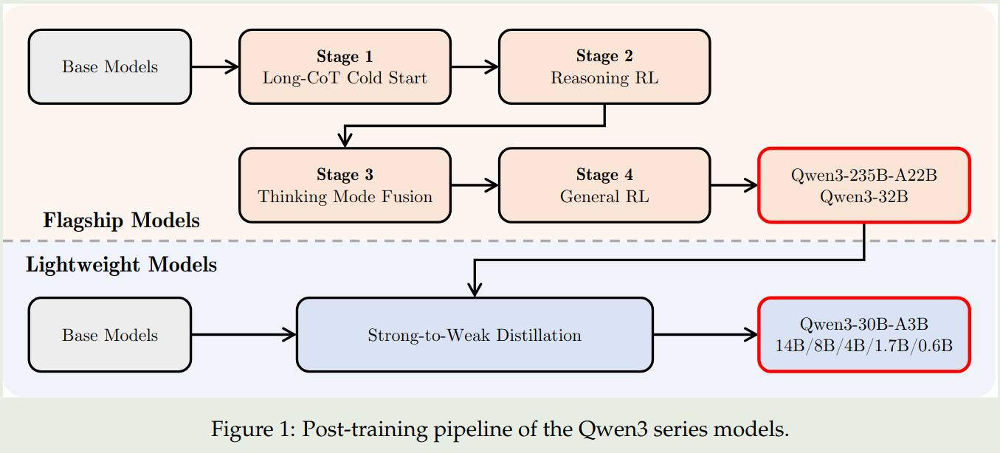
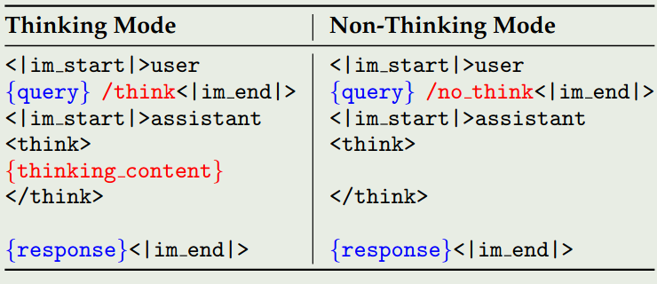
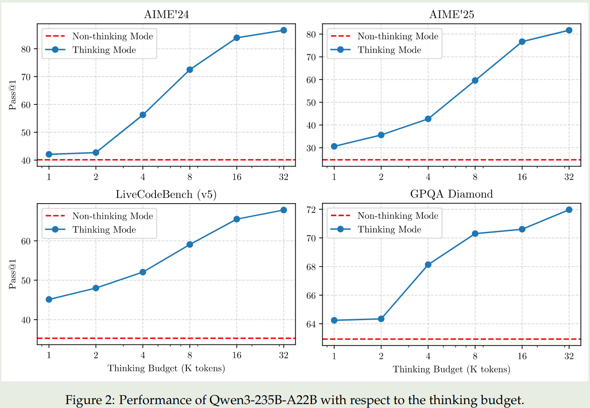
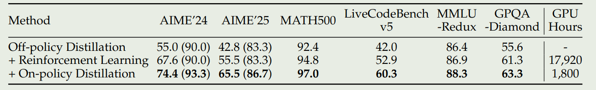
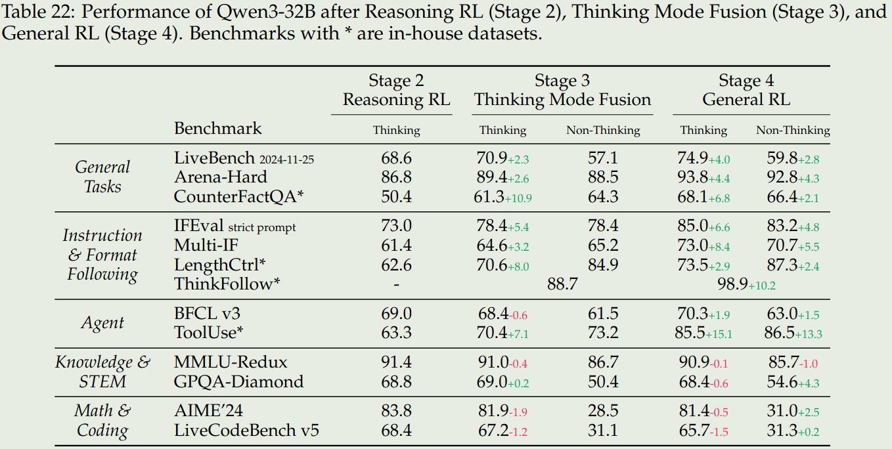

在Qwen3 blog发布之后，笔者已经简单进行了总结，见 [Qwen3 前瞻](https://maosong.website/p/qwen3%E5%89%8D%E7%9E%BB/)

本文将基于Qwen3技术报告，进一步了解其技术细节。

# 介绍

Qwen3包括6个dense模型和2个MoE模型，其旗舰模型是一个235B的MoE模型，激活参数为22B. Qwen3系列的主要亮点如下:

1. 快慢思考融合，模型原生支持在reasoning/non-reasoning模式之间切换
2. Reasoning budget, 用户可以指定思考需要的budget，来平衡latency和performance
3. Distillation, 使用蒸馏的方法训练小模型，大幅度提高模型的表现
4. 多语种支持，相比于Qwen2.5，Qwen3支持119中语言和方言

# 架构

Qwen3的dense模型的架构与Qwen2.5基本一致，包括使用GQA, SwiGLU, RoPE, RMSNorm和pre-normalization. Qwen3进一步移除了QKV-bias, 然后加入了QK-Norm来提高训练的稳定性。

Qwen3的MoE架构使用了128个专业，激活专家个数为8个。与Qwen2.5-MoE不同，Qwen3里没有使用shard experts。并且，Qwen3加入了global-batch load balancing loss,来提高expert的特化程度。

在tokenizer方面，Qwen系列的tokenizer一直都是一样的，这也是Qwen系列领先的一点。

模型的具体参数如下两张表所示。

**MoE架构**：上下文长度为128K，128个专家，每个token由8个专家负责处理

- Qwen3-235B-A22B, 总参数235B，激活参数22B，
- Qwen3-30B-A3B, 总参数30B，激活参数3B

| Models | Layers | Heads (Q / KV) | # Experts (Total / Activated) | Context Length |
|--------|--------|----------------|-------------------------------|----------------|
| Qwen3-30B-A3B | 48 | 32 / 4 | 128 / 8 | 128K |
| Qwen3-235B-A22B | 94 | 64 / 4 | 128 / 8 | 128K |

**dense架构**: Qwen3-32B, Qwen3-14B, Qwen3-8B, Qwen3-4B, Qwen3-1.7B, and Qwen3-0.6B

| Models | Layers | Heads (Q / KV) | Tie Embedding | Context Length |
|--------|--------|----------------|---------------|----------------|
| Qwen3-0.6B | 28 | 16 / 8 | Yes | 32K |
| Qwen3-1.7B | 28 | 16 / 8 | Yes | 32K |
| Qwen3-4B | 36 | 32 / 8 | Yes | 32K |
| Qwen3-8B | 36 | 32 / 8 | No | 128K |
| Qwen3-14B | 40 | 40 / 8 | No | 128K |
| Qwen3-32B | 64 | 64 / 8 | No | 128K |

# Pre-training

预训练数据一共包括36T token，覆盖了119种语言。哲学数据包括coding, STEM, reasoning, books, multilingual texts以及合成数据。

为了扩展训练数据，作者微调了Qwen2.5-VL来从PDF文档中提取文字，然后使用Qwen2.5来进行修正。最终收集到了几T的token。另外，作者还使用Qwen2.5, Qwen2.5-Math, Qwen2.5-Coder来合成不同格式的数据，包括教科书，QA，指令以及代码片段等。最后，作者加入了更多的多语种数据。

作者从educational value, fields, domains以及safety对数据进行了标注。在数据混合时，Qwen3在instance层面进行操作。

预训练阶段包括3个stage：

1. General Stage (S1): 这一阶段的目的是让模型掌握世界知识，使用了30T的token，模型上下文长度为4096
2. Reasoning Stage (S2):这一阶段的目的是提高模型的推理能力，使用了5T的高质量token，模型上下文长度为4096，数据包括STEM, coding, reasoning以及合成数据
3. Long Context Stage (S3):这一阶段的目的是提升模型的长上下文能力，使用了几百B的token，模型上下文长度为32768.训练时数据混合75%的长文档数据，25%的短文本数据。作者将RoPE的frequency从10000提升到了1,000,000. 作者还是用YARN以及Dual Chunk Attention来提高inference效率

对pre-training的base model进行评测之后，作者发现：

1. `Qwen3-235B-A22B-Base`超过了其他base模型的表现，包括`DeepSeek-V3 Base`, `Llama-4-Maverick Base`, `Qwen2.5-72B Base`
2. Qwen3-MoE模型与相同大小的Qwen3-Dense模型参数相比，其只需要1/5的参数就可以达到相同的表现
3. Qwen3-MoE模型与2倍参数量的Qwen2.5-MoE模型表现差不多
4. Qwen3-Dense模型与大一个量级的Qwen2.5-Dense模型表现差不多

# Post-training

Qwen3的post-training如下图所示：

对于旗舰模型(`Qwen3-235B-A22B`, `Qwen3-32B`)的训练，Qwen3使用了一个四阶段的训练pipeline。对于轻量化模型（其他模型）的训练，Qwen3使用了知识蒸馏。

## 旗舰模型

旗舰模型的训练包括四个阶段，前两个阶段用于提升模型的reasoning能力，后两个阶段用于将reasoning和non-reasoning能力结合起来。

### Stage 1 (Long CoT Cold Start)

这个阶段的目的是让模型掌握reasoning的基础。这个阶段使用了数学，代码，逻辑推理和通用的STEM相关问题。每个问题都有参考答案或者test-cases. 作者使用了Qwen2.5-72B来过滤数据，包括non-verifiable prompts以及太简单的prompt. 作者认为，这一阶段应该减少训练使用的样本和训练步数。

### Stage 2 (Reasoning RL)

这个阶段的目的是提升模型的reasoning能力。该阶段使用了3,995条过滤得到的样本，算法为GRPO. 作者发现提高batch size和每个query的rollouts可以提高模型的表现。作者通过调整模型的entropy来控制exploration和exploitation的平衡

### Stage 3 (Thinking Mode Fusion)

这一阶段的目的是将non-reasoning能力加入到之前的reasoning模型中。作者在第二阶段的model上进行了continual SFT，然后构建了一个chat template 用于融合两种模式。

reasoning数据来源于stage1的rejection sampling和stage 2的模型. non-reasoning数据来源于各种任务，如coding, math, multilingual等。为了保证模型的多语种能力，作者还加入了一些翻译相关的数据。

作者还构建了一个chat template, 用于统一数据格式。chat template 如下图所示

作者使用 `/think` 和 `/no_think` 来标记两种模式，对于non-reasoning mode, 其 `<think></think>` 会被置空。模型在默认情况下处于reasoning mode, 因此作者加入了一些不包含`/think`的reasoning 数据。

作者发现，通过这种Think mode fusion, 模型可以学会在reasoning mode和non-reasoning mode下进行回答，因此，模型也可以基于中间结果来给出最终的答案。 当超出budget之后，作者使用以下Instruction

`Considering the limit time by the user. I have to give the solution based on the thinking directly now. \n</think>.\n\n`

来让模型直接终止思考二给出最终的答案。

### Stage 4 (General RL)

这个阶段的目的是提升模型在不同场景下的能力。作者构建了一个reward system来覆盖20多种不同的任务。这些任务包括：instruction following, format following, preference alignment, agent ability以及abilities for specialized scenarios.

作者构建了三种不同的rewards:

1. Rule-based rewards: 覆盖的任务包括instruction following和format following
2. Model-based rewards: 作者使用Qwen2.5-72B来判别答案的正确性
3. Model-based Reward without reference answer: 作者训练一个reward model来给模型的回答进行打分

## 轻量化模型

对于轻量化的模型，作者发现直接通过蒸馏可以有效提高学生模型的表现，并且训练效率也更高。蒸馏训练包括两个阶段：

1. Off-policy Distillation: 这个阶段的目的是让模型拥有基本的reasoning能力并且可以在不同的模式中进行切换。作者使用了教师模型的reasoning输出和non-reasoning输出来蒸馏学生模型
2. On-policy Distillation:在这个阶段，学生模型生成回答，然后基于教师模型的输出，使用KL-divergence来更新学生模型的参数

## 实验探究

**Thinking budget**. 作者发现当我们提高Thinking budget之后，模型的表现是可以持续提升的。结果如下图

**Efficiency of distillation**. 作者发现使用distillation可以大幅度提高模型的表现和训练效率。下面是结果如下图所示

**Effects of Thinking mode fusion and RL** 作者进一步探究了三个stage对模型表现的影响，为此，作者构建了in-house benchmarks来评估模型的表现，这些benchmarks包括：

1. CounterFactrQA. 问题是不符合事实的，用于评估模型的幻觉
2. LengthCtrl. 有长度要求的写作任务，评估生成内容长度和给定长度之间的差别
3. ThinkFollow. 多轮对话，每轮对话随机插入 `/think`和`/no_think` flag，评估模型是否能在两种模式之间切换
4. Tooluse. 评估模型的工具调用能力

结果如下

结论如下：

1. Stage3 可以提高模型在两种reasoning mode切换的能力，并且stage3还可以提高模型的通用以及instruction following能力
2. Stage4 进一步提高模型在两种模式下的通用，instruction following和agent能力
3. Stage3和stage4并没有显著提高模型在knowledge, STEM, math和coding相关任务上的表现。甚至在一些竞赛如AIME24上模型的表现还有所下降，作者认为这是由于我们提升了模型的通用能力而导致其特化能力下降导致的，作者认为作为一个通用模型，这是可以接受的。

# 结论

在本文中，作者提出了Qwen3系列大语言模型，包括6个Dense模型和2个MoE模型。Qwen3模型标志了一个新的SOTA，其特点主要是快慢思考结合，thinking budget，以及多语种。

作者认为后续工作有以下几点：

1. 使用更高质量的数据来进行预训练
2. 优化模型架构和训练方式，提升模型的上下文
3. 提高针对RL的计算资源，来进一步提高模型的agent能力

# 参考文献

- [arxiv](https://arxiv.org/abs/2309.16609)
- [Github](https://github.com/QwenLM/Qwen3)
