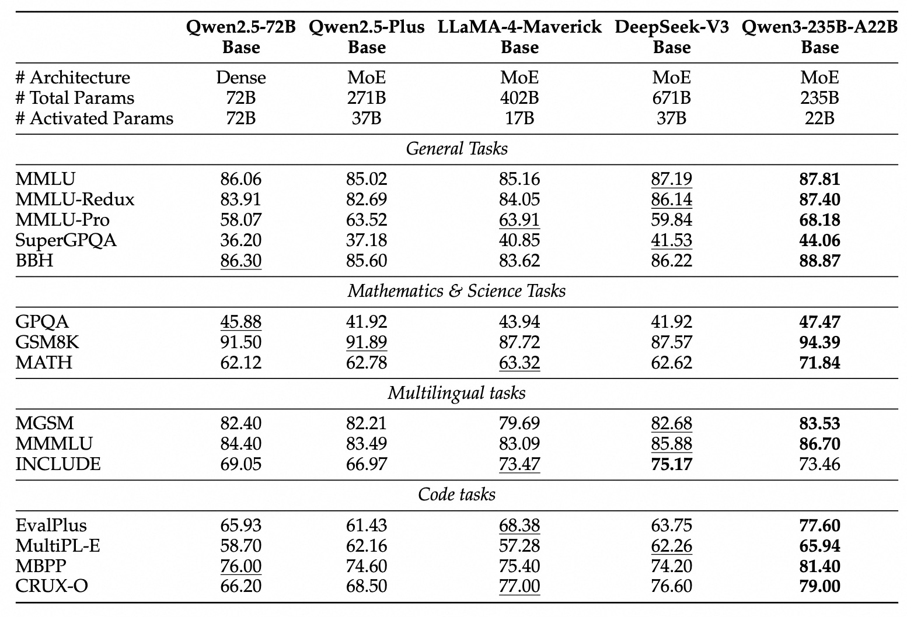

# 介绍

Qwen3发布，包含两种架构的模型，每种架构均包含对应的base model和post-trained model.

**MoE架构**：上下文长度为128K，128个专家，每个token由8个专家负责处理

- Qwen3-235B-A22B, 总参数235B，激活参数22B，
- Qwen3-30B-A3B, 总参数30B，激活参数3B

| Models | Layers | Heads (Q / KV) | # Experts (Total / Activated) | Context Length |
|--------|--------|----------------|-------------------------------|----------------|
| Qwen3-30B-A3B | 48 | 32 / 4 | 128 / 8 | 128K |
| Qwen3-235B-A22B | 94 | 64 / 4 | 128 / 8 | 128K |

**dense架构**: Qwen3-32B, Qwen3-14B, Qwen3-8B, Qwen3-4B, Qwen3-1.7B, and Qwen3-0.6B

| Models | Layers | Heads (Q / KV) | Tie Embedding | Context Length |
|--------|--------|----------------|---------------|----------------|
| Qwen3-0.6B | 28 | 16 / 8 | Yes | 32K |
| Qwen3-1.7B | 28 | 16 / 8 | Yes | 32K |
| Qwen3-4B | 36 | 32 / 8 | Yes | 32K |
| Qwen3-8B | 36 | 32 / 8 | No | 128K |
| Qwen3-14B | 40 | 40 / 8 | No | 128K |
| Qwen3-32B | 64 | 64 / 8 | No | 128K |

# 亮点

1. Hybrid Thinking modes
qwen3支持两种思考模式： thinking mode 和 non-thinking mode，前者用于解决复杂的问题，后者用于解决简单的问题
2. multilingual support
qwen3支持119中语言和方言
3. Improved agentic capabilities
提升了qwen3的coding和agentic能力，并支持MCP

# 训练

## Pre-training

Qwen3使用了36T token进行训练 （与之相比，Qwen2.5使用方的token数量为18T），数据来源于互联网和PDF，作者使用Qwen2.5-VL来提取内容，然后使用Qwen2.5来提升内容质量。作者还基于Qwen2.5-Math和Qwen2.5-Coder来合成数学以及代码数据

训练包含三个stage：

1. 上下文长度为4K tokens，训练数据为30T tokens, 目标是让模型掌握初步的语言能力和知识
2. 上下文长度为4K tokens，训练数据为5T tokens,这部分数据主要是knowledge intensive的数据，比如STEM, coding和reasoning等
3. 上下文长度扩展到32K tokens，训练数据主要是高质量长上下文的数据

## Post-training

Post-training包含四个阶段，如下图所示

- Stage 1, Long CoT code start: 作者基于math, coding, logical reasoning, STEM等domain的Long CoT数据来微调模型，让模型拥有初步的推理能力，这和Kimi-VL是类似的
- Stage 2, reasoning-based RL: 作者使用rule-based rewards来提供奖励，然后使用RL来训练模型，经一部提高模型的exploration和exploitation能力
- Stage 3, thinking mode fusion: 作者混合了一部分instruction-following和Long CoT数据来提升模型的non-thinking能力，这样可以让模型在两种思考模式之间切换
- Stage 4,general RL： 作者使用RL在20多个general-domain任务上进一步提高模型的通用能力，包括instruction following, format following以及agent capability等

# Future work

作者希望在未来能够在模型架构和训练方式上进行提升，包括：scaling data, increasing model size, extending context length, broadening modalities, advancing RL with environmental feedback for long-horizon reasoning.

# 结论

与Gemini2.5 pro，Kimi-VL等reaosning model不同，qwen3可以在快思考和慢思考之间进行转换。感觉未来有两个趋势，一个是如何在快思考和慢思考之间进行切换，切换的逻辑是什么？第二个就是qwen3以及qwen2.5-vl都在强调的agent能力，也就是我们不仅仅是在做一个LLM，而是逐步延伸到了agent这个层面。

# 参考文献

- [blog](https://qwenlm.github.io/blog/qwen3/)
