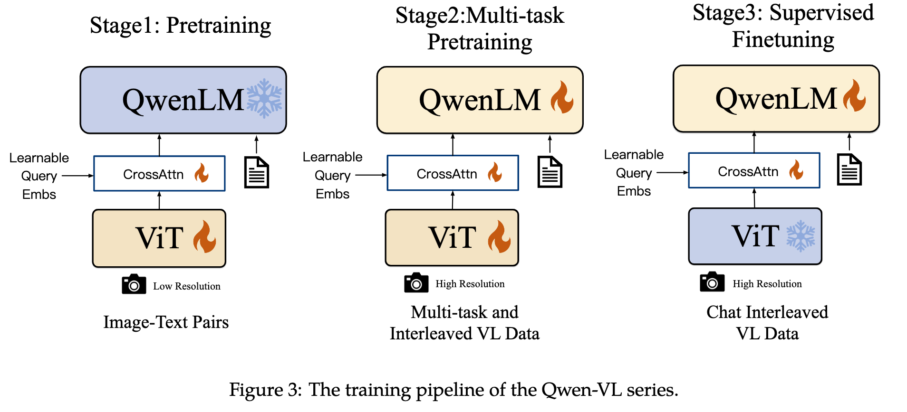
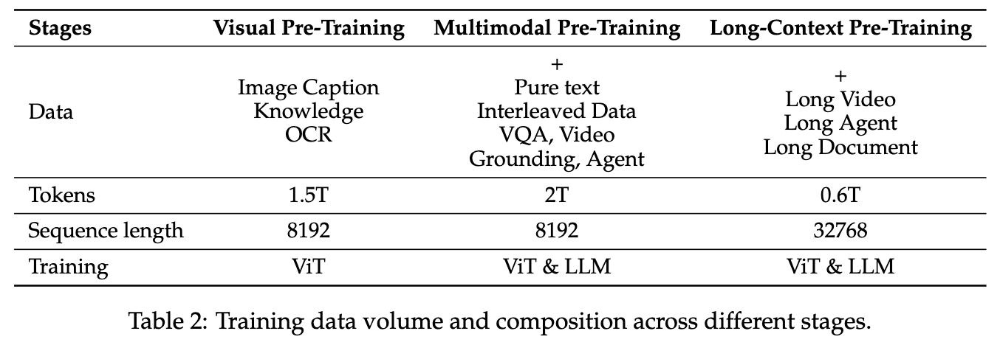

# Timeline

| 时间    | 模型系列   | Feature                                        |
|---------|------------|------------------------------------------------|
| 2023.08 | Qwen-VL    | Vision-centric understanding                   |
|         |            | Multi-lingual                                  |
|         |            | Multi-image                                    |
|         |            | Fine-grained visual understanding              |
| 2024.09 | Qwen2-VL   | Image understanding                            |
|         |            | Video understanding (20min)                    |
|         |            | Agent capability                               |
|         |            | Multilingual support                           |
| 2025.02 | Qwen2.5-VL | Document parsing                               |
|         |            | Object grounding                               |
|         |            | Long video understadning and grouding (1 hour) |
|         |            | Agent functionality                            |

# Models

|     | name           | size | Vision    | Adapter                | LLM               |
|-----|----------------|------|-----------|------------------------|-------------------|
| 1.0 | Qwen-VL        | 9.6B | ViT(1.9B) | Cross-attention(0.08B) | Qwen-LLM(7B)      |
| 2.0 | Qwen2-VL-2B    | 2B   | ViT(675M) | MLP(0.0341B)           | Qwen2-LLM(1.5B)   |
|     | Qwen2-VL-7B    | 7B   |           | MLP(0.0446B)           | Qwen2-LLM(7.6B)   |
|     | Qwen2-VL-72B   | 72B  |           | MLP(0.0682B)           | Qwen2-LLM(72B)    |
| 2.5 | Qwen2.5-VL-3B  | 3B   | ViT(675M) | MLP(0.1817B)           | Qwen2.5-LLM(3B)   |
|     | Qwen2.5-VL-7B  | 7B   |           | MLP(0.3179B)           | Qwen2.5-LLM(7.6B) |
|     | Qwe2.5n-VL-72B | 72B  |           | MLP(0.7267B)           | Qwen2.5-LLM(72B)  |

Remark

- Qwen2-VL的MLP使用的是LayerNorm
- Qwen2.5-VL的MLP使用的是RMSNorm
- 出了Qwen-VL之外，所有模型均有对应的Instruct版本，这里为了方便没有列出。Qwen-VL对应的是Qwen-VL-chat。

# Data & training

| Model series | stage                     | data        | Vision | Adapter | LLM |
|--------------|---------------------------|-------------|--------|---------|-----|
| Qwen-VL      | pretraining               | 1.4B        | ✅      | ✅       |     |
|              | Multi-task pretraining    | 96.8M       | ✅      | ✅       | ✅   |
|              | SFT                       | 350K        |        | ✅       | ✅   |
| Qwen2-VL     | pretraining               | 600b tokens | ✅？    | ✅？     |     |
|              | Multi-task pretraining    | 800b tokens | ✅？    | ✅？     | ✅？ |
|              | SFT                       |             |        | ✅？     | ✅？ |
| Qwen2.5-VL   | Visual Pre-Training       | 1.5T token  | ✅？    | ✅？     |     |
|              | Multimodal Pre-Training   | 2T token    | ✅      | ✅       | ✅   |
|              | Long-Context Pre-Training | 0.6T token  | ✅？    | ✅？     | ✅？ |
|              | SFT                       | 2M samples  |        | ✅       | ✅   |
|              | DPO                       |             |        | ✅       | ✅   |

Remark

1. Qwen2-VL按照技术报告的说法是follow了Qwen-VL的训练方式，因此这里也使用了同样的表示
2. 带问号的地方代表不确定，为个人猜测。请谨慎参考。
3. 难以确定的原因是Qwen-VL系列将projection layer和ViT作为一个模块，因此比较难区分是否训练了projection layer

技术报告的训练框架图

References

- [Qwen-VL](https://arxiv.org/pdf/2308.12966)
- [Qwen2-VL](https://arxiv.org/pdf/2409.12191)
- [Qwen2.5-VL](https://arxiv.org/pdf/2502.13923)
