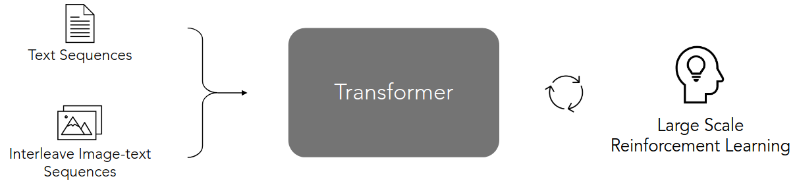
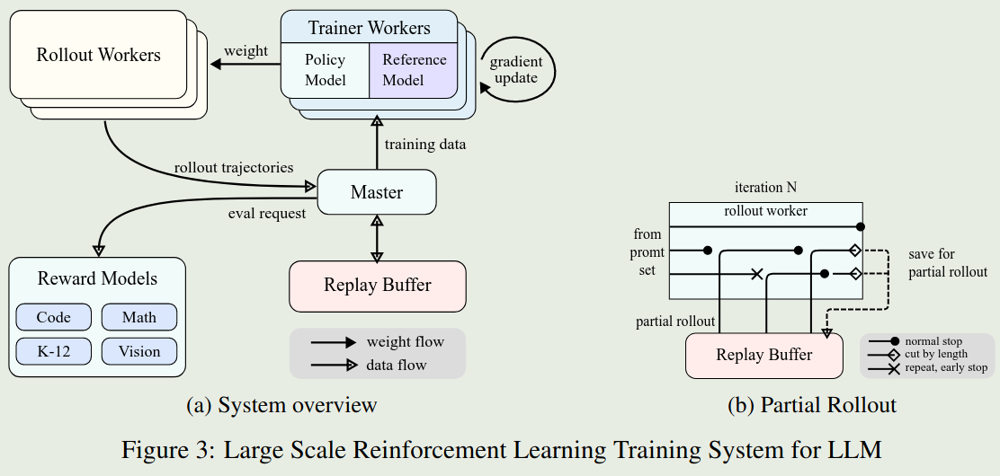
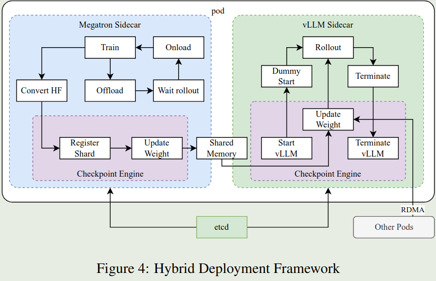
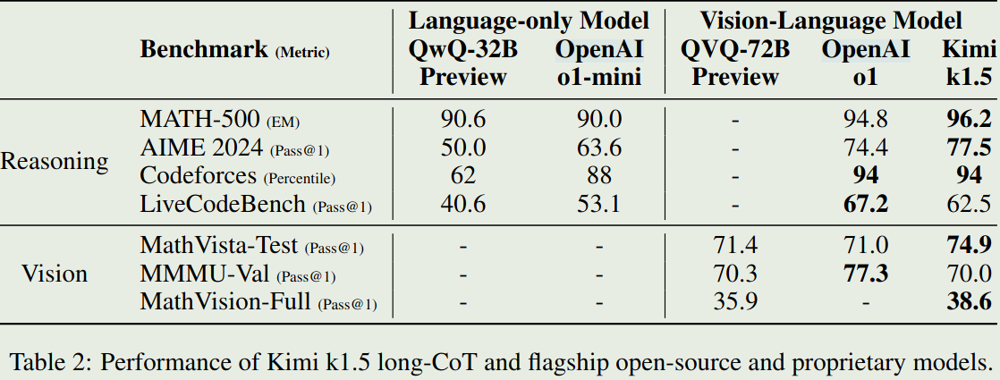
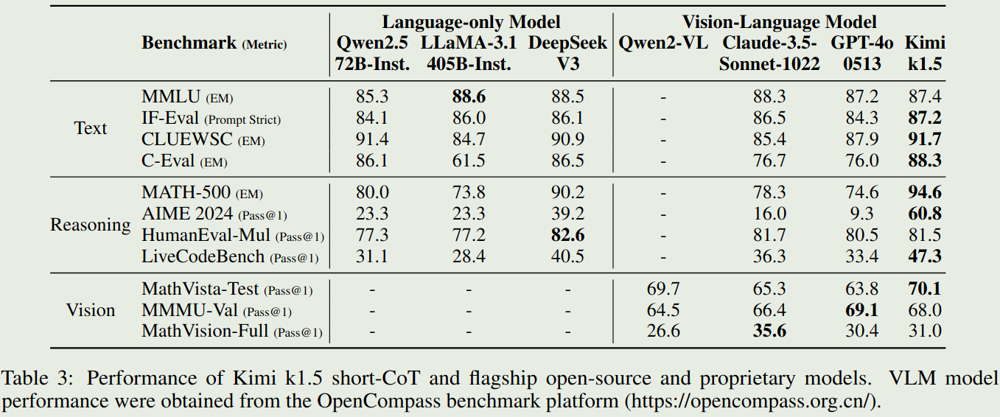
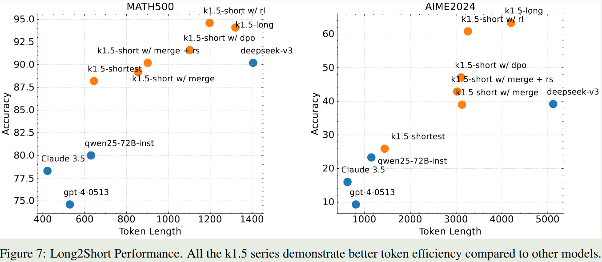

# 介绍

论文提出了Kimi k1.5， 一个基于强化学习训练的多模态推理模型。作者介绍了Kimi k1.5的训练方法，以及infra上的优化。作者的主要贡献如下：

1. 作者发现，模型的上下文长度可以有效提升LLM的推理能力。
2. 作者提出了基于online mirror descent的强化学习训练方法。
3. 作者发现可以通过long context scaling和policy optimization来提升模型的推理能力。
4. 作者提出了long2short的推理方法，可以有效提升short CoT模型的推理能力。

# 模型架构

论文中包括两个模型，一个是k1.5 base model， 其是一个多模态大模型。另一个是Kimi-1.5 reasoning model（简称为k1.5），k1.5是基于kimi-1.5 base model， 通过强化学习训练得到的推理模型。

## Kimi-1.5 base model

k1.5 base model是一个基于transformer的多模态大模型，论文没有给出详细的模型结构，只有如下的示意图

k1.5 base model的训练包括三个阶段：

1. Vision-language pretraining stage: 这一阶段的目的是让模型拥有语言和视觉的表征能力。训练时，模型先在纯文本的数据上进行训练，然后提高加入图文交错的数据进行训练，直到训练数据中图文交错的数据占比达到30%。模型的更新方式为先冻结LLM更新visual tower, 然后解冻LLM更新所有参数。
2. Vision-language cooldown stage: 这一阶段的目的是让模型保持多模态理解能力。作者发现，使用合成数据可以提高模型在这一阶段的表现。因此，作者使用闭源大语言模型，基于math, knowledge和code domain的pretraining data来合成了一些QA pair数据对，然后讲这些QA pair数据对加入到训练数据中。
3. Long-context activation stage: 这一阶段的目的是让模型在长上下文的数据上进行训练，以提升模型在长上下文上的理解能力。这一阶段包含了40%的full attention data以及60%的partial attention data。其中，full attention data是基于真实数据和合成的QA以及summary数据得到的，partial attention data是在cooldown data找那个通过均匀采样得到的。这一阶段，模型的上下文长度从4096逐步增加到131072。

## Kimi k1.5

Kimi k1.5是基于k1.5 base model， 通过进一步训练得到的推理模型。k1.5的训练包括四个阶段：

1. pretraining：这一步就是k1.5 base model的训练， 包括三个小阶段。前面已经介绍过了。
2. vanilla SFT：这一步的目的是使得k1.5 base model具有指令跟随能力。对于non-reasoning任务，作者先使用人类标注产生一个seed dataset，然后基于seed dataset训练一个seed model，最后根据收集的prompt来使用seed model来生成回答。对于reasoning任务，作者使用了rejection sampling来扩展SFT数据集
3. long-CoT SFT： 这一步的目的是让模型能够像人类一样进行推理，能够掌握最基本的推理策略，即：planning，evaluation，reflection和exploration。从而为RL训练提供一个良好的初始化。
4. RL：这一步就是通过RL来提高模型的推理能力。我们在下一节中进行详细的介绍。

# RL

## 问题定义

给定一个训练数据集 $\mathcal{D} = \{(x_i, y_i^*)\}_{i=1}^n$， 其中$x_i$是问题，$y_i^*$是ground truth。我们希望找到一个模型$\pi_{\theta}$，来解决这个问题。通常问题比较难，因此我们使用chain of thought（CoT）的方法来解决这个问题。具体做法就是让模型输出中间步骤 $z=(z_1, z_2, ..., z_m)$， 来连接问题 $x_i$ 和答案 $y$。其中，$z_j$是模型在第$j$步的推理结果，即 $z_t\sim\pi_{\theta}(x_i, z_{<t})$, $y\sim \pi_{\theta}(x_i, z)$。

通常，我们还会使用一个reward model $r_{\phi}$，来评估模型输出的答案的质量。一个常用的reward model是基于答案的正确性来评估的，即 $r_{\phi}(x_i, y, y^*) = \mathbb{I}[y=y_i^*]$。这样，我们要求解的问题就变成了最大化中间步骤和最终答案的reward，即

$$
\max_{\theta} \mathbb{E}_{(x, y^*)\sim\mathcal{D},(y,z,)\sim\pi_{\theta}}  r_{\phi}(x, y, y^*)
$$

## Policy Optimization

作者使用了online policy mirror descent来解决上面提到的优化问题。在每个iteration中，存在一个reference model $\pi_{\theta_r}$， 以及一个当前要更新的模型 $\pi_{\theta}$。online policy mirror descent要解决的优化问题为：

$$
\min_{\theta} \mathbb{E}_{(x, y^*)\sim\mathcal{D}}  \left[\mathbb{E}_{(y,z,)\sim\pi_{\theta}}\left[r_{\phi}(x, y, y^*) - \beta \mathcal{D}_{KL}(\pi_{\theta}(y,z\mid x)\Vert \pi_{\theta_r}(y,z\mid x))\right]\right]
$$

其中，$\beta$是超参数，用于平衡reward和KL散度 $\mathcal{D}_{KL}(\cdot)$.

上述问题有一个闭式解，即：

$$
\pi^*(y,z\mid x)=\pi_{\theta_r}(y,z\mid x)\exp\left(\frac{r_{\phi}(x, y, y^*)}{\beta}\right)/Z(x;\beta)
$$

其中，

$$
Z(x;\beta):=\sum_{y,z}\pi_{\theta_r}(y,z\mid x)\exp\left(\frac{r_{\phi}(x, y, y^*)}{\beta}\right)
$$

是归一化因子。在闭式解的表达式中，我们对两边取对数，得到：

$$
r_{\phi}(x, y, y^*) - \beta \log Z - \beta \log\frac{\pi^*(y,z\mid x)}{\pi_{\theta_r}(y,z\mid x)}=0
$$

这是最优策略满足的等式。作者这里使用了L2 loss来优化当前策略$\pi_{\theta}$，即：

$$
\min_{\theta} \mathbb{E}_{(x, y^*)\sim\mathcal{D}}  \left[\mathbb{E}_{(y,z,)\sim\pi_{\theta_r}}\left[r_{\phi}(x, y, y^*) - \beta \log Z - \beta \log\frac{\pi_{\theta}(y,z\mid x)}{\pi_{\theta_r}(y,z\mid x)}\right]^2\right]
$$
这里需要注意的一点是response $(y,z)$是基于reference model $\pi_{\theta_r}$生成的，而不再是基于当前策略$\pi_{\theta}$生成的。这是Kimi-1.5的RL训练和传统RL训练的一个不同点。这也是为什么k1.5说他是off-policy的原因。

接下来，我们就可以对上面的目标函数求梯度，我们将里层的函数展开为$(a-b-c)^2=(a-b)^2-2(a-b)c+c^2$的形式，然后对$\theta$求梯度，得到：

$$
 \mathbb{E}_{(x, y^*)\sim\mathcal{D}}  \left[\mathbb{E}_{(y,z,)\sim\pi_{\theta_r}}\left[\nabla_{\theta}\log \pi_{\theta}(y,z\mid x)(r_{\phi}(x, y, y^*) - \beta \log Z) - \frac{\beta}{2} \nabla_{\theta}\left(\log\frac{\pi_{\theta}(y,z\mid x)}{\pi_{\theta_r}(y,z\mid x)}\right)^2\right]\right]
$$

如果我们对每个问题$x$,采样$k$个response $(y,z)$，那么我们可以近似上式中内部的期望，得到：

$$
\frac{1}{k}\sum_{i=1}^k\left[\nabla_{\theta}\log \pi_{\theta}(y_i,z_i\mid x)(r_{\phi}(x, y_i, y^*) - \bar{r}) - \frac{\beta}{2} \nabla_{\theta}\left(\log\frac{\pi_{\theta}(y_i,z_i\mid x)}{\pi_{\theta_r}(y_i,z_i\mid x)}\right)^2\right]
$$
这里，$\bar{r}$是$\beta \log Z$的估计值。作者提供了两种估计方法：

1. 基于采样的 $(y_i,z_i)\sim \pi_{\theta_r}$对$\beta \log Z$进行估计：

$$
\bar{r}=\beta\log\frac{1}{k}\sum_{j=1}^k\exp\left(\frac{r_{\phi}(x, y_j, y^*)}{\beta}\right)
$$

2. 直接使用samples rewards的平均值来近似：

$$
\bar{r}=\frac{1}{k}\sum_{i=1}^k r_{\phi}(x, y_i, y^*)
$$

作者提到，第二种方法效果很好并且计算效率更高，因此作者在实验中使用了第二种方法。

训练时，作者每次从数据集中采样一个batch的样本，然后使用上述的梯度更新模型。模型参数更新完之后，作者将新的模型作为reference model，然后重复上述过程。

> Remark
> 作者还探究了为什么不使用value network。作者认为，在强化学习中，value network通常用于评估当前状态的价值，但是在reasoning model中，训练的目的是让模型能够充分探索，以提高模型在不同任务中的泛化性。因此，作者认为使用value network可能会限制模型的探索能力。

## Training Strategy

作者提出了两个提高采样效率的方法：

1. Curriculum Sampling. 这种采样方式会将问题按照难度进行排序，然后按照难度从易到难进行采样。以逐步提高模型的推理能力。
2. Prioritized Sampling.作者还采用了prioritized sampling来提高采样效率。也就是说，对于回答错误的问题，模型会进行更多的采样。

## Infra

### Training System

为了高效地进行RL训练，作者构建了一个iterative synchronous RL训练框架。框架如上图所示。框架的创新之处在于**Partial Rollout**，该方法可以更高效的处理复杂的推理轨迹。框架包含了以下几部分：

1. rollout worker: 该部分负责生成推理轨迹。然后将生成的推理轨迹加入到replay buffer中。
2. master: 管理data flow和replay buffer和train worker之间的通信。
3. train worker: 根据获取的rollout轨迹更新模型。
4. code execution service: 在代码相关任务中，该部分负责执行代码，并返回执行结果。

**Partial Rollout**：Partial Rollout的目的是为了整体的训练效率。其做法就是给定一个固定的outpu token budget，然后限制推理轨迹的长度。当长度超过token限制时，没有完成的部分就会被存入到replay buffer中，以供后续的训练使用。

### Deployment Framework

根据前面的介绍，我们知道k1.5每个iteration的训练包括两步：

1. inference phase: 基于Reference model进行采样，生成推理轨迹。
2. training phase: 基于采样得到的推理轨迹，更新模型。

如果我们直接使用Megatron和vLLM来实现上述的训练和推理，那么会存在以下问题：

1. Megatron和vLLM的并行策略可能并不一致，因此很难进行参数共享
2. 在训练过程中，vLLM可能会保留一些GPU，这就导致了训练和推理的资源分配不均。
3. 推理和训练的资源需求可能并不一致，无法动态调控显卡资源

因此，作者构建了一个hybrid deployment framework来解决上述问题，其框架如下图所示。

该框架的主要优势在于使用Kubernetes Sidecar containers来在一个pod中共享所有的GPU资源。这样就避免了资源分配不均的问题。

# 数据

## 数据处理

1. RL prompt set. 作者认为prompt的quality和diversity对RL训练至关重要。因此作者基于diverse coverage, balanced difficuty以及accurate evaluation来构建了一个RL prompt set。对于多样性，作者确保数据集覆盖多个domain。对于平衡难度，作者通过多次采样，根据通过率来给每个样本的难易程度打分。对于准确性，作者筛掉了多选题，正确题和证明题，确保模型能够生成正确的推理步骤。最后，作者还让模型进行猜测，如果模型猜测的正确率比较高，那么就认为该样本是easy-to-hack的，就会筛掉。
2. Test Case Generation for Coding. 作者使用[CYaRon](https://github.com/luogu-dev/cyaron)来生成coding任务的测试用例。通过与Kimi k1.5结合，作者构建了一个包含323个测试用例的训练集。
3. Reward modeling for Math. 作者使用了两种方法来提高reward model的准确性。第一个是classic RM，作者基于InstructGPT，构造了大约800K的数据训练了一个value-head based RM。模型会基于问题，参考答案和模型生成的答案来判断模型生成的答案是否正确。第二个是Chain of Thought RM，作者基于收集的800k CoT数据对kimi进行了finetune，然后对模型生成的推理步骤进行打分。最终发现，Chain of Thought RM的效果更好。因此，作者在RL训练中使用了Chain of Thought RM。
4. Vision RL Data。 作者从三个方面构建了vision RL数据集：real-world data, synthetic visual reasoning data以及text-rendered data.

## 数据集

1. pretraining：其中，纯文本数据包括Engligh, Chinese, Code, math reasoning以及Knowledge这5个领域。多模态数据包括captioning, image-text interleaving, OCR, Knowledge以及QA数据集等。附录B介绍了数据集的来源和处理过程。
2. SFT： vanilla SFT数据集包含1M的纯文本数据，其中包含500K的general QA数据，200K的coding数据，200K的数学和科学数据，5K的创作写作数据以及20K的长上下文任务（总结，QA，翻译和写作等）。作者还构建了1M的图文数据，包括chart理解，OCR，grounding，visual coding, visual reasoning以及visual aided math/science problems等
3. long-CoT SFT：该阶段的数据基于refined RL prompt set，使用了prompt engineering来构建了一个少量但高质量的long-CoT数据集。用于将reasoning能力内化到模型中。

# Long2short

为了降低推理成本，作者提出了long2short的推理方法。该方法通过将长上下文推理转化为短上下文推理，让模型能够更加高效的完成推理。作者尝试了几种方法来实现long2short：

1. Model merging:将long-CoT模型和short-CoT模型进行合并，然后进行推理。这里采用的办法是对两个模型的权重取平均。
2. shortest rejection sampling：通过对同一个问题进行多次采样（论文中每个问题采样8次），然后选择最短的，正确的推理步骤作为最终答案。
3. DPO：通过对同一个问题进行多次采样，选择最短的正确的回答作为正样本，最长的回答作为负样本，然后使用DPO进行训练。
4. Long2short RL：作者在RL阶段，选择一个在performance和token efficiency之间达到平衡的模型作为 base model，然后加入了一个long2short RL训练阶段。该阶段，作者加入了length penalty以及降低了maximum rollout length来鼓励模型生成更短的推理步骤。

## Length penalty

Length penalty的目的是降低模型的overthinking和训练成本。作者加入了一个length reward，对于问题$x$和采样的回答$(y_i,z_i)$，回答$(y_i,z_i)$的length定义为 $len(x_i)=\text{length}([z_i, y_i])$ length reward定义为：

$$
r_{\text{length}}(x, (y_i,z_i))=\begin{cases}
    \lambda, & \text{if } r(x, y_i, y^*) = 1 \\
    \min(0,\lambda), & \text{if } r(x, y_i, y^*) = 0 \\
\end{cases}
$$
其中

$$
\lambda = 0.5 - \frac{len(x_i)-\min_{j}len(x_j)}{\max_{j}len(x_j)-\min_{j}len(x_j)}
$$

也就是说，当回答正确时，我们鼓励模型生成更长的推理步骤。反之，我们鼓励模型生成更短的推理步骤。

# 实验

## 实验结果

1. K1.5在long-CoT任务上的表现

2. K1.5在Short-CoT任务上的表现

3. Long Context Scaling
作者在实验中还探究了上下文长度对模型推理能力的影响。作者针对几个模型进行了实验，结果在图5和图6里面。结果发现，随着上下文长度的增加，模型的推理能力会逐渐提升。

4. Long2short

## 消融实验

1. Scaling of model size and context length. 作者探究了模型大小和上下文长度对模型推理能力的影响，结果在图8里面。结果发现
   1. 小模型可以通过Long CoT来达到大模型的效果
   2. 大模型具有更高的token效率
   3. 理想情况下，使用具有更长上下文的大模型，可以同时达到更高的推理能力和更高的token效率，否则，使用上下文长度更长的小模型
2. Effects of using negative gradients. 作者探究了使用负梯度对模型推理能力的影响。作者与ReST方法进行了对比，结果在图10里面。结果发现，ReST回到只模型产生更长的推理步骤。作者认为，选取合适的优化方法，可以有效提升模型的推理能力。
3. Sampling strategies. 作者还探究了采样策略对模型推理能力的影响。作者与均匀采样进行了对比，结果在图9里面。结果发现，论文提出的采样策略可以有效提升模型的推理能力。

# 结论

作者提出了Kimi k1.5，一个基于强化学习训练的多模态推理模型。作者介绍了Kimi k1.5的训练方法，数据集，infra上的优化以及long2short的推理方法。作者的主要贡献在于：

1. 作者发现，模型的上下文长度可以有效提升LLM的推理能力。
2. 作者提出了基于online mirror descent的强化学习训练方法。
3. 作者提出了long2short的推理方法，可以有效提升short CoT模型的推理能力。

论文的问题在于对于多模态的内容介绍较少，感觉还是更倾向于文本推理任务。

# 参考文献

- [Kimi k1.5: Scaling Reinforcement Learning with LLMs](http://arxiv.org/abs/2501.12599)
