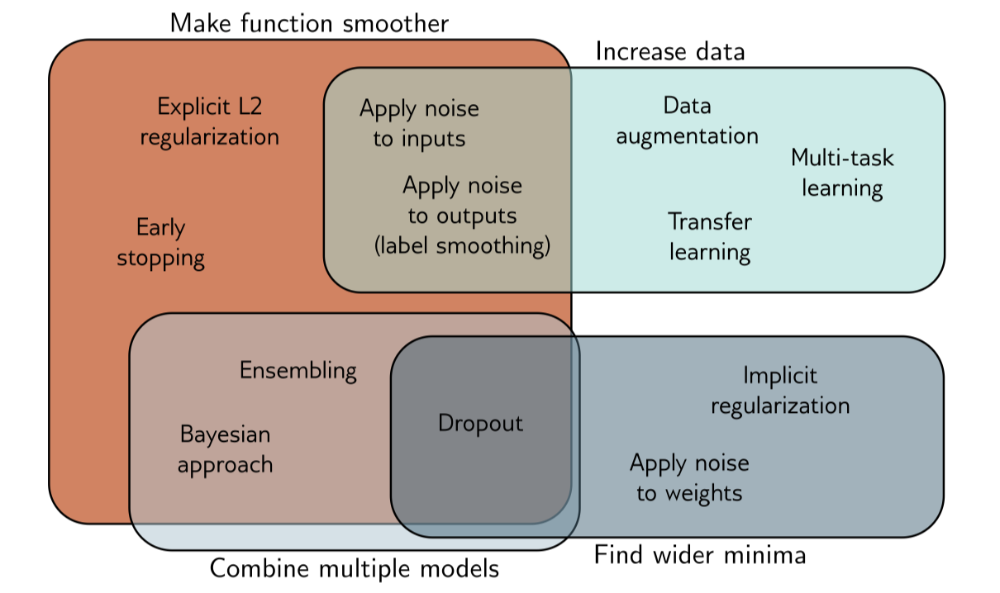

To reduce the gap of the performance of the model on the training dataset and the test dataset, we need use regularization methods.

# Introduction
Possible reasons for the discrepancy that the model performs worse on the test dataset than on the training dataset are:
1. the model describes statistical peculiarities of the training dataset that are not representative of the true mapping from the input to the output, that is, overfitting.
2. the model is unconstrained in areas with no training areas, leading to suboptimal predictions

# Explicit Regularization Methods
Consider fitting a model $f(\bm{x}; \phi)$ with parameter $\phi$ using a training dataset $\{\bm{x}_i,y_i\}$, we seek to minimize the loss function $L(\phi)$:

$$ \hat{\phi} = \arg\min_{\phi}L(\phi;\{\bm{x}_i,y_i\}) $$

Now, to bias the minimization towards certain solutions, we add an additional term:

$$ \hat{\phi} = \arg\min_{\phi}[L(\phi;\{\bm{x}_i,y_i\}) + \lambda g(\phi)] $$

where $g(\phi)$ is called the regularization term and $\lambda>0$ is a hyperparameter.

In the probabilistic perspective, we can construct the loss function from *maximum likelihood estimation*, or MLE, that is

$$ \hat{\phi} = \arg\max_{\phi}\left[ \prod_{i}\mathrm{Pr}(y_i\mid \bm{x}_i,\phi) \right] $$

The regularization term can be considered as a *prior* $\mathrm{Pr}(\phi)$， in this way, we are now using *maximum a posteriori* criterion:

$$ \hat{\phi} = \arg\max_{\phi}\left[ \prod_{i}\mathrm{Pr}(y_i\mid \bm{x}_i,\phi)\mathrm{Pr}(\phi) \right]  $$

# Implicit Regularization Methods
Gradient descent and stochastic gradient descent are commonly used to minimize the loss functions, however, neither of them moves neutrally to the minimum of the loss function, thus the implicit regularization method is proposed to solve the problem.

## Implicit Regularization in gradient descent
The change of the parameters $\phi$ is defined by the differential equation:

$$ \frac{d{\phi}}{d t} = -\frac{dL}{d\phi} $$

gradient descent uses [difference quotient](https://en.wikipedia.org/wiki/Difference_quotient) with increment (or learning rate) $\alpha$ to approximate the change of $\phi$: 

$$ \frac{\phi_{t+1}-\phi_{t}}{\alpha}=-\frac{dL}{d\phi} \Rightarrow \phi_{t+1} = \phi_{t} - \alpha\frac{dL}{d\phi} $$

However, this discretization causes deviation from the continuous path.

To fix the problem, and extra item is added to the loss to avoid the deviation caused by discretization:

$$ \tilde{L}(\phi) = L(\phi) + \frac{\alpha}{4}\left\Vert \frac{dL}{d\phi}\right\Vert^2 $$

## Implicit Regularization in stochastic gradient descent
A similar approach can be applied to stochastic gradient descent, which reads as

$$ \tilde{L}(\phi) = L(\phi) + \frac{\alpha}{4|B|}\sum_{i\in B}\left\Vert \frac{dL_{i}}{d\phi}-\frac{dL}{d\phi}\right\Vert^2  $$
where $L_{B}$ is the loss on the batch $B$.

# Heuristic Methods
## Early stopping
Early stopping means that we stop the training procedure before the model becomes overfitting. By stopping early, we prevent the model captures the corner features of the training dataset.

Early stopping has a single hyperparameter, the number of steps after which the training is stopped, this is chosen usually with the help of the validation dataset.

## Ensembling
Ensembling means we train multiple models on the training dataset, and during the inference time, we take the average inference result of each model. The technique improves the test performance with the sacrifices of training and storing multiple models.

There are some ensembling methods:
1. Use different random initializations. This leads the model reaches different local minimum and may help reduce the overfitting.
2. Generate several different datasets by re-sampling the training dataset and train model on each of them.This is also known as *bootstrap aggregating* or *bagging*, this division can smooth out the data, since each model tries to predict the distribution of data that is not included in its training dataset.

## Dropout
Drop out randomly clamps a subset of hidden units of the layer at each iteration of SGD. This makes the model depends on general feature instead of some specific feature, since the specific feature may be masked.

At test time, we can run the network as usual with all the hidden units active; however, the network now has more hidden units than it was trained with at any given iteration, so we multiply the weights by one minus the dropout probability to compensate. This is known as the *weight scaling inference rule*.

## Applying noise
Dropout can be interpreted as applying multiplicative Bernoulli noise to the network activations. We can apply noise to other parts of the model during training.

1. We can add noise to the input data, this smooth out the learned function.
2. We can also add noise to model parameters, this encourages the model to be robust to small perturbations of the weights.
3. We can also perturb the labels. We can change the label of a portion of the training dataset, this can prevent the model from being overconfident.

## Bayesian inference
The MLE approach tries to find a function $f(\bm{x};\phi)$ that fit the dataset $\{\bm{x}_i,y_i\}$, this approach may be overconfident about the task since the bias of the training data construction.

To overcome such bias, we treats the parameters $\phi$ as unknown variables instead of scalars. Then we find a distribution over the parameters $\phi$ conditioned on the training data $\{\bm{x}_i,y_i\}$, using [Bayesian theorem](https://en.wikipedia.org/wiki/Bayes%27_theorem):

$$ \mathrm{Pr}(\phi\mid \{\bm{x}_i,y_i\})  = \frac{\prod_{i}\mathrm{Pr}(y_i\mid \bm{x}_i,\phi)\mathrm{Pr}(\phi)}{\int\prod_{i}\mathrm{Pr}(y_i\mid \bm{x}_i,\phi)\mathrm{Pr}(\phi)d\phi} $$

where $\mathrm{Pr}(\phi)$ us the prior probability of the parameters, and the denominator is a normalizing term.

Then the prediction for unseen item $\{\bm{x},y\}$ is given by the following infinite weighted sum:

$$ \mathrm{Pr}(y\mid x, \{\bm{x}_i,y_i\}) = \int \mathrm{Pr}(y\mid \bm{x},\phi)\mathrm{Pr}(\phi\mid \{\bm{x}_i,y_i\})d\phi $$

This is an infinite weighted ensemble, where the weights depend on 
1. the prior probability of the parameters
2. the agreement with the data

Though Bayesian approach is capable of representing the data more robust, it is hard to implement since there is no way to represent an distribution.
Current implementation simplifies the distribution as Gaussian distribution and each parameter is replaced with the mean $\mu$ and standard deviation $\sigma$ of the Gaussian distribution.

## Transfer learning and multi-task learning
In transfer learning, the model is first pre-trained before training or fine-tuning on the task we are interested in. The idea is that the model may learn some good representation of the data from the main task. Alternatively, we can think transfer learning as initializing the model parameters in a reasonable area such that the minimum is better compared to the random initialization.

Multi-task learning is a related technique that the model is trained on multiple related tasks concurrently. In this way, the model can learn from multiple datasets and multiple objectives, this encourages the model to learn the essential part of the tasks.

## Self-supervised learning
In some cases, we do not have multiple datasets for pre-training or for multi-tasks. To solve this problem, we can use self-supervised learning to generate large amounts of label-free data. There are two families of self-supervised learning: generative and contrastive.

In generative self-supervised learning, part of each data example is masked, and the task is to predict the masked part. For example, given a sentence, we can mask the verb and ask for the model to predict the correct verb, the helps the model to learning semantic meaning of a sentence.

In contrastive self-supervised learning, we try to group related data and separated unrelated data. For example, a cat is more similar to another cat compared with a dog. In this way, the model can learn more robust representations and can be adapted to new tasks easily.

## Augmentation
Augmentation aims to expand the training dataset, we can perform transformation to each training data without changing the labels, for example we can rotate, flip a image of cat. The augmentation is to teach the model to be invariant to these irrelevant data transformations.

# Summary
To summarize the regularization methods, we use the following picture to depict the mechanisms.

# Reference
- [Understanding Deep Learning Chapter 9](https://udlbook.github.io/udlbook/)