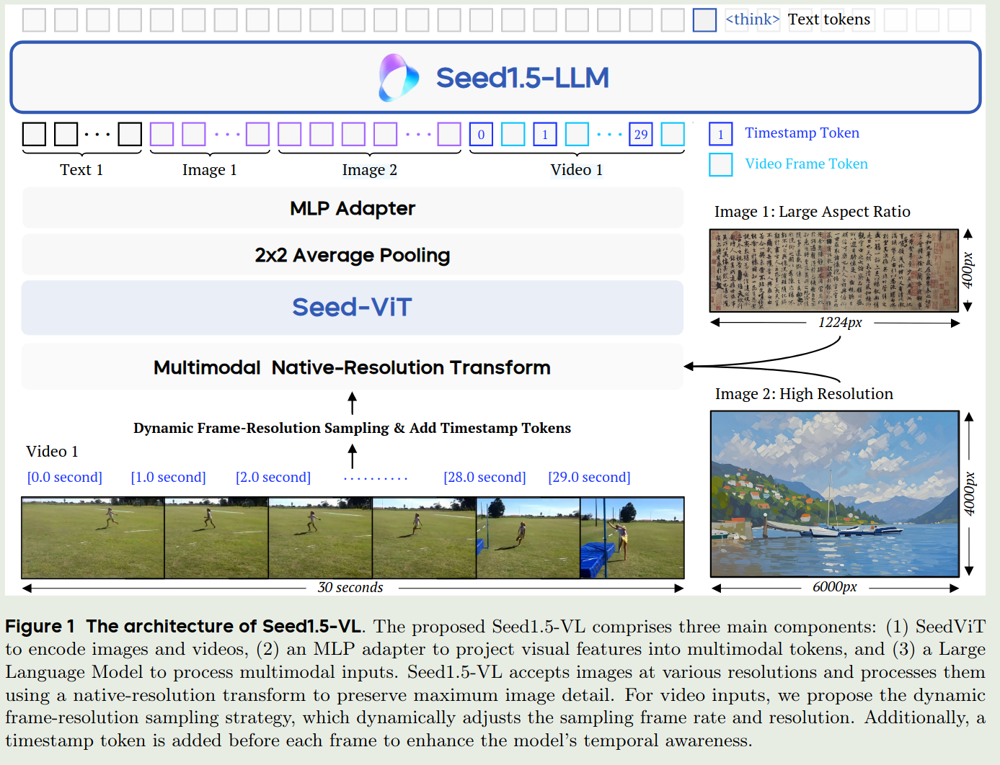
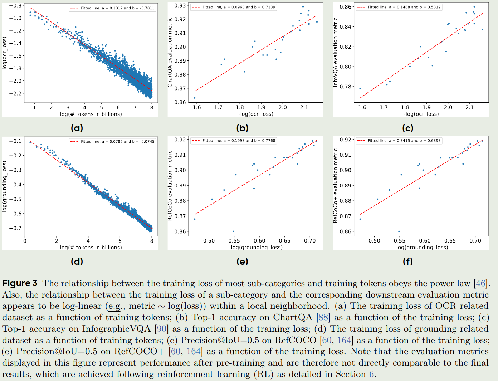
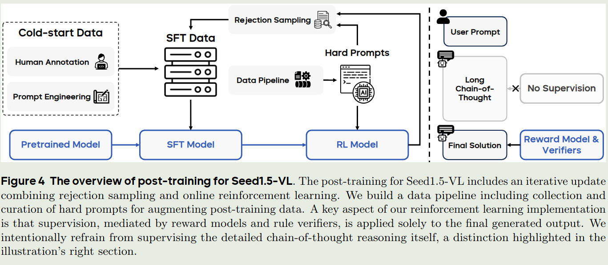
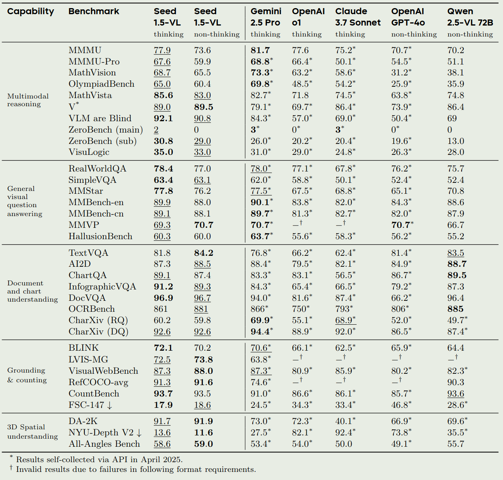
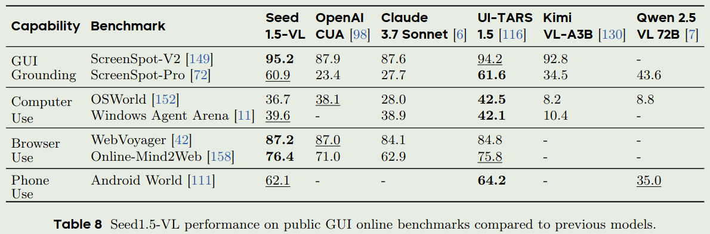

字节Seed在5月11号发布了Seed1.5-VL技术报告。技术报告详细介绍了Seed1.5-VL的架构，训练和评估细节

# 简介

Seed1.5-VL是多模态大模型，它是一个标准的 Vision Encoder - MLP - LLM 的架构，Vision Encoder是自研的Seed-ViT，参数量为532M，大语言模型的激活参数为20B（虽然论文未提及总参数量，但是从seed-Thinking v1.5来看，总参数量应该是200B）。Seed1.5-VL强调了agent能力，比如GUI control和gameplay。

# 介绍

现有的LVLM还不能与人类的通用能力相比，特别是在3D空间理解，物体技术，交互游戏等方面。并且，LVLM训练预料的多样性也不如LLM。最后，多模态数据的异质性也对模型的训练和推理提出了挑战。

基于这些问题，作者提出了Seed1.5-VL，一个视觉多模态大模型。通过构建高质量的训练数据，作者大幅度提高了模型的表现。作者还进一步探究了模型的scaling law以及pre-training和post training算法的设计。为了提高训练和推理效率，作者在infra上也进行了改进

# 架构

Seed1.5-VL的架构如下图所示

Seed1.5-VL的架构包含三个部分：

1. Vision Encoder: vision encoder是seed自研的Seed-ViT，拥有532M参数
2. Adapter：一个两层的MLP
3. LLM：Seed1.5-LLM，一个MoE架构的LLM

Seed1.5-VL支持文本，图片和视频输入，输入为文本。其可以进行理解和推理(reasoning)。

## Seed-ViT

Seed-ViT主要是在两个方面进行了改进：

1. 在pre-training阶段使用了视频数据，来提高模型的时空间感知能力
2. 使用了2D-RoPE来处理动态分辨率的图片

Seed-ViT的超参数如下表所示

| Patch size | Pos Embedding | Head dim | #heads |Embedding dim| MLP ratio | #layers|
| --- | --- |  --- | ---| ---|---|---|
|14 | 2D RoPE | 64 | 20 | 1280 | 4.0 | 27|

对于输入的图片，Seed-ViT首先将图片resize到28\*28的倍数，接下来图片会被分割为14\*14的patch. 与NaViT一样，Seed-ViT也是用了token-packing的操作，来将多个图片packing到一个sequence里进行训练。最后，对于Seed-ViT输出的图片特征，作者还是用了 $2\times 2$的 average pooling来降低token个数。

Seed-ViT的预训练包括三个阶段，其设置和超参数如下表所示：

| Categories | Unlabeled Image | Image-text pairs | Video-audio-text tuples|
| --- | --- | ---| ---|
| Training samples | 2.2B | 4.8B | 65M|
| Token percentages | 4.0% | 91.2%| 4.8%|
| Batch sizes | 55,296 | 32,768 | 1,024|
| LR warm up steps | 1,692 | 2,000 | 12,800|
| Maximum LR | $7.06\times 10^{-3}$ | $1.0\times 10^{-4}$| $5.0\times 10^{-5}$|
| Minimum LR | $1.05\times 10^{-5}$ | $1.2\times 10^{-6}$ | $2.02\times 10^{-7}$ |

在预训练时，作者考虑了三点：

1. 训练效率：尽可能提高模型的训练效率
2. 原生图片精度输入处理：让模型可以尽早处理不同分辨率图片输入
3. 数据利用率：可以使用不同类型的数据

基于这三点考虑，Seed-ViT的训练包括三个阶段：

1. Masked Image modeling with 2D RoPE：这一阶段的目的是提高模型对与几何和结构的感知能力。作者使用 `EVA02-CLIP-E`作为教师模型，然后随机将75%的patches进行mask，最后让Seed-ViT输出的特征尽可能匹配教师模型输出的特征。这里的损失函数是cosine similarity. 作者发现，scale up MIM之后，VLM在OCR和文档理解任务上的表现得到了大幅度的提升。
2. Native Resolution Contrastive Learning：这一阶段和CLIP,SigLIP的训练差不多，text encoder与`EVA02-CLIP-E`相同。损失函数为SigLIP loss和SuperClass loss
3. Omni-modal pret-raining：这一阶段使用了MiCo框架，来将video frames, audio, visual captions以及audio captions进行对齐，text encoder编码caption，ViT编码其他部分。通过这一阶段的训练，模型可以学习omni-model representations,并且还可以提高模型的图片和视频理解人物上的表现。

## 视频编码

对于视频输入，Seed1.5-VL采用了 **Dynamic Frame-Resolution Sampling**技巧，核心思想在于根据budget和处理的任务来动态调整采样率(frame)和每一帧的图片精度(resolution)。

具体来讲，在时序上，默认的FPS为1，如果要处理有关时序信息任务的话，FPS调整为2，如果要处理motion tracking等任务的话，FPS提高到5.为了进一步提高模型的时间感知能力，Seed 1.5-VL加入了timestamp tokens (e.g., `[1.5 second]`)。

在空间上，每个frame的可选精度为 $\{640, 512, 384, 256, 160, 128\}$，选择的精度根据我们的budget进行决定。如果说我们使用最低配置还是不能处理视频输入的话，我们就会先进行均匀采样，然后再进行处理，这样可以让模型处理所有的视频信息。

# Pre-training

pre-training阶段一共包括了3T token. 作者详细介绍了每一个类别。这里我们就简单总结一下。数据一共包括以下7个类别

1. Generic Image-text pairs & knowledge data. 这部分数据主要是图文交错以及image text-pairs数据。作者介绍了一下针对长尾数据（稀有物种识别）的数据构建方式
2. OCR. 这部分数据有1B左右的sample，包括documents, scene texts, tables, charts以及flowcharts等。其中，作者通过SynthDog和Latex合成了200M左右的文本密集图片。作者还对合成的数据进行了增广;Chart数据包括公开数据集和合成的数据集，最终一共有100M的样本; Table数据集也是通过提取得到的，一共包含50M左右的图片。作者还基于OCR结果构建了VQA数据集，来提高模型理解图片文字的能力
3. Visual Grounding & Counting: 提高模型识别和定位物体的能力。数据格式包括bounding box和center points. 其中bounding box主要是公开数据集；作者还是用Grounding DINO来标记了一部分数据，最后一共收集了200M的样本; point数据主要是PixMo, 作者还使用了Molmo以及CountGD标注了一部分数据，最后一共包括170M的指令以及110B的token; Counting数据从bounding box 和point数据集中筛选得到，包括了8M的样本和13B的token。最后在训练时，与InternVL一样，坐标会被normalize到 `[1,1000]`
4. 3D spatial understanding. 主要包括相对深度，绝对深度和3D Grounding数据；对于相对深度，作者使用DepthAnything V2来标注，得到了3.2B的token; 对于绝对深度，作者使用了公开数据集，最终包含18M的指令以及28B的token;对于3D Grounding，作者使用了公开数据集，最终包含770的指令以及1.3B的token
5. Video. 主要包含general video understanding数据, video temporal grounding and moment retrieval以及video streaming data.
6. STEM. 主要包含image comprehension data和problem-solving data. 前者包括收集的3.2M教育相关的数据，以及10M结构化表格，4.5M化学结构表达式，1.5M坐标系数据。后者包括100M K12的习题
7. GUI. 作者使用UI-TARS来合成数据。数据主要包括perception, grounding 以及 reasoning

预训练包括三个stage，其实验设置如下表所示：

| Stages                  | Stage 0              | Stage 1              | Stage 2               |
|-------------------------|----------------------|----------------------|-----------------------|
| Training budget (tokens) | 16B                  | 3T                   | 240B                  |
| Sequence length         | 32,768               | 32,768               | 131,072               |
| Trainable components    | MLP adaptor          | all                  | all                   |
| Batch sizes (tokens)    | 8.4M                 | 71M                  | 71M                   |
| LR warmup steps         | 100                  | 500                  | 0                     |
| Maximum LR              | $2.52 \times 10^{-4}$ | $5.22 \times 10^{-5}$ | $5.22 \times 10^{-6}$ |
| Minimum LR              | $4.50 \times 10^{-5}$ | $5.22 \times 10^{-6}$ | $5.22 \times 10^{-6}$ |

- Stage 0: 仅训练MLP，用于对齐vision encoder和LLM,使用了16B token
- Stage 1：训练全部参数，用于获取知识以及掌握grounding和OCR能力，使用了3T token
- Stage 2：训练全部参数，提升模型的长上下文能力以及对下游任务的适应性，包括视频理解，coding和3D空间理解，上下文长度从32,768提升到131,072

作者还进行了消融实验，采取了和Qwen2-VL一样的训练方式，结果发现，本文的训练方式效果更好。作者认为，解冻vision encoder，可能让vision encoder弥补LLM的不足，进而损害其自身的感知能力。

作者还探究了模型的scaling law，使用的建模函数为：

$$
\log(\hat{L}) \sim \log(B) - \beta \log(D) = -a \log(D) + b
$$
这里 $L$ 是NLL loss, D是训练的token数，$a$和$b$是待拟合的参数。实验结果如下图所示。

结论是在特定领域数据训练的loss可以作为模型在下游任务上表现的一个估计

# Post-training

post-training分为两个阶段：SFT和RL，其中RL包括RLHF, RLVR. 总流程如下图所示

## SFT

SFT数据主要包括General Instruction data以及Long Chain-of-Thought (LongCoT) data，劝着途胜模拟徐保国的指令跟随能力，后者提升模型的reasoning能力。

通用指令微调数据包括13,000条收集的数据和40,0000高质量的公开数据集。

## RLHF

RLHF的数据包括人类标注数据和合成数据。对于reward model，作者使用了LVLM作为reward model，来给不同的response进行打分。最后，使用变体的PPO算法进行训练。

## RLVR

RLVR的训练数据主要包含Visual STEM和Visual Perception and Reasoning. 前者包含1M左右的问题，主要是STEM和K12的相关问题。后者包括grounding, visual instruction following以及visual puzzles & games等

## Hybrid RL

RL的训练过程包含了RLHF和RLVR两个RL算法。作者介绍了以下细节：

1. format reward. 要求模型输出格式为 `<think>{thought}</think>{solution}`
2. hybrid reward. reward包括RM和verifier两部分
3. Shared critic. 使用一个critic model来估计value function
4. KL coefficients. 对于RLHF和RLVE，使用不同的KL divergence稀疏

## Iterative Update by Rejection Sampling Fine-tuning

在训练的过程中，作者使用了一个迭代训练策略。一个开始模型在低质量的Long-CoT数据上进行SFT，在RL过后，作者会重新评估问题的难度，然后过程掉一部分数据，再进行SFT，这样反复进行迭代训练以提高模型的表现。

> Infra部分好像都是一些细节，这里就跳过了。

# Evaluation

作者评估了

1. Seed-ViT的表现
2. Seed1.5-VL的通用视觉理解和推理能力
3. Seed1.5-VL的视频相关能力
4. Seed1.5-VL的agent能力
4. Seed1.5-VL在内部benchmark上的表现

由于Seed1.5-VL是一个API模型，并且其内部benchmark不公开，因此Seed-ViT以及其在内部benchmark上的表现我们就不列出来了。我们主要看一下其和领先多模态大模型的对比

# Conclusion

在本文中，作者介绍了Seed1.5-VL，一个领先的多模态大模型，可以处理图片和视频输入。作者介绍了Seed-ViT以及Seed1.5-VL的数据，训练和评估。

作者还分析了以下Seed1.5-VL的不足以及未来的改进方向

1. Seed1.5-VL在复杂视觉感知任务中，其计数能力会下降。
2. Seed1.5-VL的高阶推理能力还尚有不足，作者拿Klotski举了一个例子
3. Seed1.5-VL的3D spatial reasoning能力不足
4. Seed1.5-VL的temporal reasoning能力不足
5. Seed1.5-VL与其他模型一样，存在幻觉问题

未来，有以下值得探索的方向：

1. 涌现现象(emergent abilities)
2. scaling law，进一步探索模型参数量，算力以及数据对模型表现的影响
3. 提高模型的3D spatial reasoning能力，降低模型的幻觉，提高模型分组合搜索能力

# 参考文献

- [arxiv](http://arxiv.org/abs/2505.07062)
