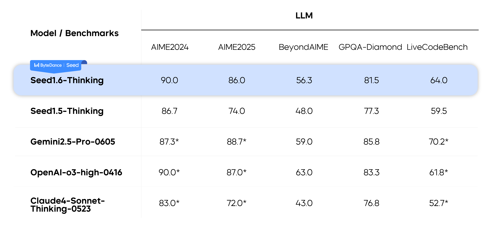
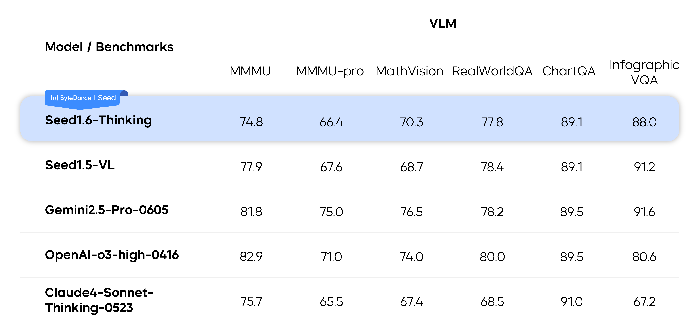
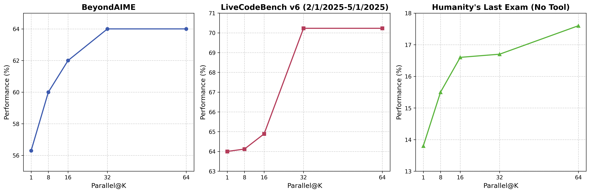
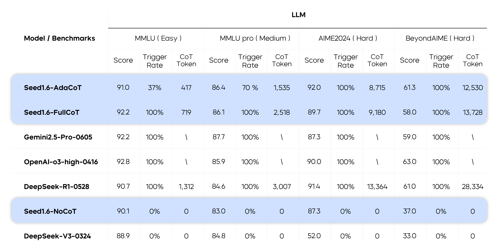
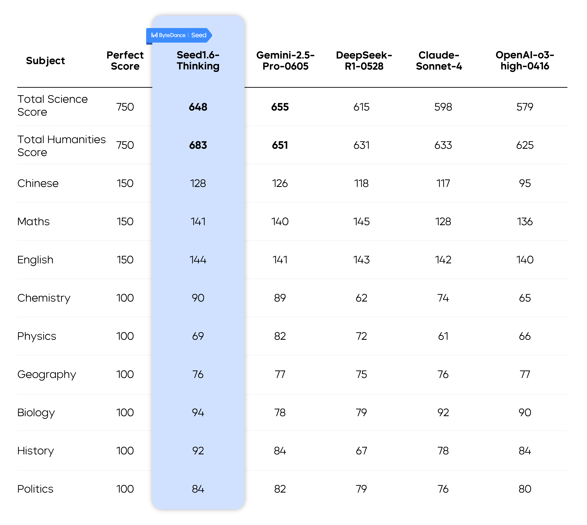

Seed 在 2025 年 6 月 25 号发布了 Seed 1.6，支持 adaptive deep thinking, multimodal understanding, GUI-based interaction, and deep reasoning with a 256K context window

Seed 1.6 基于 Seed 1.5 开发，是一个 MoE 模型, 总参数为 230B, 激活参数为 23B.

## Pre-training

pre-training 分为 3 个 stage:

1. Text-only pre-training: 使用 web pages, books, papers, code 以及其他数据来进行训练，作者使用了 rule-based 以及 model-based 策略来提高数据的质量。
2. Multimodal mixed continue training: 提高学科，代码以及 reasoning 相关的数据，来进一步提高知识密度以及 reasoning 的复杂度。同时，加入高质量的视觉数据。
3. Long-context continual training: 将模型的上下文长度从 32K 扩展到 256K

Seed 1.6 Base 的表现

| Model        | Seed1.6 Base | LLaMA-4 -Maverick Base | DeepSeek-V3Base | Qwen3-235B-A22B Base | Seed1.5 Base |
| ------------ | ------------ | ----------------------------------- | ---------------------------------- | -------------------------------- | ------------ |
| MMLU         | **88.83**    | 85.16                               | 87.19                              | 87.81                            | 88.35        |
| MMLU-Pro     | **69.98**    | 63.91                               | 59.84                              | 68.18                            | 66.47        |
| SuperGPQA    | **45.08**    | 40.85                               | 41.53                              | 44.06                            | 36.81        |
| BBH          | **92.08**    | 83.62                               | 86.22                              | 88.87                            | 88.36        |
| GPQA-Diamond | 43.43        | 43.94                               | 41.92                              | **47.47**                        | 45.25        |
| GSM8k        | 93.10        | 87.72                               | 87.57                              | **94.39**                        | 89.99        |
| MATH         | **72.86**    | 63.32                               | 62.62                              | 71.84                            | 66.18        |
| MBPP         | **83.60**    | 75.40                               | 74.20                              | 81.40                            | 81.40        |

## Post-training

作者在 post-training 构建了两个变体：

1. Seed1.6-Thinking: 先进的多模态 reasoning 能力
2. Seed1.5(Adaptive CoT): 使用 AdaCoT 来压缩 CoT 的长度，提高效率

### Seed1.6-Thinking

Seed1.6-Thinking 与 Seed-Thinking-v1.5 的训练方式差不多，作者使用了 multi-stage [[rejection fine-tuning]] (RFT) 和 RL 来提高模型的表现。在每一轮中，先进行 RL 的训练，然后进行 RFT 的训练。相比于 Seed-Thinking-v1.5, Seed1.6-Thinking 使用了更多的算力和更高质量的数据，包括数学问题，代码，谜题以及 non-reasoning 数据。

表现如下：

为了进一步提高模型的表现，作者在推理时使用了 parallel decoding, 来让模型在回答之前使用更多的 token, 作者发现 parallel decoding 可以显著提高模型在困难任务上的表现。

### Seed1.5(Adaptive CoT)

reasoning model 的问题是会出现 overthinking,导致输出的过程中花费很多不必要的 token.

为了解决这个问题，Seed1.6 提出了 AdaCoT, 来训练得到三个模型：FullCoT, NoCoT 和 AdaCoT

通过 AdaCoT, 我们可以显著降低 CoT 的长度。为了完成这个目标，作者在 RL 训练阶段构建了一个 reward, 来惩罚模型的 overthinking. 用户可以基于 prompt 来选择不同的模型：

- FullCoT: 对每个 prompt，都进行 reasoning, 模型表现与 Seed1.6-Thinking 差不多，但是 CoT length 更小
- NoCoT: 直接回答，不进行 reasoning
- AdaCoT: 由模型自主决定是否需要进行 reasoning, 模型是 FullCoT 和 NoCoT 的一个 fusion 版本

结果发现，对于不同难度的任务，AdaCoT 的出发概率是不同的，说明模型会基于任务难度调整思考方式。

作者还评测了以下模型在高考中的表现，结果如下图：

## Conclusion

作者提出了 Seed1.6 系列多模态大模型，模型在多个 benchmark 上表现优异。作者还提出了 AdaCoT, 让模型基于问题难度动态选择 CoT length

作者认为下一步工作是：

1. 构建更加高效的架构，来进一步提高 reasoning 的有效性
2. 扩展模型的多模态能力
3. 提升模型的 agent 能力，特鄙视 end-to-end task execution

## References

- [blog](https://seed.bytedance.com/en/blog/introduction-to-techniques-used-in-seed1-6)
