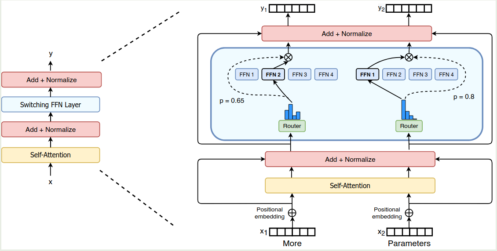
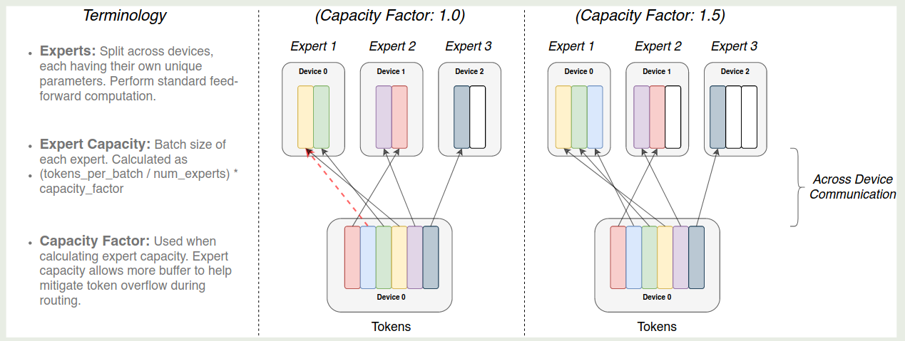
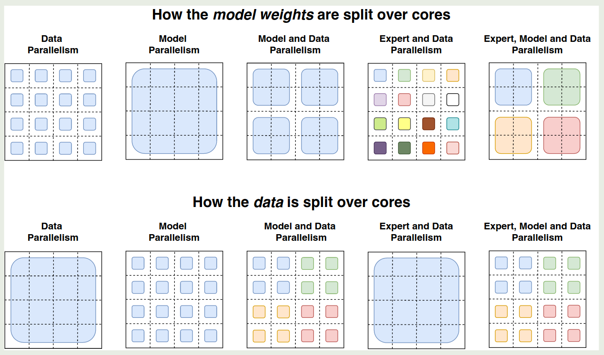
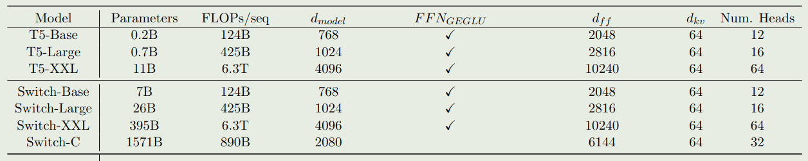
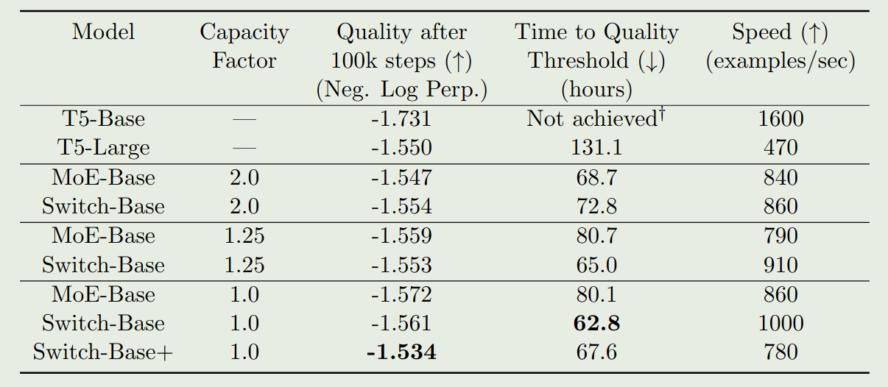
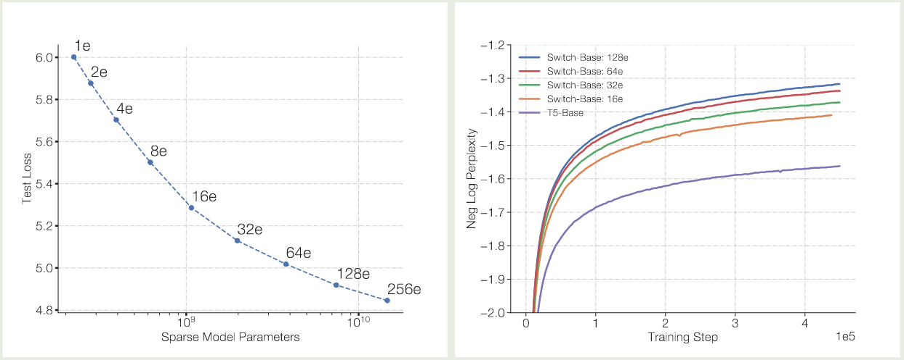
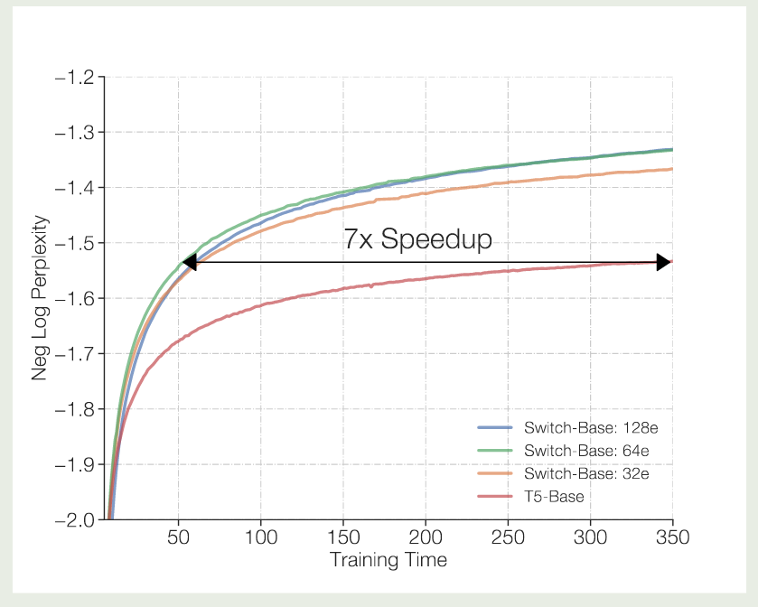
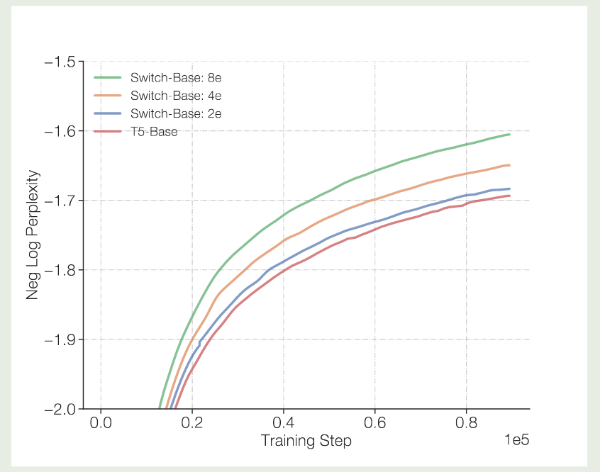
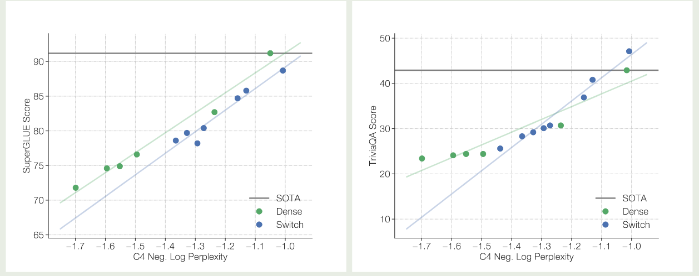

## Introduction

[Kaplan scaling law](https://maosong.website/p/kaplan-scaling-law/) 和 [Chinchilla scaling law](https://maosong.website/p/chinchilla-scaling-law/) 已经给出了针对 dense transformer model 的 scaling law, 即在给定算力下如何找到最优的 model size 和 dataset size. 已有的工作如 T5 主要是扩展 dense model 来达到更高的表现, 但是他们的问题是对算力要求比较高。

为了解决这个问题，作者尝试在不增加算力的情况下提升模型的参数量，为了达到这个目的，作者构建了基于 MoE 架构的模型 Switch Transformer.

作者的主要贡献如下：

1. 提出了基于 MoE 架构的 Switch Transformer model
2. 探究了针对 MoE 架构的 scaling law
3. 将 MoE model 的能力蒸馏到 small dense model 里去
4. 若干提升训练效率和稳定性的技巧

## Architecture

Switch Transformer 的架构如下图所示

### MoE

MoE 的定义见 [MoE tutorial](MoE%20tutorial.md), 我们假设有 $N$ 个专家，其中激活 $K$ 个专家。

之前的工作认为我们只有在激活 $>2$ 个专家时，模型才能够比较好的训练，但是在本文中，作者决定只使用 1 个 expert, 也就是 $K=1$. 作者将激活一个专家的 layer 称为 **Switch layer**.

作者认为 Switch Layer 有三个优势：

1. router computation 现在只需要将每个 token route 到 1 个 expert
2. 每个专家的 capacity 更小，负载更加均衡
3. routing 的实现更简单，且通信开销也降低了

### Efficient Sparse Routing

作者首先定义了**expert capacity**, 也就是每个 expert 处理的 token 数量，其定义如下

$$
\text{expert capacity} = \left(\frac{\text{tokens per batch}}{\text{number of experts}}\right) * \text{capacity factor}
$$

其示意图如下所示

提升 capacity factor 可以减少 token overflow 的概率，但同时也会导致计算和内存的浪费。作者通过实验发现应该尽可能降低 dropped token 比例。

为了平衡每个 expert 处理 token 的个数，作者设计了 load balancing loss, 见 [Load Balancing loss](Load%20Balancing%20loss.md) 来要求每个 expert 处理的 token 数基本一致。

## Parallelism

作者在本节介绍了针对 MoE 模型的并行策略，如下图所示

这里，我们给定 notation 如下

| Term | Description                                     |
| ---- | ----------------------------------------------- |
| $B$  | Number of tokens in the batch.                  |
| $N$  | Number of total cores.                          |
| $n$  | Number of ways for data-parallelism sharding.   |
| $m$  | Number of ways for model-parallelism sharding.  |
| $E$  | Number of experts in Switch layers.             |
| $C$  | Expert capacity, the batch size of each expert. |

作者将一个 Logical mesh 分为两个维度，一个是 data-parallel sharding, 用 $n$ 表示，另一个是 model-parallel sharding, 用 $m$ 表示，从而总的 cores 数为 $N=n\times m$.

### Data Parallelism

对于 data prallelism 来说，每个 core 上的模型是一样的，而一个 batch 的数据被切分为了 $B/n$ 份，此时 $n=N$, $m=1$. 这种并行策略的好处是仅在 forward 和 backward 完成之后才会进行一次通信。

### Model Parallelism

对于 model parallelism, 每个 core 上的数据都是全部数据（通过拷贝得到），模型被 shard 到所有 core 上，此时 $n=1,m=N$, 这种情况下，每次 forward 或者 backward，都需要进行 $N$ 次通信（假设我们使用 pipeline parallelism）， 这种并行策略的好处是每个 core 上的计算压力小了，但是缺点是通信开销多了。

### Model and Data Parallelism

第三种总策略是同时进行 model parallelism 和 data parallelism, 这种情况下，每个 core 上保存 $B/n$ 的数据以及 shard 为 $m$ 份的 sharding weight.

### Expert and Data Parallelism

第四种策略是同时进行 expert parallelism 和 data parallelism, 作者在这里假设 $n=N$ 且 $E=n=N$, 也就是每个 core 上保留 $B/n$ 的数据, 然后还有一个对应的专家。

首先，对于输入大小为 $[B,d]$ 的 tensor, 我们会进行拆分得到大小为 $[n, B/n, d]$ 的 tensor, 代表 $n$ 个设备上分别存储 $[B/n, d]$ 的数据，首先我们计算路由权重，得到

$$
[n,B/n, d]\times [d, E] \to [n, B/n, E]
$$

权重的每个值 $[i,j,k]$ 代表了第 $i$ 个 core 上,第 $j$ 个 token 分配一个第 $k$ 个专家的概率，我们对其进行 softmax 与 top-K 操作之后，就得到了对应的专家（注意 Switch Transformer 中的 $K=1$, 我们通过 one-hot 编码将其输出转化为一个二进制矩阵，大小为 $[n,B/n, E, C]$, 这里的每个值 $[i,j,k,l]$ 代表了第 $i$ 个 core 上,第 $j$ 个 token 分配给第 $k$ 个专家第 $l$ 个 token, 接下来我们再基于输入 `[n,B/n,d]` 计算 core 到 expert 的数据，其大小为 `[n,E,C,d]`, 计算方式为

$$
\mathrm{einsum}([n,B/n, d], [n,B/n,E,C], \mathrm{dim}=[B/n])
$$

里面的元素 `[i,j,k,:]` 代表了第 $i$ 个设备路由到第 $j$ 个专家的第 $k$ ($k<C$) 个 token.

然后我们就可以执行 `all-to-all` 通信来把对应的 token 传输给对应专家所在的设备上了，通信完成之后，每个设备上的专家对收集到的输入 token 进行计算，计算完之后，再通过 `all-to-all` 通信来把输出传输给输入的设备。这样就完成了 MoE 模块的计算与通信

### Expert, Model and Data Parallelism

目前我们只是通过增加专家个数来提高模型的表现，但是 FLOPs 并没有增加，如果我们希望通过增加 FLOPs 来提高模型表现的话，我们需要增加 expert layer 的 model size, 这就涉及到了 Model parallelism, 此时的做法和前面提到的 Expert and Data Parallelism 一样，我们在收集到对应的设备的输入之后，再执行 model parallelism 就可以了。

## Results

基于以上改进，作者构建了 Switch Transformer, 模型训练的数据集为 C4, 训练的目标为 masked language modeling, 训练时，作者将 $15\%$ 的 token 替换为 `[mask]` token.

模型的配置如下表所示

实验结果如下图所示

实验结果发现

1. Switch Transformer 的表现和训练效率都超过了 Dense model
2. Switch transformer 的训练效率稍微优于使用 2 个 expert 的 MoE-Base 模型
3. Switch transformer 在 low capacity factor 的场景下效果更好

### Scaling

作者对比了 MoE 模型的 scaling law, 结果如下图所示

可以看到，当我们增加专家个数的时候，模型的表现是持续提升的。并且当我们增加专家个数之后，模型的训练效率也有所提升。

作者接下来在训练时间上进行了对比，结果如下图所示

实验结果说明，switch transformer 的训练效率比 dense model 快 7 倍左右

作者进一步对比 switch transformer 和更大的 dense 模型 (T5 large, $3.5\times$ FLOPs), 实验结果证明 Switch transformer 的训练效率仍然更高。

### Switch for Attention

作者还探究了在 attention layer 加入 MoE 的表现，结果发现尽管效果有提升，但是训练不稳定。

### No Token Left behind

由于 tensorflow 为一个静态计算框架，tensor 的形状必须预先定义好，因此必须为每个 expert 设定 capacity, 但是这样就会导致有些 token 被 drop 掉。

因此，作者提出了 "No token left behind" 这种方法，来避免出现 token overflow 的情况。具体做法就是先按照正常的 router 逻辑进行计算，如果 router 选取出来的 top-K expert （本文中 $K=1$） 都已经满载了，则选取 `top-(K+1)` expert 进行计算，作者发现这种方式可以保证大部分 token 都不会被 drop. 作者通过尝试之后发现，这种方法并没有带来提升。

### Encouraging Exploration Across Experts

作者还探究了不同选取 top-Kexpert 的方式，作者对比了以下三种方法：

1. argmax
2. sampling from the softmax distribution
3. input dropout on the incoming representation
4. multiplicative jitter noise on the incoming representation

实验结果如下表所示

| Model Quality  | (Neg. Log Perp.) (↑) |
| -------------- | -------------------- |
| Argmax         | -1.471               |
| Sample softmax | -1.570               |
| Input dropout  | -1.480               |
| Input jitter   | -1.468               |

作者发现，jitter 的效果最好，因此在本文中作者使用 jitter 来加入 noise.

### Ablation on Few Experts

作者还使用了更少的专家进行实验，结果如下图所示

实验结果显示，即使我们只使用少数 experts, 其模型表现仍然超过了 dense model 的表现，说明了 MoE 架构的有效性。

### Downstream Model Performance

作者还进一步探究了模型的预训练表现与 downstream task 任务上表现的关系，结果如下图所示

实验结果显示，不管是 baseline 还是 Switch Transformer 其预训练的表现与下游任务上的表现都是正相关的。但是，作者也发现，MoE 模型在微调之后，其表现并不总是与预训练的表现正相关。因此，作者认为进一步探究这个机制是有必要的。

## Conclusion

作者在本文中提出了 Switch Transformer，一个基于 MoE 架构的 Transformer 模型。作者通过改进 MoE 算法，大幅度提高了计算和通信效率，结果发现模型比 dense model 有更高的训练效率。

作者认为，未来的工作有：

1. 提升大规模模型的训练稳定性
2. 解决 MoE 模型微调之后效果不如预期的问题
3. 探究针对 MoE 模型的 scaling law
4. 支持异构架构的 MoE 模型
5. 在 FFN 模块意外应用 MoE 架构
6. 将 Switch Transformer 扩展到其他的模态

## References

- [Arxiv](http://arxiv.org/abs/2101.03961)
