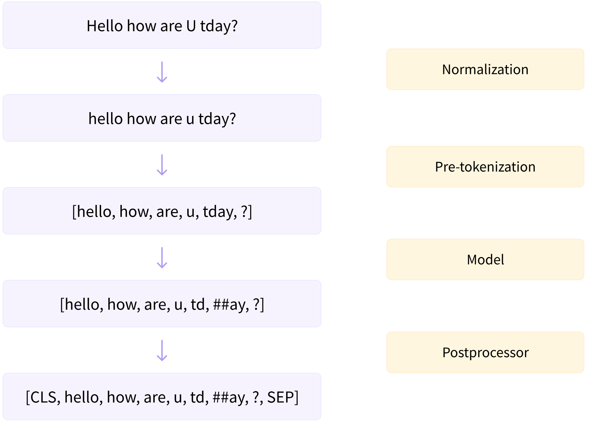
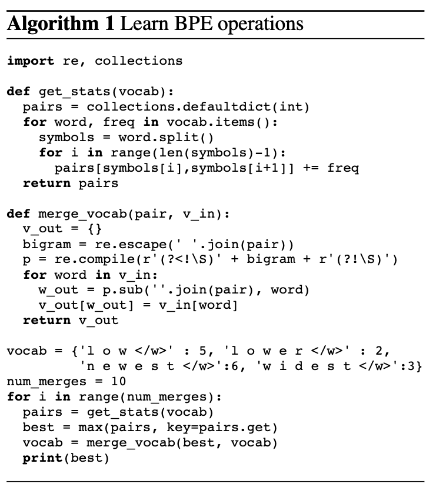
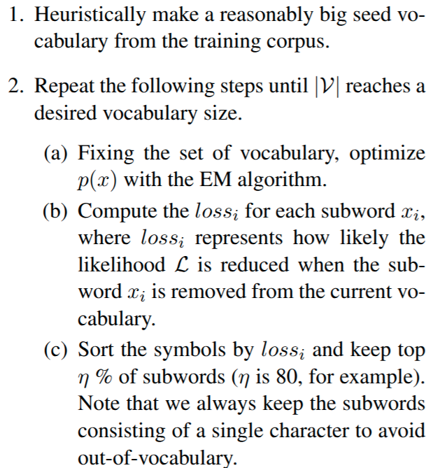

# Tokenizer总结

## Introduction

在自然语言处理中，tokenizer的作用是将一个文本序列通过一个字典转化为一个token id的序列。我们回顾图片分类任务，模型在预测的时候，实际上预测的是类别对应的id，而不是类别本身。tokenizer做的事情就是提供一个类似于从类别到对应id的字典。

一般来说，一个tokenizer处理文本序列的过程有两步：

1. pre-tokenize，也就是预处理，我们需要将文本序列分割成合适大小的chunks (words)
2. tokenize，构建chunks (words)到token id的映射

实际上, huggingface的tokenizer包括[四个步骤](https://huggingface.co/docs/tokenizers/pipeline), 其中第二第三个步骤与上述一致. 在pre-tokenize之前, 我们有一个normalization过程, 该过程会对文本序列进行处理, 如将文本序列变为小写, 删掉声调符号等, 如下面例子所示：

```python
from tokenizers import normalizers
from tokenizers.normalizers import NFD, StripAccents

normalizer = normalizers.Sequence([NFD(), StripAccents()])
normalizer.normalize_str("Héllò hôw are ü?")
# "Hello how are u?"
```

在tokenize之后, 我们会有一个post-processing过程, 比如BERT会在生成的token系列前后加入 `[CLS]` token 和 `[SEP]` token, 例子如下:

```python
from transformers import AutoTokenizer

tokenizer = AutoTokenizer.from_pretrained("bert-base-cased")
token_ids = tokenizer.encode("I love NLP.")
print(token_ids)
# [101, 146, 1567, 21239, 2101, 119, 102]
# represents [[CLS], "I", "love", "NL", "##P", ".", [SEP]]
```

其完整流程如下图所示 (图源: [huggingface llm-course](https://huggingface.co/learn/llm-course/chapter6/4?fw=pt))



构建好tokenizer之后, 我们还要保证tokenizer提供两个接口：

1. encoding, 给定文本序列, 将其映射到字典中去得到token id序列
2. decoding, 给定token id序列, 将其解码成文本序列

接下来, 我们将简单介绍一下word tokenizer, character tokenizer以及byte tokenizer, 并分析它们各自的不足。
然后, 我们介绍现代大语言模型中使用最多的BPE tokenizer。最后, 我们介绍一些sub-word tokenizer。

## Training-free tokenizer

本节我们将要介绍word tokenizer, character tokenizer以及byte tokenizer, 它们的特点就是简单易懂, 不需要额外的规则和学习.

### Word tokenizer

给定一个文本序列, 我们现在需要将其转化为一个token序列。一个比较自然的想法是, 我们按照空格将序列拆分成若干个单词, 这样每个单词的语义都能比较好地保留。下面是一个例子：

```python
import tiktoken

tokenizer = tiktoken.get_encoding("gpt2")
indices = tokenizer.encode("hello world")
# indices = [31373, 995]
# decode = ["hello", " world"]
```

接下来我们基于一个预定义好的词典, 将其转化为一个token id的序列。

word tokenizer的优点是能够保留语义信息，且压缩率比较高（每个token包含的bytes数），其问题是不能处理预定义好的词典之外的词 (out of vocabulary, OOV)。现有的处理方法是使用 `<UNK>` token来表示这些OOV的词。
但这样显然会丢失语义信息, 因为我们编码成 `<UNK>` token之后, 就没办法再解码回原有的语义信息了。

word tokenizer的缺点为：

1. 单词数量很大, 很多罕见单词的出现频率很低, 降低了tokenizer的利用率
2. 对于不在词典内的单词只能用`<UNK>` token表示, 损害了语义信息

既然基于word的tokenizer有OOV的问题，我们能否想办法解决这个问题呢？答案是可以的, 我们可以使用 character tokenizer。

### Character tokenizer

Character tokenizer的基本思想是使用字符而不是单词来编码文本序列。其实现方式如下：

```python
class CharacterTokenizer:
    def encode(self, s: str) -> list[int]:
        return list(ord(c) for c in s)
    
    def decode(self, token_ids: list[int]) -> str:
        return "".join(chr(token_id) for token_id in token_ids)
```

character tokenizer的词表大小取决于我们的编码方式，UTF-8的编码大概有[110K code points](https://en.wikipedia.org/wiki/UTF-8)。character tokenizer的缺点总结如下：

1. character tokenizer会导致我们的词表非常大
2. 和word tokenizer一样, 很多character非常罕见, 会降低词表的利用率
3. token序列的上下文语义信息较差

### Byte tokenizer

我们发现, character tokenizer和word tokenizer的词表都很大, 我们能否想办法降低词表大小, 提升每个token的利用率呢？答案是使用Byte tokenizer.

Byte tokenizer的基本思想是, 所有的字符(character)都是由byte组成的, 比如对于UTF-8编码来说, 每个字符由1-4个byte组成。
因此, 所有满足UTF-8编码的文本, 我们都可以将它们转换为基于byte的token序列。
由于现在的大部分文本都是基于UTF-8的, 因此, 我们只讨论UTF-8编码的文本。

Byte tokenizer的实现如下：

```python
class ByteTokenizer:
    def encode(self, s: str) -> list[int]:
        return list(s.encode("utf-8"))

    def decode(self, token_ids: list[int]) -> str:
        return bytes(token_ids).decode("utf-8")
```

byte tokenizer的词表很小, 其词表大小为 `256`, 这是因为一个byte可以有256中可能的值.

尽管byte tokenizer实现简单，并且词表也很小，可以说byte tokenizer解决了character tokenizer和word tokenizer的问题。
但是，byte tokenizer的问题在于，其encode的到的token序列可能会非常长！我们知道，transformer计算量与token序列的长度是平方级关系的，也就是说token序列长度增加10倍，整体的计算量就会增加100倍，因此我们势必需要考虑token序列的长度。

总之，byte tokenizer的问题为：

1. 产生的token序列过长, 增加了transformer的计算量
2. 没有上下文语义信息

### 总结

我们总结一下word tokenizer, character tokenizer以及byte tokenizer三者各自的特点:

| Feature | Word Tokenizer | Character Tokenizer | Byte Tokenizer |
|---------|---------------|-------------------|---------------|
| Granularity | Coarse | Medium | Fine |
| Vocabulary | Yes | No | No |
| Support OOV | Bad | Good | Best |
| #Tokens | Small | Large | Very Large |
| Chinese | Yes | Yes | Yes |
| Support Spell Error | Bad | Yes | Yes |
| Context | Good | Bad | Worst |

因此, 这三种tokenizer尽管实现起来很简单, 但是其都有各自的问题. 为了解决这些问题, 我们的做法就是折衷, 使用sub-word tokenizer, 也就是介于word tokenizer和byte tokenizer之间的方法.

## BPE

### 基本原理与实现

实际生活中，对于出现频率比较高的词，我们会有一个简写的方式，也就是我们使用一个新的单词来表示这个词。比如在英语中，我们会使用`plz` 来代替 `please` 以及使用`how r u` 来代替`how are you`。
BPE，即byte pair tokenizer的原理也是类似的，对于出现频率比较高的byte pair或者character pair, 我们会使用一个新的token来表示这个pair，这样就压缩了sequence的长度。

BPE算法包括以下几个步骤:

1. 对文本序列进行pre-tokenize, 分割成不同的单词
2. 当`len(vocab)<vocab_size`时, 重复以下步骤:
   1. 对所有单词, 统计其相邻character或者byte pair的频率
   2. 计算出现频率最高的pair, 使用一个新的token来表示这个pair
   3. 将新的token和其对应的`token_id`加入到`vocab`中, 并更新单词的分割表示

算法如下图所示 (参考文献2)



> 注意：实际上，我们实现的是BBPE (byte BPE算法)，BBPE与BPE的区别在于我们的最小单元是character还是bytes。本质上原理是一致的

实现代码见 [Github naive BPE](https://github.com/MaoSong2022/assignment1-basics/blob/main/cs336_basics/naive_bpe.py)

### 高效实现

BPE的原理很简单, 我们也实现了其naive版本, 但是naive版本的问题是太慢了。因此我们将要优化naive版本的效率。

首先我们发现, 我们不需要遍历所有的word, 只有含有`best_pair`的word我们才会进行处理, 因此, 我们的第一个改进就是使用 `pair_to_word` 来记录每个pair的来源, 比如：

```python
pair_to_word = {
    (b' ', b't'): [b' the', b' it'], 
    (b't', b'h'): [b'the']
}
```

这样, 我们在merge的时候, 直接使用 `pair_to_word[best_pair]` 来获取需要被更新的token序列就可以了。

其次, 注意到每次merge之后, 我们都需要重新计算一次 `pair_freq`, 而实际上, 只有被merge的token序列才需要被重新计数, 其他大部分token序列都是不需要重新计数的。
因此, 一个改进点就是我们在merge的过程中就更新 `pair_freq`, 而不是重新计算。为了达到这个目标, 我们其实只需要两个操作。
我们用`(b'x', b'a', b'b', b'y')` 和 `best_pair=(b'a', b'b')`来说明, merge之前, 这个序列贡献的`pair_freq`为：

```python
{
    (b'x', b'a'): 1,
    (b'a', b'b'): 1,
    (b'b', b'y'): 1,
}
```

merge之后, token序列变成了`(b'x', b'z', b'y')` (假设`best_pair`对应的新的token为`b'z'`), 这时候的计数为:

```python
{
    (b'x', b'a'): 0,
    (b'a', b'b'): 0,
    (b'b', b'y'): 0,
    (b'x', b'z'): 1,
    (b'z', b'y'): 1,
}
```

也就是说, merge之后, 三个pair的计数减少了1, 分别是`(token_seq[i-1], merge_pair[0])`,`merge_pair` 和 `(merge_pair[1], token_seq[i+2])`。两个pair的个数增加了1, 分别是 `(token_seq[i-1], new_token)`和`(new_token, token_seq[i+2])` (这里我们假设`merge_pair=(token_seq[i], token_seq[i+1])`)。

基于这个结论，我们就可以优化BPE算法了，具体逻辑就是：

1. pretokenize, 将 text 切分为若干个 word
2. 计算`word_count`, `pair_freq`, `pair_to_word`, 使用`splits`记录每个word对应的token分布
3. 重复以下过程：
   1. 挑选频率最高的pair将其merge为一个新的token, 基于`pair_to_words`更新对应的`pair_freq`
   2. 对每个`split`, 按照上述方式更新`pair_freq`和`split`

其具体实现见 [Github](https://github.com/MaoSong2022/assignment1-basics/blob/main/cs336_basics/efficient_bpe.py)

## Other subword tokenizers

### WordPiece

WordPiece是Google在预训练BERT时采用的tokenizer，WordPiece的基本思想和BPE差不多，都是从一个较小的vocab开始的。

首先，WordPiece会通过加上prefix `##`来把单词进行切分，比如 `word` 会被拆分为：

```python
['w', '##o', '##r', '##d']
```

接下来，对于pair $(a, b)$, WordPiece定义了merge pair的规则如下：

$$
\mathrm{score}((a, b)) = \frac{\#(a, b)}{\#a \times \#b}
$$

其中 $\#(a, b)$, $\#a$, $\#b$ 分别代表 pair $(a, b)$, 元素 $a$ 和元素 $b$ 的频率。
通过这个方式，我们会给予包含元素出现频率较低的pair更高的优先级。通过这个方式，我们选取score最高的pair，然后将其用一个新的token表示，然后和BPE算法一样，继续这一过程直到我们的vocab size达到指定大小。

在tokenize的时候，WordPiece会找出现在vocab中的最长的subword, 比如对于`'hugs'`, 假设从左向右在词典中的最长subword是`'hug'`, 那么`'hugs'` 就会被拆分为 `['hug', '##s']`。如果我们在词表中找不到对应的subword，这个时候我们就会使用`'[UNK]'`来表示。

具体实现见 [Github wordpiece](https://github.com/MaoSong2022/assignment1-basics/blob/main/cs336_basics/word_piece.py) (基于[huggingface llm course](https://huggingface.co/learn/llm-course/chapter6/4?fw=pt))。 代码实现除了选择最优pair的方式不同之外，和BPE基本一致。

### Unigram

Unigram也是由Google提出来的tokenizer，与BPE和wordpiece不同，unigram从一个非常大的vocab开始，然后merge token来降低vocab的size，直到达到指定大小。初始的vocab可以基于BPE算法或者使用prefix subword来构建。并且，初始vocab还包含所有的base characters来保证所有的word都可以被tokenize。

算法的描述如下:



我们来看一下算法的细节, 首先对于一个word, 我们有多种切割方式, 比如`'bug'`可以被切分为如下三种形式:

```python
[['b', 'u', 'g'], ['b', 'ug'], ['bu', 'g']]
```

unigram 假设每个 word 出现的概率是其 subword 出现概率的乘积, 即对于包含 $n$个subword的单词 $\bm{x}=(x_1,\dots,x_n)$, 我们有:

$$
p(\bm{x}) = \prod_{i=1}^n p(x_i)
$$

其中，对于给定的vocab $\mathcal{V}$, 我们有：

$$\sum_{v\in\mathcal{V}} p(x)=1$$

unigram的目的就是选择合适的切分 $\bm{x}\in S(\bf{x})$ (这里我们用 $\bf{x}$ 表示单词本身, 用 $\bm{x}$ 表示 $\bf{x}$ 的一个切分), 使得 $p(\bm{x})$的概率最大. 这样我们就可以写出unigram的损失函数了:

$$
\mathcal{L} = \sum_{i=1}^{N} \log\left(\sum_{\bm{x}\in S(\bf{x})}p(\bm{x})\right)
$$

其本质就是: 我们希望对每个单词找到一种合适的切分, 切分得到的subword的概率分布满足其求和为1, 并且使得每个单词的概率最大.

但是直接对上面概率最大化的问题就是我们每个subword的概率是未知的, unigram的做法是使用EM算法求解这个问题.

当我们求解完成之后, 对每个subword, 我们都尝试将其从 $\mathcal{V}$中移除, 然后计算移除后的损失 $loss_i$, 我们依照$loss_i$对subword进行排序, 然后我们去掉 $\eta \%$ 比例的subword.

unigram的伪代码逻辑如下:

```python
while len(model) > vocab_size:
    scores = compute_scores(model)
    sorted_scores = sorted(scores.items(), key=lambda x: x[1])
    # Remove percent_to_remove tokens with the lowest scores.
    for i in range(int(len(model) * percent_to_remove)):
        _ = token_freqs.pop(sorted_scores[i][0])

    total_sum = sum([freq for token, freq in token_freqs.items()])
    model = {token: -log(freq / total_sum) for token, freq in token_freqs.items()}
```

其中 `compute_scores` 用于计算最优分割以及从`model`中去掉每个token之后的loss.

具体实现见 [Github wordpiece](https://github.com/MaoSong2022/assignment1-basics/blob/main/cs336_basics/unigram.py) (基于[huggingface llm course](https://huggingface.co/learn/llm-course/chapter6/4?fw=pt))。代码实现的关键在于为每个word选取最优分割，huggingface是采取了动态规划的方法，也就是我们使用 `dp[i]` 来表示 `word[:i]` 的最优score，这样我们有：

$$
dp[i] = \max_{0 \leq j < i} dp[j]* p(word[j:i]),\quad \mathrm{s.t.}\ word[j:i]\in \mathcal{V} 
$$

这里的乘法代表 $p(\bm{x}) = \prod_{i=1}^n p(x_i)$, 在实现的时候我们会取log变成加法，然后概率会由频率来代替。

### Subword tokenizer总结

sub-word tokenizer的对比 (来自[huggingface llm course](https://huggingface.co/learn/llm-course/chapter6/4?fw=pt))：

| Method | BPE | WordPiece | Unigram |
|--------|-----|-----------|---------|
| Start Vocabulary | Small | Small | Large |
| Train | Merge tokens | Merge tokens | Remove tokens |
| Training Step | Merge with most frequent pair | Merge with best score | Remove all tokens minimized the loss |
| Learns | Merge rules and a vocab | A vocab | A vocab with a score for each token |
| Encoding | Splits into words and applies merge rules | Find the longest subword from the beginning that is in the vocab | Finds the most likely split into tokens with learned scores |
| Model | GPT | BERT | T5 |

## 实践

### tiktoken

[tiktoken](https://github.com/openai/tiktoken)是openAI提出来的一个BPE tokenizer, openAI的模型都基于这个tokenizer, 其主要用于调用GPT系列模型是对token进行计数, 我们可以在[tokenizer](https://platform.openai.com/tokenizer) 这个网站查看其分词情况.

### SentencePiece

[SentencePiece](https://github.com/google/sentencepiece)是google开源的一个无监督的text tokenizer，其实现了BPE和unigram两种算法，SentencePiece还是一个语言无关的tokenizer，使其更适合多语种大语言模型的开发。

### Tokenizer

[tokenizer](https://github.com/huggingface/tokenizers) 是huggingface推出的为基于transformer服务的tokenizer库, 其支持BPE,  wordpiece和unigram等分词算法, 使用简便. 并且, huggingface的tokenizer包括两种:

1. fast tokenizer, 即[Tokenizer库](https://github.com/huggingface/tokenizers), 这个库是基于Rust开发的
2. slow tokenizer, 这个是transformer库里模型自带的, 比如ChatGLM就有自己开发的tokenizer

huggingface比较了并行处理时两者的区别:

| Setting | Fast Tokenizer | Slow Tokenizer |
|---------|---------------|---------------|
| `batched=True` | 10.8s | 4min41s |
| `batched=False` | 59.2s | 5min3s |

huggingface提供的tokenizer库已经非常齐全了, 如果我们要训练新的基于transformer的模型的话，建议直接使用Huggingface的`AutoTokenizer`。

### 总结

| 特性 | SentencePiece | Tokenizer | tiktoken |
|------|--------------|-----------|----------|
| 是否适合中文 | √ | √ | × |
| 是否适合英文 | √ | √ | √ |
| 是否适合训练 | √ | √ | × |
| 是否快速 | √ | √ | fast |
| 是否用于 GPT 系列 | × | × | √ |
| 是否可解码 | √ | √ | √ |
| 是否支持多语言 | √ | √ | × |

## 结论

本文中, 我们介绍了大语言模型中的tokenizer, 我们从byte level, word level到sub-word level, 再到现代大语言模型最常使用的BPE tokenizer, 并给出了其（高效版本）实现。最后, 我们介绍了一下tokenizer-free的大语言模型和huggingface的tokenizer库。在未来, 我们将继续深入了解大语言模型的基本原理和实现细节。

## 参考文献

- [cs336 Lecture1](https://stanford-cs336.github.io/spring2025/)
- [Neural Machine Translation of Rare Words with Subword Units](https://arxiv.org/abs/1508.07909)
- [SentencePiece](https://arxiv.org/pdf/1808.06226)
- [Unigram](https://arxiv.org/pdf/1804.10959)
- [WordPiece](https://static.googleusercontent.com/media/research.google.com/ja//pubs/archive/37842.pdf)
- [Huggingface LLM Course](https://huggingface.co/learn/llm-course/chapter6/1)
