## Methods

Cascaded RL 的优势：

1. 编排好的训练策略可以避免灾难性遗忘
2. 不同 domain 的超参数可以分别设置
3. 同一 domain 的数据具有相似性，可以减少算力消耗

Nemotron Cascaded 2 [@Nemotron-Cascade2] 进一步结合了不同的训练策略，其核心在于：对于有冲突的 domain, 采用 cascaded 训练策略，对于没有冲突的 domain, 采用 multi-domain RL 的训练方式。

如下图所示

```mermaid
flowchart LR
    %% 样式定义
    classDef default fill:#F3EFEA,stroke:none,color:#000,rx:4,ry:4;
    classDef dashedBox fill:#F3EFEA,stroke:#333,stroke-width:1.5px,stroke-dasharray: 4 4,rx:4,ry:4;
    classDef finalBox fill:#FFFFFF,stroke:#000,stroke-width:2px,rx:6,ry:6;

    %% 节点定义
    BM["Base Model"]:::dashedBox
    SFT["SFT"]
    IFRL["IF RL"]
    MDRL["Multi-domain RL"]
    MOD["MOPD"]
    RLHF["RLHF"]
    LCRL["Long-context RL"]
    CRL["Code RL"]
    SWERL["SWE RL"]
    NC["Nemotron-Cascade 2"]:::finalBox

    %% 连线结构
    BM --> SFT
    SFT --> IFRL
    IFRL --> MDRL
    MDRL --> MOD
    MOD --> RLHF
    RLHF --> LCRL
    LCRL --> CRL
    CRL --> SWERL
    SWERL --> NC
```

其中 multi-domain RL 包括: STEM, agentic tool calling 和 structured output 三个能力,数据配比为 $55\%: 30\%: 15\%$.

Nemotron-cascade2 [@Nemotron-Cascade2] 基于以下考虑将 IF-RL 放在第一个阶段：

1. IF-RL 会损害模型的 alignment 能力
2. IF-RL 可以提高模型的指令跟随能力

基于以下考虑使用 multi-domain RL:

1. 这些 domain 的数据并没有出现互相干扰的情况
2. 输出长度以及验证时间差不多
