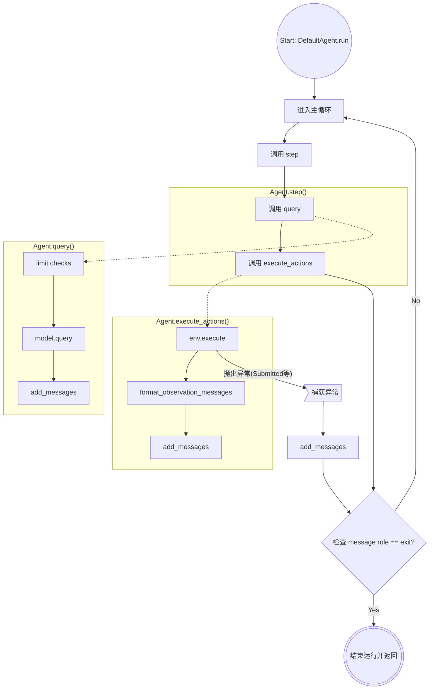

## Mini-SWE-agent

mini-swe-agent 的特点在于：

1. 只有 `bash` 这一个工具
2. linear history, 所有的历史都 append 到 `messages` 中
3. 通过 `subprocess.run()` 来执行动作

框架图如下所示



`DefaultAgent.run`

```python
while True:
    try:
        self.step()
    except InterruptAgentFlow as e:
        self.add_messages(*e.messages)
    if self.messages[-1].get("role") == "exit":
        break
```

`self.step()`:

```python
def step(self) -> list[dict]:
    return self.execute_actions(self.query())
```

`self.query()`

```python
def query(self) -> dict:
    # ... limit checks ...
    message = self.model.query(self.messages)
    self.add_messages(message)
    return message
```

`self.execute_actions()`:

```python
def execute_actions(self, message: dict) -> list[dict]:
    outputs = [self.env.execute(action) for action in message.get]
    return self.add_messages(*self.model.format_observation_messages())
```
